# 2020 项目经验总结

总结收纳自己过去一年里在项目上遇到的棘手问题以及解决办法

## 四标四实人口热力图

### 难点 1: 百万级的海量数据

海量数据的热力图渲染,如果不做特殊处理,不管是客户端还是服务器的性能都无法满足

#### 第一阶段

既然是海量数据,那么我们就给他来个浓缩,俗话说浓缩就是精华. 所以我们要拿到人口点数据后进行数据抽稀.

**什么是抽稀?怎么抽稀?**

就是用格网将地图分割,每个格网内的所有点融合为一个点. 由于是人口数据,抽稀采用总和的方法,即抽稀后的点总人口属性值为格网内所有人口点的人数总和.

并且要生成不同比例尺下的抽稀图层. 原因很简单,比如我对一比一百万的比例尺采用了 100 _ 100 的格网进行抽稀,当我地图缩放到一比五十万的时候,如果还是用这个格网生成的抽稀点数据就太稀啦,这时就需要来个 200 _ 200 的格网对一比五百万比例尺下的原始数据再做一次格网抽稀.

最后根据地图的比例尺去获取不同格网下生成的抽稀人口数据做热力图渲染.

原理图:

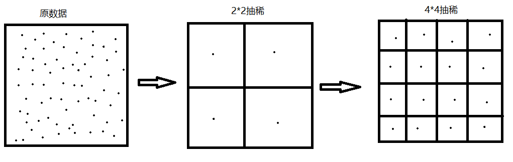

#### 第一阶段的效果

可以加载出热力图,并且在一定程度上缓解了原数据大的问题，但是缺点还是太明显，在大比例尺的情况下，如一比四千的时候，抽稀的网格是非常细的，这就导致抽稀完后的数据还是很多点，当前端根据地图范围发出查询请求的时候,接口对大数据量的数据进行空间查询遍历的时候，速度非常慢，这也最终导致接口的响应时间非常长（大比例尺情况下会大于一分钟）。

#### 第二阶段

我们都知道地图服务的出图方式有动态出图和切片两种方式,上面说的方法类似动态出图,每次请求都要查询原数据,时间就花在了这个,那我们能不能借鉴切片服务的思想呢?答案是可以!

方法很简单,我们设置一个 256 \* 256 大小的切片,对每个比例尺下生成的抽稀后点数据进行一次切片预处理(把同一个切片范围内的抽稀点放在一起). 这样,地图范围再发生变化的时候,就可以不用查询抽稀后的数据,而是根据比例尺和范围计算出对应的切片等级和切片行列号,并根据这个,直接拿到对应切片里的已经存放好的数据.

样做就可以避免计算接口进行空间查询操作，拿到切片等级和行列号后直接返回对应切片内的抽稀结果，速度上得到极大的改善. 简直就是质的飞跃.

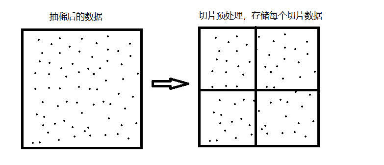

改善后接口响应时间:

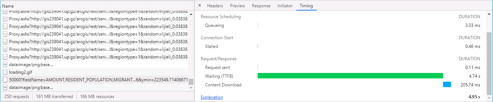

### 难点 2: 热力图渲染问题

#### 颜色梯度

拿到了数据后,如何才能将热力图的效果做到最好.(各个颜色在地图上面积占比接近,用户有直观的色差对比)

这就需要我们动态计算出当前范围获取到的数据最佳热力图颜色梯度.使每个梯度中的点数接近,这样渲染出来的热力图最好看.

arcmap 中对设置梯度分级的时候除了常见的手动设置间隔和相等间隔分级外，还给出了几个常用的分级方法:

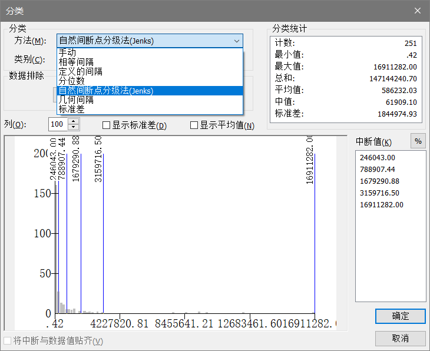

每个方法的特点参考：
http://blog.sina.com.cn/s/blog_663d9a1f0102vdp9.html

有了上面的启发,我们可以想到怎么对热力图颜色梯度做控制,最简单的方法就是拿到全部的人口点,对他们的人口数进行排序,排序后按等份切割,每份数据的最大值就是这个颜色梯度的最大值.

值得注意的是,每个颜色梯度的梯度差最好保证有最大值的 0.1%,否则可能会因为梯度差太小被忽略.

#### 热力点影响范围(blurRadius)

blurRadius 是指图层中每个点的影响区域。定义为以像素为单位的半径。默认值为 10，这表示为点位置 10 像素半径内的像素分配了一个强度值，该值对应于它们与附近点的距离。

**热力图中的颜色是如何计算出来的呢? arcgis API 官网解释如下:**

由 blurRadius 确定的区域上每个点的影响强度。高斯或正态分布用于散布点的颜色.

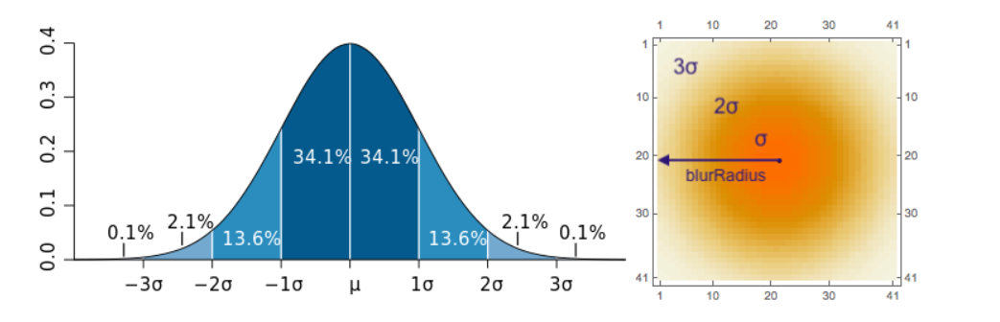

> 标准正态分布（也称为钟形曲线）用于根据视图中每个像素与一个或多个点的接近程度将强度值应用于视图中的每个像素。在点位置的 blurRadius（默认为 10px）设置的距离内的像素被分配了强度值。点的 1 个标准偏差内的像素的强度值分配为 1。相邻像素的强度值越低，则它们离该点的距离越远。在点影响区域之外的像素的强度值为 0。具有高强度值的像素被分配为强色，而具有低强度值的像素被分配为弱色 ​​。这会产生模糊的影响区域而不是离散点的视觉效果。

对每个点重复上述过程。每次执行计算时，每个像素的强度值都会基于其与多个点的接近程度而累积。然后，基于分配给每个像素的总体强度值，沿连续的色带对像素进行着色。最后产生一个连续的表面，就是热力图.

既然这个 blurRadius 这么关键,那么我们就不得不考虑如何正确设置他的值.

在一体化中我是选择了根据比例尺动态设置,原因是在小比例尺下,一个点的影响范围不应太大,极端点里例子就是设太大一个点就把整个城市都覆盖了.同理在大比例下又需要适当加大热力点影响范围.

所以先定一个最小比例尺下的 blurRadius 和最大比例尺下的 blurRadius,然后根据实际地图比例尺线型计算出 blurRadius 最合适

### 效果

在不同比例尺下的效果图

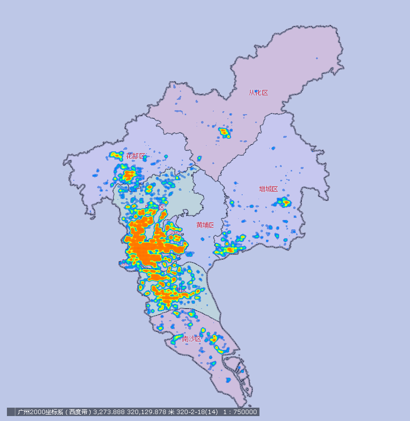

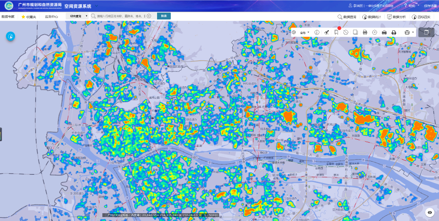

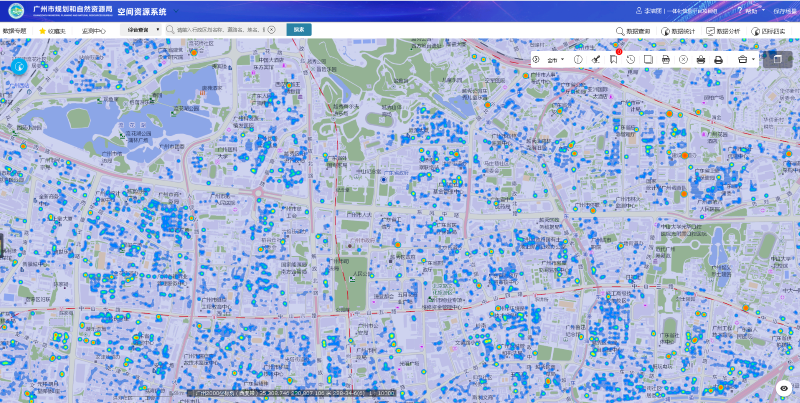

## Network Analysis

### 什么是 Network Analysis

网络分析,在GIS领域主要是对道路网络数据进行路径、最近设施点、服务区、位置分配及车辆配送等问题的分析

### 实用场景

分析设施点的服务范围,如一家医院在根据道路网络分析出2km路程内的服务范围, 而不是简单的缓冲区分析, 更加具有参考价值

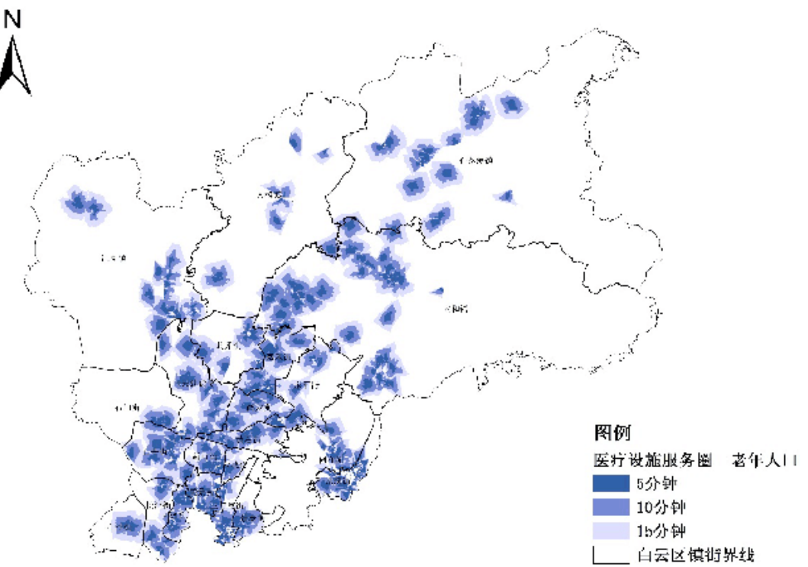

### 如何实现

1. 创建网络数据集,发布网络分析服务

具体如何创建可以参考网上资料:

以下是我发布的服务,可以连接公司VPN访问

http://192.168.1.136:6080/arcgis/rest/services/YTH/testNAService/NAServer/Service%20Area


2. 使用Network Analysis

Network Analysis下有许多分析,如路径分析服务，服务区分析服务，以及最近设施点分析服务

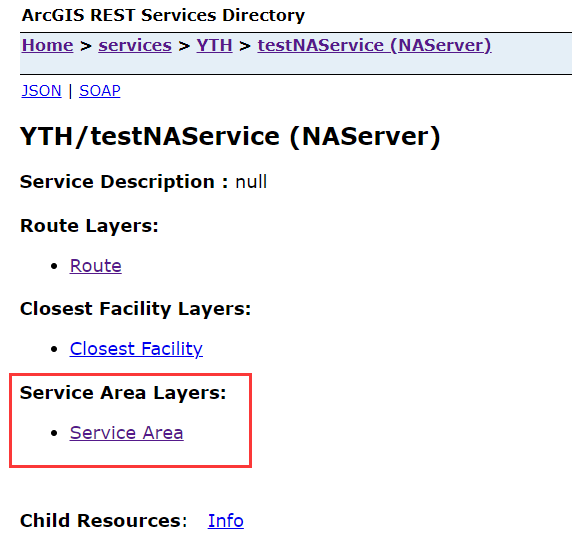

这里先分析我们用到的service Area(服务区分析)

用到了"esri/tasks/ServiceAreaTask", "esri/tasks/ServiceAreaParameters"

ServiceAreaTask 顾名思义 服务区任务,我们只需要传入我们的服务url实例化即可

```js
let serviceAreaTask = new ServiceAreaTask("http://192.168.1.136:6080/arcgis/rest/services/YTH/testNAService/NAServer/Service%20Area")
```

ServiceAreaParameters是指服务区分析的参数,下面介绍主要参数:

| 名称 | 类型 | 说明 |
| :-| :-| :- |
| Facilities | FeatureSet | 设施点集合(可以是多个设施点) |
| DefaultBreaks| Number[] | 中断值,用逗号分割，例如"100,200,300"(假如单位是米),表示搜索设施点100m,200m,300m道路网络范围|
|splitPolygonsAtBreaks |Boolean| 表示从中断处（不同区域等级）拆分多边形，这样可得到不同距离之间到达的区域多边形 |
|mergeSimilarPolygonRanges|Boolean|如果为true，则相同范围将合并。多个设施点共同分析的时候比较有用|

```js
let params = new ServiceAreaParameters({
  outSpatialReference: map.spatialReference,
  returnFacilities: false  // 是否返回设施点
});
params.splitPolygonsAtBreaks = false; // 返回的服务区是否需要在服务区之间分割
params.mergeSimilarPolygonRanges = true; // 多个设施点的时候,相同的服务区合并
params.defaultBreaks = [500, 1000, 1500] // 500米,1000米,1500米服务区分析 

let facilities = new FeatureSet();
facilities.features = features;

let location1 = new Graphic(Point);
let location2 = new Graphic(Point);
let features = [location1,location2]

// 定义两个设施点执行服务区分析
params.facilities = facilities;

serviceAreaTask.solve(params, solveResult => {
  ...
}
```

请求server执行服务区分析的地址

```url
http://192.168.1.136:6080/arcgis/rest/services/YTH/testNAService/NAServer/Service%20Area/solveServiceArea?mergeSimilarPolygonRanges=true&facilities=%7B%22type%22%3A%22features%22%2C%22features%22%3A%5B%7B%22geometry%22%3A%7B%22x%22%3A114.92063100725365%2C%22y%22%3A25.854150619326397%2C%22spatialReference%22%3A%7B%22wkid%22%3A4326%2C%22latestWkid%22%3A4326%7D%7D%7D%2C%7B%22geometry%22%3A%7B%22x%22%3A114.93800227674987%2C%22y%22%3A25.85223683539885%2C%22spatialReference%22%3A%7B%22wkid%22%3A4326%2C%22latestWkid%22%3A4326%7D%7D%7D%5D%2C%22doNotLocateOnRestrictedElements%22%3Atrue%7D
```

返回结果,可以看到返回了三个服务区的geometry

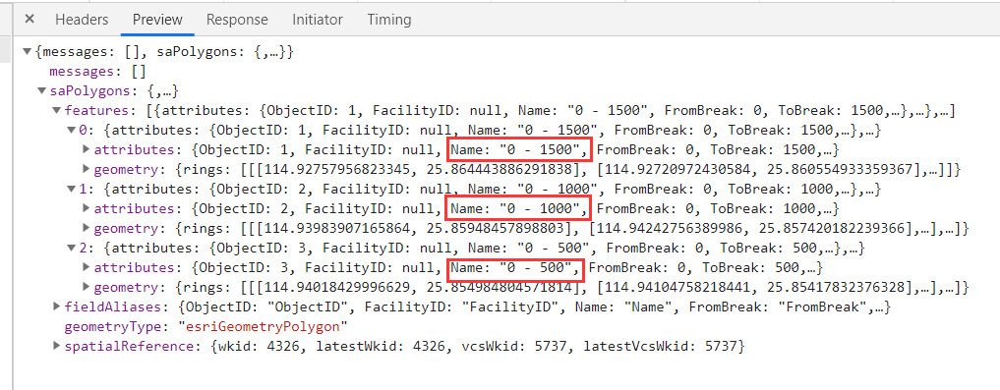

### 简单demo演示

在道路样例数据地图上选择两个点进行服务区分析,得到结果如下

蓝色是0-500m的区间,绿色是500m-1000m区间,红色是1000m-1500m区间

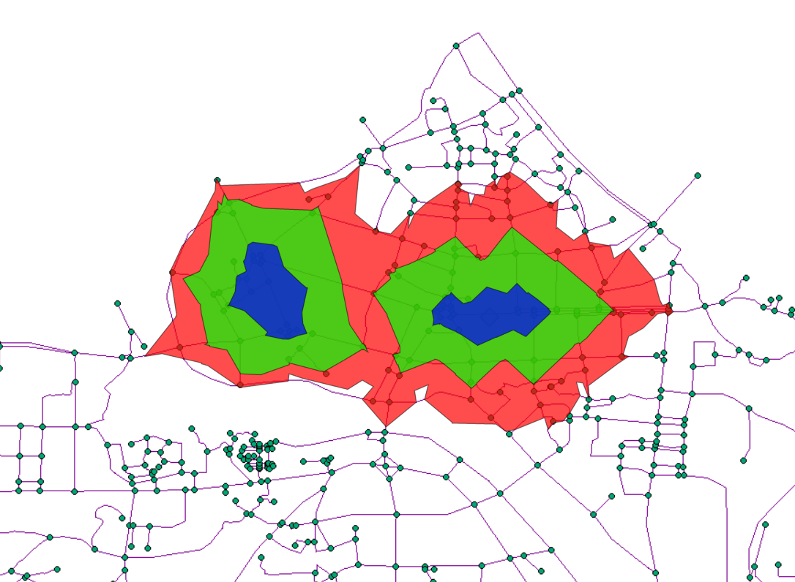

## 动态图层

地图服务发布到 ArcGIS Server 站点后，可根据需要选择是否允许服务器的客户端（如 ArcGIS web API）动态更改地图服务中的图层外观和行为。要确定哪些图层显示在地图中、图层符号系统、图层顺序和位置以及标注等，可通过使用动态图层在服务器端实现。这种方式下，动态图层可有效增加用户与地图的交互。

上面是官方的介绍,这里补充一下,动态图层不单单可以操作已发布为服务的图层,还可以把 GDB,MDB,SHP,raster 类型的本地文件当成服务来加载.

### 可以解决什么问题?

广州一体化有一个需求是将空间校正后的图片添加到地图上,使用动态图层可以完美解决. 不单只是图片,一体化在之前已经使用动态图层加载 GDB 和 SHP 数据了.

### 解决方案

如上面说的,动态图层可以把我们服务器上的文件当成服务来加载,前提是配置动态工作空间

在项目中,采用动态图层加载动态工作空间里的文件方案来加载 GDB 和 SHP 会多一些.其实他也可以加载 raster 类型的文件(栅格图片),甚至可以获取表数据关联到服务的要素上,给要素扩展属性.

### 动态工作空间的使用

#### 配置

登录 arcgis server 打开对应的 mapserver 管理页面,开启并添加动态工作空间.

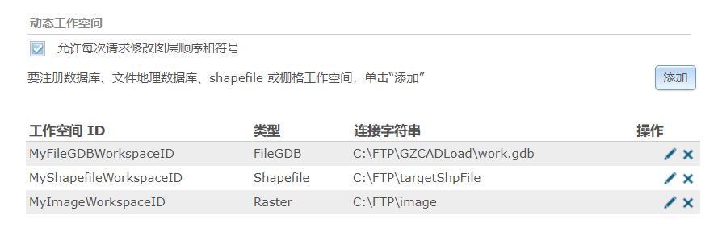

添加动态工作空间,可以选择 GDB(企业级数据库), MDB(文件地理数据库), 栅格文件夹(jpg|png|tif 等栅格图片), shapefile 文件夹(shp 文件)

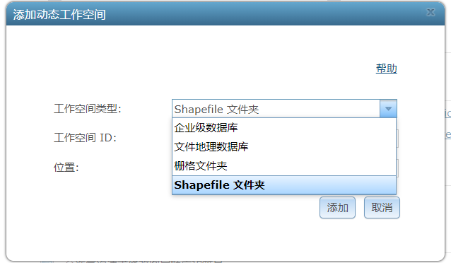

对应路径下放入图片文件

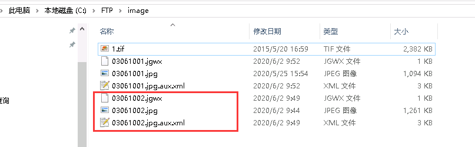

#### 测试使用

打开 mapserver 页面,例如:

http://xxxx:xx/arcgis/rest/services/GZ_DynamicLayer/MapServer

找到 Child Resources 下的动态图层

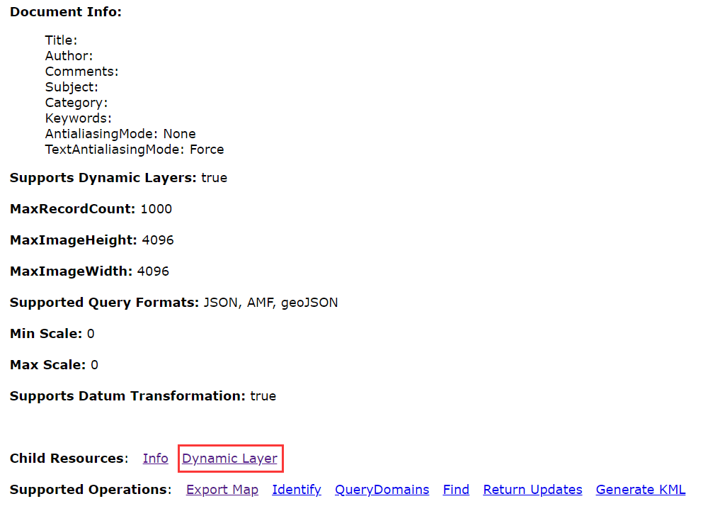

打开后传入参数(以 raster 动态工作空间为例,读取到 MyImageWorkspaceID 空间下的 03061002.jpg)

```json
{
  "id": 1,
  "source": {
    "dataSource": {
      "workspaceId": "MyImageWorkspaceID", // 配置动态工作空间的ID
      "dataSourceName": "03061002.jpg", // 动态空间文件夹下的图片文件名
      "type": "raster" // 栅格类型数据
    },
    "type": "dataLayer"
  }
}
```

那么这时 server 已经动态生成了一个 raster Layer 的图层可供前端加载

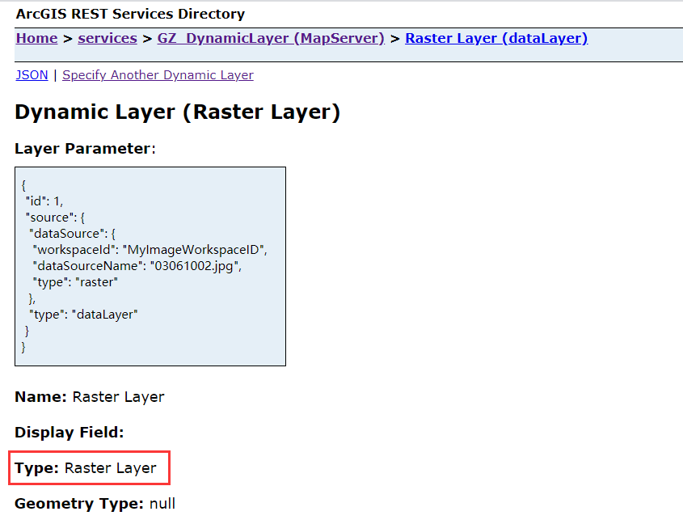

最后,通过 arcgis server 提供的 export map 接口,生成图片

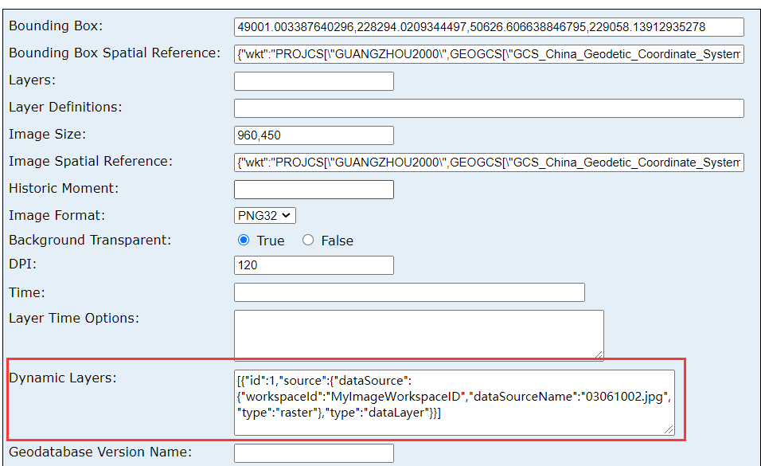

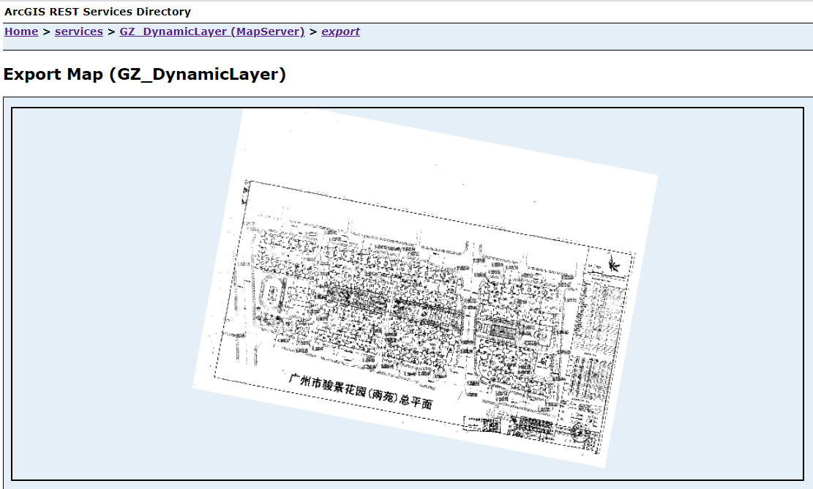

这样就能将服务器上的图片做为服务资源加载,以上是以图片为例, shp 和 gdb 同样适用.

### 代码实现(4.X 版本 API)

因为新的项目不会再用 3.x 的 api,所以这里以 4.x 版本的 api 为例,3.x 也可以实现,原理相同.

#### 以 featureLayer 来加载

加载 GDB 的要素类为例

```js
let featureLayer = new FeatureLayer(
  "http://172.30.239.201:6080/arcgis/rest/services/GZ_DynamicLayer/MapServer/dynamicLayer",
  {
    renderer,
    dynamicDataSource: {
      type: "data-layer",
      dataSource: {
        type: "table", // 如果是图片要换成raster类型
        workspaceId: "MyFileGDBWorkspaceID", // 配置动态工作空间的ID
        dataSourceName: "Polygon2101121619254669" // GDB下的要素类名称
      }
    }
  }
);
```

#### 以 MapImageLayer 来加载

以 MapImageLayer 加载,不单单要设置动态工作空间文件,还要给上 renderer 渲染器,否则会不渲染图形

加载 SHP 为例

```js
let sublayer = {
  renderer,
  opacity: 0.75,
  source: {
    type: "data-layer",
    dataSource: {
      type: "table", // 如果是图片要换成raster类型
      workspaceId: "MyShapefileWorkspaceID", // 配置动态工作空间的ID
      dataSourceName: "inter.shp" // 工作空间文件夹下的SHP文件名称
    }
  }
};
sublayers.push(sublayer);

let dynamicLayer = new MapImageLayer(
  "http://172.30.239.201:6080/arcgis/rest/services/GZ_DynamicLayer/MapServer"
);
dynamicLayer.sublayers = sublayers;
```

### 延伸(动态图层的表关联)

除了添加几何图形或图片到地图上,动态工作空间还支持把表数据关联到服务上

#### 数据准备

在 GDB 中新建一个 table,增加一个关联用的字段 XZQH(这个字段将会和别的图层表做表关联),这里写了一个天河区,将会和后面举例的图层中行政区名字段做关联

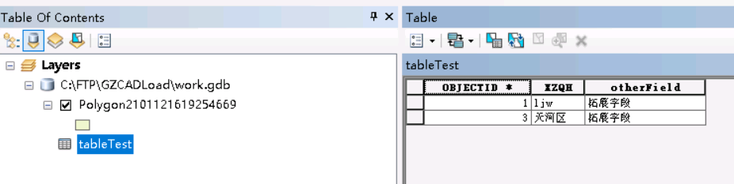

打开需要关联的服务图层,开启动态工作空间并配置,这里不再赘述

找到对应的关联字段

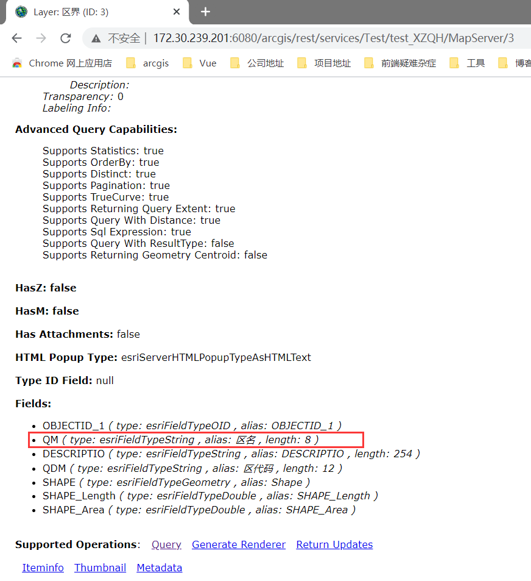

#### 代码实现并检验

新建一个 featureLayer,因为 featureLayer 是查询到要素再加载到地图上,可以查看到要素的属性,如果换成的话,只能拿到一张图片,无法知道属性是否已关联到我们新建的表.

```js
var featureLayer = new FeatureLayer(
  "http://172.30.239.201:6080/arcgis/rest/services/Test/test_XZQH/MapServer/dynamicLayer",
  {
    renderer,
    outFields: ["*"],
    dynamicDataSource: {
      // 动态数据层
      type: "data-layer",
      dataSource: {
        type: "join-table",
        // 定义一个左源表,类型是"map-layer"表示服务里的图层
        // mapLayerId是服务对应的图层下标
        leftTableSource: {
          type: "map-layer",
          mapLayerId: 3
        },
        // 定义右源表,这里把我们要关联上的table放进来
        rightTableSource: {
          type: "data-layer",
          dataSource: {
            type: "table",
            workspaceId: "MyFileGDBWorkspaceID",
            dataSourceName: "tableTest"
          }
        },
        // 定义两个表的关联字段
        leftTableKey: "QM",
        rightTableKey: "name",
        // 左内联还是左外联
        joinType: "left-outer-join"
      }
    }
  }
);
```

完成后加载 featureLayer,查看网络请求

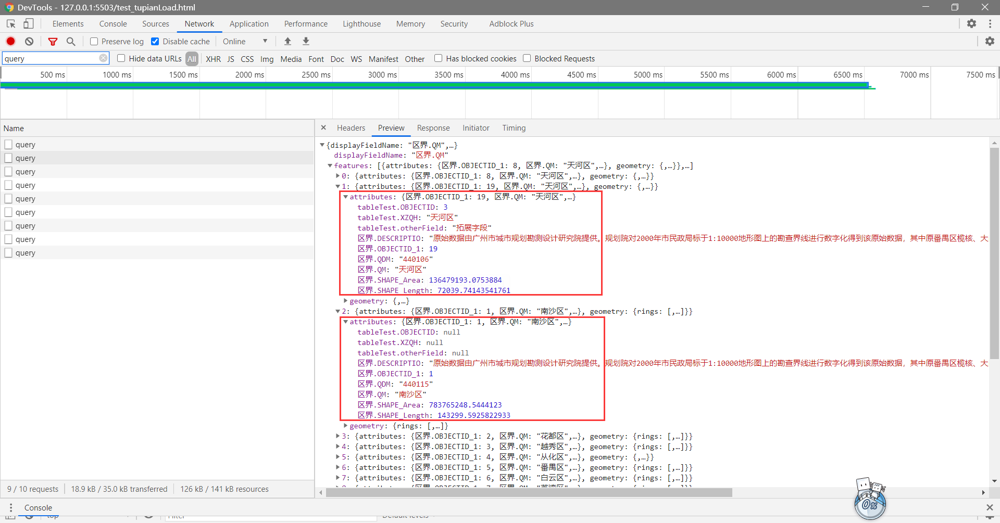

可以看到,我们的 tableTest 表的数据被关联进来了,如果关联字段匹配,就会把字段填值填入,否则为 null

上面例子中的右源表除了是 table,也可以是 shp 或者是 GDB 下的要素类,效果一样

## 自动获取 OGC 服务元数据

OGC 服务包括 WMS,WMTS,WFS,WCS,其中在我们项目中比较容易接触到的是 WMS(web map server)和 WMTS(web map tile server). OGC 服务如何使用也成为了必须掌握的技能.

### 服务元数据

OGC 服务的服务元数据都会存放在 GetCapabilities 接口下,里面有图层信息,切片信息(切片等级,比例尺,切片原点),出图类型(jpg|png),坐标信息

以天地图为例

http://t0.tianditu.gov.cn/vec_c/wmts?tk=5d4236a2a06043cd0b0880bbf270c958&Request=GetCapabilities&Service=WMTS

加载服务需要的参数如下,所有信息都可以在里面拿到

```js
let mateData = {
    style: "",  // 服务样式
    layer: "",  // 图层名称
    format: "", //图像格式
    matrixSet: "", // 切片矩阵名
    tileGrid: {
      origin: { x: , y: }, // 切片原点
      tileSize: [],        // 切片大小
      resolutions: [],     // 切片分辨率
      matrixIds: []        // 切片矩阵IDs
    }
  };
```

arcgis API 对加载 OGC 服务会先获取到服务元数据,解析后再加载.

openlayers 中没有对应的代码,新建一个 OGC 图层的时候,要手动去查服务元数据,写到配置文件中.当加载 OGC 服务的时候就读取配置文件加载.

考虑到 arcgis API 可以实现自动获取服务信息,那我们也可以在 openlayers 上实现

### 自动获取元数据

```js
// GetCapabilities获取到服务元数据，返回的是xml格式
const data = await axios.get(
  `${url}${
    url.indexOf("?") > -1 ? "&" : "?"
  }service=WMTS&request=GetCapabilities`,
  {
    responseType: "xml"
  }
);

let mateDataXML = new DOMParser().parseFromString(data, "text/xml");

const contentsXML = mateDataXML.getElementsByTagName("Contents")[0];

// 通过getElementsByTagName把需要的信息全部拿下后加载图层
```

这部分内容在新一张图中的 eyemap 库已实现

## Arcgis api 与 echarts 结合

### 遇到的问题

需要在地图上展示图表,但是 arcgis API 并没有相关支持, echarts 官网也只是提供了迁徙图的解决方案,没有饼状图柱状图等常用图表与 arcgis API 结合

### 解决方案

从 echarts 官方提供 demo 入手,既然他可以支持迁徙图,那我们稍加改造,支持饼状图柱状图应该问题不大.

### 代码实现

#### 创建图表的 DOM 元素

创建一个工具类,首先第一步我们需要创建一个和地图一样大小的 DOM 元素用来加载图表,并且挂载在地图 DOM 元素下

工具类的构造函数如下,三个参数分别为需要添加图表的地图对象,echarts 包,和图表的 DOM 元素 ID

```js
constructor: function (map, chart, chartId) {
  var n = document.getElementById(chartId);
  if (n == null) {
    // 创建DOM元素
    n = document.createElement("div");
    n.setAttribute("id", chartId);
    n.style.position = "absolute";
    n.style.height = map.height + "px";
    n.style.width = map.width + "px";
    n.style.top = 0;
    n.style.left = 0;
    // 和地图DOM元素一样大小并挂载到map对象下
    map.__container.appendChild(n);
  }
  this._echartsContainer = n;
  this._map = map;
  this.chart = chart;

  // 基于准备好的dom，初始化echarts实例
  this._ec = this.chart.init(this._echartsContainer);

  // 绑定地图事件,后面会提及
  this._bindEvent()
}
```

#### 定义图表的地理坐标,转为屏幕坐标加载

配置图表数据,包括地理坐标,配置信息如下:

```json
options : [{
  // 重点在这个grid里,我们自定义了lat,lon经纬度 其他参数查阅echarts官网
  "grid": [{ "lat": 120, "lon": 22.5, "width": "30px", "height": "30px" }],
  "tooltip": {
    "trigger": "axis",
    "axisPointer": {
      "type": "shadow"
    }
  },
  "xAxis": [
    {
      "gridIndex": 0,
      "type": "category",
      "data": ["Mon", "Tue", "Wed", "Thu", "Fri", "Sat", "Sun"]
    }
  ],
  "yAxis": [{ "gridIndex": 0, "type": "value", "show": false }],
  "series": [
    {
      "name": "Test",
      "type": "bar",
      "xAxisIndex": 0,
      "yAxisIndex": 0,
      "data": [120, 200, 150, 80, 70, 110, 130]
    }
  ]
}]
```

工具类中定义处理数据的函数,并调用 echarts 库的 setOption 函数生成图表

```js
setOption : function (options) {
  options.grid.forEach(function(grid, index) {
    var point = new Point(grid.lon, grid.lat);
    var i = this._map.toScreen(point);
    // 得到了坐标点对应的屏幕点
    if (i && i.x && i.y) {
      (grid.x = i.x + "px"), (grid.y = i.y + "px");
      if (option.series[index].type == "pie") {
        e.series[index].center = [i.x, i.y];
      }
    }
  });
  
  this._options = options;
  // 转换为屏幕点后就可以调用echarts库,生成图表
  this._ec.setOption(options, t);
}
```

#### 交互优化

目前已经做到了在地图对应的坐标点中生成图表,那么当地图发生变化时,图表也要响应跟着变化

上面提到的 bindEvent 函数就起作用了

```js
_resize: function () {
  this.setOption(this._options)
  this._ec.resize()
},
_bindEvent: function () {
  // 如果是4.x的api直接监听extent属性即可
  // 3.x需要监听缩放和平移
  this.handler = [
    // 地图发生缩放的时候,先隐藏图表,缩放完成后再重新渲染图表
    this._map.on("zoom-start", lang.hitch(this, function (e) {
        this._echartsContainer.style.visibility = "hidden"
    })),
    this._map.on("zoom-end", lang.hitch(this, function (e) {
      this._resize();
      this._echartsContainer.style.visibility = "visible"
    })),
    // 同理地图拖拽的时候也一样
    this._map.on("pan",lang.hitch(this,  function (e) {
        this._echartsContainer.style.visibility = "hidden"
    })),
    this._map.on("pan-end",lang.hitch(this,  function (e) {
        this._resize();
        this._echartsContainer.style.visibility = "visible"
    }))
  ]
}
```

#### 销毁事件

如果不再需要显示图表了,销毁监听事件

```js
unBindEvent: function () {
  this.handler.forEach(function (item) {
      item.remove()
  });
  this.handler = null;
}
```
#### 效果展示

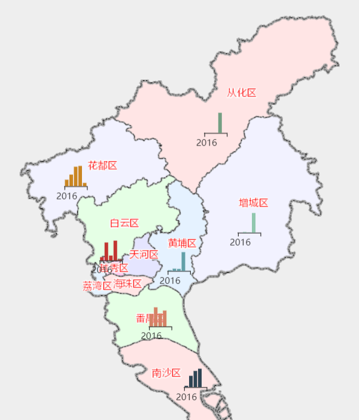

## openlayers 与超图平台

### openlayers 基础入门

https://roman-29.github.io/Blog/dailyRecord/OpenLayers.html

### 项目上使用 openlayers/超图 的经验

http://52.83.238.168:9000/ks/doc-project-summary/%E5%9F%BA%E7%A1%80%E4%BF%A1%E6%81%AF%E5%B9%B3%E5%8F%B0/%E9%98%B3%E6%B1%9F.html

#### 

## Nginx

Nginx 代理转发可以解决跨域和内外网 IP 造成的问题

### Nginx 学习笔记

https://roman-29.github.io/Blog/dailyRecord/Nginx.html

或者

https://www.yuque.com/docs/share/509b5c01-5b43-4684-8f1f-a6224a10b919?#%20%E3%80%8ANginx%E5%85%A5%E9%97%A8%E3%80%8B

### 正式环境内外网 IP 导致请求失败的问题

#### 问题分析

超图 iserver 是可以通过一定的规则拼接 url 实现调取图例的图片，例如在服务：
http://52.83.214.66:8090/iserver/services/map-XZQHJX/rest/maps/XZQH/layers/XZQH.html

可以访问下面的 url 获取 XZQH_SJXZQH 图层的图例
http://52.83.214.66:8090/iserver/services/map-XZQHJX/rest/maps/XZQH/layers/XZQH_SJXZQH@yjdata@@XZQH/legend

这个地址可以看成是 iserver 对外提供的一个接口，其最终会根据请求地址查找到 iserver tomcat 下的静态图片文件并返回给前端。
比如在我电脑的 iserver，图例的静态文件：

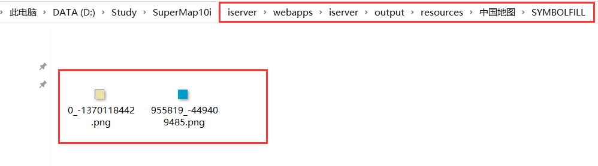

现场网络情况是政务外网只能通过外网 IP 访问服务器的 iserver，但是服务器访问自身是需要内网 IP。

这就会导致我在用外网 IP 请求 isrever 的图例接口，可以访问成功，但是 iserver 根据我的请求获取 tomcat 下的静态图片文件也是用了外网 IP，导致无法访问。

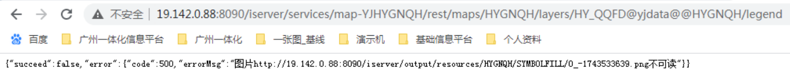

但是我又不能直接用内网 IP 请求 isrever 的图例接口，因为网络环境的原因，在外网是无法使用内网 IP 发送请求的。

### 解决办法

在服务器上配置 Nginx 做转发,在客户机上使用外网 IP 访问服务器的 Nginx 端口，通过 Nginx 反向代理转发，在服务器上转发为使用内网 IP 访问服务器上的图例，问题解决。

```txt
server {
  listen       8091;
  server_name  localhost;

  # 匹配到iserver就做转发

	location ^~ /iserver/
  {
	  proxy_pass http://内网IP:端口;
  }
}
````
