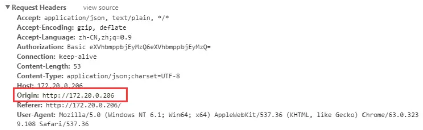
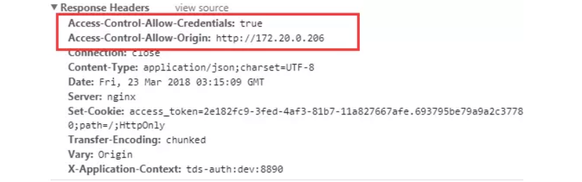
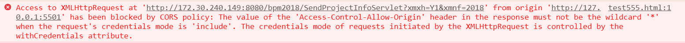
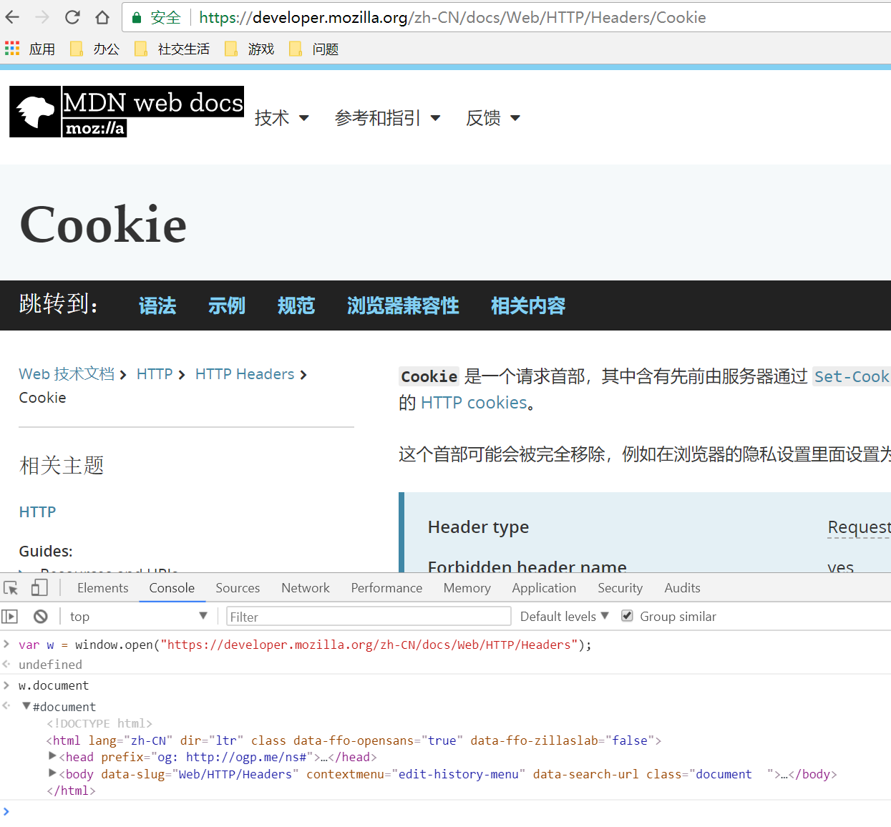
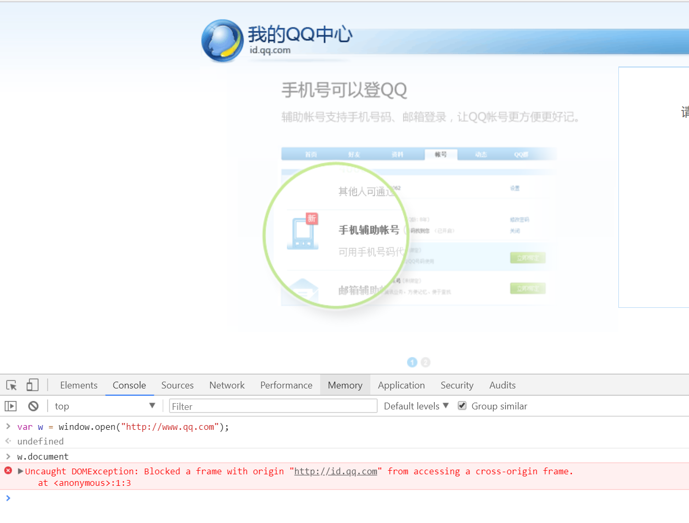
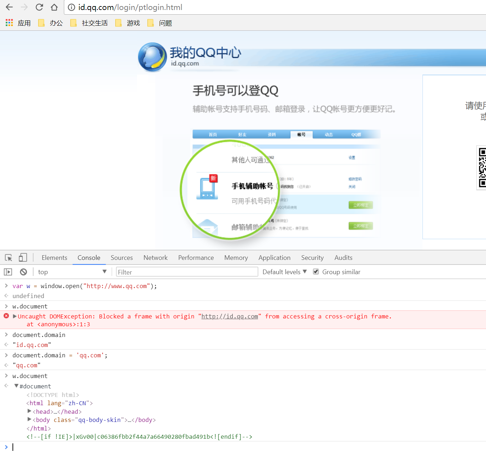
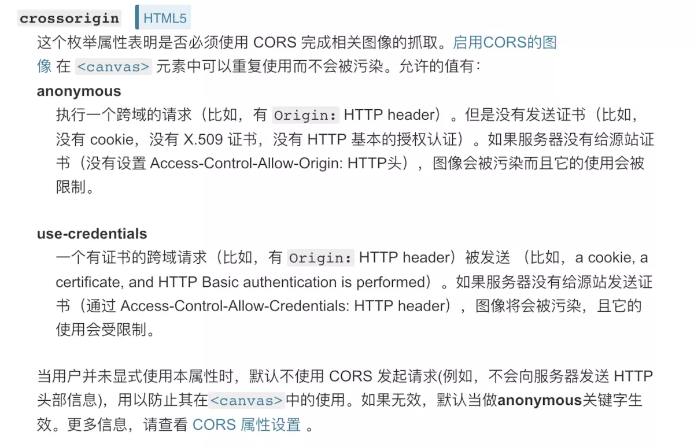

# 跨域

## 什么是前端跨域以及作用

### 浏览器的同源策略

同源策略限制了从同一个源加载的文档或脚本如何与来自另一个源的资源进行交互。这是一个用于隔离潜在恶意文件的重要安全机制。

### 同源的定义

如果两个页面的协议，端口（如果有指定）和主机都相同，则两个页面具有相同的源。
下表给出了相对http://store.company.com/dir/page.html同源检测的示例:

URL|结果|原因
-|-|-
http://store.company.com/dir2/other.html|成功|只有路径不同
http://store.company.com/dir/inner/another.html|成功|只有路径不同
https://store.company.com/secure.html|失败|不同协议 ( https和http )
http://store.company.com:81/dir/etc.html|失败|不同端口 ( http:// 80是默认的)
http://news.company.com/dir/other.html|失败|不同域名 ( news和store )

### 没有同源策略限制的两大危险场景

**没有同源策略限制的接口请求**

有一个小小的东西叫cookie大家应该知道，一般用来处理登录等场景，目的是让服务端知道谁发出的这次请求。如果你请求了接口进行登录，服务端验证通过后会在响应头加入Set-Cookie字段，然后下次再发请求的时候，浏览器会自动将cookie附加在HTTP请求的头字段Cookie中，服务端就能知道这个用户已经登录过了。知道这个之后，我们来看场景：

1.你准备去清空你的购物车，于是打开了买买买网站 www.maimaimai.com，然后登录成功，一看，购物车东西这么少，不行，还得买多点。

2.你在看有什么东西买的过程中，你的好基友发给你一个链接 www.nidongde.com，一脸yin笑地跟你说：“你懂的”，你毫不犹豫打开了。

3.你饶有兴致地浏览着 www.nidongde.com，谁知这个网站暗地里做了些不可描述的事情！由于没有同源策略的限制，它向www.maimaimai.com发起了请求！聪明的你一定想到上面的话“服务端验证通过后会在响应头加入Set-Cookie字段，然后下次再发请求的时候，浏览器会自动将cookie附加在HTTP请求的头字段Cookie中”，这样一来，这个不法网站就相当于登录了你的账号，可以为所欲为了！如果这不是一个买买买账号，而是你的银行账号，那……

这就是传说中的CSRF攻击（跨站请求伪造）。

**没有同源策略限制的Dom查询**

1.有一天你刚睡醒，收到一封邮件，说是你的银行账号有风险，赶紧点进www.yinghang.com改密码。你吓尿了，赶紧点进去，还是熟悉的银行登录界面，你果断输入你的账号密码，登录进去看看钱有没有少了。

2.睡眼朦胧的你没看清楚，平时访问的银行网站是www.yinhang.com，而现在访问的是www.yinghang.com，这个钓鱼网站做了什么呢？

```
// HTML
<iframe name="yinhang" src="www.yinhang.com"></iframe>
// JS
// 由于没有同源策略的限制，钓鱼网站可以直接拿到别的网站的Dom
const iframe = window.frames['yinhang']
const node = iframe.document.getElementById('你输入账号密码的Input')
console.log(`拿到了这个${node}，我还拿不到你刚刚输入的账号密码吗`)
```

由此我们知道，同源策略确实能规避一些危险，不是说有了同源策略就安全，只是说同源策略是一种浏览器最基本的安全机制，毕竟能提高一点攻击的成本。其实没有刺不穿的盾，只是攻击的成本和攻击成功后获得的利益成不成正比。

## 同源策略限制下接口请求的正确打开方式 
### 1.JSONP
在HTML标签里，一些标签比如script、img这样的获取资源的标签是没有跨域限制的，利用这一点，我们可以使用jsonp。
jsonp的原理：通过script标签引入一个js文件，这个js文件载入成功后会执行我们在url参数中指定的函数，并且会把我们需要的json数据作为参数传入，有种回调的味道！

```html
<!DOCTYPE html>
<html>
  <head>
    <meta charset="utf-8">
  </head>
  <body>
    <script type='text/javascript'>
      // 后端返回直接执行的方法，相当于执行这个方法，由于后端把返回的数据放在方法的参数里，所以这里能拿到res。
      window.jsonpCb = function (res) {
        console.log(res)
      }
    </script>
    <script src='http://localhost:9871/api/jsonp?msg=helloJsonp&callback=jsonpCb' type='text/javascript'></script>
  </body>
</html>
```
简单封装一下前端这个套路
```js
/**
 * JSONP请求工具
 * @param url 请求的地址
 * @param data 请求的参数
 * @returns {Promise<any>}
 */
const request = ({url, data}) => {
  return new Promise((resolve, reject) => {
    // 处理传参成xx=yy&aa=bb的形式
    const handleData = (data) => {
      const keys = Object.keys(data)
      const keysLen = keys.length
      return keys.reduce((pre, cur, index) => {
        const value = data[cur]
        const flag = index !== keysLen - 1 ? '&' : ''
        return `${pre}${cur}=${value}${flag}`
      }, '')
    }
    // 动态创建script标签
    const script = document.createElement('script')
    // 接口返回的数据获取
    window.jsonpCb = (res) => {
      document.body.removeChild(script)
      delete window.jsonpCb
      resolve(res)
    }
    script.src = `${url}?${handleData(data)}&cb=jsonpCb`
    document.body.appendChild(script)
  })
}
// 使用方式
request({
  url: 'http://localhost:9871/api/jsonp',
  data: {
    // 传参
    msg: 'helloJsonp'
  }
}).then(res => {
  console.log(res)
})
```

JSONP的优缺点
优点：它不像XMLHttpRequest对象实现的Ajax请求那样受到同源策略的限制；它的兼容性更好，在更加古老的浏览器中都可以运行，不需要XMLHttpRequest或ActiveX的支持；并且在请求完毕后可以通过调用callback的方式回传结果。

缺点：它只支持GET请求而不支持POST等其它类型的HTTP请求；它只支持跨域HTTP请求这种情况，不能解决不同域的两个页面之间如何进行JavaScript调用的问题。

### 2.空iframe加form
iframe可以发POST请求
```js
const requestPost = ({url, data}) => {
  // 首先创建一个用来发送数据的iframe.
  const iframe = document.createElement('iframe')
  iframe.name = 'iframePost'
  iframe.style.display = 'none'
  document.body.appendChild(iframe)
  const form = document.createElement('form')
  const node = document.createElement('input')
  // 注册iframe的load事件处理程序,如果你需要在响应返回时执行一些操作的话.
  iframe.addEventListener('load', function () {
    console.log('post success')
  })

  form.action = url
  // 在指定的iframe中执行form
  form.target = iframe.name
  form.method = 'post'
  for (let name in data) {
    node.name = name
    node.value = data[name].toString()
    form.appendChild(node.cloneNode())
  }
  // 表单元素需要添加到主文档中.
  form.style.display = 'none'
  document.body.appendChild(form)
  form.submit()

  // 表单提交后,就可以删除这个表单,不影响下次的数据发送.
  document.body.removeChild(form)
}
// 使用方式
requestPost({
  url: 'http://localhost:9871/api/iframePost',
  data: {
    msg: 'helloIframePost'
  }
})
```

### 3.CORS
CORS是一个W3C标准，全称是"跨域资源共享"（Cross-origin resource sharing)。CORS有两种请求，简单请求和非简单请求：
只要同时满足以下两大条件，就属于简单请求。

(1) 请求方法是以下三种方法之一：
* HEAD
* GET
* POST

(2)HTTP的头信息不超出以下几种字段：
* Accept
* Accept-Language
* Content-Language
* Last-Event-ID
* Content-Type：只限于三个值application/x-www-form-urlencoded、multipart/form-data、text/plain

**简单请求:**

前端什么也不用干，就是正常发请求就可以,大部分还是后端人员的工作。

浏览器：诶，你小子要跨域是吧，我得问问服务器大哥肯不肯！往请求头添加origin亮一下牌面。



服务器：诶，你是谁，我来看看你的origin，嗯嗯，可以，符合我的要求，放行！顺便告诉你，老夫的规矩！



`Access-Control-Allow-Origin`有多种设置方法：
* 设置"\*"是最简单粗暴的，但是服务器出于安全考虑，肯定不会这么干，而且，如果是"\*"的话，游览器将不会发送cookies.即使你的XHR设置了withCredentials。报错信息如图：



* 指定域，如上图中的http://172.20.0.206

`withCredentials`：表示XHR是否接收cookies和发送cookies，也就是说如果该值是false，响应头的`Set-Cookie`，浏览器也不会理，并且即使有目标站点的cookies，浏览器也不会发送。

**复杂请求:**

最常见的情况，当我们使用put和delete请求时，浏览器会先发送option（预检）请求，不过有时候，你会发现并没有，这是后面会讲到缓存。
非简单请求会发出一次预检测请求，返回码是204，预检测通过才会真正发出请求，这才返回200。

与简单请求不同的是，option请求多了2个字段：
`Access-Control-Request-Method`：该次请求的请求方式
`Access-Control-Request-Headers`：该次请求的自定义请求头字段

```
//指定允许其他域名访问
'Access-Control-Allow-Origin:http://172.20.0.206'//一般用法（*，指定域，动态设置），3是因为*不允许携带认证头和cookies
//是否允许后续请求携带认证信息（cookies）,该值只能是true,否则不返回
'Access-Control-Allow-Credentials:true'
//预检结果缓存时间,也就是上面说到的缓存啦
'Access-Control-Max-Age: 1800'
//允许的请求类型
'Access-Control-Allow-Methods:PUT,POST,GET,DELETE,OPTIONS'
//允许的请求头字段
'Access-Control-Allow-Headers:x-requested-with,content-type'
```

### 4.代理

想一下，如果我们请求的时候还是用前端的域名，然后有个东西帮我们把这个请求转发到真正的后端域名上，不就避免跨域了吗？

如GIS专业最常接触的esri代理，只要配置一下需要代理的地址，前端就不用干什么事情了，也没后端什么事情了

## 同源策略限制下Dom查询的正确打开方式

### 1.postMessage

window.postMessage() 是HTML5的一个接口，专注实现不同窗口不同页面的跨域通讯。

这里是http://localhost:9099/#/crossDomain，发消息方

```vue
<template>
  <div>
    <button @click="postMessage">给http://crossDomain.com:9099发消息</button>
    <iframe name="crossDomainIframe" src="http://crossdomain.com:9099"></iframe>
  </div>
</template>

<script>
export default {
  mounted () {
    window.addEventListener('message', (e) => {
      // 这里一定要对来源做校验
      if (e.origin === 'http://crossdomain.com:9099') {
        // 来自http://crossdomain.com:9099的结果回复
        console.log(e.data)
      }
    })
  },
  methods: {
    // 向http://crossdomain.com:9099发消息
    postMessage () {
      const iframe = window.frames['crossDomainIframe']
      iframe.postMessage('我是[http://localhost:9099], 麻烦你查一下你那边有没有id为app的Dom', 'http://crossdomain.com:9099')
    }
  }
}
</script>
```

这里是http://crossdomain.com:9099，接收消息方

```
<template>
  <div>
    <button @click="postMessage">给http://crossDomain.com:9099发消息</button>
    <iframe name="crossDomainIframe" src="http://crossdomain.com:9099"></iframe>
  </div>
</template>

<script>
export default {
  mounted () {
    window.addEventListener('message', (e) => {
      // 这里一定要对来源做校验
      if (e.origin === 'http://crossdomain.com:9099') {
        // 来自http://crossdomain.com:9099的结果回复
        console.log(e.data)
      }
    })
  },
  methods: {
    // 向http://crossdomain.com:9099发消息
    postMessage () {
      const iframe = window.frames['crossDomainIframe']
      iframe.postMessage('我是[http://localhost:9099], 麻烦你查一下你那边有没有id为app的Dom', 'http://crossdomain.com:9099')
    }
  }
}
</script>
```

### 2.document.domain

这种方式只适合主域名相同，但子域名不同的iframe跨域。

分享几个例子：

* 1.访问同源页面：

打开https://developer.mozilla.org/zh-CN/docs/Web/HTTP/Headers/Cookie，在f12控制台里window.open页面：https://developer.mozilla.org/zh-CN/docs/Web/HTTP/Headers，访问返回的window对象的document属性，发现能够访问成功，如下图：



* 2.访问协议、端口号一致，域名不一致，但具有相同上级域名的页面

打开id.qq.com，f12打开控制台，window.open页面: www.qq.com，同样访问返回的window对象的document属性，发现访问失败，提示被阻止访问跨域的窗体：



这个时候分别打印id.qq.com的document.domain和www.qq.com的document.domain，发现前者是id.qq.com，而后者是qq.com，这时我们手动设置一下id.qq.com页面的document.domain，设置为qq.com，再次访问www.qq.com的window对象的document，发现访问成功：



### 3.canvas操作图片的跨域问题

* 1.首先，图片服务器需要配置Access-Control-Allow-Origin

当需要需要对canvas图片进行getImageData()或toDataURL()操作的时候，有可能会遇到跨域问题，而且跨域问题还不止一层。

图片服务器需要配置Access-Control-Allow-Origin信息，此时，Chrome浏览器就不会有Access-Control-Allow-Origin相关的错误信息了，但是，还会有其他的跨域错误信息。

* 2.HTML crossOrigin属性解决资源跨域问题

```js
img = new Image();
img.setAttribute("crossOrigin", "Anonymous");
```

关于 crossOrigin，我们看看 MDN 的解释。



这段话，用我自己的理解来解释一下：

加了 crossorigin 属性，则表明图片就一定会按照 CORS 来请求图片。而通过CORS 请求到的图片可以再次被复用到 canvas 上进行绘制。换言之，如果不加 crossorigin 属性的话，那么图片是不能再次被复用到 canvas 上去的。
可以设置的值有 anonymous 以及 use-credentials，2 个 value 的作用都是设置通过 CORS 来请求图片，区别在于 use-credentials 是加了证书的 CORS。
如果默认用户不进行任何设置，那么就不会发起 CORS 请求。但如果设置了除 anonymous 和 use-credentials 以外的其他值，包括空字串在内，默认会当作 anonymous来处理。

参考文章：

- [不要再问我跨域的问题了](https://segmentfault.com/a/1190000015597029)
- [没错，就是Access-Control-Allow-Origin，跨域](https://www.jianshu.com/p/89a377c52b48)
- [一个关于image访问图片跨域的问题](https://www.jianshu.com/p/8fa0fb53c183)
- [canvas图片问题浅析](https://www.jianshu.com/p/c3aa975923de)