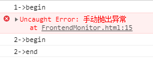
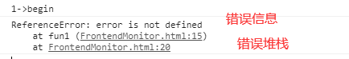
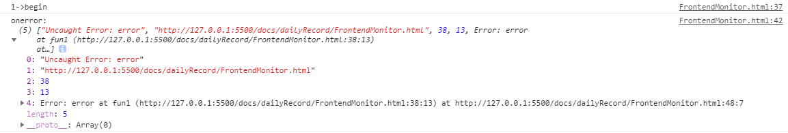
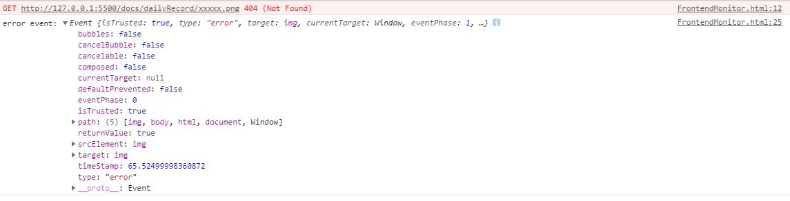
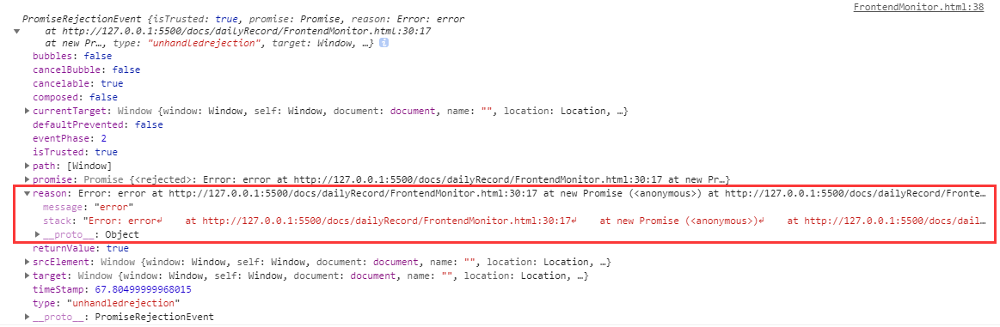

# 前端异常监控实践

## JS 异常

### JS 异常的特点

js 异常的特点是,出现不会导致 JS 引擎崩溃 最多只会终止当前执行的任务。

```html
<script>
  setTimeout(() => {
    console.log("1->begin");
    throw new Error("手动抛出异常");
    console.log("1->end");
  });
  setTimeout(() => {
    console.log("2->begin");
    console.log("2->end");
  });
</script>
```

执行上面的例子，我们用 setTimeout 分别启动了两个任务，虽然第一个任务执行了一个错误的方法。程序执行停止了。但是另外一个任务并没有收到影响。



其实如果你不打开控制台都看不到发生了异常。好像是异常是在静默中发生的。所以我们需要对前端的异常进行收集监控，以便更好的对系统进行运维管理。

### Error 错误类型

代码执行过程中会发生各种类型的错误。每种类型都会对应一个错误发生时抛出的错误对象。

#### Error

Error 是基类型，其他错误类型继承该类型。因此，所有错误类型都共享相同的属性（所有错误对象上的方法都是这个默认类型定义的方法）。

浏览器很少会抛出 Error 类型的错误，该类型主要用于开发者抛出自定义错误。

#### InternalError

InternalError 类型的错误会在底层 JavaScript 引擎抛出异常时由浏览器抛出。例如，递归过多导 致了栈溢出。这个类型并不是代码中通常要处理的错误，如果真发生了这种错误，很可能代码哪里弄错
了或者有危险了。

#### RangeError

数值变量或参数超出其有效范围。

```js
function fn() {
  fn();
}
fn(); //RangeError: Maximum call stack size exceeded

let item = new Array(-20); // RangeError: Invalid array length
```

#### ReferenceError

引用变量不存在，无效引用。

```js
console.log(a); // ReferenceError: a is not defined
```

#### SyntaxError

语法错误。

```js
const c = """" //SyntaxError: Unexpected string
```

#### TypeError

变量或参数不属于有效类型。

```js
var b = {};
b.xxx(); // TypeError: b.xxx is not a function

let o = new 10(); // TypeError: 10 is not a constructor
```

#### URIError

以一种错误的方式使用全局 URI 处理函数而产生的错误。

```js
decodeURI("%"); // URIError: URI malformed
```

## 异常收集

### try-catch

作为在 JavaScript 中处理异常的一种方式,任何可能出错的代码都应该放到 try 块中，而处理错误的代码则放在 catch 块中。

如果在函数中错误没有被捕获，错误会上抛。

```js
function fun1() {
  console.log("1->begin");
  error;
  console.log("1->end");
}
setTimeout(() => {
  try {
    fun1();
  } catch (e) {
    console.log(e);
  }
});
```



但是 try/catch 对异步代码就显得无能为力了,除非给所有的异步都再加一个 try-catch（代码改动巨大）。

```js
function fun1() {
  console.log("1->begin");
  error;
  console.log("1->end");
}

try {
  setTimeout(() => {
    fun1();
  });
} catch (e) {
  console.log("catch", e);
}
```

### window.onerror

任何没有被 try/catch 语句处理的错误都会在 window 对象上触发 error 事件，不管是同步还是异步。

```js
function fun1() {
  console.log("1->begin");
  throw new Error("error");
  console.log("1->end");
}
window.onerror = (...args) => {
  console.log("onerror:", args);
  // 返回true 可以阻止浏览器报告这个错误
  return true;
};

setTimeout(() => {
  fun1();
});
```

在 onerror 事件处理程序中，会传入 5 个参数：

1. message
2. 发生错误的 URL
3. 行号
4. 列号
5. 错误 event 对象



### 监听 error 事件

其实 onerror 固然好但是还是有一类异常无法捕获。这就是网络异常的错误。比如下面的例子。

```html

```

注意，当资源（如 img 或 script）加载失败，加载资源的元素会执行该元素上的 onerror()处理函数。这些 error 事件不会向上冒泡到 window，但可以在捕获阶段被捕获。所以需要在捕获阶段捕获事件。

```js
window.addEventListener(
  "error",
  (args) => {
    console.log("error event:", args);
    return true;
  },
  true // 捕获阶段
);
```



### Promise 异常捕获

ES 6 原生提供了 Promise 对象。Promise 对象代表了未来将要发生的事件，用来传递异步操作的消息。

这种无论是 onerror 还是监听错误事件都是无法捕获 Promise。除非每个 Promise 都添加一个 catch 方法，但是显然是不能这样做。

```js
new Promise((resolve, reject) => {
  throw new Error("error");
}).catch((err) => {
  // 增加异常捕获
  console.log("promise catch:", err);
});
```

我们可以考虑将 unhandledrejection 事件捕获错误抛出交由错误事件统一处理就可以了

```js
window.addEventListener("unhandledrejection", (e) => {
  console.log(e);
  throw e.reason;
});
```

可以看到 unhandledrejection 事件是可以拿到错误信息的



拿到错误信息后直接 throw 将错误抛出，window.onerror 就会收集到错误信息统一处理。

### async/await 异常捕获

实际上 async/await 语法本质还是 Promise 语法。区别就是 async 方法可以被上层的 try/catch 捕获。

```js
const asyncFunc = () => {
  return new Promise((resolve) => {
    throw new Error("error");
    resolve(null);
  });
};

setTimeout(async () => {
  try {
    await asyncFun();
  } catch (e) {
    // 会捕获到 asyncFunc 的错误
    console.log("catch:", e);
  }
});
```

如果不用 try/catch，就会和 Promise 一样，需要用 unhandledrejection 事件捕获。这样的话我们只需要在全局增加 unhandlerejection 就好了。

### 小结

| 异常类型                    | 同步方法 | 异常类型 | 资源加载 | Promise | async/await |
| --------------------------- | -------- | -------- | -------- | ------- | ----------- |
| try/catch                   | √        | ×        | ×        | ×       | ×           |
| onerror                     | √        | √        | ×        | ×       | ×           |
| error 事件监听              | √        | √        | √        | ×       | ×           |
| unhandledrejection 事件监听 | ×        | ×        | ×        | √       | √           |

实际上我们可以将 unhandledrejection 事件抛出的异常再次抛出就可以统一通过 error 事件进行处理了。

最终用代码表示如下：

```js
window.addEventListener("unhandledrejection", (e) => {
  // 抛出错误到 error事件 统一处理
  throw e.reason;
});

window.addEventListener(
  "error",
  (args) => {
    console.log("error event:", args);
    return true;
  },
  true
);
```

## 后续还在画饼中。。。

## VUE 项目异常收集

## 前端录制回放

## 异常筛选过滤及分类分析

## 上传错误信息和回放

## 后端信息收集入库

## 前端搭建异常监控可视化管理平台
