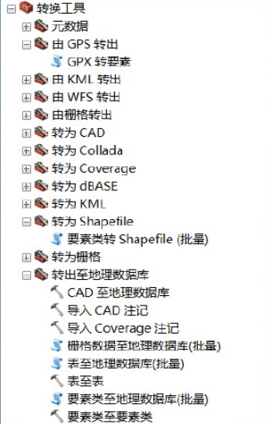
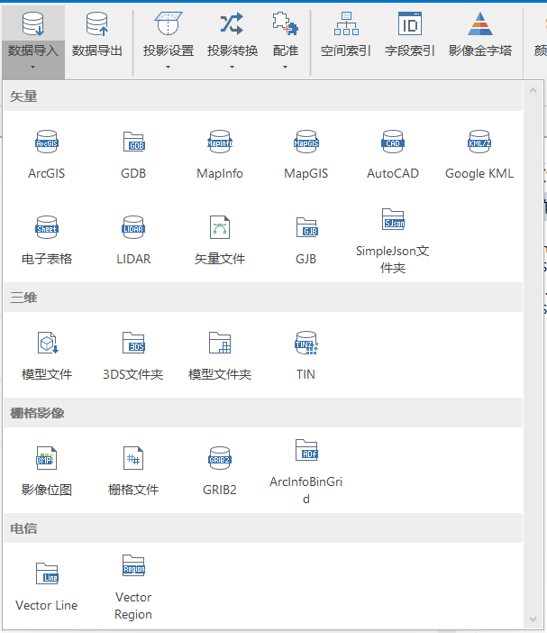
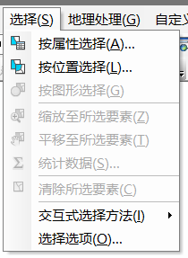
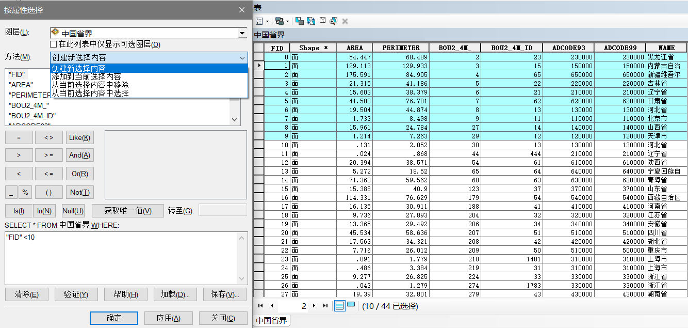

# GIS 体系介绍

## 地图数据生产

### 数据获取

从获取方式来看可以分为:

1. 矢量化：纸质地图扫描后，进行配准投影及数字化处理 
2. 测量：导出全站仪等测量仪器采集的点数据，进行内业成图处理 
3. GPS采集：利用GPS接收机或RTK技术采集的数据，进行内业成图处
4. 遥感影像解译：利用卫星影像，数据预处理，进行影像自动分类识别或人工解译提取信息 
5. 航测或雷达数据：利用航拍的卫片或利用雷达数据，提取信息

从获取途径来看可以分为：

1. 测绘部门
2. 商业机构
3. 独立采集

### 数据处理

#### 数据格式转换

arcgis工具箱中提供了大量的数据转换工具

supermap同样也支持多格式的数据导入与导出

#### 数据抽取

按位置或按属性进行要素筛选

以arcgis为例，对数据进行筛选操作如下：

**按属性选择**

如图所示，选择一个图层和筛选的方法，填写SQL语句对图层数据进行筛选

**按位置选择**

如图所示，选择目标图层和源图层，并确定空间关系，进行要素筛选

#### 数据坐标系

**遇到的问题：**

1. 数据没有坐标系
2. 多个数据之间坐标系不一致
3. 数据没有坐标值

**定义投影**

对没有坐标系的数据进行坐标系定义

**投影变换**

对坐标系不一致的数据进行坐标转换

**数据校正**

矢量数据空间校正

栅格数据地理校准

#### 

### 质量控制

### 地图整饰

### 数据应用

#### 地图服务 

将地图

## 数据存储

1. 简介

2. arcgis 

mxd gdb sde 要素数据集 要素类 栅格数据集

3. supermap

工作空间、数据源、数据集、地图、场景、布局

## 地图服务器

1. arcgis server

mapServer featureServer sceneServer GPServer NAServer OGC

2. supermap iserver

地图服务 数据服务 空间分析服务 三维服务 交通网络服务 OGC

## 客户端呈现

1. ArcMap

arcgisonline arcgis for js arcmap

2. Supermap iDesktop

 for openlayer   for mapbox 