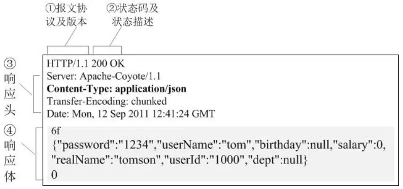

# HTTP请求与响应

## HTTP简介

HTTP协议工作于客户端-服务端架构上。浏览器作为HTTP客户端通过URL向HTTP服务端即WEB服务器发送所有请求。Web服务器根据接收到的请求后，向客户端发送响应信息。

## HTTP三点注意事项：

* **HTTP是无连接**：无连接的含义是限制每次连接只处理一个请求。服务器处理完客户的请求，并收到客户的应答后，即断开连接。采用这种方式可以节省传输时间。

* **HTTP是媒体独立的**：这意味着，只要客户端和服务器知道如何处理的数据内容，任何类型的数据都可以通过HTTP发送。客户端以及服务器指定使用适合的MIME-type内容类型。

* **HTTP是无状态**：HTTP协议是无状态协议。无状态是指协议对于事务处理没有记忆能力。缺少状态意味着如果后续处理需要前面的信息，则它必须重传，这样可能导致每次连接传送的数据量增大。另一方面，在服务器不需要先前信息时它的应答就较快。

## 客户端请求消息

客户端发送一个HTTP请求到服务器的请求消息包括以下格式：请求行（request line）、请求头部（header）、空行和请求数据四个部分组成，下图给出了请求报文的一般格式。

**常见的HTTP请求头属性**

协议头|说明|示例
-|-|-
Accept|告诉服务端，客户端接受什么类型的响应。值可以为一个或多个MIME类型的值|如Accept:text/plain只能接受纯文本数据
Cookie|由服务器通过Set-Cookie设置的一个HTTP协议Cookie|JSESSIONID=luojw; loginstate=1
Origin|标识跨域资源请求(匹配服务端设置Access-Control-Allow-Origin响应字段)|Origin: http://www.example.com
Cache-Control|缓存机制|https://developer.mozilla.org/zh-CN/docs/Web/HTTP/Headers/Cache-Control
Connection|决定当前的事务完成后，是否会关闭网络连接。|如果该值是“keep-alive”，网络连接就是持久的，不会关闭，使得对同一个服务器的请求可以继续在该连接上完成。

## 服务器响应消息

响应报文由三个部分组成(响应行,响应头,响应体)，如图：

**常见的HTTP响应头属性**

协议头|说明|示例
-|-|-
Access-Control-Allow-Origin|指定哪些网站可以跨域源资源共享|Access-Control-Allow-Origin: *
Access-Control-Allow-Credentials|允许传入cookie|Access-Control-Allow-Credentials:true
Content-Type|	当前内容的MIME类型|https://www.runoob.com/http/http-content-type.html

全部参数，请参考:
https://blog.csdn.net/xiaochengyihe/article/details/80910913
