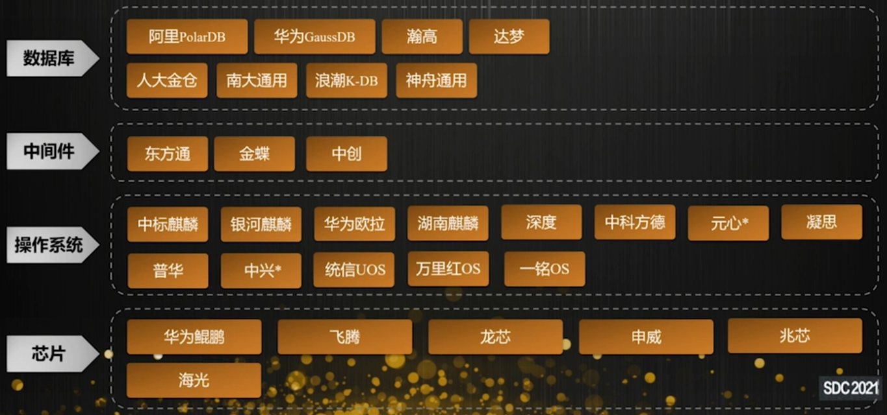
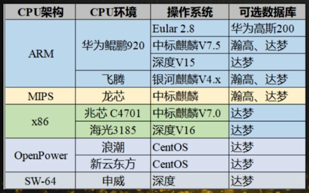
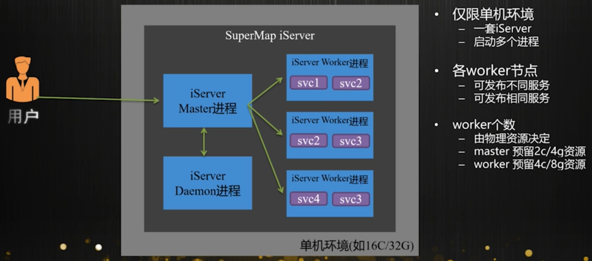
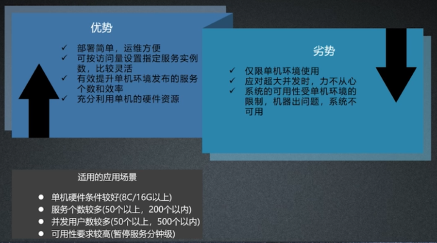
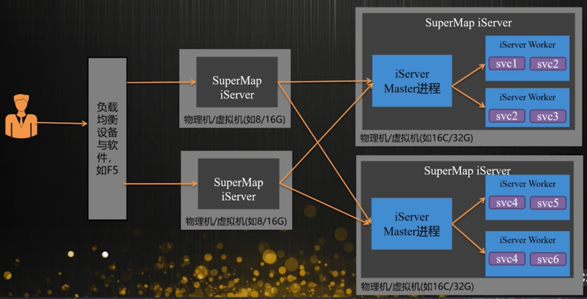

# 信创环境

## 主流信创平台

随着信创类相关政策的陆续出台, 政府逐步开展信创工作. 在日常工作中有可能会涉及到相关内容.

下图为目前主流的信创平台

## 平台选型和资源预估

如何对信创软硬件平台进行合理选型和预估

### 分析项目需求

**部署与集成需求**

1. 软硬件平台部署需求, 是否明确系统, 芯片, 数据库, 中间件等

2. 部署于涉密环境还是通用环境

3. 独立部署, 嵌入已有系统, 集成三方设施或应用

**功能需求**

1. 地图, 数据, 三维等基础功能

2. 空间分析, 网络分析, 空间处理分析等

3. 分布式分析, 机器学习, 区块链等

**质量需求**

1. 支撑用户数量, 设备并发数

2. 数据的量级(瓦片数据, 空间数据)

3. 响应时间

4. 安全性需求

### 选型

如果没有明确相关选型, 根据相关平台的成熟度, 按优先级排序选型:

* CPU架构: ARM(鲲鹏/飞腾) > MIPS(龙芯) > X86(兆芯/海光) > SW-64(申威)

* 操作系统选择与CPU架构适配的系统

* Web中间件: TongWeb(东方通) > Apusic(金蝶) > InfoSuite(中创)

* 数据库: 瀚高 > 达梦 > 高斯 > 人大金仓 > 神舟通用,南大通用 > 浪潮K-DB

在"强信创类"应用中, 需要各个平台都是信创类平台, 考虑到相互的兼容性, 按下表推荐:

### 合理预估资源

1. 功能

* 强计算类: 动态出图, 叠加分析等需要消耗CPU和内存资源

* 强IO类: 瓦片发布, 空间查询, 地址匹配等, 硬盘IO要求高

2. 响应时间

* 响应时间越低, 资源要求越高, 涉及到计算资源和网络带宽

3. 并发用户数

不同功能并发要求不同, 用户越多资源要求越高, 涉及CPU, 内存, 网络带宽

#### 预估计算资源(CPU和内存)

通过GIS功能+并发请求数进行综合评估

* 瓦片出图1核CPU支持30个并发, 动态出图1核CPU支持5个并发

* 空间查询1核CPU支持8个并发, 空间分析1核CPU支持5个并发

CPU和内存比例

* 1:2(低配) 如16C(32G), 1:4(高配) 如16C(64G)

多种功能的资源需求, 按功能累加

* 300并发瓦片出图, 25并发动态出图, 40并发空间查询
* CPU(核) = 300/30 + 25/5 + 40/8 = 20
* 内存 = 20 * 2 = 40G低配 或 20 * 4 = 80G高配

#### 预估存储资源(硬盘/NAS)

数据量 * 副本数 * 缓冲比例

* 缓冲比例: 1.5(低配) 2(高配)
* 数据量5T, 3副本, 缓存比例2
* 磁盘容量 = 5 * 3 * 2 (30T)

数据副本如何计算

* 由磁盘IO需求和磁盘IO能力决定
* 磁盘IO需要300M/s, 磁盘IO能力为100M/s
* 副本数 = 300 / 100 = 3副本

#### 预估网络带宽

由系统各个功能的网络带宽需求累加

* 地图瓦片30M/s, 三维瓦片80M/s, 空间查询5M/s
* 网络带宽总需求 = 30 + 80 + 5 = 115M/s

单个功能网络带宽需求由并发数和响应时间决定

* 单个瓦片30KB, 5000个并发, 响应时间0.5s
* 网络带宽总需求 = 30KB * 5000 * (1/0.5) = 292M/s

## 部署方案和实施

### 单机多进程

### 多机集群

## 性能与稳定性调优

### 常见性能瓶颈原因

#### 资源使用瓶颈

* 查询CPU使用情况(top/xmstat). 并发访问动态出图, 空间分析等计算密集型功能容易导致CPU资源不足

* 查询内存使用情况(top/free). 网络分析模型过大, 发布服务过多等原因造成的内存不足

* 查询磁盘IO(iostat/vmstat). 瓦片请求过多, 导致的磁盘IO性能瓶颈

* 查询网络带宽(ifstat/)

#### 运行环境设置不当

* jvm堆设置过小

* web中间件设置不当

#### 地图服务器使用不当

* 发布服务过多, 以及不适当的缓存设置

* 工作节点过少, 或节点资源分配不足(iserver)

#### 数据问题

* 发布服务数据过大

* 要素复杂或图层过多

* 未构建空间索引

### 常见优化手段

#### 加资源

* 升级CPU提示计算能力
* 升级内存提升实时数据处理能力
* 升级磁盘提升IO能力
* 升级网卡/网络提升带宽

#### 调架构

* 单机多进程部署, 充分利用单机的性能

* 多机集群部署

#### 优化配置

* 优化jvm参数

* 优化web中间件设置, 增大备用链接线程数和最大连接线程数

#### 减少额外功能

* 关闭jar/tld扫描(JarScanner)

* 关闭文件变更监控(WatchedResource)

* 关闭请求访问日志(AccessLog)

* 关闭响应体自动压缩(Compression)

* 去除不必要的默认web应用

#### 优化地图服务器

* 删除或停用多余的服务

* 迁移数据到其他节点

* 数据合并减少服务个数

* 使用合适的缓存策略