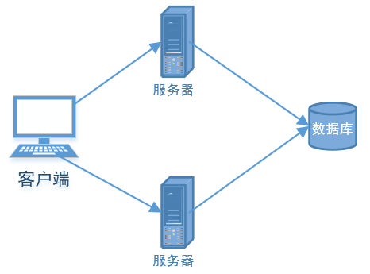
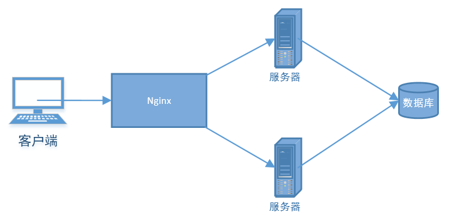
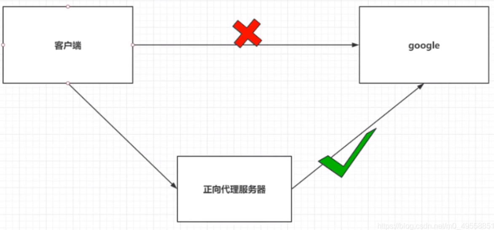
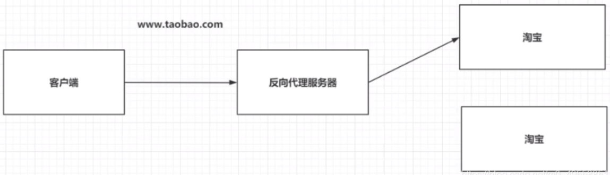

# Nginx入门

## Nginx介绍

最简单的系统架构



> 问题：客户端到底要将请求发送给哪台服务器 

使用nginx做反向代理



> Nginx帮助我们进行分配服务器

## Nginx的基本配置介绍

在Nginx的安装目录下，找到conf/nginx.conf，主要结构如下：

```json
#user  nobody;
worker_processes  1;
#error_log  logs/error.log;

# 以上统称为全局快
# worker_processes越大，并发能力越强

events {
    worker_connections  1024;
}

# events块
# worker_connections越大，并发能力越强

http {
    include       mime.types;
    default_type  application/octet-stream;
	
    server {
        listen       8091;
        server_name  localhost;

		location / {
            root   html;
            index  index.html index.htm;
        }
		# location块
		# root/ ：接收到请求后去root的文件夹查找index资源
    }
	
	# server块
	# listen：代表监听的端口号
	# localhost：代表接受请求的IP或域名
}

# HTTP块
# include代表引入一个外部的文件 mime.types中放有大量的媒体类型
```

## Nginx反向代理

### 正向代理

> 1.正向代理服务是由客户端设立的 
>
> 2.客户端了解代理服务器和目标服务器都是谁 
>
> 3.实现突破访问权限，提高访问的速度，对目标服务器隐藏客户端的ip地址



### 反向代理

> 1.反向代理服务器是配置在服务端的 
>
> 2.客户端不知道访问的到底是哪一台服务器 
>
> 3.达到负载均衡，并且可以隐藏服务器真正的ip地址



### 基于Nginx实现反向代理

#### location路径匹配映射

```json
# 1. 精准匹配
location = / {
	#精准主机名后面不能带任何字符串
	#例如localhost:8091或localhost:8091/ 都可以匹配
    #localhost:8091/luojw 不行
}

#2. 通用匹配
location /xxx {
	#匹配所有以/xxx开头的路径
	#例如127.0.0.1:8080/xxx
}

#3. 正则匹配
location ~ /xxx {
	#匹配包含/xxx的路径
}

#4. 匹配开头路径
location ^~ /xxx {
	#匹配所有以/xxx开头的路径
}

#5. 匹配结尾路径
location ~* \.(gif/jpg/png)$ {
	#匹配以.gif、.jpg或者.png结尾的路径
}

以上匹配的先后顺序规则如下：
1）精准匹配，若成功，则停止后面的步骤，若没有，继续下面的步骤
2）普通匹配（若有多个匹配项匹配成功，那么记住最长匹配，并继续下面的匹配步骤）
3）命中前缀匹配（^~）终止匹配
4）正则表达式匹配
```

### proxy_pass代理转发

在nginx中配置proxy_pass代理转发时，如果在proxy_pass后面的url加/，表示绝对根路径；如果没有/，表示相对路径，把匹配的路径部分也给代理走。

假设下面四种情况分别用 http://localhost:8091/proxy/test 进行访问。

第一种：
 location /proxy {
 		proxy_pass http://127.0.0.1/;
 }
 代理到URL：http://127.0.0.1/


第二种（相对于第一种，最后少一个 / ）
 location /proxy/ {
 		proxy_pass http://127.0.0.1;
 }
 代理到URL：http://127.0.0.1/proxy/test


## Nginx负载均衡

Nginx为我们默认提供了三种负载均衡的策略： 

1. 轮询：  将客户端发起的请求，平均分配给每一台服务器 
2. 权重：  会将客户端的请求，根据服务器的权重值不同，分配不同的数量 
3. ip_hash:  基于发起请求的客户端的ip地址不同，他始终会将请求发送到指定的服务器上  就是说如果这个客户端的请求的ip地址不变，那么处理请求的服务器将一直是同一个

### 轮询

修改配置文件：

```json
upstream myserver{
	server ip:端口;
    server 域名:端口;
}
	
server {
    listen       8091;
    server_name  localhost;
	
	location / {
		proxy_pass http://myserver/;
	}
}
```

这样当我访问localhost:8091的时候，会循环代理到我本机的localhost:80和support.supermap.com.cn:8090

### 权重

实现权重的方式：在配置文件中upstream块中加上weight：

```json
upstream myserver{
	server ip:端口 weight=1;
    server 域名:端口 weight=2;
}
```

这样发送三次请求，有两次会转发到第二条地址，一次转发到第一条地址

### IP_hash

实现ip_hash方式：在配置文件upstream块中加上ip_hash

```json
upstream my_server{
	ip_hash;
    server ip:端口 weight=1;
    server 域名:端口 weight=2;
}
```

这样一个IP会分配给固定的服务器

## Nginx动静分离

为什么要做动静分离？

图

> Nginx的并发能力公式：  worker_processes * worker_connections / 4|2 = Nginx最终的并发能力 
>
> 动态资源需要/4，静态资源需要/2 
>
> Nginx通过动静分离来提升Nginx的并发能力，更快的给用户响应

### 动态资源代理

```json
location / {
  proxy_pass 路径;
}
```

### 静态资源代理

```json
location / {
    root 静态资源路径;
    index 默认访问路径下的什么资源;
    autoindex on;#代表展示静态资源的全部内容，以列表的形式展开
}
```

如Nginx默认配置文件中：

```json
location / {
	root   html;
	index  index.html index.htm;
}
```

在直接访问Nginx监听的端口号时，会代理到Nginx安装目录下的html文件夹里的index.html文件
