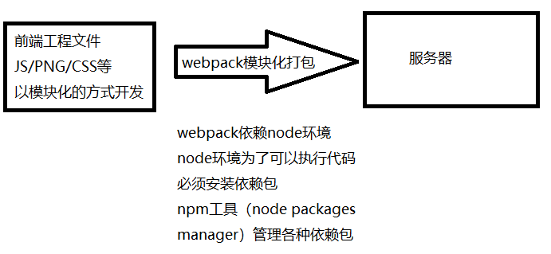

# 前端模块化

## 前端模块化的前世今生

### 什么是模块化

* 将一个复杂的程序依据一定的规则(规范)封装成几个块(文件), 并进行组合在一起
* 块的内部数据与实现是私有的, 只是向外部暴露一些接口(方法)与外部其它模块通信

### 为什么要有模块化

在网页开发的早期, js制作作为一种脚本语言，做一些简单的表单验证或动画实现等,那个时候代码还是很少的。
那个时候的代码是怎么写的呢?
直接将代码写在`<script>`标签中即可

随着ajax异步请求的出现,慢慢形成了前后端的分离:
客户端需要完成的事情越来越多,代码量也是与日俱增。
为了应对代码量的剧增,我们通常会将代码组织在多个js文件中,进行维护。

但是这种维护方式,依然不能避免一些灾难性的问题。
比如全局变量同名问题:

```js
// 我在a.js中，定义了一个变量name
var name = "luojw"

// 同事在b.js中，也定义了一个变量name
var name = "roman"

// 在main.js中输出name
console.log(name)
// 这个时候输出的结果就要根据a.js和b.js谁后被引用了
```

这种代码的编写方式对js文件的依赖顺序几乎是强制性的

但是当js文件过多,比如有几十个的时候,弄清楚它们的顺序是一件十分困难的的事情。
而且即使弄清楚顺序了,也不能避免上面出现的这种尴尬问题的发生。

### 匿名函数的解决方案

我们可以使用匿名函数来解决上面的全局变量污染的问题

并且使用模块作为出口，代码如下：

```js
// 在a.js中
var moduleA = (function () {
    // 导出对象
    var obj = {}

    var name = "ljw"
    obj.name = name
    return obj
})();
```

在匿名函数内部,定义一个对象。
给对象添加各种需要暴露到外面的属性和方法
最后将这个对象返回,并且在外面使用了一个全局变量MoudleA接受。

接下来就是如何使用模块了，代码如下：

```js
// 在main.js中
console.log(moduleA.name)
```

这就是模块最基础的封装。
现在我们认识了到了为什么需要模块以及模块的原始雏形

幸运的是，前端模块化开发已经有了很多既有的规范以及对应的实现方案，常见的有：CommosJS，AMD，CMD，ES6的modules


### CommonJS

CommonJS是NodeJS环境的模块规范，需要在NodeJS环境下才能使用

**基本语法**

```js
// 导出语法
module.exports = {
    flag: true,
    test(a, b) {
    return a + b
    }，
    demo(a, b) {
        return a * b
    }
}

// 导入语法
// CommonJS模块
let { test, demo, flag } = require('moduleA');
//等同于
1et mA = require('moduleA');
let test = mA.test;
let demo = mA.demo;
let flag = mA.flag;
```

**特点**

* 适用于服务端编程,如Node.js
* 模块可以多次加载，但只会在第一次加载时运行一次，然后运行结果就被缓存了，以后再加载就直接读取缓存结果；要想让模块再次运行，必须清除缓存
* 同步的模块加载方式不适合在浏览器环境中，同步意味着阻塞加载，浏览器资源是异步加载的
* 不能非阻塞的并行加载多个模
* 模块输出的是一个值的拷贝

### AMD

CommonJS规范加载模块是同步的，也就是说，只有加载完成，才能执行后面的操作。AMD规范则是非同步加载模块，所有依赖这个模块的语句，都定义在一个回调函数中。
由于Node.js主要用于服务器编程，模块文件一般都已经存在于本地硬盘，所以加载起来比较快，不用考虑非同步加载的方式，所以CommonJS规范比较适用。
但是，如果是浏览器环境，要从服务器端加载模块，这时就必须采用非同步模式，因此浏览器端一般采用AMD规范。

**基本语法**

```js
//定义没有依赖的模块
define(function(){
    return module
})

//定义有依赖的模块
define(['module1', 'module2'], function(m1, m2){
    return module
})

//引入使用模块
require(['module1', 'module2'], function(m1, m2){
    ...
})
```

**特点**

* 适用于浏览器环境
* 定义清晰，不会污染全局变量，能清楚地显式依赖关系
* 允许异步加载模块，也可以根据需要动态加载模块
* 提前加载,推崇依赖前置

### CMD

CMD规范专门用于浏览器端，模块的加载是异步的，模块使用时才会加载执行。CMD规范整合了CommonJS和AMD规范的特点。在 Sea.js 中，所有 JavaScript 模块都遵循 CMD模块定义规范。

**基本语法**

```js
//定义没有依赖的模块
define(function(require, exports, module){
    exports.xxx = value
    module.exports = value
})

//定义有依赖的模块
define(function(require, exports, module){
    //引入依赖模块(同步)
    var module2 = require('./module2')
    //引入依赖模块(异步)
    require.async('./module3', function (m3) {
    })
    //暴露模块
    exports.xxx = value
})

//引入使用模块
define(function (require) {
    var m1 = require('./module1')
})
```

**特点**

* 对于依赖的模块，CMD 是延迟执行。
* AMD 推崇依赖前置，CMD 推崇依赖就近。
* 模块的加载逻辑偏重

### UMD

规范类似于兼容 CommonJS 和 AMD 的语法糖，是模块定义的跨平台解决方案。

### ES6模块化

ES6 模块的设计思想是尽量的静态化，使得编译时就能确定模块的依赖关系，以及输入和输出的变量。CommonJS 和 AMD 模块，都只能在运行时确定这些东西。比如，CommonJS 模块就是对象，输入时必须查找对象属性。

**基本语法**

```js
/** 定义模块 math.js **/
var basicNum = 0;
var add = function (a, b) {
    return a + b;
};
export { basicNum, add };

/** 引用模块 **/
import { basicNum, add } from './math';
function test(ele) {
    ele.textContent = add(99 + basicNum);
}
```

**特点**

* 模块输出的是值的引用
* 模块是编译时输出接口

### 参考资料
https://segmentfault.com/a/1190000017466120

## requireJS的原理


## webpack

在ES6之前,我们要想进行模块化开发,就必须借助于其他的
工具，让我们可以进行模块化开发。

并且在通过模块化开发完成了项目后,还需要处理模块间的各
种依赖,并且将其进行整合打包。

而webpack其中一个核心就是让我们可能进行模块化开发，并
且会帮助我们处理模块间的依赖关系。

而且不仅仅是JavaScript文件,我们的CSS、图片、json文件
等等在webpack中都可以被当做模块来使用。

这就是webpack中模块化的概念。

**webpack，node，npm的关系图**



**核心概念**

* Entry：入口，Webpack 执行构建的第一步将从 Entry 开始，可抽象成输入。
* Module：模块，在 Webpack 里一切皆模块，一个模块对应着一个文件。Webpack 会从配置的 Entry 开始递归找出所有依赖的模块。
* Chunk：代码块，一个 Chunk 由多个模块组合而成，用于代码合并与分割。
* Loader：模块转换器，用于把模块原内容按照需求转换成新内容。
* Plugin：扩展插件，在 Webpack 构建流程中的特定时机注入扩展逻辑来改变构建结果或做你想要的事情。
* Output：输出结果，在 Webpack 经过一系列处理并得出最终想要的代码后输出结果。

Webpack 启动后会从 Entry 里配置的 Module 开始递归解析 Entry 依赖的所有 Module。 每找到一个 Module， 就会根据配置的 Loader 去找出对应的转换规则，对 Module 进行转换后，再解析出当前 Module 依赖的 Module。 这些模块会以 Entry 为单位进行分组，一个 Entry 和其所有依赖的 Module 被分到一个组也就是一个 Chunk。最后 Webpack 会把所有 Chunk 转换成文件输出。 在整个流程中 Webpack 会在恰当的时机执行 Plugin 里定义的逻辑。

### 入门

#### 安装与使用

webpack全局安装与本地安装

```
全局安装：
npm install webpack -g
```

全局安装的弊端：当clone一个项目并且希望打包测试的时候，如果该项目用的webpack版本与之前全局安装的版本不一致，有可能打包失败，这时就需要使用本地安装的webpack进行打包。

```
在本地安装特定版本号
--save-dev 表示开发时依赖

cd 对应目录
npm install webpack@3.6.0 --save-dev
```

本地安装完后`package.json`文件会多出一个`devDependencies`
```
"devDependencies": {
  "webpack": "^3.6.0"
}
```

这时再执行脚本，会优先使用本地安装的webpack进行打包

在根目录下创建一个`webpack.config.js`文件

```js
webpack.config.js

// 动态获取路径（使用node包里的path工具）
const path = require("path");

// 必须使用CommonJs规范
module.exports = {
  entry: {
    // 入口js文件
    app: "./app.js"
  },
  output: {
    // 打包文件的输出目录,必须是绝对路径否则报错
    // __dirname是node自带的全局变量（当前文件的路径）
    path: path.resolve(__dirname, "dist"),
    // 打包文件的名称
    // filename: "build.js",

    // 这种命名格式为原名称+hash八位随机值.js
    // 可以知道打包文件的源文件名称并且保证文件名不重复
    filename: "[name].[hash:8].js",
    // 当涉及到url的都会拼接dist/
    publicPath:"./dist/"
  }
};
```

同时在终端输入`npm init`生成一个npm包管理文件`package.json`

```js
package.json

{
  "scripts": {
    "test": "echo \"Error: no test specified\" && exit 1",
    // 添加脚本
    "build": "webpack"
  }
}
```

最后在终端运行`npm run build`将文件打包到dist文件下
并且在index.html中将打包文件引用即可

#### 使用loader

loader是webpack中非常核心的概念。在开发中不仅仅有基本的js代码处理,也需要加载css、图片,也包括一些高级的将ES6转成
ES5代码,将TypeScript转成ES5代码,将scss、less转成css ,将.vue文件转成js文件等等。

对于webpack本身的能力来说,对于这些转化是不支持的。需要给webpack扩展对应的loader。

loader使用过程:
步骤一: 通过npm安装需要使用的loader
步骤二:在webpack.config.js中的modules关键字下进行配置
大部分loader我们都可以在webpack的官网中找到，并且学习对应的用法。
网站地址：https://www.webpackjs.com/loaders/

例如现在希望将CSS样式也进行打包

目录结构如下
```
|-src
  |-css
    |-normal.css
  |-js
    |-utils.js
  |-main.js
```

```css
normal.css

body{
  background-color: red;
}
```

```js
utils.js

function add(a,b){
  return a+b;
}

function mul(a,b){
  return a*b;
}

module.exports={
  add,mul
}
```

```js
main.js

const {add,mul} = require("./js/utils.js")

console.log(add(3,4));
console.log(mul(3,4));

// 引入css文件
require("./css/normal.css")

document.writeln("<h2>罗健文</h2>")
```

要支持非 JavaScript 类型的文件，需要使用 Webpack 的 Loader 机制。安装好对应的loader（可以看webpack官网，查找需要的loader）后，Webpack的配置修改使用如下：

```js
const path = require('path');

module.exports = {
  // JavaScript 执行入口文件
  entry: './main.js',
  output: {
    // 把所有依赖的模块合并输出到一个 bundle.js 文件
    filename: 'bundle.js',
    // 输出文件都放到 dist 目录下
    path: path.resolve(__dirname, './dist'),
  },
  module: {
    rules: [
      {
        // 用正则去匹配要用该 loader 转换的 CSS 文件
        test: /\.css$/,
        // 先使用 css-loader 读取 CSS 文件，再交给 style-loader 把 CSS 内容注入到 JavaScript 里
        use: ['style-loader', 'css-loader?minimize'],
      }
    ]
  }
};
```

重新执行构建时，会发现 bundle.js 文件被更新了，里面注入了在 main.css 中写的 CSS，而不是会额外生成一个 CSS 文件。
这其实都是 style-loader 的功劳，它的工作原理大概是把 CSS 内容用 JavaScript 里的字符串存储起来，在网页执行 JavaScript 时通过 DOM 操作动态地往 HTML head 标签里插入 HTML style 标签。

**注意**

1. use 属性的值需要是一个由 Loader 名称组成的数组，Loader 的执行顺序是由后到前的
2.  每一个 Loader 都可以通过 URL querystring 的方式传入参数，例如 css-loader?minimize 中的 minimize 告诉 css-loader 要开启 CSS 压缩。

给 Loader 传入属性的方式除了有 querystring 外，还可以通过 Object 传入

```js
use: [
  'style-loader', 
  {
    loader:'css-loader',
    options:{
      minimize:true,
    }
  }
]
```

#### 使用 Plugin

Plugin 是用来扩展 Webpack 功能的，通过在构建流程里注入钩子实现，它给 Webpack 带来了很大的灵活性。


### 实战

#### 使用 ES6 语言

babel相关的技术生态：

babel-loader: 负责 es6 语法转化
babel-preset-env: 包含 es6、7 等版本的语法转化规则
babel-polyfill: es6 内置方法和函数转化垫片
babel-plugin-transform-runtime: 避免 polyfill 污染全局变量

##### 安装与使用

```
安装loader：
npm install babel-loader@8.0.0-beta.0 @babel/core @babel/preset-env webpack
或者
npm install babel-loader babel-core babel-preset-env webpack
```

在 webpack 配置对象中，需要添加 babel-loader 到 module 的规则列表中

```js
module: {
  rules: [
    {
      // 正则匹配.js结尾的文件
      test: /\.js$/,
      // 排除不需要转换的js文件
      exclude: /(node_modules|bower_components)/,
      // 
      use: {
            loader: "babel-loader" // 转化需要的loader
            // options选项配置在: .babelrc
            // options: {
            //   ...
            // }
        }
    }
  ]
}
```

同时在根目录增加一个`.babelrc`文件

```js
{
  "presets": [
    [
      "env",
      {
        "targets": {
          "browsers": ["last 2 versions"]
        }
      }
    ]
  ]
}
```

##### babel插件

由于babel默认只转换新的JavaScript语法，但对于一些新的API是不进行转化的（比如内建的Promise、WeakMap，静态方法如Array.from或者Object.assign），那么为了能够转化这些东西，我们就需要使用babel的插件

**`babel-polyfill`**

**特点**
1. 会将需要转化的API进行直接转化，这就导致用到这些API的地方会存在大量的重复代码
2. 是直接在全局作用域里进行垫片，所以会污染全局作用域
3. 是为开发应用准备的

```
安装：
npm install babel-polyfill -save

使用：
直接在main.js顶部使用: import "@babel/polyfill"
```

**`babel-runtime-transform`**

**特点**

1. 需要用到的垫片，会使用引用的方式引入，而不是直接替换，避免了垫片代码的重复
2. 由于使用引用的方式引入，所以不会直接污染全局作用域。
3. `babel-plugin-transform-runtime`不能单独作用，因为有一些静态方法，如`"foobar".includes("foo")`仍然需要引入`babel-polyfill`才能使用
4. 是为开发框架准备的

```
安装：
npm install babel-plugin-transform-runtime -save-dev
npm install babel-runtime -save

使用：
在.babelrc文件的plugins中添加：
"plugins": ["transform-runtime"]
```

### 优化

#### 提取公共代码

##### 为什么需要提取公共代码

大型网站通常会由多个页面组成，每个页面都是一个独立的单页应用。 但由于所有页面都采用同样的技术栈，以及使用同一套样式代码，这导致这些页面之间有很多相同的代码。

如果每个页面的代码都把这些公共的部分包含进去，会造成以下问题：

* 相同的资源被重复的加载，浪费用户的流量和服务器的成本；
* 每个页面需要加载的资源太大，导致网页首屏加载缓慢，影响用户体验。

如果把多个页面公共的代码抽离成单独的文件，就能优化以上问题。 原因是假如用户访问了网站的其中一个网页，那么访问这个网站下的其它网页的概率将非常大。 在用户第一次访问后，这些页面公共代码的文件已经被浏览器缓存起来，在用户切换到其它页面时，存放公共代码的文件就不会再重新加载，而是直接从缓存中获取。 这样做后有如下好处：

减少网络传输流量，降低服务器成本；
虽然用户第一次打开网站的速度得不到优化，但之后访问其它页面的速度将大大提升。