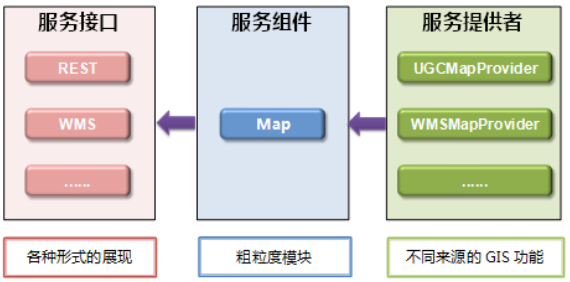

# SuperMap Iserver

SuperMap iServer 可提供的服务类型如下：

* REST 服务。基于 REST 的架构以资源形式提供 GIS 功能接口。包含地图功能、数据功能、分析功能、三维功能等。
* OGC W*S 服务。OGC 标准服务，如 WMS、WFS、WMTS 等。

SuperMap iServer 可以使用多种来源提供的数据来发布上述服务，如 SuperMap 工作空间数据、远程 WMS 服务、远程 WFS 服务、远程 REST Map 服务等。

<table>
    <tr>
        <td>GIS 功能</td>
        <td>服务类型</td>
        <td>服务来源</td>
    </tr>
    <tr>
        <td rowspan="3">地图功能</td>
        <td>地图 REST 服务</td>
        <td rowspan="3">SuperMap 工作空间数据、远程 WMS 服务、远程 WMTS 服务、远程 REST Map 服务、超图云服务、Bing Maps 服务、天地图服务、MBTiles 文件等。</td>
    </tr>
    <tr>
        <td>WMS 服务</td>
    </tr>
    <tr>
        <td>WMTS 服务</td>
    </tr>
    <tr>
        <td rowspan="3">数据功能</td>
        <td>数据 REST 服务</td>
        <td rowspan="3">SuperMap 工作空间数据、远程 WFS 服务、远程 REST Data 服务。</td>
    </tr>
    <tr>
        <td>WFS 服务</td>
    </tr>
    <tr>
        <td>WCS 服务</td>
    </tr>
    <tr>
        <td rowspan="4">分析功能</td>
        <td>空间分析 REST 服务</td>
        <td>SuperMap 工作空间数据，以及 REST SpatialAnalyst 服务。</td>
    </tr>
    <tr>
        <td>交通网络分析 REST 服务</td>
        <td>SuperMap 工作空间数据，以及 REST TransportationAnalyst 服务。</td>
    </tr>
    <tr>
        <td>交通换乘分析 REST 服务</td>
        <td>SuperMap 工作空间数据，以及 REST TrafficTransferAnalyst 服务。</td>
    </tr>
    <tr>
        <td>WPS 服务</td>
        <td>SuperMap 工作空间数据。</td>
    </tr>
    <tr>
        <td rowspan="2">三维功能</td>
        <td>三维 REST 服务</td>
        <td>SuperMap 工作空间数据，以及 REST 3D 服务。</td>
    </tr>
    <tr>
        <td>三维网路分析 REST 服务</td>
        <td>SuperMap 工作空间数据。</td>
    </tr>
    <tr>
        <td>动态标绘功能</td>
        <td>动态标绘REST服务</td>
        <td>Plot 文件。</td>
    </tr>
</table>

## 体系结构

### GIS 服务提供者

服务提供者（GIS Service Provider）封装并统一了对功能的不同实现，屏蔽了不同服务来源的区别，对于不同的服务来源有不同的服务提供者，例如，用于获取 SuperMap iObjects 提供的 GIS 功能的 UGCMapProvider，用于获取 WMS 服务的 WMSMapProvider 等

### GIS 服务组件

GIS 服务组件（GIS Service Component）通过对 GIS 服务提供者（GIS Service Provider）提供的服务能力进行组合，封装成粒度较粗的服务组件。

GIS 服务组件包括通用空间服务（Generic Spatial Service）和领域空间服务（Domain Spatial Service）。

通用空间服务指通常的 GIS 服务，如地图服务、空间数据服务、空间分析服务、网络分析服务等；而领域空间服务则用来描述 GIS 在特定行业中的应用相关的服务，用户通过对通用空间服务的二次开发或配置，添加自己的业务逻辑，就能定制出满足某一行业领域特殊需求的空间服务，进而达到通用空间服务在具体领域的多层次复用。

例如气象领域，在通用空间服务的基础之上，加上天气预报服务、气象警报服务等，定制出满足气象行业特殊要求的气象领域服务。

### GIS 服务接口

SuperMap iServer 在服务接口层支持将其按照不同的服务规范发布成网络服务，比如 REST 服务、WMS 服务等。
