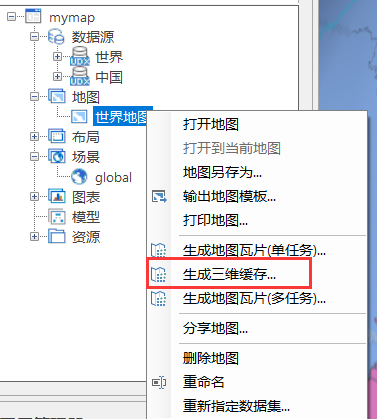
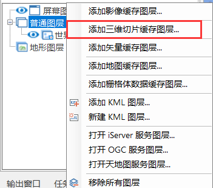

# SuperMap Cesium

## 地图

`new Cesium.Viewer(container, options)`

Viewer是用于构建应用程序的基础部件，它将所有标准的Cesium部件组合成一个可重复使用的包。 

### 场景

`new Cesium.Scene(options)`

三维场景类，它是所有三维图形对象和状态的容器，通常不直接创建场景，而是由CesiumWidget隐式创建

### 视野（camera）

对Viewer进行视图控制

#### 方法一：通过setView函数控制

传入中心点经纬度
```js
view.camera.setView({
  destination : Cesium.Cartesian3.fromDegrees(116.435314,39.960521, 15000.0), // 设置位置

  orientation: {
    heading : Cesium.Math.toRadians(20.0), // 方向
    pitch : Cesium.Math.toRadians(-90.0),// 倾斜角度
    roll : 0 // 滚动角
  }
});
```

传入范围经纬度
```js
view.camera.setView({
    destination: Cesium.Rectangle.fromDegrees(0.0, 20.0, 10.0, 30.0),//west, south, east, north

    orientation: {
        heading : Cesium.Math.toRadians(20.0), // 方向
        pitch : Cesium.Math.toRadians(-90.0),// 倾斜角度
        roll : 0
    } 
});
```

#### 方法二：通过flyto函数控制

```js
view.camera.flyTo({
  destination :Cesium.Cartesian3.fromDegrees(116.435314,39.960521, 15000.0), // 设置位置
  orientation: {
    heading :Cesium.Math.toRadians(20.0), // 方向
    pitch :Cesium.Math.toRadians(-90.0),// 倾斜角度
    roll :0
  },
  duration:5, // 设置飞行持续时间，默认会根据距离来计算
  complete:function () {
  // 到达位置后执行的回调函数
  },
  cancle:function () {
  // 如果取消飞行则会调用此函数
  },
  pitchAdjustHeight:-90, // 如果摄像机飞越高于该值，则调整俯仰俯仰的俯仰角度，并将地球保持在视口中。
  maximumHeight:5000, // 相机最大飞行高度
  flyOverLongitude:100, // 如果到达目的地有2种方式，设置具体值后会强制选择方向飞过这个经度(这个，很好用)
});
```

#### 方法三：通过lookAt函数控制

```js
var center = Cesium.Cartesian3.fromDegrees(114.44455, 22.0444);//camera视野的中心点坐标
var heading = Cesium.Math.toRadians(50.0);
var pitch = Cesium.Math.toRadians(-20.0);
var range = 5000.0;
view.camera.lookAt(center, new Cesium.HeadingPitchRange(heading, pitch, range));
```

## 服务

### 服务管理

`new Cesium.ImageryLayerCollection()`在Cesium.Viewer中用于管理地图的影像图层

`new Cesium.Layers()`在Cesium.Scene中有用于管理场景的三维切片缓存图层

### 地形服务

地球场景Viewer在实例化的时候可以传入一个地形服务作为场景的地形

#### 配置一个地形服务
```js
var viewer = new Cesium.Viewer('cesiumContainer',{
    //创建地形服务提供者的实例，url为SuperMap iServer发布的TIN地形服务
    terrainProvider : new Cesium.CesiumTerrainProvider({
        url,
        isSct : true//地形服务源自SuperMap iServer发布时需设置isSct为true
    })
});
```

### 动态地图服务

与arcgis的动态地图服务有所不同的是，supermap会自动对请求范围设定切割原点和切片宽高，对请求的范围进行切割，获取到多张图片平铺到地图上。这也让用户的使用体验得到了一定的提升。

#### 加载动态地图服务

在三维场景中对地图服务进行加载

```js
//初始化viewer部件
let viewer = new Cesium.Viewer('cesiumContainer');
let imageryLayers = viewer.imageryLayers;

//利用服务url创建SuperMapImageryProvider实例
let provider = new Cesium.SuperMapImageryProvider({
    url //地图服务
});

// 方法一：
layer = new this.Cesium.ImageryLayer(provider);
imageryLayers.add(layer)

// 方法二：直接添加服务提供者
imageryLayers.addImageryProvide(provider);
```

#### `SuperMapImageryProvider`与`ImageryLayer`

`SuperMapImageryProvider`是图层的服务提供者，主要控制出图背景是否透明以及图片格式等。

`ImageryLayer`是图层对象，控制图层自身的透明度，色调以及图层的显隐等。

#### 地图服务图层控制

在`SuperMapImageryProvider`类下，有一个`layersID`属性，这个属性是用来控制子图层显隐的，具体介绍如下：

>当前地图图层ID的定义规则如下： 
>1.  各级图层按照图层顺序自上而下从0开始编号； 
>2.  冒号（:）前为地图； 
>3.  英文句号（.）表示其他各级图层间的从属关系； 
>4.  英文逗号（,）表示图层间的分隔。
>
>例如： 
>1.  [0:0,1,2.0]表示地图0下面的图层：0、1及其下属所有子图层，和2下的子图层0； 
>2.  [1:1.2,2]表示地图1下面的图层：1下的子图层2，和图层2及其下属所有子图层；
>3.  两个示例合并在一起则是：[0:0,1,2.0,1:1.2,2]
>此外，[0,1,2,3]表示地图0下面的图层0、1、2、3及所有子图层，[0:,1:,2:]表示地图0、1、2及其所有子图层。 
>4.  当我们初始化图层之后还想改变图层显示时可以直接如下进行设置： layer.layersID = “[0:0,1,7,11]”

### 切片服务

与arcgis不同的是，supermap的切片服务需要单独发布，而arcgis则是在地图服务的基础上增加切片服务的功能。

发布好切片服务后，加载的方式和动态服务基本相同。不过需要给服务提供者传入最大最小缩放层级，否则当地图的比例尺与切片服务的切片比例尺差太远的时候显示效果会有问题。

```js
// 获取服务的切片信息
let originResult = await this.Cesium.loadJson(地图服务url + ".json");

// 切片信息
let visibleScales = originResult.visibleScales;

// 匹配当前服务的切片与地图的缩放层级
let min = this.findNearScale(visibleScales[0]);
let max = this.findNearScale(visibleScales[visibleScales.length - 1]);
provider = new this.Cesium.SuperMapImageryProvider({
    url: 地图服务,
    // 设置最大缩放层级后，到了最大缩放层级，不会去后端请求数据，但是地图还可以继续放大
    maximumLevel: max,
    minimumLevel: min
});

findNearScale(scale) {
  // webGL3D采用固定比例尺出图，且从第一级比例尺开始。
  let indexScale = 3.3803271432053056e-9;
  let sub;
  let zoom = 0;
  for (let j = 0; j < 20; j++) {
    let temp = Math.abs(scale - indexScale);
    // 如果是第一次对比则保留
    if (j == 0) {
      sub = temp;
      indexScale = indexScale * 2;
      continue;
    }
    if (sub > temp) {
      sub = temp;
      zoom = j;
    } else {
      // 上次的比例尺差距比这次小，用上次的zoom作为最接近值
      break;
    }
    indexScale = indexScale * 2;
  }
  return zoom;
}
```

### 三维服务

#### 三维切片缓存图层

加载三维服务的三维切片缓存图层方式有两种：

**直接将整个三维服务的场景添加进地图**

```js
// 加载整个三维服务
let url = 三维服务根节点URL
let promise = scene.open(url);
Cesium.when(promise,function(layers){
    // 异步加载三维服务，可以获取到三维场景里所有图层
    ...
},function(){
    ...
});
```

**对三维场景中某个图层进行单独加载**

```js
let scene = Cesium.viewer.scene;
let promise = scene.addS3MTilesLayerByScp(
    图层的三维数据资源URL + "/config",
    {
        name: 图层名称
    }
);

promise.then(layer => {
    // 相机飞到当前图层
    this.viewer.flyTo(layer);
});
```

#### 三维地图缓存

这里的三维地图缓存是指在Idesktop中通过对二维地图进行三维缓存并将缓存添加到三维场景



并在场景里添加到普通图层里



最后发布成服务

加载这种类型的服务，类似前面的加载切片服务

```js
provider = new this.Cesium.SuperMapImageryProvider({
    url: 三维服务数据列表URL + 图层名
});
layer = new this.Cesium.ImageryLayer(provider);
viewer.imageryLayers.add(layer)
```

## 查询

### 地图服务图层查询

**`SuperMap.REST.GetLayersInfoService`**

获取图层信息服务类。 该类负责将从客户端指定的服务器上获取该服务器提供的图层信息。

使用场景示例：

获取地图服务的所有图层供用户选择，根据选择的图层进行查询操作

用法示例：

```js
var url = 地图服务地址
var getLayersInfoService = new SuperMap.REST.GetLayersInfoService(url, {
    eventListeners: {
        "processCompleted": queryLayersInfoCompleted
        "processFailed": processFailed
    }
});
getLayersInfoService.processAsync();
```

### 图层字段信息查询

**`SuperMap.REST.GetFieldsService`**

字段查询服务，支持查询指定数据集的中所有属性字段（field）的集合

属性|介绍
-|-
dataset	{String}|要查询的数据集名称。
datasource	{String}|要查询的数据集所在的数据源名称。

使用场景示例：

获取到某个图层下的所有字段供用户选择，根据选择的字段进行字段统计

用法示例：

```js
var url = 数据服务地址
getFieldsService = new SuperMap.REST.GetFieldsService(url, {
    eventListeners: {"processCompleted": getFieldsCompleted, "processFailed": processFailed},
    datasource: dataInfo.dataSourceName,
    dataset: dataInfo.name
});
getFieldsService.processAsync();
```

### 数据集查询基类介绍

#### `SuperMap.REST.GetFeaturesParametersBase`

数据服务中数据集查询参数基类

属性|简介
-|-
datasetNames	{Array(String)}|数据集集合中的数据集名称列表。
maxFeatures	{Integer}|进行SQL查询时，用于设置服务端返回查询结果条目数量，默认为1000。
returnContent	{Boolean}|是否立即返回新创建资源的表述还是返回新资源的URI。 如果为 true，则直接返回新创建资源，即查询结果的表述。 如果为 false，则返回的是查询结果资源的 URI。默认为 true。
returnCountOnly {Boolean}|只返回查询结果的总数，默认为false。
fromIndex	{Integer}|查询结果的最小索引号。 默认值是0，如果该值大于查询结果的最大索引号，则查询结果为空。
toIndex	{Integer}|查询结果的最大索引号。 默认值是19，如果该值大于查询结果的最大索引号，则以查询结果的最大索引号为终止索引号。

#### `SuperMap.REST.GetFeaturesServiceBase`

数据服务中数据集查询服务基类。 查询结果通过该类支持的事件的监听函数参数获取。
获取的结果数据包括 result 、originResult 两种， 其中，originResult 为服务端返回的用 JSON 对象表示的查询结果数据，result 为服务端返回的查询结果数据。

属性|介绍
-|-
url	{String}|数据查询结果资源地址。请求数据服务中数据集查询服务， URL 应为：http://{服务器地址}:{服务端口号}/iserver/services/{数据服务名}/rest/data/
eventListeners {Object}|监听器对象。监听查询成功或失败事件

监听查询完成或失败的方法：

```js
// 方法一
var myService = new SuperMap.REST.GetFeaturesServiceBase(url);
myService.events.on({
    "processCompleted": getFeatureCompleted,
     "processFailed": getFeatureError
});
function getFeatureCompleted(GetFeaturesEventArgs){//todo};
function getFeatureError(GetFeaturesEventArgs){//todo};

// 方法二
var myService = new SuperMap.REST.GetFeaturesServiceBase(url, {
    eventListeners: {
        "processCompleted": getFeatureCompleted,
        "processFailed": getFeatureError
    }
});
```

### 数据集ID查询

可以使用通过SQL查询数据集的方法替代

**`SuperMap.REST.GetFeaturesByIDsParameters`**

Geometry 查询参数类。 该类用于设置 Geometry查询的相关参数。

属性|介绍
-|-
fields	{Array(String)}|设置查询结果返回字段。 当指定了返回结果字段后，则 GetFeaturesResult 中的 features 的属性字段只包含所指定的字段。 不设置即返回全部字段。
IDs	{Array(Integer)}|所要查询指定的元素ID信息。

**`SuperMap.REST.GetFeaturesByIDsService`**

数据集ID查询服务类。 在数据集集合中查找指定 ID 号对应的空间地物要素。

使用场景示例：

选择的一个或多个数据集进行ID查询，返回这些数据集中符合ID要求的要素

用法示例：

```js
var url // 数据服务的根节点url
var getFeaturesByIDsParameters = new SuperMap.REST.GetFeaturesByIDsParameters({
    returnContent: true,
    datasetNames: ["数据源名称:数据集名称"],
    fromIndex: 0,
    IDs: [1, 247]
});
var getFeaturesByIDsService = new SuperMap.REST.GetFeaturesByIDsService(url, {
    eventListeners: {
        "processCompleted": getFeatureCompleted,
        "processFailed": getFeatureError
           }
    });
getFeaturesByIDsService.processAsync(getFeaturesByIDsParameters); // 将客户端的查询参数传递到服务端。
```

### 数据集SQL查询

其实SQL查询可以替代上面的ID查询

**`SuperMap.REST.GetFeaturesBySQLParameters`**

数据服务中数据集SQL查询参数类。

属性|介绍
-|-
queryParameter	{SuperMap.REST.FilterParameter} |查询过滤条件参数

**`SuperMap.REST.FilterParameter`**

查询过滤条件参数类。 该类用于设置查询数据集的查询过滤参数。

属性|介绍
-|-
attributeFilter	{String}|属性过滤条件。SLQ语句
name	{String}|查询数据集名称或者图层名称。一般情况下该字段为数据集名称，但在进行与地图相关功能的操作时， 需要设置为图层名称（图层名称格式：数据集名称@数据源别名）。
joinItems	{Array(SuperMap.REST.JoinItem)}|与外部表的连接信息 JoinItem 数组。
linkItems	{Array(SuperMap.REST.LinkItem)}|与外部表的关联信息 LinkItem 数组。
ids	{Array(String)}|查询 id 数组，即属性表中的 SmID 值。
orderBy	{String}|查询排序的字段, orderBy 的字段须为数值型的。
groupBy	{String}|查询分组条件的字段。
fields	{Array(String)}|查询返回的字段数组。

**`SuperMap.REST.GetFeaturesBySQLService`**

数据服务中数据集 SQL 查询服务类。 在一个或多个指定的图层上查询符合 SQL 条件的空间地物信息。

使用场景示例：

只能对某个数据集进行查询，可以是ID查询也可以是SQL语句查询，并可以对查询出来的结果进行排序，分组操作

用法示例：

```js
var url = // 数据服务的根节点url
var getFeatureParam, getFeatureBySQLService, getFeatureBySQLParams;

getFeatureParam = new SuperMap.REST.FilterParameter({
    name: "数据集名称@数据源名称",
    attributeFilter: "SMID = 247"
});

getFeatureBySQLParams = new SuperMap.REST.GetFeaturesBySQLParameters({
    queryParameter: getFeatureParam,
    datasetNames: ["数据源名称:数据集名称"]
});

getFeatureBySQLService = new SuperMap.REST.GetFeaturesBySQLService(url, {
    eventListeners: {"processCompleted": processCompleted, "processFailed": processFailed}
});

getFeatureBySQLService.processAsync(getFeatureBySQLParams);
```

### 数据集范围查询

**`SuperMap.REST.GetFeaturesByBoundsParameters`**

数据集范围查询参数类。 该类用于设置数据集范围查询的相关参数。

属性|介绍
-|-
attributeFilter	{String}|范围查询属性过滤条件。SLQ语句
bounds	{SuperMap.Bounds}|用于查询的范围对象。
spatialQueryMode	{SuperMap.REST.SpatialQueryMode}|空间查询模式常量，必设参数，默认为SuperMap.REST.CONTAIN。
fields	{Array(String)}|查询返回的字段数组。
queryParameter	{SuperMap.REST.FilterParameter}|查询过滤条件参数。

**`SuperMap.REST.GetFeaturesByBoundsService`**

数据集范围查询服务类 查询与指定范围对象符合一定空间关系的矢量要素。

用法示例：

```js
var url = // 数据服务的根节点url
var bounds = feature.geometry.bounds;

var GetFeaturesByBoundsParameters, getFeaturesByGeometryService;
GetFeaturesByBoundsParameters = new SuperMap.REST.GetFeaturesByBoundsParameters({
    datasetNames: ["数据源名称:数据集名称"],
    spatialQueryMode: SuperMap.REST.SpatialQueryMode.INTERSECT,
    bounds: bounds
});
getFeaturesByGeometryService = new SuperMap.REST.GetFeaturesByBoundsService(url, {
    eventListeners: {
        "processCompleted": processCompleted,
        "processFailed": processFailed
    }
});
getFeaturesByGeometryService.processAsync(GetFeaturesByBoundsParameters);
```

### 数据集几何查询

**`SuperMap.REST.GetFeaturesByGeometryParameters`**

数据集几何查询参数类。 该类用于设置数据集几何查询的相关参数。

属性|介绍
-|-
attributeFilter	{String}|范围查询属性过滤条件。SLQ语句
fields	{Array(String)}|查询返回的字段数组。
geometry	{SuperMap.Geometry}|用于查询的几何对象。
spatialQueryMode	{SuperMap.REST.SpatialQueryMode}|空间查询模式常量，必设参数，默认为SuperMap.REST.CONTAIN。
queryParameter	{SuperMap.REST.FilterParameter}|查询过滤条件参数。


**`SuperMap.REST.GetFeaturesByGeometryService`**

数据集几何查询服务类 查询与指定几何对象符合一定空间关系的矢量要素。

用法示例：

```js
var url = // 数据服务的根节点url
let getFeaturesByGeometryParameters = new SuperMap.REST.GetFeaturesByGeometryParameters({
    datasetNames: ["数据源名称:数据集名称"],
    spatialQueryMode: SuperMap.REST.SpatialQueryMode.INTERSECT,
    geometry: drawGeometryArgs.feature.geometry
});
let getFeaturesByGeometryService = new SuperMap.REST.GetFeaturesByGeometryService(url, {
    eventListeners: {
        "processCompleted": processCompleted,
        "processFailed": processFailed
    }
});
getFeaturesByGeometryService.processAsync(getFeaturesByGeometryParameters);
```

### 数据集缓冲区查询

**`SuperMap.REST.GetFeaturesByBufferParameters`**

数据服务中数据集缓冲区查询参数类。

属性|介绍
-|-
attributeFilter	{String} 属性查询条件。SLQ语句
fields	{Array(String)}|查询返回的字段数组。
geometry	{SuperMap.Geometry}|用于查询的几何对象。
bufferDistance	{Number}|buffer距离,单位与所查询图层对应的数据集单位相同。
queryParameter	{SuperMap.REST.FilterParameter}|查询过滤条件参数。


**`SuperMap.REST.GetFeaturesByBufferService`**

数据服务中数据集缓冲区查询服务类。

用法示例：

```js
var url = // 数据服务的根节点url
let getFeatureParameter = new SuperMap.REST.GetFeaturesByBufferParameters({
    bufferDistance: 30,
    attributeFilter: "SMID > 0",
    datasetNames: ["数据源名称:数据集名称"],
    geometry: feature.geometry
});
let getFeatureService = new SuperMap.REST.GetFeaturesByBufferService(url, {
    eventListeners: {
        "processCompleted": processCompleted,
        "processFailed": processFailed
    }
});
getFeatureService.processAsync(getFeatureParameter);
```

### 数据集字段统计

**`SuperMap.REST.FieldStatisticService`**

字段查询统计服务类。用来完成对指定数据集指定字段的查询统计分析，即求平均值，最大值等。

属性|介绍
-|-
datasource	{String}|数据集所在的数据源名称。
dataset	{String}|数据集名称。
field	{String}|查询统计的目标字段名称。
statisticMode|{SuperMap.REST.StatisticMode} 字段查询统计的方法类型。

用法示例：

```js
var url = // 数据服务的根节点url
var statisticService = new SuperMap.REST.FieldStatisticService(url, {
    eventListeners: {"processCompleted": statisticComplete, "processFailed": processFailed},
    datasource: 数据源名称,
    dataset: 数据集名称,
    field: 字段名称,
    statisticMode: 统计方式
})
statisticService.processAsync();
```

## 几何图形

## 符号与渲染

## 空间分析服务

## 事件

<ToTop/>