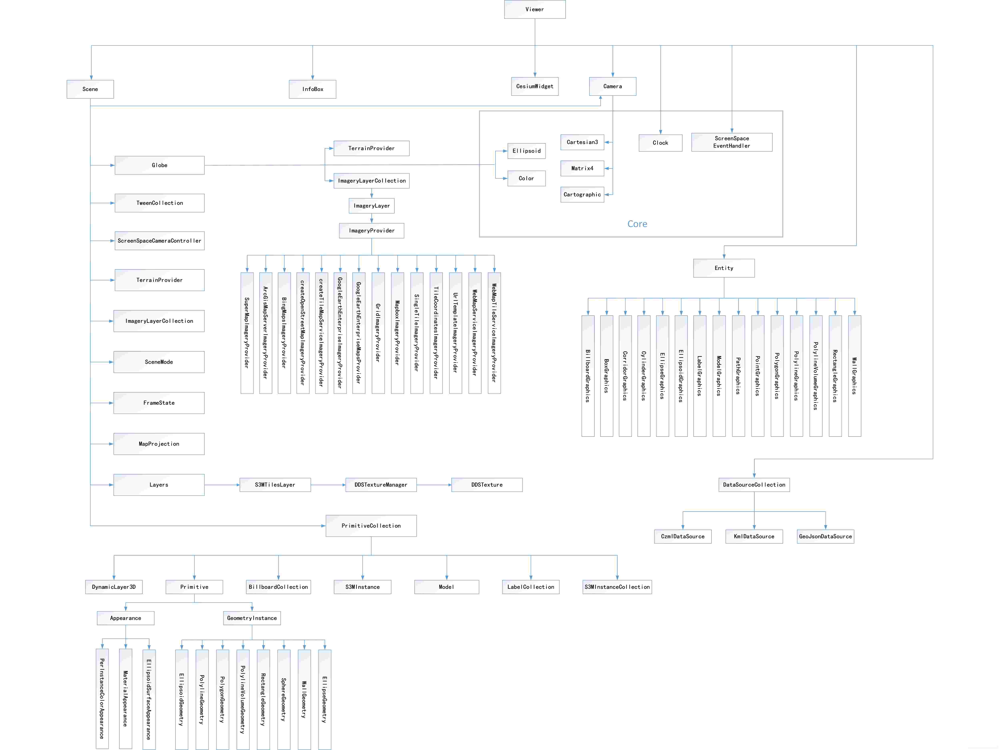
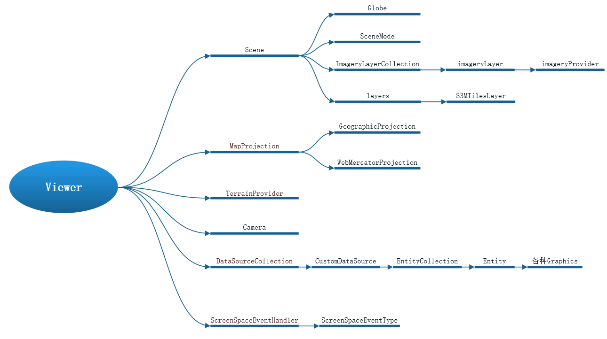
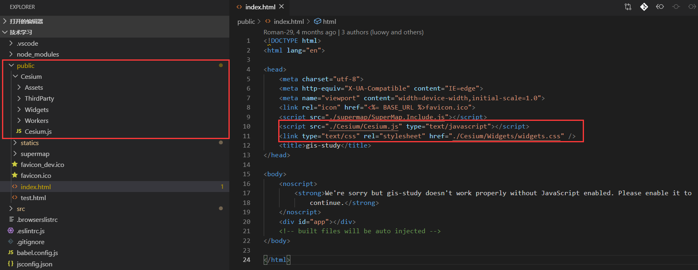
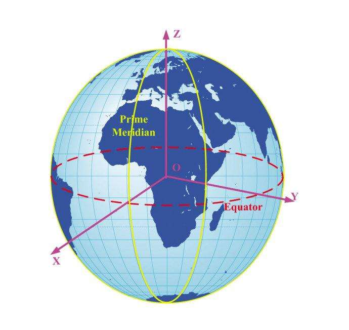
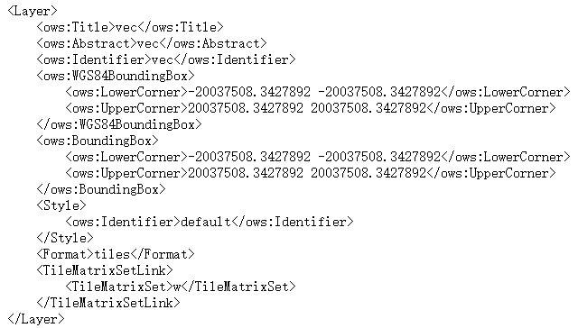
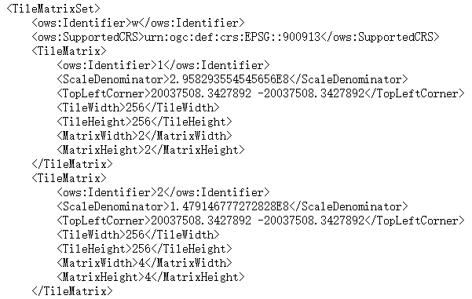

# SuperMap iClient 3D for WebGL

## 目标

1. 了解cesium的基本结构

2. 三维地球加载地图服务

3. 自定义空间图形

4. 简单的交互事件

## 简介

**SuperMap iClient 3D for WebGL**

SuperMap iClient 3D for WebGL 是一款在服务式 GIS 架构体系中， 无任何插件，跨浏览器的客户端产品。它基于 Cesium 开源框架,面向 HTML 5 的三维应用开发，快速构建内容丰富、响应迅速、体验流畅的三维真空间应用。

http://support.supermap.com.cn:8090/webgl/

在官网地址可以下载到最新的超图 WEBGL 包，以及检测自己的浏览器的 WEBGL 支持程度。

**Vue-iClient3D-WebGL**

官方也提供了一个在 SuperMap_iClient3D_for_WebGL 产品包基础上使用 Vue 框架进行封装的库，将三维应用的常用功能以组件的形式提供，使之轻量且高效。

http://support.supermap.com.cn:8090/webgl/examples/component/dist/

这个库里也有许多已经封装好的三维分析组件值得我们学习。

## cesium 结构介绍

### cesium 整体框架体系



关键部分：



## 安装使用

下载超图提供的 cesium 包，放到 public 目录下。

引用方式如下：



避免 eslint 报错，修改.eslintrc.js

```js
module.exports = {
  ...
  globals: {
    "Cesium": true
  }
}
```

编写自己的 map 组件：

```VUE
<template>
  <div class="main">
    <div class="luojw-map" ref="mapNode"></div>
  </div>
</template>

<script>
export default {
  name: "luojw-map",
  data() {
    return {
      viewer: null
    };
  },
  mounted() {
    this.mapNode = this.$refs.mapNode;
    this._initMap();
  },
  methods: {
    _initMap() {
      let viewer = new Cesium.Viewer(this.mapNode, {
        infoBox: false,
        selectionIndicator: false,
        navigation: false
      });
    }
  }
};
</script>
```

在系统初始化的时候注册并使用：

```js
Vue.component(component.name, component);
......

// 某个VUE文件的<template>中：

<luojw-supermap>
  ...
</luojw-supermap>
```


## Cesium 核心

### 视图

`new Cesium.Viewer(container, options)`

Viewer 类是 cesium 的核心类，是地图可视化展示的主窗口，扮演必不可少的核心角色。

| 参数名          | Type             | 简介                                                         |
| --------------- | ---------------- | ------------------------------------------------------------ |
| container       | Element / String | 指定容纳 viewer 部件的 HTML 元素的文档对象模型（DOM）或 ID。 |
| terrainProvider | TerrainProvider  | 地形提供者。（默认生成 WGS84 椭球体）                        |
| mapProjection   | MapProjection    | 地图投影，默认 WGS84                                         |

还有一些自带的场景控制组件（导航，底图切换，时间轴）也是在 viewer 中控制。

### 场景

`new Cesium.Scene(options)`

三维场景类，它是所有三维图形对象和状态的容器。

scene 中有一个 mode 属性，用来控制地图的显示模式，默认是 3D。可以修改为 2D 或是 2.5D 模式。

### 地形

在实例化 Cesium.Viewer 的时候，默认会根据 mapProjection 生成一个椭球体作为地球。

new Cesium.EllipsoidTerrainProvider(ellipsoid)

默认椭球为 WGS84 的椭球，在超图封装的 Cesium 包里，Ellipsoid 还定义好了国家 2000，西安 80 等坐标系的椭球参数。

[Ellipsoid](http://support.supermap.com.cn:8090/webgl/Build/Documentation/Ellipsoid.html)

### 相机（camera）

`new Cesium.Camera(scene)`

对 Viewer 进行视图控制

#### 方法一：通过 setView 函数控制

传入中心点经纬度

```js
view.camera.setView({
  destination: Cesium.Cartesian3.fromDegrees(116.435314, 39.960521, 15000.0), // 设置位置

  orientation: {
    heading: Cesium.Math.toRadians(20.0), // 方向
    pitch: Cesium.Math.toRadians(-90.0), // 倾斜角度
    roll: 0 // 滚动角
  }
});
```

传入范围经纬度

```js
view.camera.setView({
  destination: Cesium.Rectangle.fromDegrees(0.0, 20.0, 10.0, 30.0), //west, south, east, north

  orientation: {
    heading: Cesium.Math.toRadians(20.0), // 方向
    pitch: Cesium.Math.toRadians(-90.0), // 倾斜角度
    roll: 0
  }
});
```

#### 方法二：通过 flyto 函数控制

```js
view.camera.flyTo({
  destination: Cesium.Cartesian3.fromDegrees(116.435314, 39.960521, 15000.0), // 设置位置
  orientation: {
    heading: Cesium.Math.toRadians(20.0), // 方向
    pitch: Cesium.Math.toRadians(-90.0), // 倾斜角度
    roll: 0
  },
  duration: 5, // 设置飞行持续时间，默认会根据距离来计算
  complete: function() {
    // 到达位置后执行的回调函数
  },
  cancle: function() {
    // 如果取消飞行则会调用此函数
  },
  pitchAdjustHeight: -90, // 如果摄像机飞越高于该值，则调整俯仰俯仰的俯仰角度，并将地球保持在视口中。
  maximumHeight: 5000, // 相机最大飞行高度
  flyOverLongitude: 100 // 如果到达目的地有2种方式，设置具体值后会强制选择方向飞过这个经度。
});
```

#### 方法三：通过 lookAt 函数控制

```js
var center = Cesium.Cartesian3.fromDegrees(114.44455, 22.0444); //camera视野的中心点坐标
var heading = Cesium.Math.toRadians(50.0);
var pitch = Cesium.Math.toRadians(-20.0);
var range = 5000.0;
view.camera.lookAt(center, new Cesium.HeadingPitchRange(heading, pitch, range));
```

### 笛卡尔坐标

使用 Cesium 开发三维 GIS 应用离不开笛卡尔坐标系，这是 Cesium 的基础数据类型，所有坐标最后均转换成这个类型参与三维渲染。

那么问题来了，这个笛卡尔坐标系到底是什么东东？

1. 笛卡尔坐标系原点是地球几何中心；
2. 笛卡尔坐标系是米单位;

3. xz 平面是中央经线和 180 度经线组成的平面，其中 x 轴正方向指向的是中央经线，x 轴负方向指向 180 度经线;
4. y 轴正方向指向东经 90 度经线，负方向指向西经 90 度经线。



#### 补充内容，涉及大量数学知识

https://blog.csdn.net/wqy248/article/details/90701068

## 服务

### 服务管理

`new Cesium.ImageryLayerCollection()`
二维地图服务图层集合类。该类主要用于对二维地图服务图层进行管理。

```js
let viewer = new Cesium.Viewer(this.mapNode, {
  infoBox: false,
  selectionIndicator: false
});

// 获取当前场景的二维图层集合。
let imageryLayers = viewer.imageryLayers;
```

`new Cesium.Layers()`
图层集合类。该类用于对三维场景中的所有图层进行管理。

```js
let viewer = new Cesium.Viewer(this.mapNode, {
  infoBox: false,
  selectionIndicator: false
});

// 获取当前场景的三维图层集合。
let layers = viewer.scene.layers;
```

### `ImageryProvider`与`ImageryLayer`

**`ImageryProvider`**
影像图层类，是图层的服务提供者，主要控制出图背景是否透明以及图片格式等。

官方提供的类有：

> ArcGisMapServerImageryProvider
> SingleTileImageryProvider
> BingMapsImageryProvider
> GoogleEarthEnterpriseMapsProvider
> MapboxImageryProvider
> createOpenStreetMapImageryProvider
> WebMapTileServiceImageryProvider
> WebMapServiceImageryProvider

超图自己也封装了一套

> SuperMapImageryProvider

**`ImageryLayer`**
影像图层类，用于显示影像提供者的瓦片影像数据。
他是具体的图层对象，控制图层自身的透明度，色调以及图层的显隐等。

### arcgis地图服务

#### 地图服务

```js
provider = new Cesium.ArcGisMapServerImageryProvider({
  url: info.url,
  layers: layersID,
  name: info.ID
});
layer = new Cesium.ImageryLayer(provider);
```

#### 切片服务

### 超图地图服务

#### 加载动态地图服务

在三维场景中对地图服务进行加载

```js
//初始化viewer部件
let viewer = new Cesium.Viewer("cesiumContainer");
let imageryLayers = viewer.imageryLayers;

//利用服务url创建SuperMapImageryProvider实例
let provider = new Cesium.SuperMapImageryProvider({
  url //地图服务
});

// 方法一：
layer = new Cesium.ImageryLayer(provider);
imageryLayers.add(layer);

// 方法二：直接添加服务提供者
imageryLayers.addImageryProvide(provider);
```

#### 超图服务图层控制

在`SuperMapImageryProvider`类下，有一个`layersID`属性，这个属性是用来控制子图层显隐的，具体介绍如下：

> 当前地图图层 ID 的定义规则如下：
>
> 1.  各级图层按照图层顺序自上而下从 0 开始编号；
> 2.  冒号（:）前为地图；
> 3.  英文句号（.）表示其他各级图层间的从属关系；
> 4.  英文逗号（,）表示图层间的分隔。
>
> 例如：
>
> 1.  [0:0,1,2.0]表示地图 0 下面的图层：0、1 及其下属所有子图层，和 2 下的子图层 0；
> 2.  [1:1.2,2]表示地图 1 下面的图层：1 下的子图层 2，和图层 2 及其下属所有子图层；
> 3.  两个示例合并在一起则是：[0:0,1,2.0,1:1.2,2]
>     此外，[0,1,2,3]表示地图 0 下面的图层 0、1、2、3 及所有子图层，[0:,1:,2:]表示地图 0、1、2 及其所有子图层。
> 4.  当我们初始化图层之后还想改变图层显示时可以直接如下进行设置： layer.layersID = “[0:0,1,7,11]”

[官方文档说明](http://support.supermap.com.cn/DataWarehouse/WebDocHelp/iServer/mergedProjects/SuperMapiServerRESTAPI/root/maps/map/tileImage.htm#layersID)

### 二维切片服务

超图发布好切片服务后，切片服务也可以动态出图，所以加载的方式和动态服务基本相同。不过需要给服务提供者传入最大最小缩放层级，否则当地图的比例尺与切片服务的切片比例尺差太远的时候显示效果会有问题。

获取服务的切片信息
http://52.83.214.66:8090/iserver/services/map-ugcv5-ShiJieDiTuQiePianHuanCunBiLiChi/rest/maps/%E4%B8%96%E7%95%8C%E5%9C%B0%E5%9B%BE%E5%88%87%E7%89%87%E7%BC%93%E5%AD%98%E6%AF%94%E4%BE%8B%E5%B0%BA1.json

```js
let originResult = await Cesium.loadJson(地图服务url + ".json");

// 切片信息
let visibleScales = originResult.visibleScales;

// 匹配当前服务的切片与地图的缩放层级
let min = this.findNearScale(visibleScales[0]);
let max = this.findNearScale(visibleScales[visibleScales.length - 1]);
provider = new Cesium.SuperMapImageryProvider({
    url: 地图服务,
    // 设置最大缩放层级后，到了最大缩放层级，不会去后端请求数据，但是地图还可以继续放大
    maximumLevel: max,
    minimumLevel: min
});

findNearScale(scale) {
  // webGL3D采用固定比例尺出图，且从第一级比例尺开始。
  let indexScale = 3.3803271432053056e-9;
  let sub;
  let zoom = 0;
  for (let j = 0; j < 20; j++) {
    let temp = Math.abs(scale - indexScale);
    // 如果是第一次对比则保留
    if (j == 0) {
      sub = temp;
      indexScale = indexScale * 2;
      continue;
    }
    if (sub > temp) {
      sub = temp;
      zoom = j;
    } else {
      // 上次的比例尺差距比这次小，用上次的zoom作为最接近值
      break;
    }
    indexScale = indexScale * 2;
  }
  return zoom;
}
```

### 天地图（WMTS）

#### 天地图地图服务简介：

- 天地图地图服务支持 HTTP 和 HTTPS 协议。

- 天地图地图服务采用 OGC WMTS 标准，具体使用方法请参考 OGC WMTS 标准 中 GetCapabilities 和 GetTile。

- 天地图地图服务对所有用户开放。使用本组服务之前，需要申请 Key。

[具体的服务列表](http://lbs.tianditu.gov.cn/server/MapService.html)

#### 天地图的使用

1. 获取服务元数据

选好需要使用的服务类型和坐标系，使用 OGC WMTS 标准中的 GetCapabilities 方法获取切片元数据

[WMTS 元数据](http://t1.tianditu.com/vec_c/wmts?request=GetCapabilities&service=wmts&tk=5d4236a2a06043cd0b0880bbf270c958)

2. 提取关键信息

找到 Contents 节点下的 Layer。如图：





这里可以看到切片的具体信息，如图层，切片等级，切片比例尺（ScaleDenominator），切片原点（TopLeftCorner），切片大小以及切片矩阵的宽高。

我们提取出关键信息，加载天地图

```js
let provider = new Cesium.WebMapTileServiceImageryProvider({
    url: this.baseLayers[i].url,

    // 图层名，对应layer的identify
    layer: this.baseLayers[i].layer,

    // 对应style标签
    style: "default",

    // 对应format标签
    format: "tiles",

    // TileMatrixSet的identify
    tileMatrixSetID: "w"

    // 对应TileMatrix的identify，对应若不设置，默认从0开始
    tileMatrixLabels: [...],

    // 平铺方案，默认是WebMercatorTilingScheme（用于墨卡托投影）
    // 经纬度（国家2000）要使用GeographicTilingScheme
    tilingScheme: new Cesium.GeographicTilingScheme({
        // 对应第一个TileMatrix的MatrixWidth和MatrixHeight
        numberOfLevelZeroTilesX: 2,
        numberOfLevelZeroTilesY: 2
    })
});

let layer = new Cesium.ImageryLayer(provider);
```

**注意：对接其他的 WMTS 服务，需保证 WMTS 的比例尺方案与 Google Maps 或天地图比例尺方案一致**

### 三维切片服务

这里的三维地图缓存是指在 Idesktop 中通过对二维地图进行三维缓存并将缓存添加到三维场景


并在场景里添加到普通图层里


最后发布成服务

加载这种类型的服务，类似前面的加载切片服务

```js
let url = "http://localhost:8090/iserver/services/3D-mymap/rest/realspace/datas/世界地图三维缓存"

provider = new Cesium.SuperMapImageryProvider({
  url(三维服务数据集URL + 数据集名称)
});
layer = new Cesium.ImageryLayer(provider);
viewer.imageryLayers.add(layer);
```

### 地形服务

TerrainProvider 地形提供者，一般会用到的类：

> EllipsoidTerrainProvider
> CesiumTerrainProvider

EllipsoidTerrainProvider 就是上面提到的，根据坐标系的椭球参数生成的椭球地形。

#### 配置一个地形服务

CesiumTerrainProvider 是使用我们自己发布的地形数据（DEM）作为地球表面显示出来

```js
var viewer = new Cesium.Viewer("cesiumContainer", {
  //创建地形服务提供者的实例，url为SuperMap iServer发布的TIN地形服务
  terrainProvider: new Cesium.CesiumTerrainProvider({
    url,
    isSct: true //地形服务源自SuperMap iServer发布时需设置isSct为true
  })
});
```

### 三维服务

加载三维服务的三维切片缓存图层方式有两种：

**直接将整个三维服务的场景添加进地图**

```js
// 加载整个三维服务
let url = 三维服务根节点URL
let promise = scene.open(url);
Cesium.when(promise,function(layers){
    // 异步加载三维服务，可以获取到三维场景里所有图层
    ...
},function(){
    ...
});
```

**对三维场景中某个图层进行单独加载**

```js
// 图层的三维数据资源URL
let =
  "http://www.supermapol.com/realspace/services/3D-GuangZhou/rest/realspace/datas/%E5%B1%80%E9%83%A8%E6%95%B0%E6%8D%AE_Model@%E5%B9%BF%E5%B7%9E%E5%B1%80%E9%83%A8%E9%9D%A2";

let scene = Cesium.viewer.scene;
let promise = scene.addS3MTilesLayerByScp(url + "/config", {
  name: 三维数据集名称
});

promise.then(layer => {
  // 相机飞到当前图层
  this.viewer.flyTo(layer);
});
```

## 空间图形

### Cesium.Entity （要素实体）

常用参数：

| 参数名   | Type             | 简介                                        |
| -------- | ---------------- | ------------------------------------------- |
| id       | String           | 对象的唯一标识符。如果没有提供，则生成 GUID |
| show     | Boolean          | 是否显示实体对象及其子项                    |
| position | PositionProperty | 实体的位置                                  |
| point    | PointGraphics    | 点对象                                      |
| polygon  | PolygonGraphics  | 多边形对象                                  |
| polyline | PolylineGraphics | 折线对象                                    |

### 符号与渲染

Entity 的图形与符号，参数繁杂，其实不适合逐个讲解，并且都是比较简单的参数填写，直接看文档和案例结合很快就能理解。

这里简单举例点线面实体的生成

```js
// 点
let mypoint = new Cesium.Entity({
  id: "point1",
  // 点的位置（经纬度转笛卡尔坐标）
  position: Cesium.Cartesian3.fromDegrees(114, 22),
  // 点样式
  point: {
    pixelSize: 5,
    color: Cesium.Color.RED,
    outlineColor: Cesium.Color.WHITE,
    outlineWidth: 2
  }
});

// 线
let myline = new Cesium.Entity({
  id: "line1",
  polyline: {
    // 线的坐标串[x1,y1,x2,y2...]
    positions: Cesium.Cartesian3.fromDegreesArray([120, 20, 130, 20]),
    width: 5,
    // 材质（纯色）
    material: Cesium.Color.RED
  }
});

// 面
let mypolygon = viewer.entities.add({
  id: "polygon1",
  name: "贴着地表的多边形",
  polygon: {
    // 面坐标串
    hierarchy: Cesium.Cartesian3.fromDegreesArray([
      -115.0,
      37.0,
      -115.0,
      32.0,
      -107.0,
      33.0
    ]),
    material: Cesium.Color.RED
  }
});

var greenPolygon = viewer.entities.add({
  name: "绿色拉伸多边形",
  polygon: {
    hierarchy: Cesium.Cartesian3.fromDegreesArray([
      -108.0,
      42.0,
      -100.0,
      42.0,
      -104.0,
      40.0
    ]),
    // 平地拉伸高度
    extrudedHeight: 500000.0,
    material: Cesium.Color.GREEN
  }
});

var orangePolygon = viewer.entities.add({
  name: "每个顶点具有不同拉伸高度的橘色多边形",
  polygon: {
    hierarchy: Cesium.Cartesian3.fromDegreesArrayHeights([
      -108.0,
      25.0,
      100000,
      -100.0,
      25.0,
      100000,
      -100.0,
      30.0,
      300000
    ]),
    // 使用每个位置的自己高度
    perPositionHeight: true,
    material: Cesium.Color.ORANGE,
    outline: true,
    outlineColor: Cesium.Color.BLACK
  }
});
```

注意事项：多边形的 outlineWidth 属性在 Windows 上的 WebGL 无效。

### Cesium.CustomDataSource （矢量数据源）

viewer 到 entity 的关系：

Viewer ==> DataSourceCollection ==> CustomDataSource ==> EntityCollection ==> Entity

```js
let myEntityCollection = new Cesium.CustomDataSource("myEntityCollection");
viewer.dataSources.add(myEntityCollection);
myEntityCollection.entities.add(new Cesium.Entity(options));

// 获取Entity
let entity = myEntityCollection.entities.getById("uniqueId");
```

### 绘制 Cesium.DrawHandler

| 参数名    | Type      | 简介                             |
| --------- | --------- | -------------------------------- |
| viewer    | Viewer    | viewer 对象                      |
| mode      | DrawMode  | 绘制模式，包含点、线、面         |
| clampMode | ClampMode | 绘制风格，包含空间、贴地、贴对象 |

#### 绑定事件

```js
let handlerPolygon = new Cesium.DrawHandler(
        this.viewer,
        this.drawmode,
        Cesium.ClampMode.Ground
      );

handlerPolygon.activeEvt.addEventListener(function(result){
if (isActive == true) {
    this.viewer.enableCursorStyle = false;
    this.viewer._element.style.cursor = "";
  } else {
    this.viewer.enableCursorStyle = true;
  }
});

handlerPolygon.movingEvt.addEventListener(windowPosition => {
  if (handlerPolygon.isDrawing) {
    this.tooltip.showAt(
      windowPosition,
      "<p>点击确定多边形中间点</p><p>右键单击结束绘制</p>"
    );
  } else {
    this.tooltip.showAt(windowPosition, "<p>点击绘制第一个点</p>");
  }
});

handlerPolygon.drawEvt.addEventListener(result => {
  this.viewer.entities.add(new Cesium.Entity({
    id: "draeEntity",
    polygon: result.object.polygon
  }));  
})
```

## 事件

监听用户与地图的交互事件。

```js
let handlerClick = new Cesium.ScreenSpaceEventHandler(this.viewer.canvas);

handlerClick.setInputAction(event => {
  let earthPosition = this.viewer.camera.pickEllipsoid(
    event.position,
    this.viewer.scene.globe.ellipsoid
  );
  console.log(earthPosition);
}, Cesium.ScreenSpaceEventType.LEFT_CLICK);

handlerClick.removeInputAction(Cesium.ScreenSpaceEventType.LEFT_CLICK);
```

监听用户与三维模型交互。

```js
S3MTilesLayer.setQueryParameter({
  url:"三维数据对应的数据服务",
  dataSourceName: "数据源名称",
  dataSetName: "数据集名称"
  isMerge: "该图层是否为合并数据集的，如果是则不用指定数据集名称"
});

viewer.pickEvent.addEventListener(function);

//移除点击事件
viewer.pickEvent.removeEventListener(function);
```