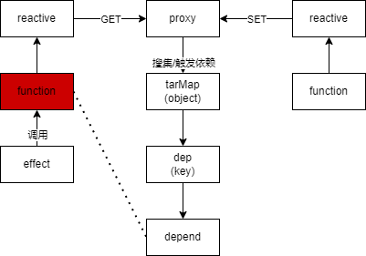
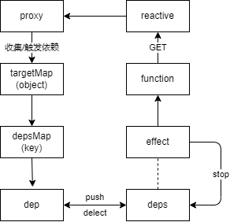
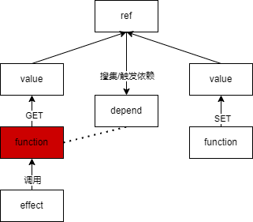

# 一、响应式核心(依赖收集和触发)

本章内容图解


可以以这张图为向导, 阅读本章节

GitHub: https://github.com/Roman-29/mini-vue

## effect 和 reactive

### 简介

在 vue3 中 reactive 响应式对象, 当值改变时自动更新, 测试代码如下

```ts
import { reactive } from "../reactive";
import { effect } from "../effect";

describe("effect", () => {
  it("happy path", () => {
    const user = reactive({ age: 10 });

    let nextAge;
    effect(() => {
      nextAge = user.age + 1;
    });

    expect(nextAge).toBe(11);

    // updata
    user.age++;
    expect(nextAge).toBe(12);
  });
});
```

其实现原理如图:



在 effect 中的函数, 如果有响应式对象被执行了 get 方法, 就会进入依赖收集, 将当前 effect 的函数存入 dep 中, 在响应式对象被执行 set 方法的时候, 会找到依赖收集时候的 dep, 将 function 再执行一遍, 实现响应式更新.

### 代码

reactive 逻辑

```ts
import { track, trigger } from "./effect";

export function reactive(raw: any) {
  // 通过proxy代理原对象
  return new Proxy(raw, {
    get(target, key) {
      const res = Reflect.get(target, key);

      // 存入effect
      track(target, key);

      // 判断是否为object
      if (isObject(target[key])) {
        // 嵌套object也需要转换
        return reactive(target[key]);
      }

      return res;
    },

    set(target, key, value) {
      const res = Reflect.set(target, key, value);

      // 触发effect
      trigger(target, key);

      return res;
    },
  });
}
```

effect 逻辑

```ts
const targetMap = new WeakMap();
let activeEffect: ReactiveEffect;

export class ReactiveEffect {
  private _fn: Function;
  public options;

  // 收集挂载这个effect的deps
  public deps: any[] = [];

  constructor(fn, options: any = {}) {
    this._fn = fn;
    this.options = options;
  }

  run() {
    // 赋值当前正在执行的effect
    activeEffect = this;

    const res = this._fn();
    // 重置属性
    activeEffect = undefined;
    return res;
  }
}

export function track(target: any, key: string | symbol) {
  // 判断是否有依赖需要收集
  if (!isTracking()) return;

  let depsMap = targetMap.get(target);
  if (!depsMap) {
    depsMap = new Map();
    targetMap.set(target, depsMap);
  }

  let deps = depsMap.get(key);
  if (!deps) {
    deps = new Set();
    depsMap.set(key, deps);
  }

  deps.add(activeEffect);
  activeEffect.deps.push(deps);
}

export function trigger(target: any, key: string | symbol) {
  let depsMap = targetMap.get(target);
  let deps = depsMap.get(key);

  deps.forEach((effect) => {
    effect.run();
  });
}

export function effect(fn: Function) {
  // 实例化effect
  const _effect = new ReactiveEffect(fn);

  // 执行函数
  _effect.run();

  const runner = _effect.run.bind(_effect);

  // 返回runner
  return runner;
}

export function isTracking() {
  return activeEffect;
}
```

## scheduler 功能

### 简介

什么是 scheduler? 下面将用一段测试代码解释其作用:

```ts
it("scheduler", () => {
  // 1. 通过effect的第二个参数给定 scheduler 函数
  // 2. effect 第一次执行的时候, 会执行第一个参数里的函数
  // 3. 当响应式对象 set(updata) 后不会再执行第一个参数的函数, 而是执行 scheduler 函数
  // 4. 如果当执行 renner 的时候, 会再次执行第一个参数的函数

  let dummy;
  let run: any;
  const scheduler = jest.fn(() => {
    run = runner;
  });
  const obj = reactive({ foo: 1 });
  const runner = effect(
    () => {
      dummy = obj.foo;
    },
    { scheduler }
  );

  // scheduler不会被调用
  expect(scheduler).not.toHaveBeenCalled();
  expect(dummy).toBe(1);
  // 应该在第一次触发时调用
  obj.foo++;
  expect(scheduler).toHaveBeenCalledTimes(1);
  // 不执行更新
  expect(dummy).toBe(1);

  run();
  // 执行更新
  expect(dummy).toBe(2);
});
```

那么 scheduler 功能的使用场景在哪里呢? 既然 scheduler 可以让 run 函数在响应式对象更新时不执行, 那么就可以用来处理懒执行, 比如在 computed 和 nextTick, 都是通过 scheduler 功能实现的, 具体如何实现后面会专门作为一个章节说明. 这里知道 scheduler 功能就可以了.

### 代码

在原有的 effect 基础上, 做出修改:

```ts
export function trigger(target: any, key: string | symbol) {
  let depsMap = targetMap.get(target);
  let deps = depsMap.get(key);

  // 在触发依赖的时候, 判断是否存在scheduler
  deps.forEach((effect) => {
    if (effect.options.scheduler) {
      effect.options.scheduler();
    } else {
      effect.run();
    }
  });
}

export function effect(fn: Function, options: any = {}) {
  // 增加scheduler参数
  const _effect = new ReactiveEffect(fn, options);
  _effect.run();

  const runner = _effect.run.bind(_effect);

  return runner;
}
```

## stop 功能

### 简介

找到对应的 def, 将 effect 清除出依赖收集, 不再进行响应式更新.



测试代码如下:

```ts
it("stop", () => {
  let dummy;
  const obj = reactive({ prop: 1 });
  const runner = effect(() => {
    dummy = obj.prop;
  });
  obj.prop = 2;
  expect(dummy).toBe(2);
  stop(runner);

  // obj.prop++ 相当于 obj.prop = obj.prop + 1 (同时触发get和set)
  obj.prop++;
  expect(dummy).toBe(2);

  // 仍然可以手动调用runner更新值
  runner();
  expect(dummy).toBe(3);

  // 确保没有因为runner()重新注册了响应式
  obj.prop++;
  expect(dummy).toBe(3);
});

it("onStop", () => {
  const obj = reactive({
    foo: 1,
  });
  const onStop = jest.fn();
  let dummy;
  const runner = effect(
    () => {
      dummy = obj.foo;
    },
    {
      onStop,
    }
  );

  stop(runner);
  expect(onStop).toBeCalledTimes(1);
});
```

### 代码

在原有的 effect 基础上, 做出修改:

```ts
export class ReactiveEffect {
  private _fn: Function;
  public options;

  // 收集挂载这个effect的deps
  public deps: any[] = [];
  // 是否stop状态
  active = true;

  constructor(fn, options: any = {}) {
    this._fn = fn;
    this.options = options;
  }

  run() {
    // 赋值当前正在执行的effect
    activeEffect = this;

    const res = this._fn();
    // 重置属性
    activeEffect = undefined;
    return res;
  }

  stop() {
    if (this.active) {
      cleanupEffect(this);
      // 如果有stop回调函数就执行回调函数
      if (this.options.onStop) {
        this.options.onStop();
      }
      this.active = false;
    }
  }
}

function cleanupEffect(effect) {
  effect.deps.forEach((dep: any) => {
    dep.delete(effect);
  });

  // 把 effect.deps 清空
  effect.deps.length = 0;
}

export function stop(runner) {
  // 调用effect的stop函数
  runner.effect.stop();
}

export function track(target: any, key: string | symbol) {
  if (!isTracking()) return;

  let depsMap = targetMap.get(target);
  if (!depsMap) {
    depsMap = new Map();
    targetMap.set(target, depsMap);
  }

  let deps = depsMap.get(key);
  if (!deps) {
    deps = new Set();
    depsMap.set(key, deps);
  }

  // 看看 dep 之前有没有添加过，添加过的话 那么就不添加了
  if (deps.has(activeEffect)) return;

  deps.add(activeEffect);
  activeEffect.deps.push(deps);
}
```

## ref 功能

### 简介



当我们定义基本类型的响应式对象的时候, 会去使用 ref 功能. ref 功能其实是对 reactive 的二次包装.

因为不需要关心object的依赖, 所以依赖不保存在targetMap下, 而是直接保存在了 ref 自身的私有属性里.

测试代码如下

```ts
import { effect } from "../effect";
import { ref } from "../ref";

describe("ref", () => {
  it("happy path", () => {
    const a = ref(1);
    expect(a.value).toBe(1);
  });

  it("should be reactive", () => {
    const a = ref(1);
    let dummy;
    let calls = 0;
    effect(() => {
      calls++;
      dummy = a.value;
    });
    expect(calls).toBe(1);
    expect(dummy).toBe(1);
    a.value = 2;
    expect(calls).toBe(2);
    expect(dummy).toBe(2);

    // 相同的值不应该触发
    a.value = 2;
    expect(calls).toBe(2);
    expect(dummy).toBe(2);
  });

  it("should make nested properties reactive", () => {
    const a = ref({
      count: 1,
    });
    let dummy;
    effect(() => {
      dummy = a.value.count;
    });
    expect(dummy).toBe(1);
    a.value.count = 2;
    expect(dummy).toBe(2);
  });
});
```

### 代码

```ts
import { hasChanged, isObject } from "../share";
import { isTracking, trackEffects, triggerEffects } from "./effect";
import { reactive } from "./reactive";

class RefImpl {
  private _value;
  private _rawValue;
  // ref自身的依赖收集
  public deps;

  constructor(value) {
    // 判断是否需要转换成reactive
    this._value = convert(value);
    this.deps = new Set();
  }

  get value() {
    trackRefValue(this);
    return this._value;
  }
  set value(newValue) {
    this._value = newValue;

    // 和原值做对比
    if (!Object.is(newValue, this._rawValue)) {
      this._rawValue = newValue;
      this._value = convert(newValue);
      triggerEffects(this.deps);
    }
  }
}

function convert(value) {
  return isObject(value) ? reactive(value) : value;
}

function trackRefValue(ref) {
  // 判断是否有activeEffect, 有则收集依赖
  if (isTracking()) {
    trackEffects(ref.deps);
  }
}

export function ref(value) {
  return new RefImpl(value);
}
```

并且重构 effect 代码, 在原有代码基础上做出修改, 抽离出重复代码:

```ts
export function track(target: any, key: string | symbol) {
  if (!activeEffect) return;

  let depsMap = targetMap.get(target);
  if (!depsMap) {
    depsMap = new Map();
    targetMap.set(target, depsMap);
  }

  let deps = depsMap.get(key);
  if (!deps) {
    deps = new Set();
    depsMap.set(key, deps);
  }
  trackEffects(deps);
}

export function trackEffects(deps) {
  // 看看 dep 之前有没有添加过，添加过的话 那么就不添加了
  if (deps.has(activeEffect)) return;

  deps.add(activeEffect);
  activeEffect.deps.push(deps);
}

export function trigger(target: any, key: string | symbol) {
  let depsMap = targetMap.get(target);
  if (!depsMap) {
    // never been tracked
    return;
  }

  let deps = depsMap.get(key);
  triggerEffects(deps);
}

export function triggerEffects(deps) {
  deps.forEach((effect) => {
    if (effect.options.scheduler) {
      effect.options.scheduler();
    } else {
      effect.run();
    }
  });
}
```

从上面的代码可以看出, reactive 收集的依赖放在 targetMap 里, 而 ref 则将依赖存放在自身属性, 不参与到 targetMap 中.

## computed 计算属性

### 简介

computed 接受一个 getter 函数，返回一个只读的响应式 ref 对象。该 ref 通过 .value 暴露 getter 函数的返回值。它也可以接受一个带有 get 和 set 函数的对象来创建一个可写的 ref 对象。

测试代码如下:

```ts
import { computed } from "../computed";
import { reactive } from "../reactive";

describe("computed", () => {
  it("happy path", () => {
    const user = reactive({
      age: 1,
    });

    const age = computed(() => {
      return user.age;
    });

    expect(age.value).toBe(1);
  });

  it("should compute lazily", () => {
    const value = reactive({
      foo: 1,
    });
    const getter = jest.fn(() => {
      return value.foo;
    });
    const cValue = computed(getter);

    // lazy
    expect(getter).not.toHaveBeenCalled();

    expect(cValue.value).toBe(1);
    expect(getter).toHaveBeenCalledTimes(1);

    // 不会重复计算
    cValue.value; // get
    expect(getter).toHaveBeenCalledTimes(1);

    // 即使修改了值, 在需要时才会再计算
    value.foo = 2;
    expect(getter).toHaveBeenCalledTimes(1);

    // now it should compute
    expect(cValue.value).toBe(2);
    expect(getter).toHaveBeenCalledTimes(2);

    // 不会重复计算
    cValue.value;
    expect(getter).toHaveBeenCalledTimes(2);
  });
});
```

### 代码

这里为了实现计算属性的懒计算, 使用到了前面提到的 scheduler 功能

```ts
import { ReactiveEffect } from "./effect";

class ComputedRefImpl {
  private _effect: ReactiveEffect;
  private _dirty = true; // 判断是否需要重新计算
  private _value: any; // 数据缓存

  constructor(getter) {
    this._effect = new ReactiveEffect(getter, {
      scheduler: () => {
        // 依赖发生变化, 需要从新执行getter函数
        this._dirty = true;
      },
    });
  }

  get value() {
    if (this._dirty) {
      // 不再重复执行getter函数
      this._dirty = false;
      this._value = this._effect.run();
    }
    return this._value;
  }
}

export function computed(getter) {
  return new ComputedRefImpl(getter);
}
```

可以看到计算属性非常巧妙的使用 scheduler 功能, 实现了懒计算
