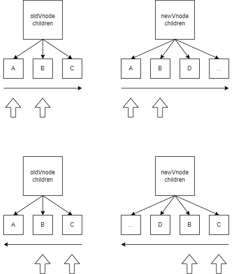
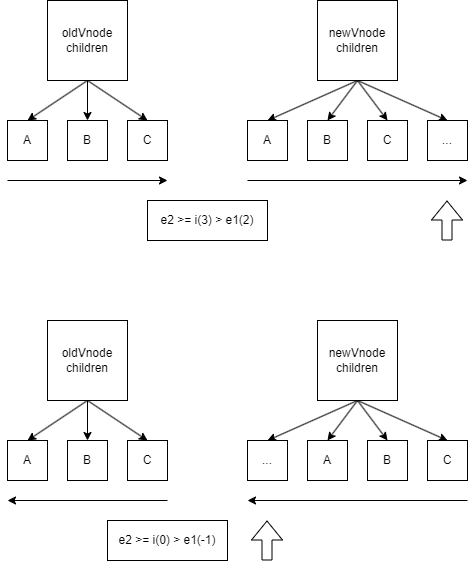
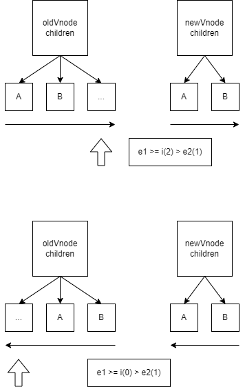
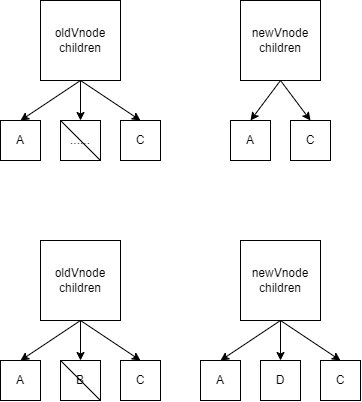
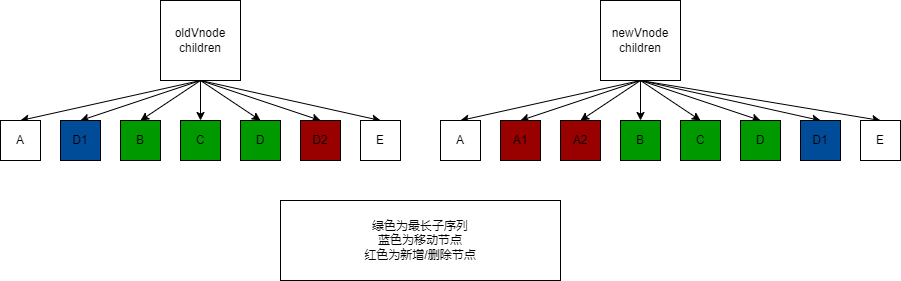
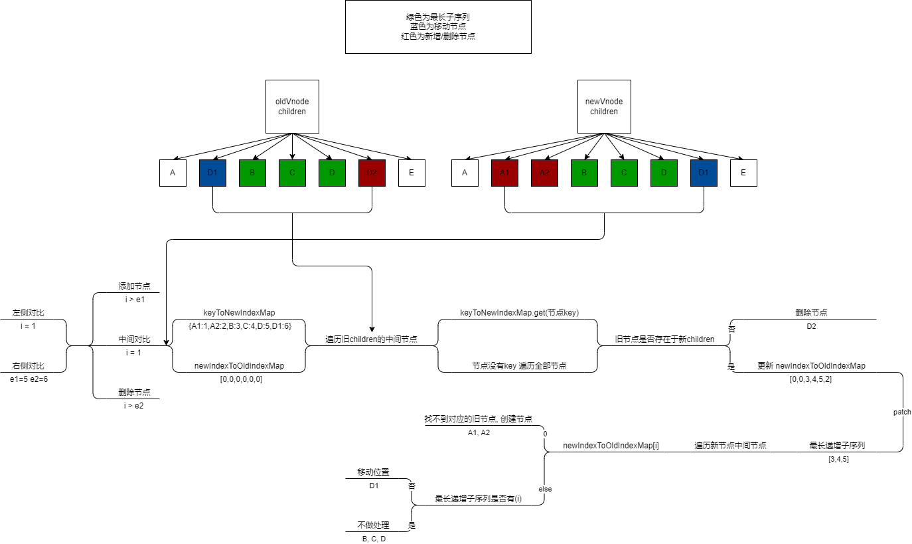

# diff 更新算法

GitHub: https://github.com/Roman-29/mini-vue

## 双端对比

更新 element 子节点的时候, 当新旧子节点都是数组类型的时候, 我们就可以使用 diff 算法优化 element 更新逻辑. 算法的核心是双端对比, 也就是对数组从头到尾, 从尾到头进行对比, 找到双端相同的部分和中间发生变化的部分, 对中间部分进行针对性处理(增加/删除/移动位置).

## 对比原则

### 简介

拿到虚拟节点对比 tag 和 key 属性, 判断是否为相似节点, 如果相似直接在原 DOM 元素上修改, 不进行 DOM 的删除再创建

### 代码

在 vnode.ts 增加虚拟节点的 key 属性

```ts
export function createVnode(type, props?, children?) {
  const vnode = {
    type,
    props,
    children,
    key: props && props.key, // 在props将key取出
    shapeFlag: getShapeFlag(type),
    el: null,
  };

  ...

  return vnode;
}

export function isSameVNodeType(n1, n2) {
  // 判断 type 和 key
  return n1.type === n2.type && n1.key === n2.key;
}
```

## 判断左侧/右侧相似节点

### 简介



如图, 我们需要对比新旧子节点, 找到两者左侧和右侧相同部分的索引

### 代码

在上一章 renderer.ts 在更新 element 的时候对不同的子节点类型进行了不同的处理, 这里我们将新旧子节点都是数组的情况进行补充

```ts
function patchChildren(n1, n2, container, parentComponent, anchor) {
  const prevShapeFlag = n1.shapeFlag;
  const shapeFlag = n2.shapeFlag;
  const c1 = n1.children;
  const c2 = n2.children;

  ...

  // 当prevShapeFlag和shapeFlag都是数组时 采用 diff 算法
  patchKeyedChildren(c1, c2, container, parentComponent, anchor);
}

function patchKeyedChildren(c1, c2, container, parentComponent, parentAnchor) {
  let i = 0; // 左侧索引
  let e1 = c1.length - 1; // 旧节点相同节点索引
  let e2 = c2.length - 1; // 新节点相同节点索引

  // 左侧对比
  while (i <= e1 && i <= e2) {
    const n1 = c1[i];
    const n2 = c2[i];
    if (isSameVNodeType(n1, n2)) {
      // 继续刷新节点下的内容
      patch(n1, n2, container, parentComponent, parentAnchor);
    } else {
      // 节点完全不一致, 对比结束, 得到 i 为左侧相同元素的后一位下标
      break;
    }
    i++;
  }

  // 右侧对比
  while (i <= e1 && i <= e2) {
    const n1 = c1[e1];
    const n2 = c2[e2];
    if (isSameVNodeType(n1, n2)) {
      // 继续刷新节点下的内容
      patch(n1, n2, container, parentComponent, parentAnchor);
    } else {
      // 节点完全不一致, 对比结束, 得到 e1,e2 为右侧相同元素的前一位下标
      break;
    }
    e1--;
    e2--;
  }
}
```

## 创建新节点

### 简介



如图当左侧索引(i) 大于 旧节点相同节点索引(e1)的情况出现时, 可以认定只需要创建新节点

### 创建

```ts
function patchKeyedChildren(c1, c2, container, parentComponent, parentAnchor) {

  ...

  if (i > e1) {
    if (i <= e2) {
      // 新的比旧的多 创建后续节点
      const nextPos = e2 + 1;
      // 获取插入的锚点
      const anchor = nextPos < c2.length ? c2[nextPos].el : null;

      while (i <= e2) {
        patch(null, c2[i], container, parentComponent, anchor);
        i++;
      }
    }
  }
}
```

### 插入

由于可能会出现在头部插入节点的情况, 所以要修改默认渲染器的 insert 函数, 增加一个锚点作为插入依据

修改 renderer.ts

```ts
function mountElement(vnode, container, parentComponent, anchor) {

  ...

  // 增加一个锚点参数
  hostInsert(el, container, anchor);
}
```

修改 runtime-dom/index.js

```ts
function insert(child, container, anchor) {
  // 当锚点为null时效果和append一样, 会插入到DOM元素的最后面
  container.insertBefore(child, anchor || null);
}
```

## 删除旧节点

### 简介



如图当左侧索引(i) 大于 新节点相同节点索引(e2)的情况出现时, 可以认定只需要删除旧节点

### 删除

```ts
function patchKeyedChildren(c1, c2, container, parentComponent, parentAnchor) {

  ...

  if (i > e2) {
    while (i <= e1) {
      // 新的比旧的少 删除多余节点
      hostRemove(c1[i].el);
      i++;
    }
  }
}
```

## 中间对比

### 简介

上面是两种简单场景的处理方式, 但是实际上我们会遇到更加复杂的情况, 这个时候就需要用到中间对比去解决了

### 删除节点

如图, 当旧节点中有多余或不可匹配的子节点, 都要对其进行删除处理



```ts
function patchKeyedChildren(c1, c2, container, parentComponent, parentAnchor) {

  ...

  // 当上述两种情况都不满足时, 采用中间对比
  let s1 = i;
  let s2 = i;

  // 记录新节点需要处理的中间节点总数量
  const toBePatched = e2 - s2 + 1;
  // 记录当前处理的数量
  let patched = 0;

  // 把新节点下标和key做映射表
  const keyToNewIndexMap = new Map();

  for (let i = s2; i <= e2; i++) {
    const nextChild = c2[i];
    nextChild.key && keyToNewIndexMap.set(nextChild.key, i);
  }

  // 遍历旧节点
  for (let i = s1; i <= e1; i++) {
    const prevChild = c1[i];

    // 如果当前处理的数量已经大于新节点中间节点总数，那么旧节点直接删除就可以了
    if (patched >= toBePatched) {
      hostRemove(prevChild.el);
      continue;
    }

    let newIndex;

    // 拿到旧节点在新节点对应的位置
    if (prevChild.key) {
      newIndex = keyToNewIndexMap.get(prevChild.key);
    } else {
      // 如果用户没有设置key，那么就遍历所有，时间复杂度为O(n)
      for (let j = s2; j <= e2; j++) {
        if (isSameVnodeType(prevChild, c2[j])) {
          newIndex = j;
          break;
        }
      }
    }

    if (newIndex === undefined) {
      // 新节点没有对应的key, 直接删除
      hostRemove(prevChild.el);
    } else {
      // 更新对应的旧节点
      patch(prevChild, c2[newIndex], container, parentComponent, null);
      patched++;
    }
  }
}
```

### 最长递增子序列

在一个给定的数值序列中，找到一个子序列，使得这个子序列元素的数值依次递增，并且这个子序列的长度尽可能地大。

当我们处理中间子节点的移动和添加时, 就需要用到最长递增子序列, 锁定中间节点"最稳定部分", 修改其他非稳定节点

如图, 我们只需要处理最长子序列以外的节点, 就可以达到性能最优



代码如下:

```ts
function getSequence(arr) {
  const p = arr.slice();
  const result = [0];
  let i, j, u, v, c;
  const len = arr.length;
  for (i = 0; i < len; i++) {
    const arrI = arr[i];
    if (arrI !== 0) {
      j = result[result.length - 1];
      if (arr[j] < arrI) {
        p[i] = j;
        result.push(i);
        continue;
      }
      u = 0;
      v = result.length - 1;
      while (u < v) {
        c = (u + v) >> 1;
        if (arr[result[c]] < arrI) {
          u = c + 1;
        } else {
          v = c;
        }
      }
      if (arrI < arr[result[u]]) {
        if (u > 0) {
          p[i] = result[u - 1];
        }
        result[u] = i;
      }
    }
  }
  u = result.length;
  v = result[u - 1];
  while (u-- > 0) {
    result[u] = v;
    v = p[v];
  }
  return result;
}
```

### 移动或创建节点

在上述最长子序列的原则, 我们实现对节点进行移动或创建

```ts
function patchKeyedChildren(c1, c2, container, parentComponent, parentAnchor) {
  // 当上述两种情况都不满足时, 采用中间对比
  let s1 = i;
  let s2 = i;

  // 记录新节点需要处理的中间节点总数量
  const toBePatched = e2 - s2 + 1;
  // 记录当前处理的数量
  let patched = 0;

  // 把新节点下标和key做映射表
  const keyToNewIndexMap = new Map();

  // 新旧节点索引映射表
  const newIndexToOldIndexMap = new Array(toBePatched);
  let moved = false;
  let maxNewIndexSoFar = 0;
  // 初始化映射表
  for (let i = 0; i < toBePatched; i++) newIndexToOldIndexMap[i] = 0;

  for (let i = s2; i <= e2; i++) {
    const nextChild = c2[i];
    nextChild.key && keyToNewIndexMap.set(nextChild.key, i);
  }

  // 遍历旧节点
  for (let i = s1; i <= e1; i++) {
    const prevChild = c1[i];

    // 如果当前处理的数量已经大于新节点中间节点总数，那么旧节点直接删除就可以了
    if (patched >= toBePatched) {
      hostRemove(prevChild.el);
      continue;
    }

    let newIndex;

    // 拿到旧节点在新节点对应的位置
    if (prevChild.key) {
      newIndex = keyToNewIndexMap.get(prevChild.key);
    } else {
      // 如果用户没有设置key，那么就遍历所有，时间复杂度为O(n)
      for (let j = s2; j <= e2; j++) {
        if (isSameVnodeType(prevChild, c2[j])) {
          newIndex = j;
          break;
        }
      }
    }

    if (newIndex === undefined) {
      // 没有匹配到节点, 直接删除
      hostRemove(prevChild.el);
    } else {
      if (newIndex >= maxNewIndexSoFar) {
        maxNewIndexSoFar = newIndex;
      } else {
        // 如果旧的节点在新的节点里，前一个索引没有比后面一个索引大就需要移动
        moved = true;
      }

      // 0 代表老的节点在新的节点里面是不存在的，所以要 +1
      newIndexToOldIndexMap[newIndex - s2] = i + 1;

      // 更新对应的旧节点
      patch(prevChild, c2[newIndex], container, parentComponent, null);
      patched++;
    }
  }

  // 找到最长递增子序列
  const increasingNewIndexSequence = moved
    ? getSequence(newIndexToOldIndexMap)
    : [];
  let j = increasingNewIndexSequence.length - 1;

  // 因为调用的DOM API 的insertBefore是需要插入到一个元素的前面，所以要使用倒序排列
  for (let i = toBePatched - 1; i >= 0; i--) {
    const nextIndex = i + s2;
    const nextChild = c2[nextIndex];
    const anchor = nextIndex + 1 < c2.length ? c2[nextIndex + 1].el : null;

    if (newIndexToOldIndexMap[i] === 0) {
      // 当新节点在旧节点索引映射表为0 表示不存在 新建节点
      patch(null, nextChild, container, parentComponent, anchor);
    } else if (moved) {
      // 有需要移动的节点
      if (j < 0 || i !== increasingNewIndexSequence[j]) {
        console.log("移动位置");
        hostInsert(nextChild.el, container, anchor);
      } else {
        j--;
      }
    }
  }
}
```

## 总结

整个算法的逻辑图如下


