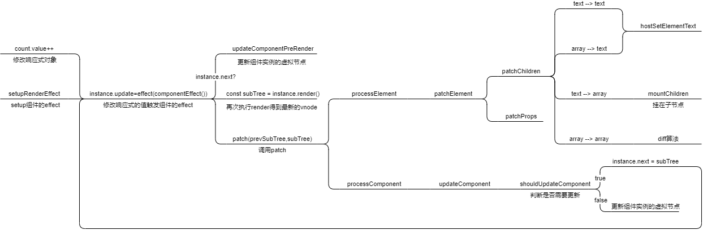

# 运行时的更新

本章内容图解



可以以这张图为向导, 阅读本章节

GitHub: https://github.com/Roman-29/mini-vue

## 更新 element 流程

### 简介

当组件的响应式对象发生改变的时候, 我们需要同步修改页面视图, 比如下面代码, 点击按钮后数字需要更新

```js
import { h, ref } from "../../lib/mini-vue.esm.js";

export const App = {
  name: "App",

  setup() {
    const count = ref(0);

    const onClick = () => {
      count.value++;
    };

    return {
      count,
      onClick,
    };
  },
  render() {
    return h(
      "div",
      {
        id: "root",
      },
      [
        h("div", {}, "count:" + this.count), // 依赖收集
        h(
          "button",
          {
            onClick: this.onClick,
          },
          "click"
        ),
      ]
    );
  },
};
```

### 代码

既然要更新, 就需要将更新前和更新后的虚拟节点做对比.

1. 要拿到虚拟节点我们就要找到组件创建虚拟节点的地方 renderer.ts

2. 要实现响应式更新, 就要用到前面实现的 effect 做依赖收集和调用

先修改 component.ts 增加三个属性到组件实例上

```ts
export function createComponentInstance(vnode, parent) {
  const component = {
    vnode,
    type: vnode.type,
    setupState: {},
    el: null,
    props: {},
    slots: {},
    provides: parent ? parent.provides : {},
    parent,
    isMounted: false, // 组件是否已挂载
    subTree: {}, // 虚拟节点
    next: null, // 更新后的虚拟节点
    emit: () => {},
  };

  // 锁定第一个参数是组件instance
  component.emit = emit.bind(null, component) as any;

  return component;
}
```

再修改 renderer.ts

```ts
import { effect } from "../reactivity/effect";

export function createRenderer(options) {
  function render(vnode, container) {
    patch(null, vnode, container, null);
  }

  // n1,n2代表新旧subTree
  function patch(n1, n2, container, parentComponent) {
    // 需要判断vnode是组件还是element
    const { type, shapeFlag } = n2;

    switch (type) {
      // Fragment只渲染children
      case Fragment:
        processFragment(n2, container, parentComponent);
        break;
      case Text:
        processText(n2, container);
        break;
      default:
        if (shapeFlag & ShapeFlags.ELEMENT) {
          processElement(n1, n2, container, parentComponent);
        } else if (shapeFlag & ShapeFlags.STATEFUL_COMPONENT) {
          // 处理组件
          processComponent(n2, container, parentComponent);
        }
        break;
    }
  }

  function processElement(n1, n2, container, parentComponent) {
    if (!n1) {
      // 组件初始化
      mountElement(n2, container, parentComponent);
    } else {
      // 更新组件视图
      patchElement(n1, n2, container);
    }
  }

  function patchElement(n1, n2, container) {
    console.log("patchElement");
    console.log("current", n2);
    console.log("prev", n1);
  }

  ...

  function mountChildren(vnode, container, parentComponent) {
    vnode.children.forEach((v) => {
      // 挂载子节点的时候 不会有旧节点
      patch(null, v, container, parentComponent);
    });
  }

  ...

  function setupRenderEffect(instance, initialVNode, container) {
    // 当响应式对象发生改变, 触发函数
    effect(() => {
      if (!instance.isMounted) {
        // 首次挂载
        const { proxy } = instance;
        // 保存subTree
        const subTree = (instance.subTree = instance.render.call(proxy));

        // 初始化的时候没有旧节点
        patch(null, subTree, container, instance);
        initialVNode.el = subTree.el;
        instance.isMounted = true;
      } else {
        const { proxy } = instance;
        const subTree = instance.render.call(proxy);
        const prevSubTree = instance.subTree;
        // 获取新旧subTree并更新
        instance.subTree = subTree;

        patch(prevSubTree, subTree, container, instance);
      }
    });
  }
}
```

## 更新 element 的 props

### 简介

处理 element 的 props 变化, 首先修改测试用例, 增加对 element 的 props 修改

```js
import { h, ref } from "../../lib/mini-vue.esm.js";

export const App = {
  name: "App",

  setup() {
    const count = ref(0);

    const onClick = () => {
      count.value++;
    };

    const props = ref({
      foo: "foo",
      bar: "bar",
    });
    const onChangePropsDemo1 = () => {
      props.value.foo = "new-foo";
    };

    const onChangePropsDemo2 = () => {
      props.value.foo = undefined;
    };

    const onChangePropsDemo3 = () => {
      props.value = {
        foo: "foo",
      };
    };

    return {
      count,
      onClick,
      onChangePropsDemo1,
      onChangePropsDemo2,
      onChangePropsDemo3,
      props,
    };
  },
  render() {
    return h(
      "div",
      {
        id: "root",
        ...this.props,
      },
      [
        h("div", {}, "count:" + this.count),
        h(
          "button",
          {
            onClick: this.onClick,
          },
          "click"
        ),
        h(
          "button",
          {
            onClick: this.onChangePropsDemo1,
          },
          "changeProps - 值改变了 - 修改"
        ),

        h(
          "button",
          {
            onClick: this.onChangePropsDemo2,
          },
          "changeProps - 值变成了 undefined - 删除"
        ),

        h(
          "button",
          {
            onClick: this.onChangePropsDemo3,
          },
          "changeProps - key 在新的里面没有了 - 删除"
        ),
      ]
    );
  },
};
```

### 代码

基于上一节的代码, 我们把更新视图的代码都放在了 renderer.ts 的 patchElement 函数中, 这里对函数进行扩展.

```ts
const EMPTY_OBJ = {};

function patchElement(n1, n2, container) {
  console.log("patchElement");
  console.log("current", n2);
  console.log("prev", n1);

  // 获取新旧节点的props
  const oldProps = n1.props || EMPTY_OBJ;
  const newProps = n2.props || EMPTY_OBJ;

  const el = (n2.el = n1.el);

  patchProps(el, oldProps, newProps);
}

function patchProps(el, oldProps, newProps) {
  if (oldProps !== newProps) {
    for (const key in newProps) {
      const prevProp = oldProps[key];
      const nextProp = newProps[key];
      // 更新props值
      if (prevProp !== nextProp) {
        hostPatchProp(el, key, prevProp, nextProp);
      }
    }

    // 删除旧props多余的属性
    if (oldProps !== EMPTY_OBJ) {
      for (const key in oldProps) {
        if (!(key in newProps)) {
          hostPatchProp(el, key, oldProps[key], null);
        }
      }
    }
  }
}
```

同时修改 runtime-dom/index.ts 的 patchProp 函数, 使其支持对 props 的更新

```ts
function patchProp(el, key, prevVal, nextVal) {
  const isOn = (key: string) => /^on[A-Z]/.test(key);
  if (isOn(key)) {
    const event = key.slice(2).toLowerCase();
    el.addEventListener(event, nextVal);
  } else {
    if (nextVal === undefined || nextVal === null) {
      // 删除属性
      el.removeAttribute(key);
    } else {
      el.setAttribute(key, nextVal);
    }
  }
}
```

## 更新 element 的 children

继续补充 patchElement 函数, 在已经支持 props 更新后再增加 children 更新的逻辑代码

```ts
export function createRenderer(options) {
  // 渲染器新增remove和setElementText函数
  const {
    createElement: hostCreateElement,
    patchProp: hostPatchProp,
    insert: hostInsert,
    remove: hostRemove,
    setElementText: hostSetElementText,
  } = options;

  function patchElement(n1, n2, container, parentComponent) {
    ...
    patchChildren(n1, n2, el, parentComponent);
  }

  function patchChildren(n1, n2, container, parentComponent) {
    const prevShapeFlag = n1.shapeFlag;
    const shapeFlag = n2.shapeFlag;
    const c1 = n1.children;
    const c2 = n2.children;

    if (shapeFlag & ShapeFlags.TEXT_CHILDREN) {
      // 更新子节点是 Text 类型
      if (prevShapeFlag & ShapeFlags.ARRAY_CHILDREN) {
        // 把旧的子节点清空
        unmountChildren(c1);
      }
      if (c1 !== c2) {
        // 设置 Text
        hostSetElementText(container, c2);
      }
    } else {
      // 更新子节点是 数组
      if (prevShapeFlag & ShapeFlags.TEXT_CHILDREN) {
        // 清空
        hostSetElementText(container, "");
        mountChildren(c2, container, parentComponent);
      } else {
        // diff 算法
      }
    }
  }

  function unmountChildren(children) {
    for (let i = 0; i < children.length; i++) {
      const el = children[i].el;
      // remove
      hostRemove(el);
    }
  }
}
```

同时在 runtime-dom/index.ts 补充默认的 remove 和 setElementText 函数

```ts
function remove(child) {
  const parent = child.parentNode;
  if (parent) {
    parent.removeChild(child);
  }
}

function setElementText(el, text) {
  el.textContent = text;
}
```

你可能已经注意到, 当新旧节点的子节点都是数组的时候, 我们需要采用 diff 算法, 这一节里并不打算深入说明, 有关于 diff 算法将会在新的章节里详细讲解

## 更新组件的 props

### 简介

除了对 element 的更新, 我们也需要对组件进行更新

### 代码

和更新 element 类似, 在更新组件的时候从 renderer.ts 的 processComponent 函数入手

```ts
function processComponent(n1, n2, container, parentComponent, anchor) {
  if (!n1) {
    mountComponent(n2, container, parentComponent, anchor);
  } else {
    updateComponent(n1, n2);
  }
}

function mountComponent(initialVNode, container, parentComponent, anchor) {
  // 将组件实例存入虚拟节点中
  const instance = (initialVNode.component = createComponentInstance(
    initialVNode,
    parentComponent
  ));

  setupComponent(instance);
  setupRenderEffect(instance, initialVNode, container, anchor);
}

function updateComponent(n1, n2) {
  const instance = (n2.component = n1.component);
  if (shouldUpdateComponent(n1, n2)) {
    instance.next = n2;
    // 调用setupRenderEffect的effect
    instance.update();
  } else {
    n2.el = n1.el;
    instance.vnode = n2;
  }
}

// 判断是否需要更新组件 props
function shouldUpdateComponent(prevVNode, nextVNode) {
  const { props: prevProps } = prevVNode;
  const { props: nextProps } = nextVNode;

  for (const key in nextProps) {
    if (nextProps[key] !== prevProps[key]) {
      return true;
    }
  }

  return false;
}

function setupRenderEffect(instance, initialVNode, container, anchor) {
  // 将effect绑定到组件实例
  instance.update = effect(() => {
    if (!instance.isMounted) {
      const { proxy } = instance;

      // 保存subTree
      const subTree = (instance.subTree = instance.render.call(proxy));

      console.log(subTree);

      // vnode-> patch
      // vnode-> element-> mountElement
      patch(null, subTree, container, instance, anchor);

      initialVNode.el = subTree.el;

      instance.isMounted = true;
    } else {
      const { next, vnode } = instance;

      // 判断是否有新的虚拟节点
      if (next) {
        // 将需要更新的新虚拟节点属性注入到当前组件实例并patch进行更新
        next.el = vnode.el;
        instance.vnode = next;
        instance.next = null;
        instance.props = next.props;
      }

      const { proxy } = instance;
      const subTree = instance.render.call(proxy);
      const prevSubTree = instance.subTree;
      // 获取新旧subTree并更新
      instance.subTree = subTree;

      patch(prevSubTree, subTree, container, instance, anchor);
    }
  });
}
```

## 实现 nextTick 功能

### 简介

在上面已经实现了响应式更新组件和 element, 但是当响应式对象被多次修改的时候, 也就意味着 runtime 会多次更新视图, 如下面的测试代码, 其实我们只需要更新一次视图就行, 但是实际上会更新一百次

```js
import { h, ref, getCurrentInstance } from "../../lib/mini-vue.esm.js";

export default {
  name: "App",
  setup() {
    const count = ref(1);

    function onClick() {
      for (let i = 0; i < 100; i++) {
        console.log("update");
        count.value = i;
      }
    }

    return {
      onClick,
      count,
    };
  },
  render() {
    const button = h("button", { onClick: this.onClick }, "update");
    const p = h("p", {}, "count:" + this.count);

    return h("div", {}, [button, p]);
  },
};
```

解决思路是:

1. 执行全部同步任务
2. 执行一次异步更新视图

这里就会用到一个微任务的概念, 我们在同步的时候, 把所有要更新的 effect 存放在微任务队列中(重复的 effect 只保存一次).

### 代码

回顾前面 effect 的 scheduler 功能, 每当第二次执行 effect.run 的时候, 会去执行 effect 下的 scheduler 而不是 effect 绑定的 function.

所以可以给 runtime-update 的时候增加一个 scheduler 去将要更新的 effect 存入微任务队列中

找到 renderer.ts

```ts
import { queueJobs } from "./scheduler";

function setupRenderEffect(instance, initialVNode, container, anchor) {
    instance.update = effect(
      () => {
        ...
      },
      {
        scheduler() {
          // 注册微任务队列
          queueJobs(instance.update);
        },
      }
    );
  }
```

并且创建 scheduler.ts 管理微任务队列

```ts
const queue: any[] = [];
let isFlushPending = false;

export function queueJobs(job) {
  // 存入微任务
  if (!queue.includes(job)) {
    queue.push(job);
  }

  queueFlush();
}

function queueFlush() {
  if (isFlushPending) {
    return;
  }

  // 创建一个promise, 异步执行微任务
  isFlushPending = true;
  nextTick(flushJobs);
}

export function nextTick(fn) {
  // 通过Promise.resolve(), 异步执行fn
  return fn ? Promise.resolve().then(fn) : Promise.resolve();
}

function flushJobs() {
  isFlushPending = false;
  let job;
  while ((job = queue.shift())) {
    job && job();
  }
}
```

这样不管响应式对象更新多少次, 都只会在同步任务结束后通过Promise.resolve()去执行一次异步刷新, 极大优化了运行效率.

### 使用 nextTick

修改测试代码

```js
import {
  h,
  ref,
  getCurrentInstance,
  nextTick,
} from "../../lib/mini-vue.esm.js";

export default {
  name: "App",
  setup() {
    const count = ref(1);
    const instance = getCurrentInstance();

    function onClick() {
      for (let i = 0; i < 100; i++) {
        console.log("update");
        count.value = i;
      }

      console.log(instance);
      nextTick(() => {
        // 此时组件实例已经完成了异步刷新
        console.log(instance);
      });

      // 使用await也可以查看异步更新后的组件实例
      // await nextTick()
      // console.log(instance)
    }

    return {
      onClick,
      count,
    };
  },
  render() {
    const button = h("button", { onClick: this.onClick }, "update");
    const p = h("p", {}, "count:" + this.count);
    return h("div", {}, [button, p]);
  },
};
```