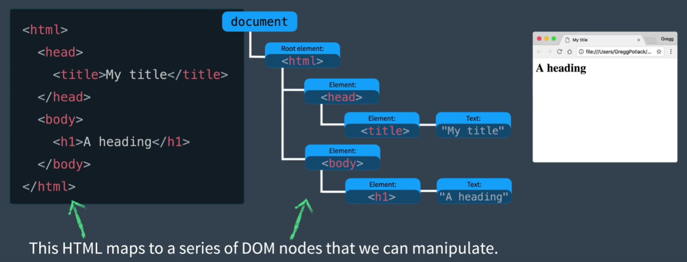
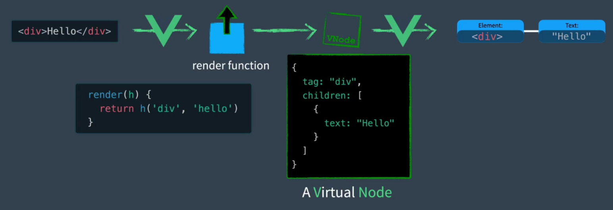
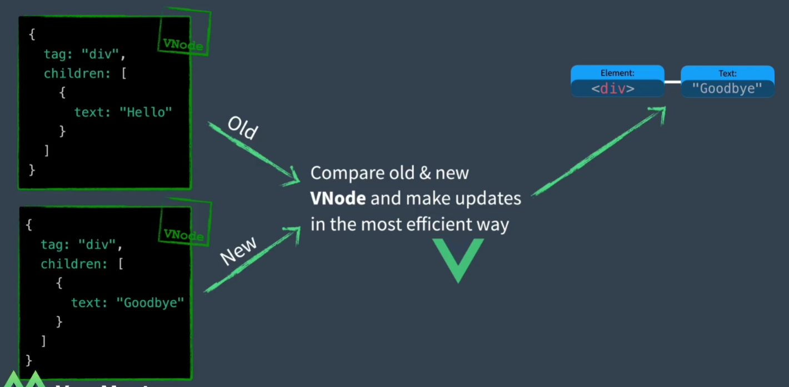
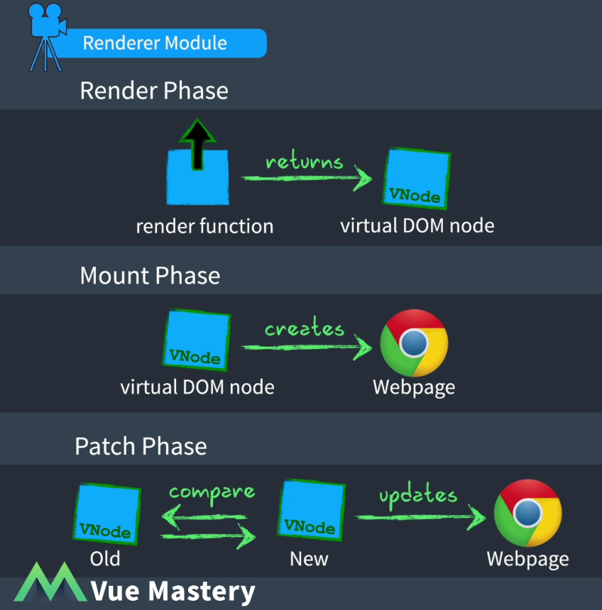

# Vue3 深度探讨

## DOM与VDOM

### DOM

DOM(document object model) 文档对象模型

### VDOM 

VDOM(Virtual DOM) 虚拟节点

虚拟节点是表示DOM的一种方式, 使用JS对象

VUE基于模版创建一个渲染函数, 返回虚拟节点. 

当组件改变时, render函数会重新生成Vnode, VUE会对新旧node进行比较, 最后更新到网页上. 

#### 为什么要有虚拟节点

虚拟节点让组件的渲染逻辑完全从真实的DOM解耦, 并让他更加直接的重新使用框架的运行时. 

另一方面, 虚拟节点提供了以编译方式构建, 检查, 克隆的能力以及操作DOM的结构. 

## VUE的三个核心模块

### 响应式模块

响应式模块允许我们创建JS响应式对象, 并观察其变化. 当适用到这些对象的代码运行时, 他们会被跟踪(track). 所以当响应式对象发生变化后, 他们可以再次运行(trigger)

### 编译器模块

获取到HTML模块并将他们编译成render函数,他可以在浏览器运行时中执行, 但更常用在构建(build) VUE项目的时候. 这样浏览器只需要接收render函数, 

### 渲染模块

渲染模块包含在网页上渲染组件的三个不同阶段.

1. 渲染阶段
    返回一个虚拟节点

2. 挂载阶段
    适用虚拟节点, 并调用DOM API创建页面

3. 补丁阶段
    将旧的虚拟节点和新的虚拟节点做对比, 更新发生变化的部分

### 组件执行步骤的顺序

1. 拥有一个模版以及在模版内的响应式对象

2. 模版编译器将HTML编译为render函数

3. 使用响应式模块初始化响应式对象

4. 渲染模块调用render函数, render函数又会引用跟踪响应式对象(track), 最后render函数返回虚拟节点

5. 在挂载阶段, 使用虚拟节点创建web页面

6. 响应式对象发生任何变化, 响应式被触发(trigger), 渲染模块会再次执行render创建一个新的虚拟节点, 对比新旧虚拟节点, 发送到补丁函数

7. 补丁函数根据变化更新页面

##

