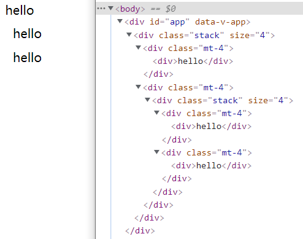

# Vue3 深度探讨

## DOM 与 VDOM

### DOM

DOM(document object model) 文档对象模型


### VDOM

VDOM(Virtual DOM) 虚拟节点

虚拟节点是表示 DOM 的一种方式, 使用 JS 对象

VUE 基于模版创建一个渲染函数, 返回虚拟节点.


当组件改变时, render 函数会重新生成 Vnode, VUE 会对新旧 node 进行比较, 最后更新到网页上.


#### 为什么要有虚拟节点

虚拟节点让组件的渲染逻辑完全从真实的 DOM 解耦, 并让他更加直接的重新使用框架的运行时.

另一方面, 虚拟节点提供了以编译方式构建, 检查, 克隆的能力以及操作 DOM 的结构.

## VUE 的三个核心模块

### 响应式模块

响应式模块允许我们创建 JS 响应式对象, 并观察其变化. 当适用到这些对象的代码运行时, 他们会被跟踪(track). 所以当响应式对象发生变化后, 他们可以再次运行(trigger)

### 编译器模块

获取到 HTML 模块并将他们编译成 render 函数,他可以在浏览器运行时中执行, 但更常用在构建(build) VUE 项目的时候. 这样浏览器只需要接收 render 函数,

### 渲染模块

渲染模块包含在网页上渲染组件的三个不同阶段.

1. 渲染阶段
   返回一个虚拟节点

2. 挂载阶段
   使用虚拟节点, 并调用 DOM API 创建页面

3. 补丁阶段
   将旧的虚拟节点和新的虚拟节点做对比, 更新发生变化的部分


### 组件执行步骤的顺序

1. 拥有一个模版以及在模版内的响应式对象

2. 模版编译器将 HTML 编译为 render 函数

3. 使用响应式模块初始化响应式对象

4. 渲染模块调用 render 函数, render 函数又会引用跟踪响应式对象(track), 最后 render 函数返回虚拟节点

5. 在挂载阶段, 使用虚拟节点创建 web 页面

6. 响应式对象发生任何变化, 响应式被触发(trigger), 渲染模块会再次执行 render 创建一个新的虚拟节点, 对比新旧虚拟节点, 发送到补丁函数

7. 补丁函数根据变化更新页面

## 渲染机制和渲染函数

在 VUE3 中 render 函数的写法与 VUE2 有所变化, 扁平的 props 参数以及 hyperscript 从 Vue 本身全局导入

### 如何使用 render 函数

我们可以在 VUE 组件中用 render 函数替代 template

```js
import { h } from "vue";
const App = {
  render() {
    return h("div", { id: "hello" }, [h("span", "world")]);
  },
};

// <div id="hello"><span>world</span></div>
```

#### 条件判断

使用三元表达式进行判断

```js
import { h } from 'vue'

const App = {
  render () {
    return this.ok
      ? h('div',{ id: 'hello' }, [h('span', 'world')]
      : this.otherCondition
        ? h('p', 'other branch')
        : h('span')
    )
  }
}
```

使用变量进行判断

```js
import { h } from 'vue'

const App = {
  render () {
    let nodeToReturn
      if(this.ok) {
        nodeToReturn = ...
      } else if (xxx) {
    }
  }
}
```

#### 循环

```js
import { h } from 'vue'
const App = {
  render () {
    return this.list.map(item => {
      return h('div', {key: item.id}, item.text)
    }))
  }
}
```

#### 插槽

```js
import { h } from "vue";

const App = {
  render() {
    //  Vue 3 里默认插槽将暴露在this.$slot.default
    const slot = this.$slot.default
      ? this.$slot.default() // 如果存在, slot是数组
      : [];

    // return h('div', slot)

    // render函数非常灵活, 可以用filter过滤，也可以用map遍历它
    return h(
      "div",
      slot.map((vnode) => {
        return h("div", [vnode]);
      })
    );
  },
};
```

#### 案例

循环嵌套列表, 普通的基于模板的语法，在同一个插槽内它们都是默认插槽，你能做的只有渲染这个部分，因此这在模板很难实现。但是用渲染函数则能够程序化地遍历插槽内的每个项目，然后把它们变成别的东西。

```html
<script src="https://unpkg.com/vue@next"></script>
<style>
  .mt-4 {
    margin: 10px;
  }
</style>

<div id="app"></div>
<script>
  const { h, createApp } = Vue;
  const Stack = {
    render() {
      const slot = this.$slots.default ? this.$slots.default() : [];
      return h(
        "div",
        { class: "stack" },
        slot.map((child) => {
          return h("div", { class: `mt-${this.$attrs.size}` }, [child]);
        })
      );
    },
  };
  const App = {
    components: {
      Stack,
    },
    template: `
      <Stack size="4">
        <div>hello</div>
        <Stack size="4">
          <div>hello</div>
          <div>hello</div>
        </Stack>
      </Stack>
    `,
  };
  createApp(App).mount("#app");
</script>
```

效果如下



当创作这些组件的时候, 有时 render 函数会比写模版方便很多. 所以我们要了解两种方法的利弊, 编写代码的时候选择最佳解决方案.

## 创建 DOM 元素挂载并更新

### 挂载 mount 函数

对于要构建的应用程序, 挂载就是根据虚拟节点创建真实的元素

```js
function h(tag, props, children) {
  return {
    tag,
    props,
    children,
  };
}

function mount(vnode, container) {
  // 根据虚拟节点的tag创建真实元素
  const el = (vnode.el = document.createElement(vnode.tag));
  if (vnode.props) {
    for (const key in vnode.props) {
      // key可能是property, attribute, 或者事件监听
      // 简单起见, 不做判断, 默认attribute
      const value = vnode.props[key];
      el.setAttribute(key, value);
    }
  }
  if (vnode.children) {
    // child可以是字符串, 也可以是一个vnode
    if (typeof vnode.children === "string") {
      el.textContent = vnode.children;
    } else {
      vnode.children.forEach((child) => {
        mount(child, el);
      });
    }
  }

  // 挂载到容器下
  container.appendChild(el);
}

// 定义一个虚拟节点
const vdom = h("div", { class: "red" }, [h("span", null, "hello")]);

// 挂载虚拟节点
mount(vdom, document.getElementById("app"));
```

### 更新 DOM 节点

```js
function patch(oldVnode, newVnode) {
  if (oldVnode.tag === newVnode.tag) {
    const el = (newVnode.el = oldVnode.el);

    const oldProps = oldVnode.props || {};
    const newProps = newVnode.props || {};

    for (const key in newProps) {
      const oldValue = oldVnode[key];
      const newValue = newProps[key];
      if (oldValue !== newValue) {
        // 简单起见, 不做判断, 默认attribute
        el.setAttribute(key, newValue);
      }
    }

    // 去掉失效的props
    for (const key in oldProps) {
      if (!(key in newProps)) {
        el.removeAttribute(key);
      }
    }

    // 处理children
    const oldChildren = oldVnode.children;
    const newChildren = newVnode.children;

    if (typeof newChildren === "string") {
      if (typeof oldChildren === "string") {
        if (newChildren !== oldChildren) {
          el.textContent = newChildren;
        }
      } else {
        el.textContent = newChildren;
      }
    } else {
      if (typeof oldChildren === "string") {
        // 清空元素
        el.innerHTML = "";
        newChildren.forEach((child) => {
          mount(child, el);
        });
      } else {
        const commonLength = Math.min(oldChildren.length, newChildren.length);
        for (let i = 0; i < commonLength; i++) {
          patch(oldChildren[i], newChildren[i]);
        }
        if (newChildren.length > oldChildren.length) {
          newChildren.slice(oldChildren.length).forEach((child) => {
            mount(child, el);
          });
        } else {
          oldChildren.slice(newChildren.length).forEach((child) => {
            el.removeChild(child.el);
          });
        }
      }
    }
  } else {
    // 替换元素
  }
}

const vdom2 = h("div", { class: "green" }, [h("span", null, "change!!")]);

patch(vdom, vdom2);
```

## 响应式

关于响应式, 在另一篇中有详细的介绍. 这里就不在赘述.

## Mini VUE

我们已经实现了虚拟节点以及更新 DOM 的逻辑, 又实现了属性响应式, 那么一个简单的 VUE 就可以通过这几个模块组装实现了

```js
const App = {
  data: reactive({
    count: 0,
  }),
  render() {
    return h(
      "div",
      {
        onclick: () => {
          this.data.count++;
        },
      },
      String(this.data.count)
    );
  },
};

function mountApp(component, container) {
  let isMounted = false;
  let prevVdom = null;
  watchEffect(() => {
    if (!isMounted) {
      const vdom = component.render();
      mount(vdom, container);
      prevVdom = vdom;
      isMounted = true;
    } else {
      const newVdom = component.render();
      patch(prevVdom, newVdom);
      prevVdom = newVdom;
    }
  });
}

mountApp(App, document.getElementById("app"));
```

## composition API

下面是一个使用 composition API 的例子

```js
import { reactive, ref, computed, watchEffect, watch, onMounted } from "vue";

// 抽离重用逻辑在不同组件下使用
function useFeature() {
  onMounted(() => {
    console.log("mounted!");
  });
}
export default {
  setup(props) {
    const state = reactive({ count: 0 });
    const fetchData = ref(null);
    watchEffect(() => {
      console.log(state.count);

      // 监听props的属性
      fetch(`url${props.id}`).then((res) => {
        fetchData.value = res;
      });
    });

    watch(
      () => {
        state.count;
      },
      (count, oldCount) => {
        // 区别于watchEffect, 不会马上执行回调, 并且anotherProperty不会被响应式监听
        state.anotherProperty = count;
      }
    );

    const count = ref(0);
    const plusOne = computed(() => {
      state.count + 1;
    });
    // watch监听的必须是响应式对象
    watch([count, plusOne], (count, oldCount) => {
      // 区别于watchEffect, anotherProperty不会被响应式监听
      state.anotherProperty = count;
    });

    // onMounted(() => {
    //   console.log("mounted!");
    // });
    useFeature();

    return {
      state,
      increment: () => {
        state.count++;
      },
    };
  },
};
```

所有的 composition API 都在一个名为 setup 的钩子中发生. 引入一个新的 setup 钩子目的是可以结合 VUE2 现有的 options API, 两者并肩工作不冲突. 并且在 setup 钩子 return 的所有内容将会暴露在模版中, 以及组件的 this 对象中供 options API 使用.

setup 作为钩子函数, 将会在 vue 生命周期最开始调用, 甚至在 beforeCreate 之前. 需要注意的是在 setup 我们没有权限访问 this, 这是 VUE3 故意而为.

因为 setup 可以使用丰富的 composition API , 另外 setup 是在所有 options API 之前被触发, 我们也不能在 setup 中使用 data 或者是 computed, 所以在 setup 本身并没有太多的 this 用例.

所以, 一般的经验法则是在 setup 内部, 我们不会假设我们已经知道其他 options 的内容.

## 代码组织与重用

假设我们的组件有三个主要功能 A,B,C 功能

如果是使用 options API, 我们很容易知道组件内的所有 data, 所有 methods, 但是具体到每个功能真正需要的 data,methods 的时候, 情况就变复杂了

```js
export default {
  data() {
    return {
      foo: 1, // 功能A
      bar: 2, // 功能B
      baz: 3, // 功能C
    };
  },
  methods: {
    one() {}, // 功能A
    two() {}, // 功能B
    three() {}, // 功能C
  },
  watch: {
    // ...
  },
  computed: {
    // ...
  },
};
```

这时使用 composition API 将解决上面的问题

```js
import { reactive, ref, computed, watchEffect, watch, onMounted } from "vue";

// 抽离重用逻辑在不同组件下使用
export function useFeatureA() {
  const foo = ref(0);
  const plusOne = computed(() => {
    foo.value + 1;
  });
  watchEffect(()=>{...}),
  functionA(){}

  return {
    foo,
    plusOne
  }
}

// 甚至是导出setup给别的组件对该组件进行扩展
export function setup(props){
  // 功能A
  const {foo, plusOne } = useFeatureA()

  // 功能B
  // ...

  // 功能C
  // ...

  return {
    // ...
  };
}

export default {
  // setup(props) {
  //   // 功能A
  //   const {foo, plusOne } = useFeatureA()

  //   // 功能B
  //   // ...

  //   // 功能C
  //   // ...

  //   return {
  //     // ...
  //   };
  // },
  setup
};
```

可以看到在代码重用方面, 使用 composition API 可以避免使用 mixins

补充 mixins 的缺点:

```js
const { createApp } = Vue;

const mouseMixin = {
  data() {
    return {
      x: 0,
      y: 0,
    };
  },
  mounted() {
    window.addEventListener("mousemove", this.update);
  },
  methods: {
    update(e) {
      this.x = e.pageX;
      this.y = e.pageY;
    },
  },
  unmounted() {
    window.removeEventListener("mousemove", this.update);
  },
};

const anotherMixin = {
  // 不同的mixin之间 属性的命名会有冲突的可能
};

const App = {
  template: `{{x}} {{y}}`,
  // 出现多个mixin的时候, 属性来自哪个mixin将不得而知
  mixins: [mouseMixin, anotherMixin],
};

createApp(App).mount("#app");
```
