# VUE3 响应式原理

## 响应式存储

### 基本变量响应式

VUE3是如何存储代码中的计算方式, 并当属性更新时重新跑一次代码计算新值

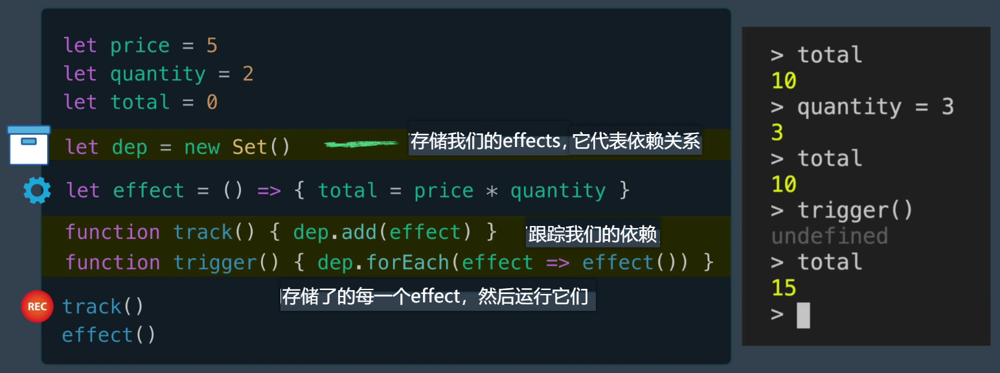

### 单个响应式对象

当变量在对象里, 对象中的每个属性都需要自己的dep(依赖关系), 或者说effect的Set集合

示意图:

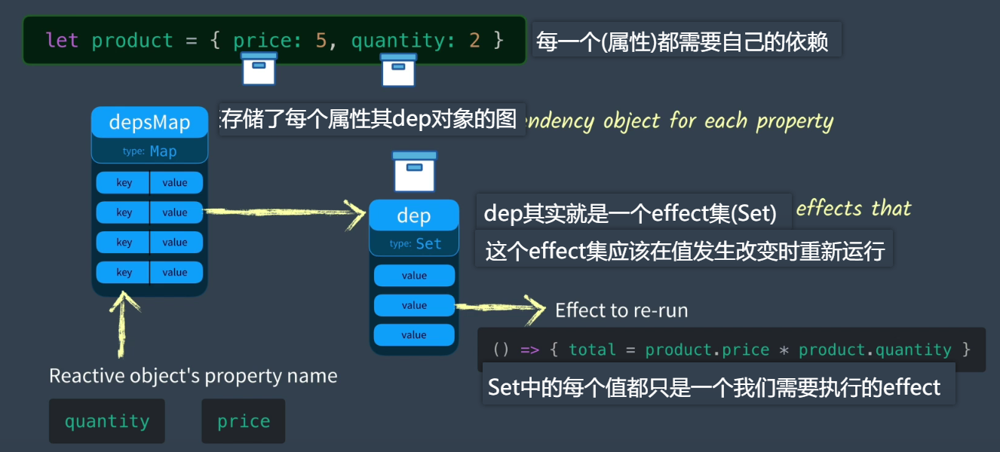

实现代码:

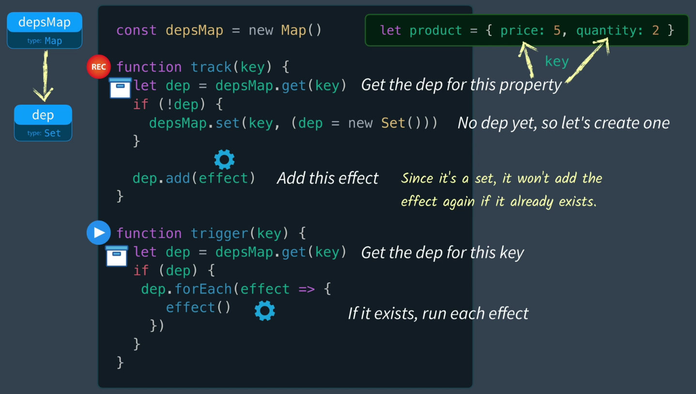

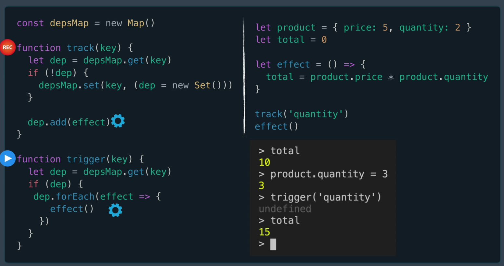

### 多个响应式对象

当我们有多个响应式对象时, 每个都需要跟踪effect

这个时候就需要一个"目标图"去存储我们每个"响应式对象属性"的关联依赖

示意图:

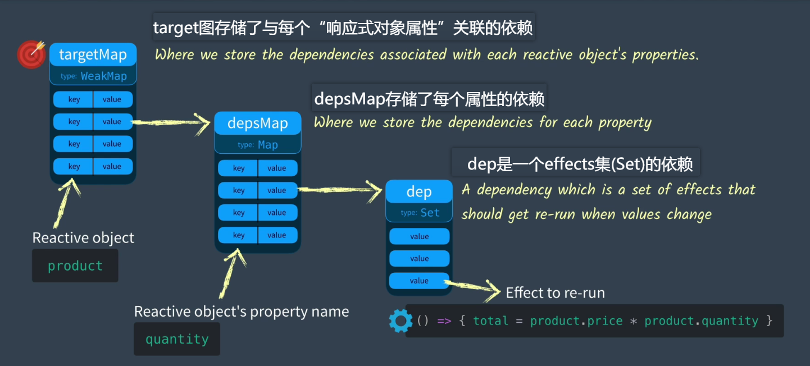

实现代码:

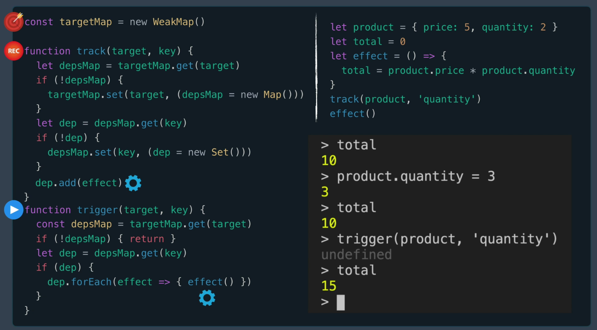

这里的targetMap用到weakMap的原因是如果这个目标对象不再可以从任何代码访问, 那么他在weakMap上的关联就会被垃圾回收.

### 总结

我们已经有存储不同effect的方法, 但是我们还没让effect实现自动重新运行, 这会留到下一章. 

## 响应式触发

基于上一章的内容, 我们仍在手动调用track和trigger来保存和触发effect. 

如果想自动调用track和触发trigger, 则按照如下思路

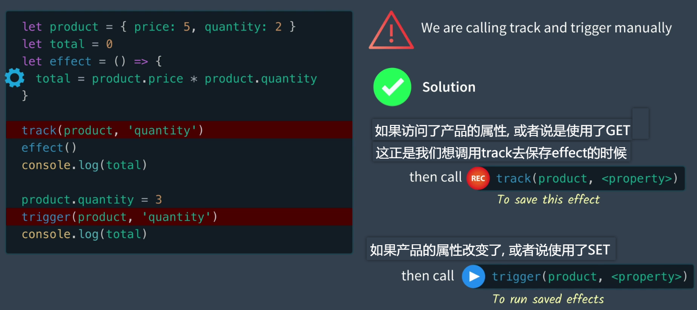

那么问题就变成了如何拦截GET和SET方法

### VUE版本响应式变化

#### VUE2

在VUE2 中, 使用的是ES5的 Object.defineProperty() 去拦截GET和SET. 

由于GET和SET是被添加在各个属性下的, 导致创造了一个响应式对象后, 无法再添加新的响应式属性, 需要调用VUE.set()

#### VUE3

在VUE3 中, 使用的是ES6的 Reflect和Proxy. 这意味着可以在响应式对象中随意添加属性, 他们会自动的变成响应式. 

### Reflect

获取对象属性的三个方法:

```js
let product = {
    price: 5,
    quantity: 2
}

console.log(product.quantity);

console.log(product["quantity"]);

console.log(Reflect.get(product, "quantity"));
```

三种方法都可以得到对象属性, 但是Reflect有一种超能力, 后面再讲解.

### Proxy

示意图:

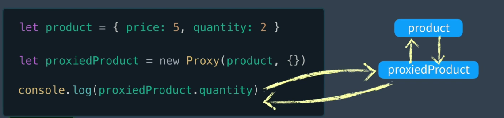

注意Proxy的第二个参数, 叫做handler对象, 我们可以传递一个诱捕器拦截我们想要的操作, 如属性查找, 函数调用等. 如下图:

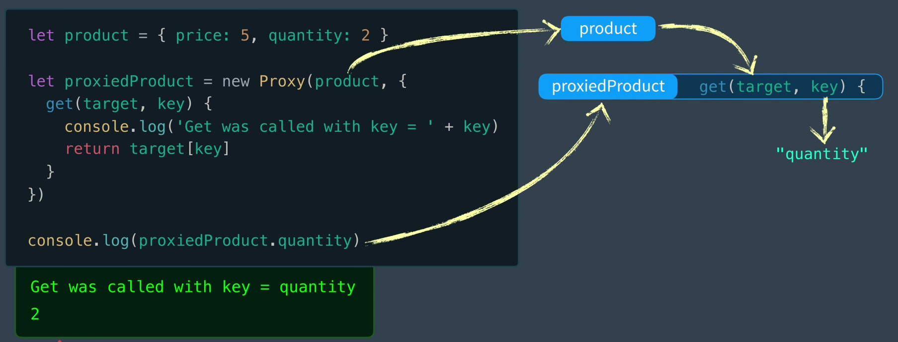

#### 在 Proxy 中使用 Reflect

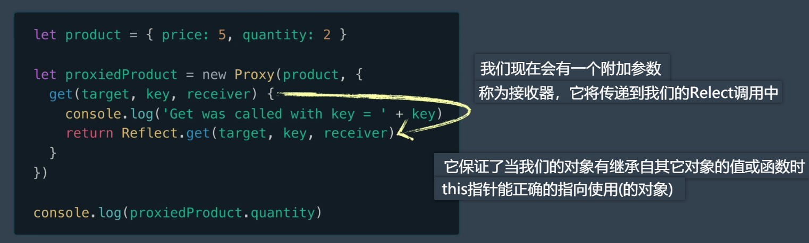

#### 在handler加上set

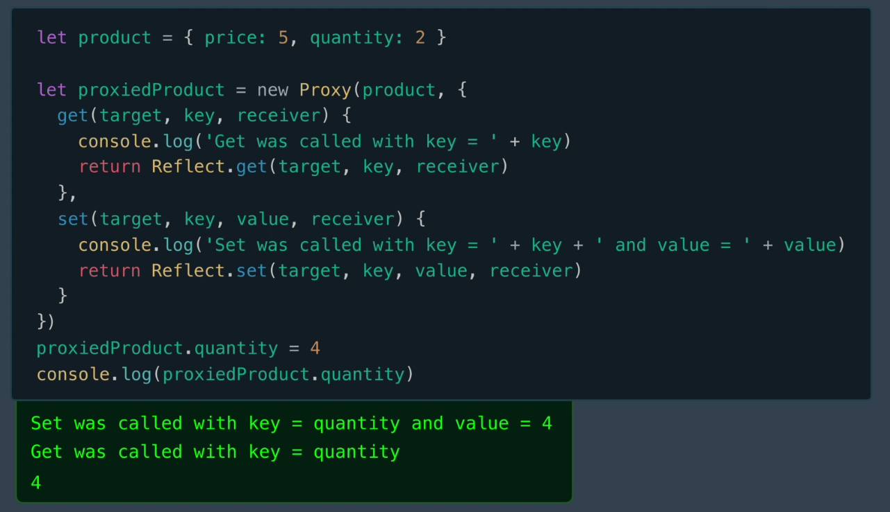

#### 对 proxy 进行封装

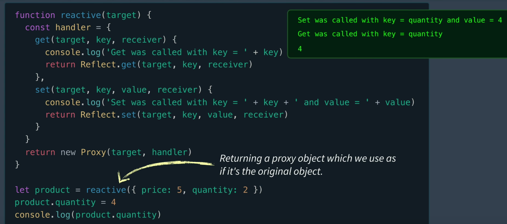

### 完成响应式更新

将track 和 trgger 放入 porxy的 handler函数中

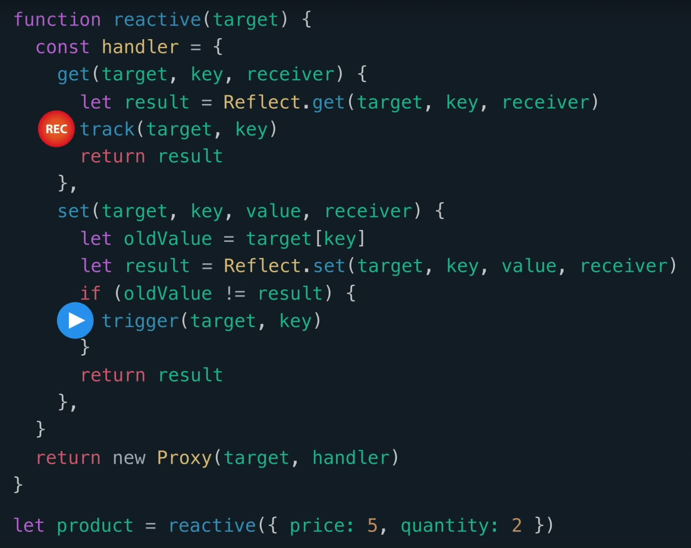

这样我们就完成了响应式, 响应式流程如下:

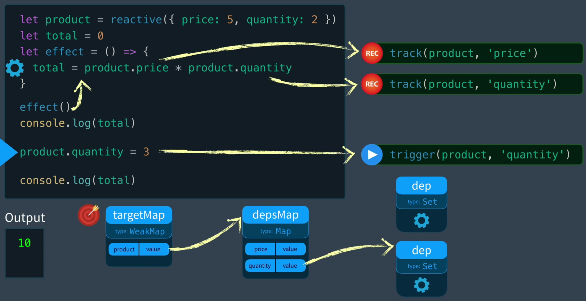

## 优化响应式更新

### avtiveEffect

上一章我们已经实现响应式更新, 但是每次执行响应式对象的GET方法都会触发 track 去存储effect, 这并不是最佳方案, 如图:

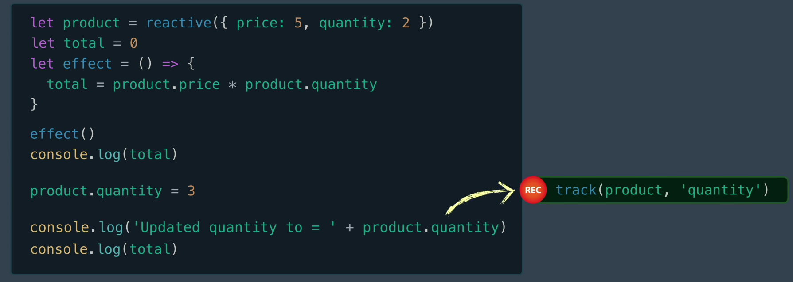

为了解决这个问题, 我们引入一个 avtiveEffect 变量, 表示现在正在运行中的effect.

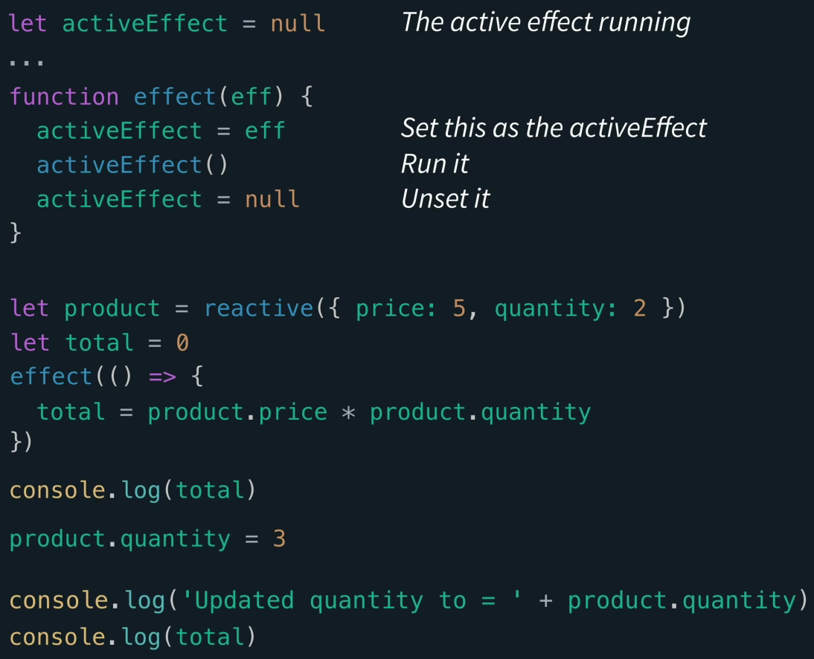

然后在 track 函数中判断当前是否有 avtiveEffect , 有才会对effect进行存储, 这样就不会重复执行存储

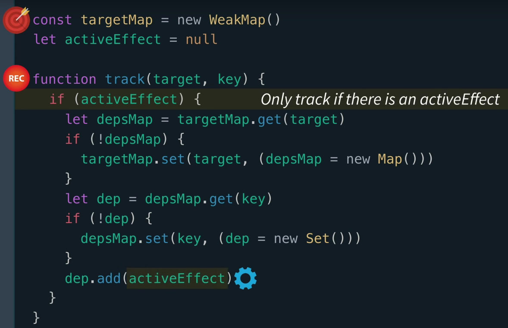

### ref

我们已经解决了 track 函数重复记录 effect 的问题. 那么当 effect 中有非响应式对象的时候, 我们应该怎么处理呢? 

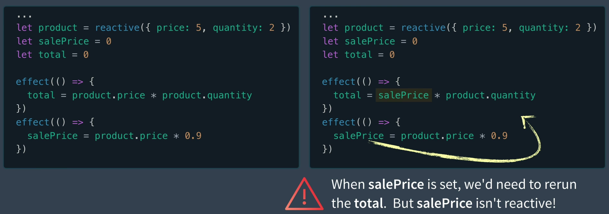

解决方案有两种:

#### 直接生成一个响应式对象

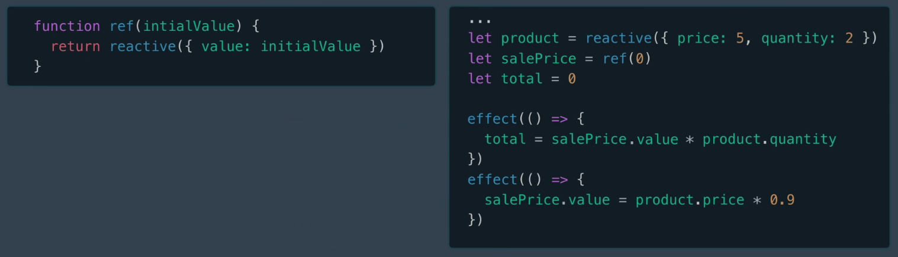

#### 利用对象的get,set

在VUE3 的 composition API 中 ref 的实现方式

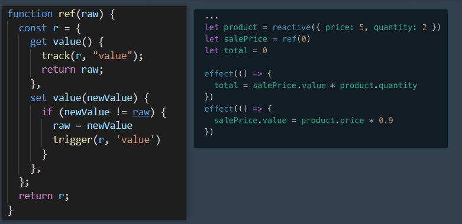

###  计算属性

```js
function computed(getter) {
  let result = ref();
  watchEffect(() => {
    result.value = getter();
  });
  return result;
}

let product = reactive({
  price: 5,
  quantity: 2,
});
let salePrice = computed(() => {
  console.log("computed salePrice");
  return product.price * 0.9;
});
let total = computed(() => {
  console.log("computed total");
  return salePrice.value * product.quantity;
});

console.log("total应该等于9:" + total.value);
console.log("salePrice应该等于4.5:" + salePrice.value);

product.quantity = 3;
console.log("total应该等于13.5:" + total.value);
console.log("salePrice应该等于4.5:" + salePrice.value);
```

## 思考总结

### ref与reactive

ref适用于专注一个值的响应式, 如果适用了reactive就违背了初衷, 所以不能把ref当成一个普通的响应式对象. 并且在VUE3中会有 isRef 这样的函数去检测ref以区分reactive, 最后还需要考虑性能问题, 创建一个响应式对象需要做很多额外工作, 相比ref更加消耗性能. 

### proxy带来的优势

当适用proxy的时候, 所谓的响应式会变为懒加载, 因为在VUE2的响应式中, 必须遍历所有的键, 并当场转换为响应式. 在VUE3中, 当调用reactive的时候, 所做的只是返回了一个代理对象. 

这极大提升了性能, 例如应用程序里有一个庞大的对象列表, 但是对于分页而言, 我们可能只需要渲染前10个, 那么只有这10个对象会进行响应式转换. 