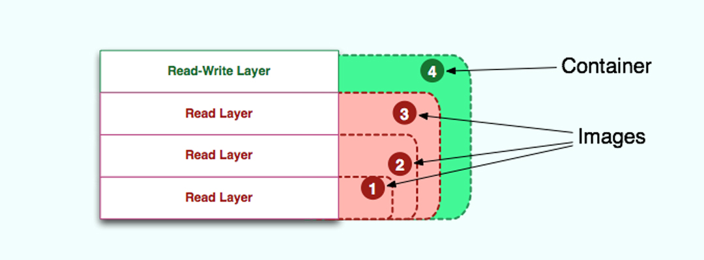

# docker

## 软件基础架构的发展史

* 90年代是传统服务器

    缺点: 高配置的服务器, 大部分时间都无法完全释放性能

* 2000年开始流行虚拟化技术

    优点: 在一个服务器上模拟多台服务器
    缺点: 占用服务器资源, 模拟一个服务器需要占用大量资源

* 2005-2015年云技术Cloud开始流行

    优点:  将硬件、软件、网络等系列资源统一起来，实现数据的计算、储存、处理和共享

* 2015年以后Container(容器)时代

    优点: 有效的将单个操作系统的资源划分到孤立的组中，以便更好的在孤立的组之间平衡有冲突的资源使用需求

## 容器技术概念

容器就像一个打包工具，打包的不仅是你的程序，也包括运行环境。就好比你把你的开发主机和开发程序完全复制了一份，别人拿到后就不需要搭建环境，也不需要根据环境进行调试，直接就可以运行了。

## 镜像与容器的区别

镜像像是一个包含了OS文件系统和应用的对象，类似虚拟机的模板（比如Window10镜像）。如果你是一个开发 者，可以把镜像看成面向对象编程中的只读类(read-only Class)。

容器和镜像几乎一模一样，唯一的区别是镜像是只读的，而容器上面有一个可读写层。所以容器=镜像+读写层。



## 容器

### 创建容器

```
docker container run < image name >
```

如果系统中没有这个镜像，Docker会自动去Docker Hub上拉取对应的镜像到本地，然后执行对应的Shell脚本，脚本会把镜像自动安装到Doker容器里，并最终启动对于的镜像服务。

### 查看容器

查看你所有容器，包含已经停止的容器，可以加一个-a,参数。

```
docker container ls -a
```

* CONTAINER ID : 容器对应的ID，这个是唯一的
* IMAGE : 使用的镜像名称，显示不同
* COMMAND : 执行的相关命令
* CREATED: 创建的时间
* STATUS: 目前镜像的状态，一般会有两种状态Up和Exited.
* PORTS: 协议和端口
* NAMES: 容器的名称，名字是Docker随机生成的

### 停止容器

```
docker container stop <name or ID>
```

### 删除容器

```
docker container rm <name or ID>
```

正在运行的容器，是不可以直接删除, 可以使用强制删除命令进行删除。

```
docker container rm <ID or Image Name > -f
```

### 多容器操作

方法一:

把三个容器用一个命令停掉，直接加上ID或名字。
```
docker container stop  <ID1  ID2  ID3>
```

方法二:

查看现在所有容器的ID
```
docker container ps -aq
``` 

使用组合命令
```
docker container stop $(docker container ps -qa)
```


