# GIS 体系介绍

## 空间数据生产

### 空间数据基础

#### 数据与空间数据

* 数据 
指客观事物的属性、数量、位置及其相互关系等的符号描述。

* 空间数据
是对现实世界中空间对象（事物）的描述，其实质是指以地球表面空间位置为参照，用来描述空间实体的位置、形状、大小及其分布特征等诸多方面信息的数据。

#### 空间数据的特征

1. **空间特征**
指空间地物的位置，形状，大小的几何特征，以及与相邻地物的空间关系。是地理信息系统独有的特征。

2. **属性特征**
指除了时间和空间特征以外的空间现象的其它特征。如级别、数量特征和名称等

3. **时间特征**
数据随时间的变化，变化的周期有短期、中期、长期等。
空间数据总是在某一特定的时间或时间段内采集得到或计算得到的。
考虑时间特征的空间数据也可以称之为时空数据

#### GIS空间数据内容

1. **数字线化数据（DLG）--矢量数据**
是对空间地物通过点线面进行描述的数据。

2. **数字栅格数据（DRG）**
现有纸质地形图经扫描、纠正、图像处理及数据压缩处理后，形成在内容、几何精度和色彩上与地形图保持一致的栅格文件。

3. **影像数据（DOM）**
来源自遥感影像或航空影像，通过正射投影生成的数据

4. **数字高程模型（DEM）**
地形数据，表示地表高程信息

5. **属性数据**
对空间地物属性的描述，通常用于解释空间地物是什么以及详细描述信息

### 空间数据获取方法

#### GIS数据的来源

大多数GIS中的数据是第二手数据

数据类型|第一手数据|第二手数据
-|-|-
非电子数据|平板测量数据 工程测量数据 笔记 航空、遥感相片 人口普查 社会经济调查 各种统计资料|地图 专题地图 统计图表
电子数据|全站仪 GPS数据地球物理 地球化学 遥感数据|已建各种数据库GIS数据

#### 野外数据采集

* 野外测量工具：经纬仪、全站仪、GNSS（全球导航卫星系统）

* 特点：精度高、效率较低

* 适合范围：小范围GIS数据采集或局部数据更新

#### 地图数字化

将非数字化的地图数据转化为数字格式的过程。

#### 摄影测量数据采集

摄影测量在我国基本比例尺测图生产中起了关键作用，我国绝大部分1:1万和1:5万基本比例尺地形图使用的是摄影测量方法。

* 摄影测量：包括航空摄影测量、航天摄影测量和地面摄影测量

* 地面摄影测量：一般采用倾斜摄影或交向摄影

* 航空摄影：一般采用垂直摄影

#### 遥感图像处理数据采集

遥感影像数据是GIS重要的数据源

遥感是借助对电磁波敏感的仪器 ，从远处(不与探测目标相接触)记录目标物对电磁波的辐射、反射、散射等信息，通过分析，揭示出目标物的特征性质及其变化的综合性探测技术。

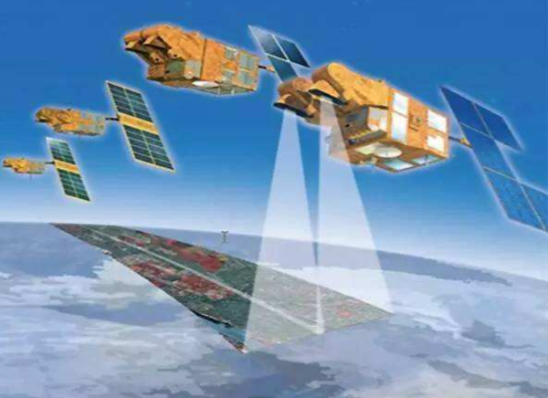

**遥感的优点：**

* 观测范围大
* 瞬间静态图像、动态视频遥感影像
* 大面积重复性观测
* 光谱范围包含可见光、紫外、红外、微波等
* 空间详细程度高——厘米级甚至毫米级

### 空间数据质量

#### GIS的数据质量

指空间数据在表达空间位置、专题属性和时间特征时所能达到的准确性、一致性、完整性以及三者统一性的程度。

### 元数据 

#### 元数据概念与类型

是关于数据的描述，即数据的数据

**元数据的内容**

1. 对数据集的描述
2. 对数据集中各数据项、数据来源、数据所有者、数据生产历史等的说明
3. 对数据质量的描述：数据精度、数据的逻辑一致性、数据完整性、分辨率、源数据比例尺等
4. 对数据处理信息的说明：如数据转换方法描述、数据库的更新、集成方法等说明

#### 空间数据元数据描述

空间数据元数据：是各类空间数据描述的集合，说明地理空间数据的数据。

是对空间数据的位置信息、属性信息和时空信息的详细描述或说明。

#### 空间数据元数据标准

空间元数据涉及到空间特征、属性特征及关系的描述，标准建立比较复杂，但标准是空间数据标准化的前提和保证，只有这样才能有效利用空间数据。

#### 空间数据元数据作用

1. 通过元数据可以检索、访问数据库，利用计算机系统资源，对数据进行加工和二次开发、
2. 有助于有效地管理和维护空间数据，建立数据文档
3. 提供有关数据生产单位数据存储、分类、数据质量等信息，便于用户查询、检索地理空间数据
4. 提供通过网络对数据进行查询、检索的方法或途径

## 空间数据可视化表达

### 符号化的概念

符号化技术就是将空间数据通过分类，简化，夸张等方法获得的记号，根据其基本特征，相对重要性和相关位置制作成各种图形。

### 地图符号

地图符号是表示地图内容的基本手段，它由形状不同，大小不一，颜色有别的图形和文字组成。

#### 地图符号的功效

1. 有选择的表示重要地物，如体育场

2. 用平面符号表示地面的起伏，如等高线

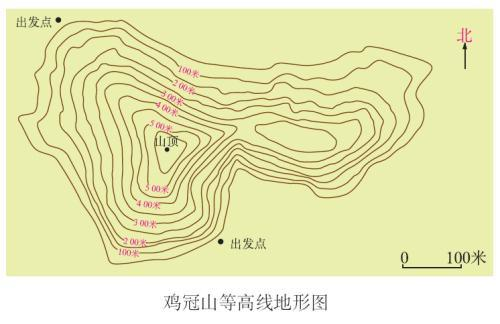

3. 表示不能直接观察的地理事物特征，如降水情况

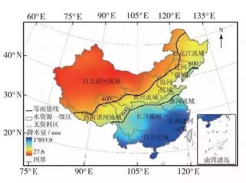

4. 表示表面没有外形的自然和社会现象，如人口分布

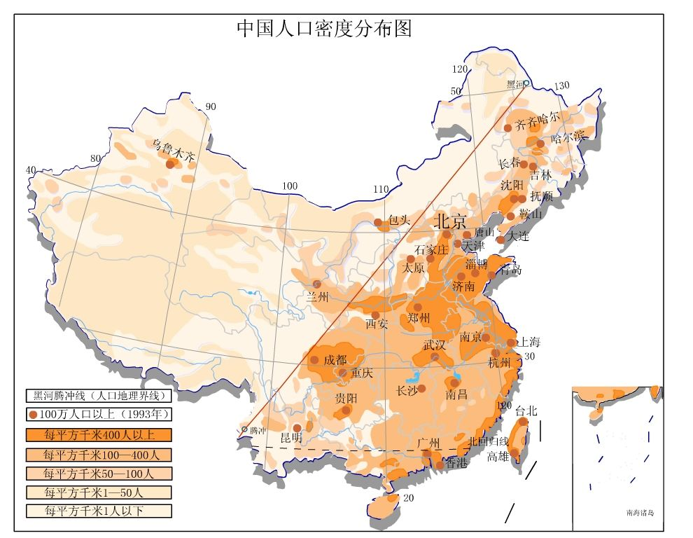

#### 地图符号的特点

* 符号是空间信息传递的手段。
如我们可以通过符号描述，知道中国的人口分布的特征和规律。

* 符号模型，不受比例尺的变化的限制，仍能反映区域的基本面貌。
如在较大的比例尺地图上，可以用轮廓线描述城市范围，在较小的比例尺上用点符号表达城市的空间位置

* 符号提供了极大的表现能力。
如地貌可以用等高线符号表达，也可以用晕渲法来表达。

* 符号能能给难以表达的现象建立构想模型。
如春运人口迁移图。

#### 地图符号设计要求

* 符号应与实际事物的具体特征相联系

* 符号之间应有明显的差异

* 同类事物的符号应该类似

* 简单，美观，便于记忆

### GIS可视化的表示方法

#### GIS可视化的概念

* 可视化
是利用了计算机图形图像技术，将复杂的科学现象，自然景观以及一些抽象概念图形化的过程。

* GIS可视化
以计算机科学，地图学，认知科学与地理信息系统为基础，以屏幕地图形式，直观、形象、多维、动态的显示空间信息的方法与技术。

#### GIS可视化的表示方法分类

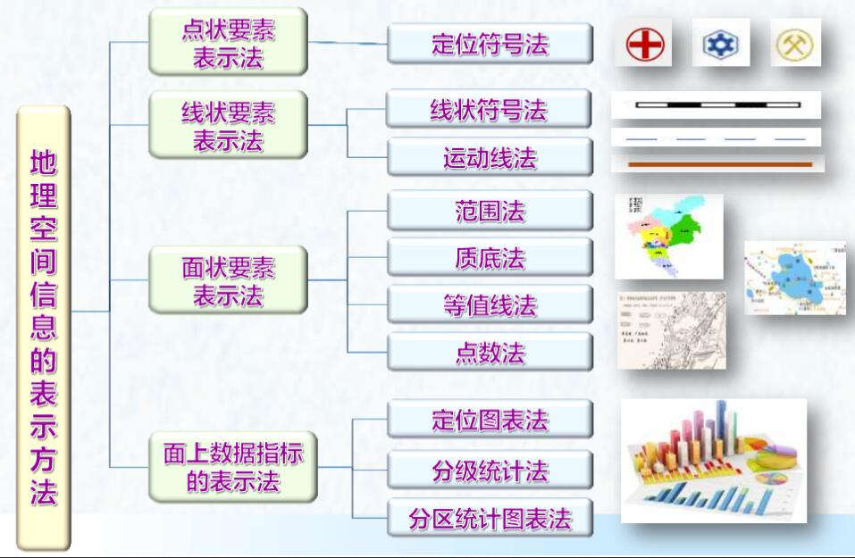

##### 定位符号法

表示点状分布的物体，使用比率符号来表达其数量关系。

##### 线状符号法

用于表示呈线状分布的对象（现象），如河流，交通线等。

##### 运动线法

用箭头符号和不同宽度，颜色的条带表示现象移动的方向、路径和数量、质量特征。

##### 范围法

表示呈间断成片分布的面状对象，用真实的或隐含的轮廓线表示其
分布范围，其内再用颜色、网纹、符号乃至注记等手段区分其质量特征。

##### 质底法

表示连续分布、满布于整个区域的面状现象，如地质现象、土地
利用状况、土壤类型等。

##### 等值线法

用等值线的形式表示布满全区域的面状现象。最适用于表达:地形起
伏、气温、降水、地表径流等满布整个制图区域的均匀渐变的自然现象。

##### 点数法

对制图区域中呈分散的、复杂分布的现象,如人口、动物分布等
当无法勾绘其分布范围时，可以用一定大小和形状的点群来反映。

##### 定位图表法

用图表的形式反映定位于制图区域的某些点周期性现象的数量特征
和变化的方法。
如监测站测量风向风速图

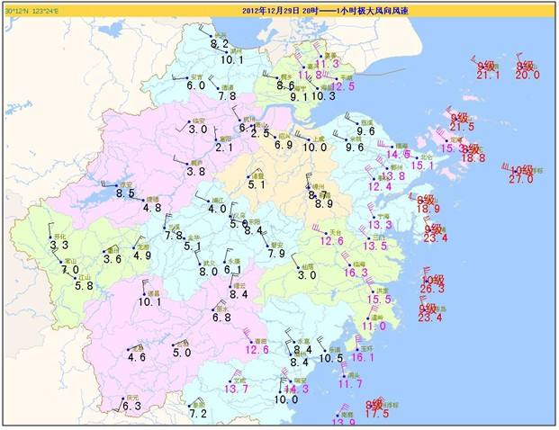

##### 分级统计图法

根据各制图单元(如:行政区划)的统计数据进行分级，用不同色
阶或用晕线网纹反映各分区现象的集中程度或发展水平的方法。

* 等差分级法：以相同的级差划分等级的方法。

* 等比分级法：以整倍数的级差划分等级的方法。

在实际应用中，应根据数据特征进行等级间距调整。

##### 分区统计图表发

在各分区单元内,把统计数据描绘成不同形式的统计图表,置于
相应的区划单元内,以反映各区划单元内现象的总量、构成和变化。

### GIS软件中的地图渲染功能

**选择渲染的字段和方法**

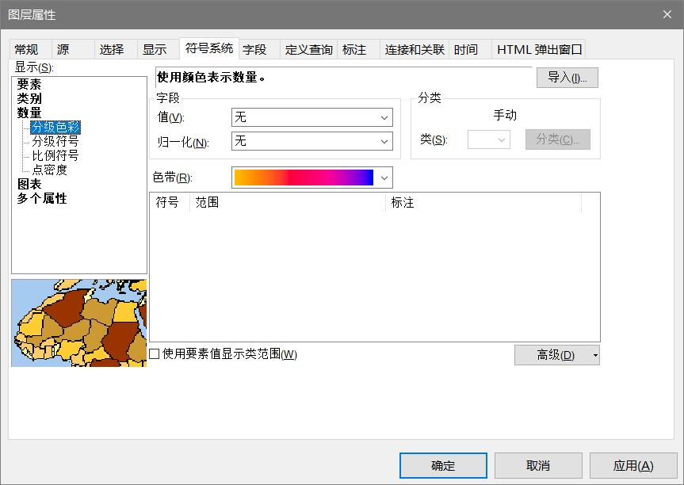

**根据不同的渲染方式设置参数**

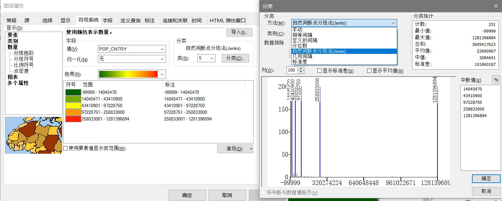

**设置符号样式**

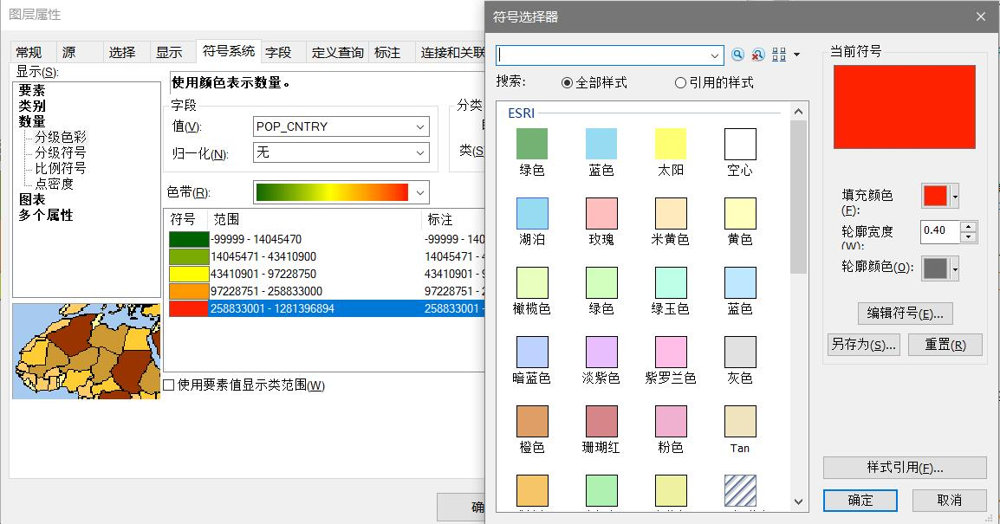

**显示渲染效果**

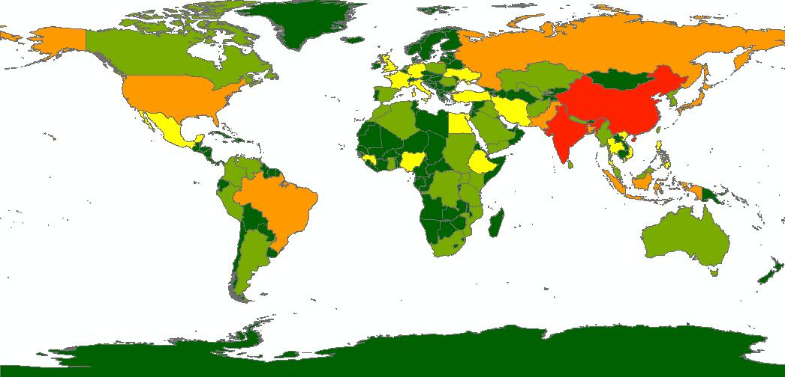

## 数据管理与存储

### GIS数据常见文件格式

数据类型|常见文件格式
-|-
DEM地形数据|tif,dem
DOM影像数据|tif,img
矢量数据|shp,kml,geojson,def/dwg
三维模型|倾斜摄影osgd,人工建模obj,BIM数据dvt/dgn,点云las/ply

#### TIF

TIF文件为栅格图像文件，后缀为tif或tiff, 是ogc规范的一种，全称GeoTiff. 通常不能在资源管理器中查看tif栅格影像数据的坐标系信息，需要用GIS软件查看，因为它的坐标系信息写在数据文件内部。

tif可以有8位，24位等深度，一般真彩色是24位，而地形数据只有一个高度值，采用8位。目前很多卫星影像数据、地形数据的存储式都是tif.

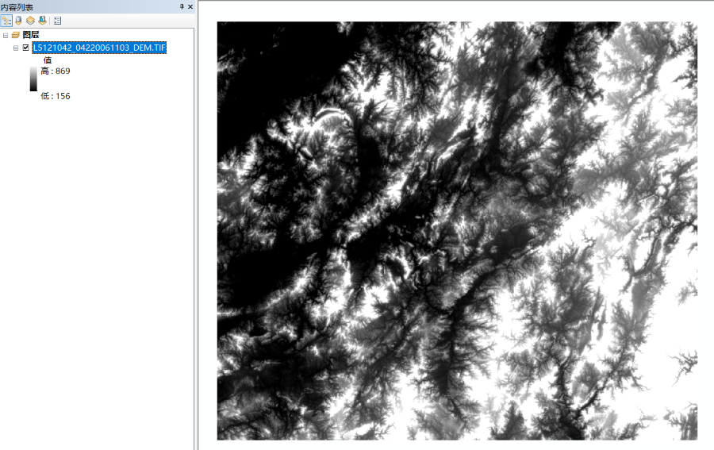

#### SHP

Shapefile文件是ESRI公司ArcGIS平台的常用格式文件，是工业标准的矢量数据文件。
Shapefile将空间特征表中的非拓扑几何对象和属性信息存储在数据集中，特征表中的几何对象存为以坐标点集表示的图形文件--SHP文件，Shapefile文件并不含拓扑(Topological) 数据结构。

shp的特点：

1. 1个Shape文件包括三个文件:主文件(.shp) ,索引文件(.shx), dBASE表(.dbf)

2. 一个shp文件只能存储点、线、面中的一种类型，不存
在混合存在的状态

3. shp可以设置很多字段属性
 
#### KML/KMZ

KML(Keyhole Markup Language,Keyhole标记语言)最初是由Google旗下的Keyhole公司开发和维护的一种基于XML的标记语言，利用XML语法格式描述地理空间数据(如点、线、面、多边形和模型等)，适合网络环境下的地理信息协作与共享。
2008 年4月,KML的最新版本2.2被OGC宣布为开放地理信息编码标准并改由OGC维护和发展。

KMZ文件是压缩过的KML文件。由于KMZ是压缩包，因此，它不仅
能包含KML文本，也能包含与之关联的如图片、模型等其他文件。

#### DWG/DXF

dwg文件:是Autodesk公司AutoCAD平台的图形文件格式，是二维或三维图形档案。其与dxf文件是可以互相转化的。

dxf文件:是AutoCAD推出与其它软件平台之间进行数据交换的一种开放的矢量数据格式

由于AutoCAD是最流行的CAD系统，DXF也被广泛使用。绝大多数CAD系统都能读入或输出DXF文件。

#### GeoJSON

GeoJSON是适合于Web下对各种地理数据结构进行编码的格式，基于Javascript对象表示法的地理空间信息数据交换格式。与普通json文件格式区别在于 对其属性及组成由一定规范。

GeoJSON将所有的地理要素分为Point、MultiPoint. LineString、MultiLineString、Polygon、MultiPolygon、GeometryCollection 
首先是将这些要素封装到单个的geometry里，然后作为一个个的Feature 要素放到一个要素集合里构成。

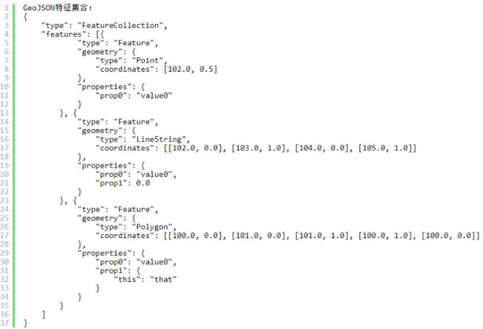

### GIS软件的数据组织结构（SuperMap）

以SuperMap为例。数据组织结构主要包括工作空间、数据源、数据集、地图、场景、布局等。

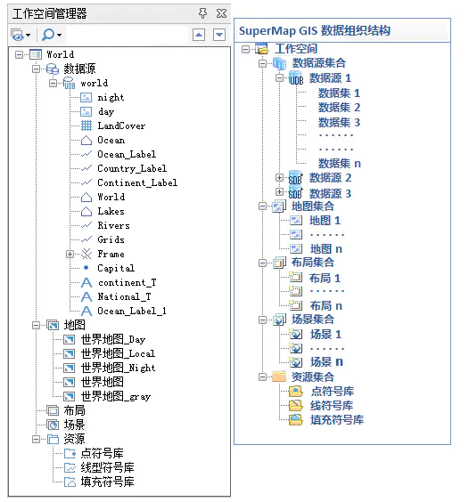

* 数据源集合：组织和管理着工作空间中的所有数据源，数据源是由各种类型的数据集（如点、线、面、栅格/影像等类型数据）组成的数据集集合。一个数据源可包含一个或多个不同类型的数据集；也可以同时存储矢量数据集和栅格数据集。

* 地图集合：用来管理存储在工作空间中的地图数据，用户在工作空间中显示和制作的地图都可以保存在工作空间中，便于下次打开工作空间时浏览地图。

* 布局集合：用来管理工作空间的布局数据，布局主要用于对地图进行排版打印。

* 场景集合：用来管理存储在工作空间中的场景数据，用户在工作空间中显示和制作的场景都可以保存在工作空间中。

* 资源集合：即符号库集合，用来管理工作空间中的地图和场景中所使用的符号库资源，包括点符号库、线符号库和填充符号库。

#### 工作空间

即用户的工作环境，用户在进行数据操作时，都需要先创建一个工作空间，才能进一步操作 GIS数据。工作空间会保存用户在该工作环境中的操作结果，包括用户在该工作空间中打开的数据源、保存的地图、布局和三维场景等，当用户打开工作空间时可以继续上一次的工作成果来工作。

工作空间中的地图、布局、三维场景和资源都是依附于工作空间存在的，即这些内容都保存在工作空间中，删除工作空间时，其中的地图、布局、三维场景和符号库资源也相应的随之删除；而数据源是独立存储的，与工作空间只是关联关系，并没有保存在工作空间中，当删除工作空间时，只是删除了工作空间与数据源的关联关系，并不能删除数据源。

#### 数据源集合

工作空间中的数据源集合主要管理工作空间中打开的所有数据源，通过工作空间中的数据源集合可以实现数据源的创建、打开、关闭等操作功能。

**数据源**

数据源用于存储空间数据，独立于工作空间，因此存储在数据源中的所有空间数据也独立于工作空间存储。

数据源可以分为三大类：

* 文件型数据源
即 UDB 类型数据源，存储于扩展名为 `.udb/.udd` 的文件。新建 UDB 数据源时，会同时产生两个文件。
GIS 空间数据除了包含空间几何对象外，还包含对象的属性信息，在文件型数据源中，`.udb` 文件主要存储空间数据的空间几何信息，`.udd`文件存储属性信息。一个数据源文件只对应一个数据源。

* 数据库型数据源
存储于数据库中的数据源，其空间数据的空间几何信息和属性信息都存储在数据库中。

* Web 数据源，存储于网络上的某个服务器上，在使用该类型的数据源时，通过 URL 地址来获取相应的数据源。

一个工作空间中可以包含多个不同类型的数据源，通常一个数据源中组织一类用途的空间数据，从而便于数据的归类和使用。

**数据集**

数据源中的空间数据是对现实世界的抽象，即将现实世界中的地理事物抽象为计算机世界中可以处理的各种图形对象，现实世界中的点状事物就抽象为点几何对象，线状事物就抽象为线几何对象，面状事物就抽象为面几何对象，为了便于数据的统一管理，引入数据集的概念，即将同类事物存储在一类数据集中。

例如，点数据集就只能存储点几何对象、线数据集就只能存储线几何对象、面数据集就只能存储面几何对象。因此，一个数据源中的空间数据被组织为各种类型数据集，即数据源实际是一个数据集集合，包含了各种类型的多个数据集。

SuperMap GIS的数据集类型包括：
点数据集（Point）、线数据集（Line）、面数据集（Region）、纯属性数据集（Tabular）、网络数据集（Network）、复合数据集（CAD）、文本数据集（Text）、路由数据集（LineM）、影像数据集（Image）、栅格数据集（Grid）、模型数据集（Model）。

数据集是 SuperMap GIS空间数据的基本组织单位之一，是数据组织的最小单位，数据集可以作为图层在地图窗口中实现可视化显示，即可以将数据集中存储的几何对象以图形的方式呈现在地图窗口中，对于栅格和影像数据集，则根据其存储的像元值以图像的方式显示在地图窗口中。并且数据集的可视化编辑也是通过地图窗口来实现的，如编辑数据集中几何对象的空间位置和形状或者通过矢量化获取新的数据集等。

一个数据源中可以包含多个各种类型的数据集，可以通过工作空间中的数据源来管理数据源中的数据集，包括创建数据集或者导入其他来源的数据作为数据集以及其他操作等。

#### 地图集合

地图集合用来管理存储在工作空间中的地图数据，用户在工作空间中显示和制作的地图都可以保存在工作空间中，便于下次打开工作空间时浏览地图。

应用程序可以同时打开多个地图窗口，每一个地图窗口中当前显示的内容为一幅地图，工作空间中的地图都包含在地图集合中，由于地图是保存在工作空间中的，因此，只有保存了工作空间，其中的地图才能被保存下来。

#### 地图

将数据集添加到地图窗口中，被赋予了显示属性，如：显示风格、专题地图等，就成为图层。
当一个或者多个图层按照某种顺序叠放在一块，显示在一个地图窗口中，就可以成为一个地图。
一般而言，一个图层对应着一个数据集；同一个数据集可以被多次添加到不同的地图窗口中，而且可以赋予不同的显示风格。
地图窗口中图层的风格可以随时根据需要进行修改，通过修改图层风格或制作专题地图两种方法即可实现。
在地图窗口中还可以对图层中的空间几何对象进行可视化编辑，如改变对象的位置、大小和形状等，这些操作都会直接反映到图层对应的数据集中，也就是说，对图层的编辑实质是对图层关联的数据集中数据的编辑。

#### 布局集合

工作空间中的布局集合管理工作空间中保存的所有布局，通过布局集合可以实现布局的创建、保存、输出、打印以及删除等操作。

#### 布局

布局主要用于对地图进行排版打印，是地图、图例、地图比例尺、指北针、文本等各种不同元素的混合排版与布置。

#### 场景集合

工作空间中的场景集合管理工作空间中保存的所有场景。

#### 场景

场景是以抽象的球模式来模拟现实的地球，并将现实世界抽象出来的地理事物在球体上进行展示，从而更直观形象地反映现实地理事物的实际空间位置和相互关系。
用户可以将二维或者三维数据直接加载到球上进行浏览，制作专题图等。

#### 资源集合

工作空间中的资源集合主要管理工作空间中的地图所使用的符号库资源，包括符号库、线型库和填充库。

#### 符号库

使用点符号库设置图层中点的风格，包括符号类型、大小、颜色等；使用线符号库设置图层中线的风格，包括线型、线宽、线的颜色等；使用填充符号库，设置图层中面对象的填充风格。

### ArcGIS （写的不好，想删掉）

ArcGIS 的数据组织结构，主要包括gdb、mdb

ArcGIS能够支持的数据格式：

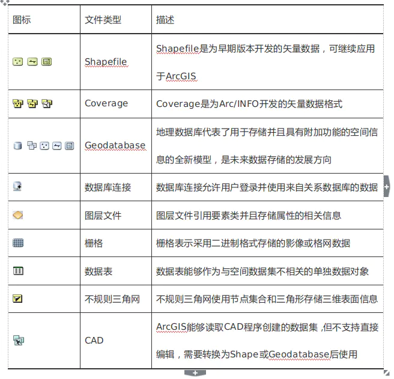

#### 地图文件（MXD）

即用户的工作环境，用户在进行数据操作时，都需要先创建一个地图文件，才能进一步操作 GIS数据。地图文件会保存用户操作结果，包括用户在打开的数据源、符号化方案等。当用户打开地图文件时可以继续上一次的工作成果来工作。

#### Geodatabase地理数据库

Geodatabase是在新的一体化数据存储技术的基础上发展起来的新数据模型。实现Geodatabase数据模型之前所有空间数据模型（包括shape和Coverage）都无法完成的数据统一管理。即在一个公共模型框架下,对GIS通常所处理和表达的地理空间特征如矢量、栅格、TIN、网络和地址进行统一描述。
同时，Geodatabase是面向对象的地理数据模型，其地理空间特征的表达较之以往的模型更接近我们对现实事物对象的认识和表达。

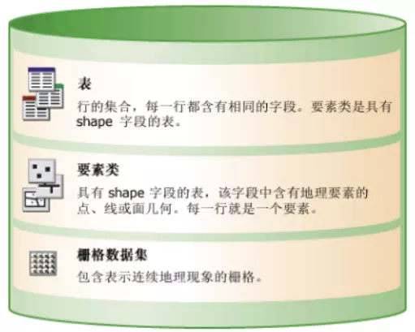

##### 表

表格信息是地理要素的基础，可用于显示、查询和分析数据。简言之，表是由行和列组成，且所有行都具有相同的列。在 ArcGIS 中，行和列分别称为记录和字段。每个字段可存储一个特定的数据类型，如数字、日期或文本段。

##### 要素数据集
要素数据集是共用一个通用坐标系的相关要素类的集合。要素数据集用于按空间或主题整合相关要素类。它们的主要用途是，将相关要素类编排成一个公用数据集，用以构建拓扑、网络数据集、地形数据集或几何网络。

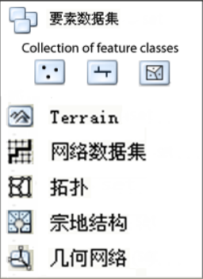

**要素类**

数据源中的空间数据是对现实世界的抽象，即将现实世界中的地理事物抽象为计算机世界中可以处理的各种图形对象，现实世界中的点状事物就抽象为点几何对象，线状事物就抽象为线几何对象，面状事物就抽象为面几何对象，为了便于数据的统一管理，将同类事物存储在一类要素类中。
例如，点要素类就只能存储点几何对象、线要素类就只能存储线几何对象、面要素类就只能存储面几何对象。

**Terrain**
Terrain 数据集是一种多分辨率的基于 TIN 的表面数据结构，它是基于作为要素存储在地理数据库中的测量值构建而成的。通常，terrain 数据集利用激光雷达、声纳和摄影测量源进行构建。Terrain 存储在地理数据库的要素数据集中，其中包含用于构建 terrain 的要素。

**网络数据集**

网络数据集非常适合于构建交通网络。它们由包含了简单要素 (线和点) 和转弯要素的源要素创建而成，而且存储了源要素的连通性。使用 ArcGIS Network Analyst 扩展模块执行分析时，该分析始终作用于网络数据集。

**拓扑**

拓扑关系可以为指定的单个或多个要素类执行拓扑规则。例如地块是不能出现交叠的、一个地块不能跨越两个行政区划，建筑物必须在地块之内等，都是一些拓扑规则，这些规则建立后可以作用到这些要素类上，当对这些要素类进行数据编辑的时候，ArcGIS对自动进行拓扑检查。

**关系类**

是一种表（要素类）和另一个表（要素类）之间的联系机制。关系类是有一个表（要素类）指向另一个要素类。当第一个要素类中的数据发生变化后，另一个要素类的数据要会发生变化。例如我们可以把地块和建筑物关联起来，当地块移动的时候，地块内的建筑物可以随着地块自动移动。

##### 栅格目录

**栅格数据集**

栅格数据集通过将世界分割成在格网上布局的离散方形或矩形像元来表示地理要素。每个像元都具有一个值，用于表示该位置的某个特征，例如温度、高程或光谱值。

**镶嵌数据集**
是一组以目录形式存储并以单个镶嵌影像或单个影像（栅格）的方式显示或访问的栅格数据集（影像）。这些集合的总文件大小和数据集数量都会非常大。镶嵌数据集中的栅格数据集可以采用本机格式保留在磁盘上，也可以存在于地理数据库中。可通过栅格记录以及属性表中的属性来管理元数据。通过将元数据存储为属性，可以更方便地管理诸如传感器方向数据等参数，同时也可以提高对选择内容的查询速度。

## 地图服务器

### GIS服务

GIS服务是将数据通过Web的方式通过接口暴露封装的GIS功能，提供给客户端应用调用。开发人员通常会接触到服务这个层面的相关使用。

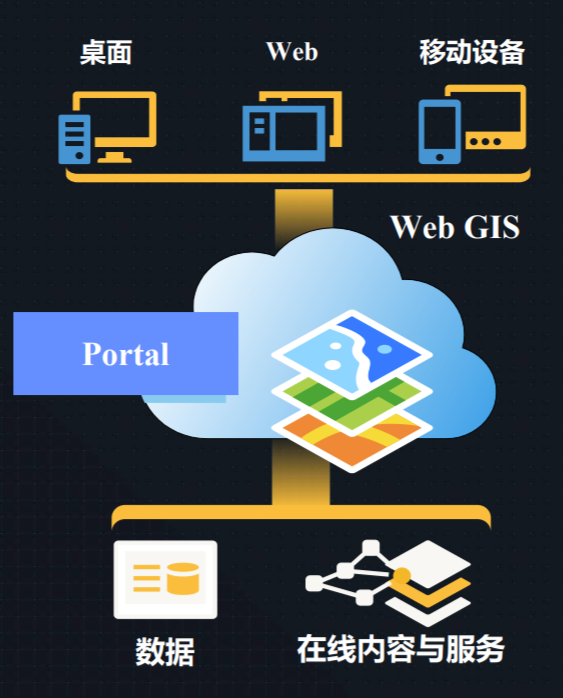

### ArcGIS Server服务

常用的服务有MapServer（动态地图服务/切片地图服务），FeatureServer（要素服务）

#### 动态地图服务

地图服务器根据请求参数，实时生成地图数据图片

常用的数据有地图范围，显示图层，图片大小。如图：

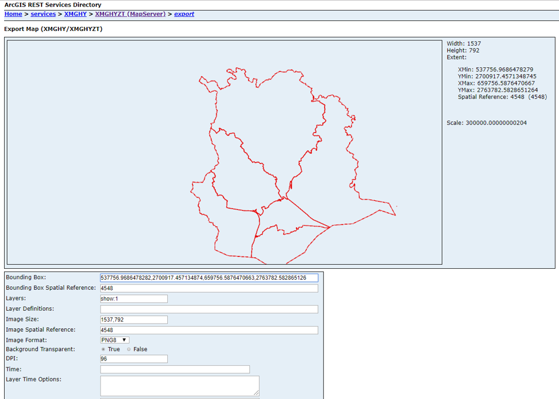

#### 切片地图服务

现在越来越多的地图服务用到瓦片技术，基本我们平常所接触的地图的底图都是瓦片地图。瓦片地图金字塔模型是一种多分辨率层次模型，从瓦片金字塔的底层到顶层，分辨率越来越低，但表示的地理范围不变。

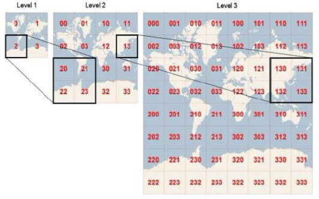

##### 切片服务的特点

1. 具有唯一的瓦片等级和瓦片行列编号
2. 瓦片等级越高，组成地图的瓦片数越多，可以看到的信息越详细
3. 某一瓦片等级地图的瓦片是由低一级的各瓦片切割成4个瓦片组成，形成了瓦片金字塔

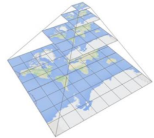

##### 切片服务的相比动态地图服务

1. 由于切片地图服务中的图片不需要服务器实时生成，本身存在服务器的硬盘上，所以大大提高了服务器的性能。
2. 切片地图服务由于图片事先存在，所以该服务实现的功能有限，例如无法实现隐藏服务中的某个图层。

##### 切片存储

1. 松散型（未加密）

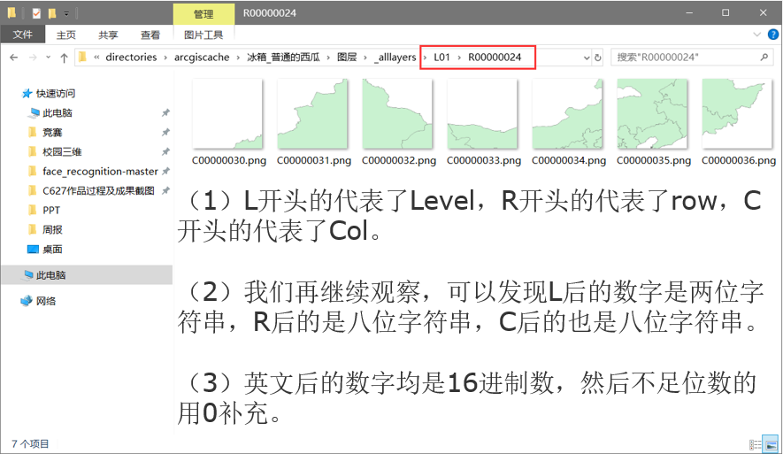

2. 紧凑型（加密）切片服务的行列号

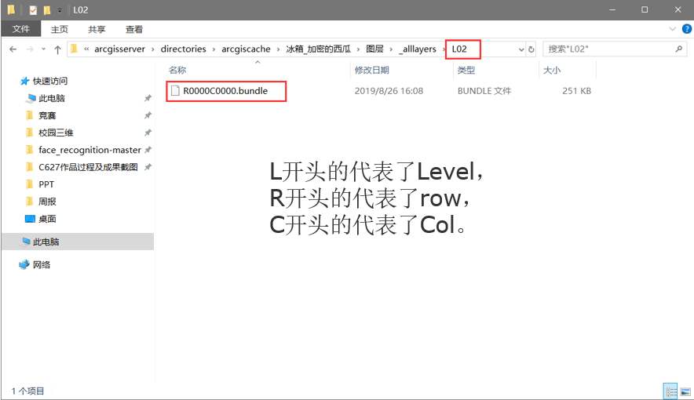

#### 要素服务

用于发布空间数据库中的要素图层，并支持对图层的要素进行增删查改等操作。

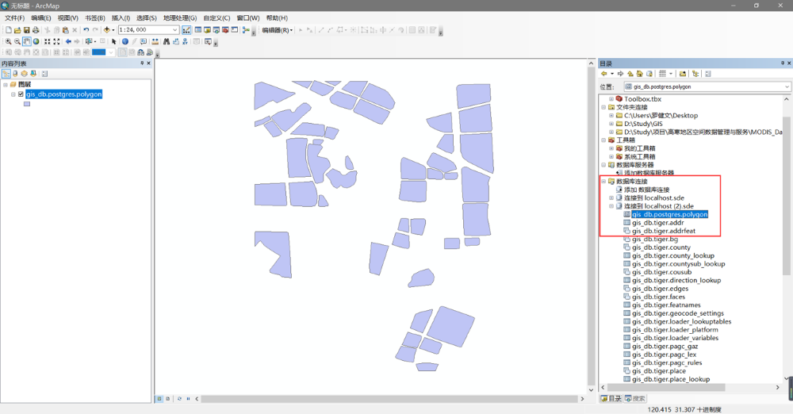
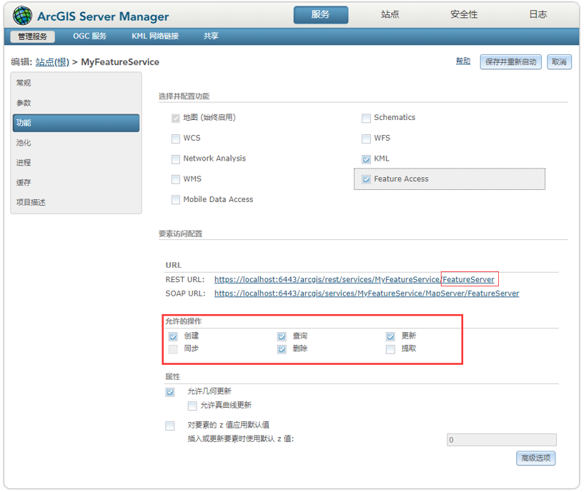

### GeoServer

通常我们使用GeoServer来发布OGC标准服务，GeoServer（地理信息系统服务器）是OpenGIS Web服务器规范的J2EE实现，利用GeoServer可以方便的发布地图数据。

常见的服务类型有:WMS,WMTS,WFS,WCS

#### Web Map Service (WMS)
将空间信息以地图形式表现的一种方法。这个规范定义了三个操作：

GetCapabitities、GetMap、GetFeatureInfo。GetCapabitities用于返回服务级元数据；

GetMap 用作返回一个地图影像，这个地图影像的地理参考坐标是已经定义好的；

GetFeatureInfo 是一个可选的参数，它的主要作用是返回一些特殊要素，这些特殊要素是可以在地图上表示出来的。

#### Web Map Tile Service (WMTS)
WMTS 是 OGC 提出的缓存技术标准。它在服务器端就把地图切割为一定不同级别大小的瓦片。
这大大降低了服务器端的载荷，使得其压力减轻，这样用户在使用的时候就具有更加的体验效果。

WMTS 因为使用了瓦片矩阵来切割地图，一副地图被切割成了多个瓦片，每个瓦片具有唯一的标识符，这些瓦片具有不同的分辨率，当用户缩放到一定级别后，显示对应级别瓦片数据，一定程度上也降低了客户端的压力。

WMTS 接口支持的三类资源：

1. 服务元数据（ServiceMetadata）资源：介绍对应服务器完成的功能及含有的特定信息。

2. 图块资源代表地图集合中一个图层中表达出的一小块地图信息。

3. 要素信息（FeatureInfo）资源返回了地图中对应图块中特定像素位置上的地物要素的信息。

#### Web Feature Service（WFS）

该服务返回图层级的地图影像。

这个规范定义了五个操作：GetCapabilites、DescribeFeatureType、GetFeature、Transaction、LockFeature 。 

* GetCapabilites 返 回 Web 要 素 服 务 性 能 描 述 文 档 ；

* DescribeFeatureType 用于返回一个 XML 文档，这个文档用于介绍能够提供服务的相关要素的结构；

* GetFeature 返回一个服务，这个服务是地址请求提供的一个要素实例；

* Transaction 为事务请求提供服务；

* LockFeature 是对要素类型实例进行锁定的操作，用于多个事务对同一要素操作时锁定要素实例。

#### Web Coverage Service（WCS）

该服务规范的主要作用是，将含有空间位置的影像数据，在网络上发布共享。

该服务由三种操作组成：GetCapabilities，GetCoverage 和 DescribeCoverageType。

* GetCapabilities 返回描述服务和数据集的XML 文档，它的主要作用是确定查询类型，数据类型以及获取的数据是否具有可操作性后执行；

* GetCoverage 操作是在 GetCapabilities 操作后面执行；

* DescribeCoverageType 根据客户端的操作要求，然后由对应的服务器返回任意一个地图层的完全描述信息。

### 静态资源数据服务

瓦片底图，terrain地形，3dtiles三维模型等一些GIS静态资源数据，除了用GIS服务器来发布以外，也可以直接使用HTTP容器（如IIS,TOMCAT,Nginx,Node等）来发布。

这种方法简单方便，并且服务效率高

### 互联网在线地图服务

近些年，地图应用爆发性增长。经常用到地图API，如谷歌地图，高德地图，Bing地图等等。这些地图服务使公众获取了大量的地理数据，也推动了GIS行业发展。

#### 特点

1. 数据实时性高
2. 数据精度高
3. 服务类型全面
4. 多种风格的产品

#### 天地图

天地图是国家测绘地理信息局建设的“国家地理信息公共服务平台”。作为中国区域内官方的地理信息服务网站。目前为国内唯一标准坐标系、数据权威可信的公共服务平台，主要的服务标准都是OGC标准发布到。

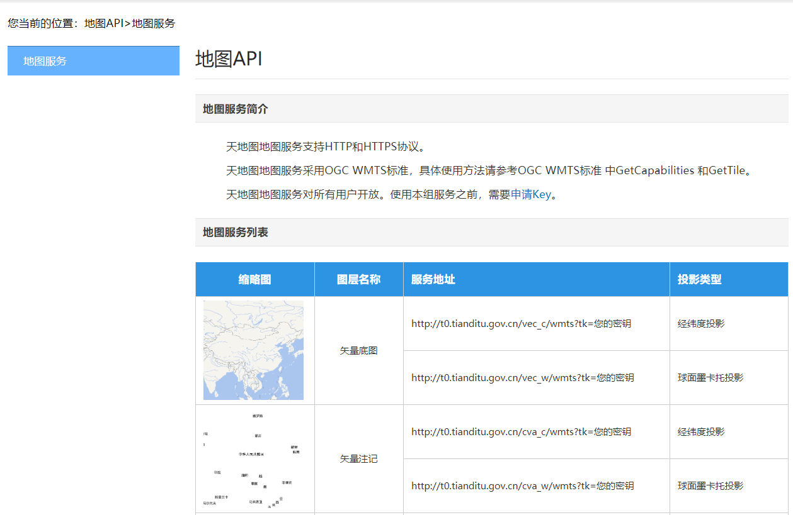

## 客户端呈现

我们获取到数据，并进行数据的处理与发布。就到了客户端使用GIS数据的阶段。

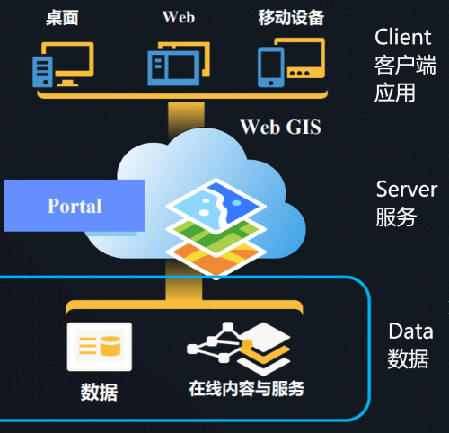

### ArcGIS

#### web端

打开ArcGIS Server 的地图服务地址，可以通过ArcGIS API for JS 或 ArcGIS OnLine 查看地图服务。

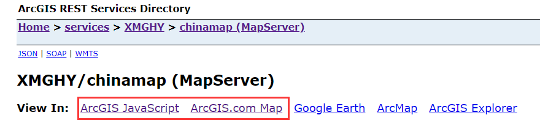

##### ArcGIS API for JS的方式

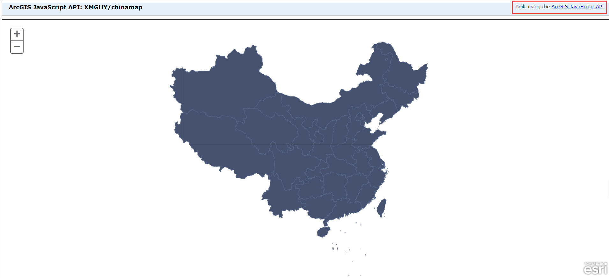

##### ArcGIS OnLine的方式

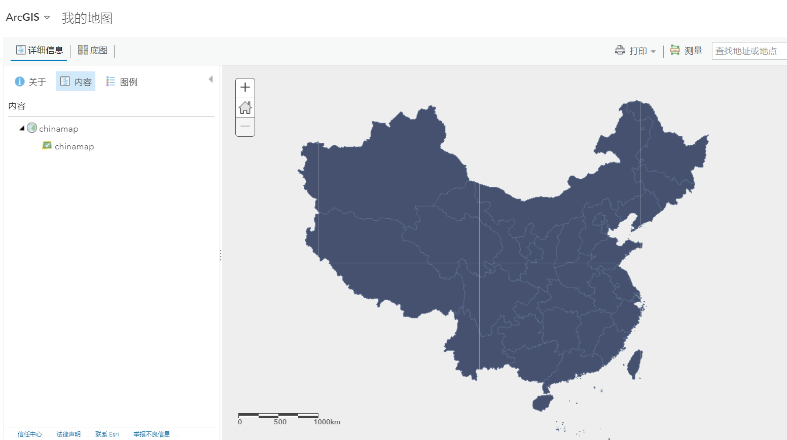

#### 桌面端

在ArcMap桌面端软件中，添加Server服务站点，就可以查看该Server站点下的所有地图服务

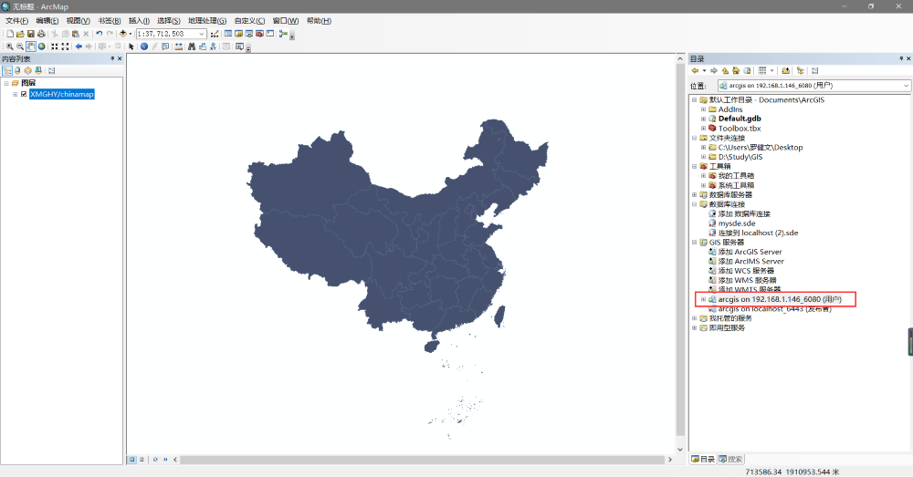

### Supermap

#### web端

打开SuperMap Iserver 的地图服务地址。

地图服务可以通过Leaflet，Openlayers，MapboxGL，Cesium这些GIS地图开源库呈现

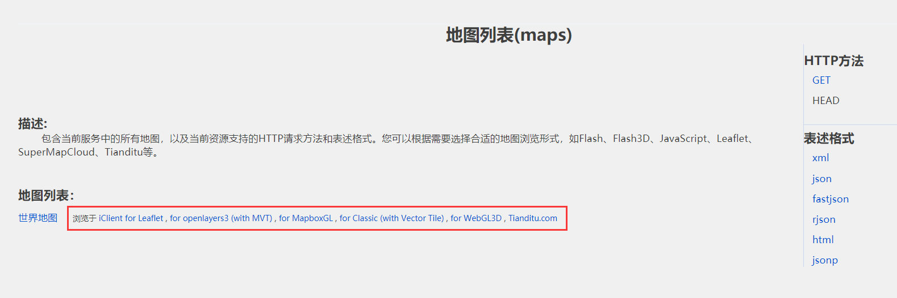

**以OpenLayers为例**

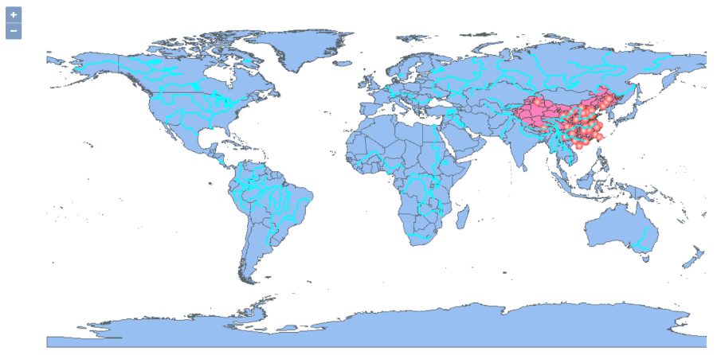

#### 桌面端

打开Supermap iDesktop,选择添加web型数据源，将地图服务添加到工作空间，就可以查看到该地图服务下的地图。

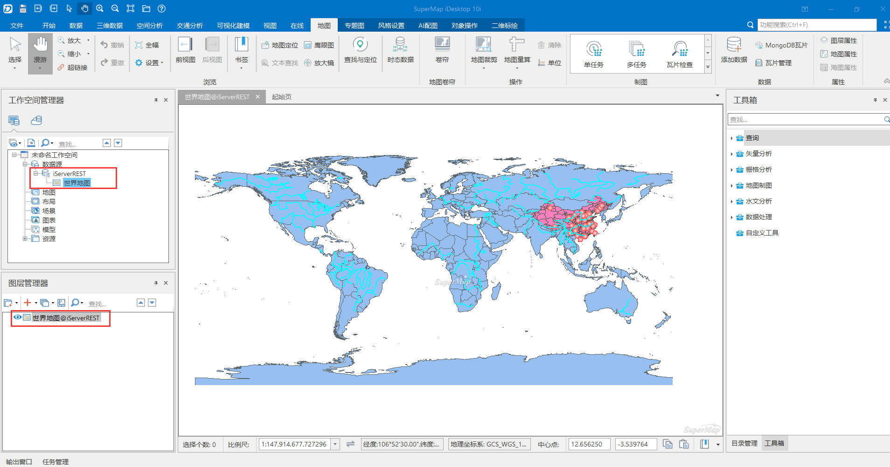

<ToTop/>

