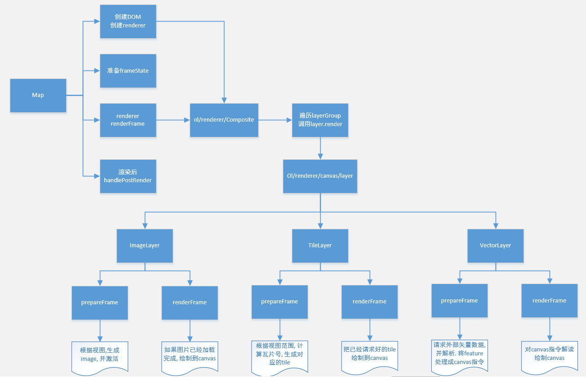
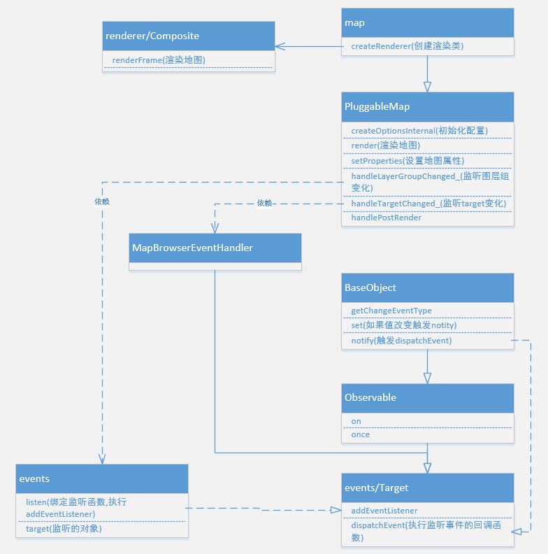
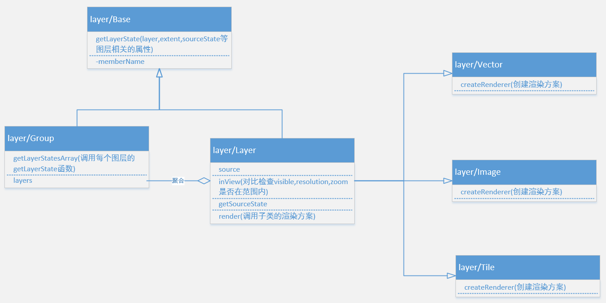
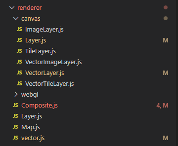
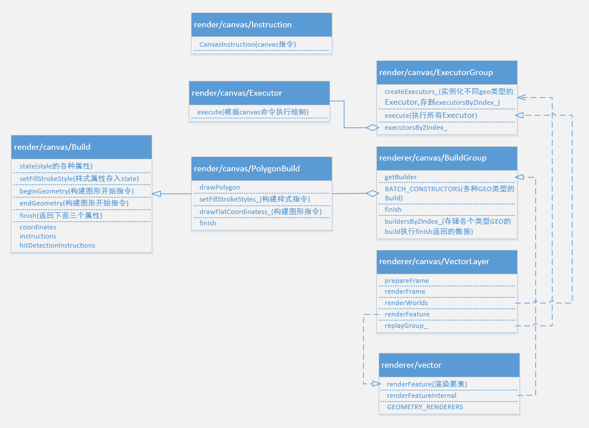
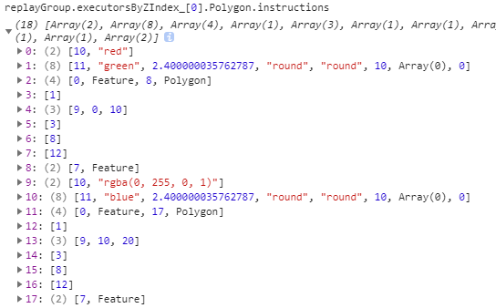

# OpenLayers 源码分析(上篇)

## 简介

上篇主要讲解地图的渲染, 包括image tile vector三种图层的渲染方式

下篇主要讲解图层source的相关内容, 即图层的数据加载部分, 以及视图发生变化后的处理机制

### 阅读对象人群

对openlayers有一定的了解, 最好是使用过openlayers. 并且想了解openlayers地图引擎的工作原理.

如果没有使用过openlayers, 可以看看下面几个官方案例, 简单了解一下openlayers

[使用ImageLayer加载arcgis服务](https://openlayers.org/en/latest/examples/arcgis-image.html)

[使用TileLayer加载arcgis服务](https://openlayers.org/en/latest/examples/arcgis-tiled.html)

[加载geojson数据](https://openlayers.org/en/latest/examples/geojson.html)

[加载服务器上的geojson数据](https://openlayers.org/en/latest/examples/hitdetect-vector.html)

## 版本及源码地址

本次openlayers源码学习, 研究的是openlayers 6.5.0版本

https://github.com/openlayers/openlayers/tree/v6.5.0

## 分析目录结构

首先拿到源码后, 最好是整体过一遍, 看看openlayers的目录结构, 结合API文档, 查看什么功能对应什么路径, 对源码有个基本的认识. 整体来说openlayers的目录结构还是比较清晰明了的

## 图层渲染流程图

本篇将围绕这张流程图 对地图和图层渲染进行分析



## 地图 (Map)

地图是我们阅读源码的起点, 一切的一切都要从这说起

ol/Map 作为构建地图的主入口，继承自 ol/PluggableMap，主要逻辑在 ol/PluggableMap 中实现



### ol/map

```js
class Map extends PluggableMap {
  constructor(options) {
    options = assign({}, options);
    if (!options.controls) {
      // 默认控件
      options.controls = defaultControls();
    }
    if (!options.interactions) {
      // 默认交互事件
      options.interactions = defaultInteractions({
        onFocusOnly: true,
      });
    }
    super(options);
  }
  createRenderer() {
    return new CompositeMapRenderer(this);
  }
}
export default Map;
```

### ol/PluggableMap

```js
class PluggableMap extends BaseObject {
  constructor(options) {
    super();
    // 创建内部属性
    const optionsInternal = createOptionsInternal(options);

    // 地图渲染函数
    this.animationDelay_ = function () {
      this.animationDelayKey_ = undefined;
      this.renderFrame_(Date.now());
    }.bind(this);

    // 构建DOM——ol-viewport 装载图层数据等
    this.viewport_ = document.createElement('div');
    this.viewport_.className =
      'ol-viewport' + ('ontouchstart' in window ? ' ol-touch' : '');
    this.viewport_.style.position = 'relative';
    this.viewport_.style.overflow = 'hidden';
    this.viewport_.style.width = '100%';
    this.viewport_.style.height = '100%';

    // 子容器ol-overlaycontainer、ol-overlaycontainer-stopevent
    ...

    // 切片请求队列, 如果是tileLayer会用到
    this.tileQueue_ = new TileQueue(
      this.getTilePriority.bind(this),
      this.handleTileChange_.bind(this)
    );

    // 地图浏览事件、LAYERGROUP、VIEW、SIZE、SIZE的change事件
    this.addEventListener(
      getChangeEventType(MapProperty.LAYERGROUP),
      this.handleLayerGroupChanged_
    );
    this.addEventListener(
      getChangeEventType(MapProperty.VIEW),
      this.handleViewChanged_
    );
    this.addEventListener(
      getChangeEventType(MapProperty.SIZE),
      this.handleSizeChanged_
    );
    this.addEventListener(
      getChangeEventType(MapProperty.TARGET),
      this.handleTargetChanged_
    );

    // 设置内部属性会触发上面绑定的监听, 引发地图render
    this.setProperties(optionsInternal.values);
  }

  createOptionsInternal(options) {
    ...
    return {
    controls: controls, // 地图控件, 如果未指定，则使用 ol/control〜defaults
    interactions: interactions, // 地图的交互, 如果未指定，则使用 ol/interaction〜defaults
    keyboardEventTarget: keyboardEventTarget, // 监听键盘事件的DOM元素, 默认
    overlays: overlays,
    values: values, // 包括LAYERGROUP,TARGET,VIEW
    };
  }

  handleTargetChanged_() {
    // target 可能会是 undefined, null, a string or an Element.
    // 如果是 string 会找到对应ID的DOM.
    // 如果找不到对应的DOM元素 就移除 viewport.
    // 如果找到对应DOM元素 会将viewport element 添加进DOM.

    let targetElement;
    if (this.getTarget()) {
      targetElement = this.getTargetElement();
    }

    if (this.mapBrowserEventHandler_) {
      // 如果为true, 说明之前有一个target是用过的, 需要移除DOM元素的监听事件
      ...
      this.mapBrowserEventHandler_ = null;
      removeNode(this.viewport_);
    }

    if (!targetElement) {
      // 没有找到DOM元素, 清除randerer
    } else {
      targetElement.appendChild(this.viewport_);
      if (!this.renderer_) {
        // 创建 renderer/Composite类
        this.renderer_ = this.createRenderer();
      }

      // 监听各种事件
      ...

      if (!this.handleResize_) {
        this.handleResize_ = this.updateSize.bind(this);
        window.addEventListener(EventType.RESIZE, this.handleResize_, false);
      }
    }

    // 调用setSize, 触发this.render
    this.updateSize();
  }

  handleSizeChanged_() {
    if (this.getView() && !this.getView().getAnimating()) {
      this.getView().resolveConstraints(0);
    }

    this.render();
  }

  handleViewChanged_() {
    // 如果曾经有绑定过View, 先清除监听
    if (this.viewPropertyListenerKey_) {
      unlistenByKey(this.viewPropertyListenerKey_);
      this.viewPropertyListenerKey_ = null;
    }
    if (this.viewChangeListenerKey_) {
      unlistenByKey(this.viewChangeListenerKey_);
      this.viewChangeListenerKey_ = null;
    }
    const view = this.getView();
    if (view) {
      // 重新计算viewport_元素的size大小并将保存在view对象上
      this.updateViewportSize_();

      this.viewPropertyListenerKey_ = listen(
        view,
        ObjectEventType.PROPERTYCHANGE,
        this.handleViewPropertyChanged_,
        this
      );
      this.viewChangeListenerKey_ = listen(
        view,
        EventType.CHANGE,
        this.handleViewPropertyChanged_,
        this
      );

      view.resolveConstraints(0);
    }
    this.render();
  }

  /*
    window.requestAnimationFrame() 告诉浏览器——你希望执行一个动画，
    并且要求浏览器在下次重绘之前调用指定的回调函数更新动画。
    该方法需要传入一个回调函数作为参数，
    该回调函数会在浏览器下一次重绘之前执行
  */
  render() {
    if (this.renderer_ && this.animationDelayKey_ === undefined) {
      this.animationDelayKey_ = requestAnimationFrame(this.animationDelay_);
    }
  }

  // 渲染视图
  renderFrame_(time) {
    const size = this.getSize();
    const view = this.getView();
    const previousFrameState = this.frameState_;
    /** @type {?FrameState} */
    let frameState = null;
    if (size !== undefined && hasArea(size) && view && view.isDef()) {
      const viewHints = view.getHints(
        this.frameState_ ? this.frameState_.viewHints : undefined
      );
      const viewState = view.getState();
      // 当前视图的状态, 这个非常重要, 后面图层的数据加载和渲染完全是依据这个来的
      frameState = {
        animate: false,
        coordinateToPixelTransform: this.coordinateToPixelTransform_,
        declutterTree: null,
        extent: getForViewAndSize(
          viewState.center,
          viewState.resolution,
          viewState.rotation,
          size
        ),
        index: this.frameIndex_++,
        layerIndex: 0,
        layerStatesArray: this.getLayerGroup().getLayerStatesArray(),
        pixelRatio: this.pixelRatio_,
        pixelToCoordinateTransform: this.pixelToCoordinateTransform_,
        postRenderFunctions: [],
        size: size,
        tileQueue: this.tileQueue_,
        time: time,
        usedTiles: {},
        viewState: viewState,
        viewHints: viewHints,
        wantedTiles: {},
      };
    }

    this.frameState_ = frameState;
    this.renderer_.renderFrame(frameState);

    ...

    if (!this.postRenderTimeoutHandle_) {
      this.postRenderTimeoutHandle_ = setTimeout(() => {
        this.postRenderTimeoutHandle_ = undefined;
        // 处理切片图层
        this.handlePostRender();
      }, 0);
    }
  }
}
```

### ol/renderer/Composite

拿到了 frameState 后, 就可以对地图做渲染了.

frameState 关键属性, 及说明:

| 属性名           | 来源                             | 简介                                                   |
| ---------------- | -------------------------------- | ------------------------------------------------------ |
| layerStatesArray | LayerGroup.getLayerStatesArray() | 拿到每个图层的 state                                   |
| layerState       | layer.getLayerState()            | 包含 opacity,sourceState,visible,zIndex,以及图层自身 等图层基本状态 |
| viewState | view.getState() | 包括当前视图的中心点, 分辨率等 |

```js
class CompositeMapRenderer extends MapRenderer {
  constructor(map) {
    super(map);

    // 构建layers的dom容器, 并插入
    this.element_ = document.createElement('div');
    const style = this.element_.style;
    style.position = 'absolute';
    style.width = '100%';
    style.height = '100%';
    style.zIndex = '0';

    this.element_.className = CLASS_UNSELECTABLE + ' ol-layers';

    const container = map.getViewport();
    container.insertBefore(this.element_, container.firstChild || null);

    ...
  }

  renderFrame(frameState) {
    ...

    this.dispatchRenderEvent(RenderEventType.PRECOMPOSE, frameState);

    const layerStatesArray = frameState.layerStatesArray.sort(function (a, b) {
      return a.zIndex - b.zIndex;
    });
    const viewState = frameState.viewState;

    this.children_.length = 0;
    const declutterLayers = [];
    let previousElement = null;
    for (let i = 0, ii = layerStatesArray.length; i < ii; ++i) {
      const layerState = layerStatesArray[i];
      frameState.layerIndex = i;
      /** 判断是否需要加载layer 判断条件包括:
       * 1. visible
       * 2. 是否超出resolution范围(max/min)
       * 3. 是否超出zoom范围(max/min) 
       * 4. SourceState是否为ready
      */
      if (
        !inView(layerState, viewState) ||
        (layerState.sourceState != SourceState.READY &&
          layerState.sourceState != SourceState.UNDEFINED)
      ) {
        continue;
      }

      const layer = layerState.layer;
      // 对每个图层进行render, 得到图层的DOM元素
      const element = layer.render(frameState, previousElement);
      if (!element) {
        continue;
      }
      if (element !== previousElement) {
        this.children_.push(element);
        previousElement = element;
      }
    }

    replaceChildren(this.element_, this.children_);
    this.dispatchRenderEvent(RenderEventType.POSTCOMPOSE, frameState);

    ...
  }
```

## Layer

在openlayers中, layer交由layerGroup进行统一管理, 控制图层的顺序等

layer并没有涉及很多业务处理, 其更加像是一个管理者的角色, 控制核心属性, 比如图层的显隐, 具体如何对图层如何请求数据, 渲染数据是交给了Source和Renderer类去完成



### ol/layer/Group

layerGroup 作为地图的图层管理者角色, 管理地图对象下的全部图层

```js
class LayerGroup extends BaseLayer {
  constructor(opt_options) {
    const options = opt_options || {};
    const baseOptions = /** @type {Options} */ (assign({}, options));
    delete baseOptions.layers;

    let layers = options.layers;

    super(baseOptions);

    if (layers) {
      if (Array.isArray(layers)) {
        layers = new Collection(layers.slice(), { unique: true });
      } else {
        assert(typeof (/** @type {?} */ (layers).getArray) === "function", 43); // Expected `layers` to be an array or a `Collection`
      }
    } else {
      layers = new Collection(undefined, { unique: true });
    }

    this.setLayers(layers);
  }

  // 获取group下所有图层state
  getLayerStatesArray(opt_states) {
    const states = opt_states !== undefined ? opt_states : [];

    const pos = states.length;

    this.getLayers().forEach(function (layer) {
      layer.getLayerStatesArray(states);
    });

    const ownLayerState = this.getLayerState();

    // 对比Group的State和Layer的State, LayerState不能超过GroupState
    for (let i = pos, ii = states.length; i < ii; i++) {
      const layerState = states[i];
      layerState.opacity *= ownLayerState.opacity;
      layerState.visible = layerState.visible && ownLayerState.visible;
      layerState.maxResolution = Math.min(
        layerState.maxResolution,
        ownLayerState.maxResolution
      );
      layerState.minResolution = Math.max(
        layerState.minResolution,
        ownLayerState.minResolution
      );
      layerState.minZoom = Math.max(layerState.minZoom, ownLayerState.minZoom);
      layerState.maxZoom = Math.min(layerState.maxZoom, ownLayerState.maxZoom);
      if (ownLayerState.extent !== undefined) {
        if (layerState.extent !== undefined) {
          layerState.extent = getIntersection(
            layerState.extent,
            ownLayerState.extent
          );
        } else {
          layerState.extent = ownLayerState.extent;
        }
      }
    }
    return states;
  }
}
```

### ol/layer/Layer

```js
class Layer extends BaseLayer {
  constructor(options) {
    const baseOptions = assign({}, options);
    delete baseOptions.source;

    super(baseOptions);

    // Overwrite default render method with a custom one
    if (options.render) {
      this.render = options.render;
    }

    // 监听source变化
    this.addEventListener(
      getChangeEventType(LayerProperty.SOURCE),
      this.handleSourcePropertyChange_
    );

    const source = options.source
      ? /** @type {SourceType} */ (options.source)
      : null;
    this.setSource(source);
  }

  handleSourcePropertyChange_() {
    if (this.sourceChangeKey_) {
      unlistenByKey(this.sourceChangeKey_);
      this.sourceChangeKey_ = null;
    }
    const source = this.getSource();
    if (source) {
      this.sourceChangeKey_ = listen(
        source,
        EventType.CHANGE,
        this.changed,
        this
      );
    }
    this.changed();
  }

  // 触发layer的change事件
  changed() {
    ++this.revision_;
    this.dispatchEvent(EventType.CHANGE);
  }

  // 图层的渲染方法
  render(frameState, target) {
    const layerRenderer = this.getRenderer();

    if (layerRenderer.prepareFrame(frameState)) {
      return layerRenderer.renderFrame(frameState, target);
    }
  }

  getRenderer() {
    if (!this.renderer_) {
      this.renderer_ = this.createRenderer();
    }
    return this.renderer_;
  }

  // layer作为图层基类, 本身不创建renderer, 由具体子类决定
  createRenderer() {
    return null;
  }
}
```

## Renderer

图层的渲染是交由Renderer完成, 查看ol/renderer/canvas 可以发现, renderer主要是分为三大类:

1. Image
2. Tile
3. Vector



### ol/renderer/canvas/ImageLayer

在 prepareFrame中, 需要得到imageSource的 image, 且image 为加载完成状态, 才会返回image, 执行renderFrame, 否则不执行. 

```js
  prepareFrame(frameState) {
    ...

    if (
      !hints[ViewHint.ANIMATING] &&
      !hints[ViewHint.INTERACTING] &&
      !isEmpty(renderedExtent)
    ) {
      if (imageSource) {
        let projection = viewState.projection;
        
        const image = imageSource.getImage(
          renderedExtent,
          viewResolution,
          pixelRatio,
          projection
        );
        if (image && this.loadImage(image)) {
          this.image_ = image;
        }
      } else {
        this.image_ = null;
      }
    }

    return !!this.image_;
  }
```

如果prepareFrame函数返回了this.image_, 则进行canvas绘制, 将图层绘制出来

```js
  renderFrame(frameState, target) {
    const image = this.image_;

    // 生成context(图层的DOM)
    this.useContainer(target, canvasTransform, layerState.opacity); 

    const context = this.context;
    const canvas = context.canvas;

    if (canvas.width != width || canvas.height != height) {
      canvas.width = width;
      canvas.height = height;
    } else if (!this.containerReused) {
      context.clearRect(0, 0, width, height);
    }

    const img = image.getImage();

    // 计算canvas绘制为保证图片不变形的偏移量(dx,dy,dw,dh)
    ...

    assign(context, this.getLayer().getSource().getContextOptions());
    this.preRender(context, frameState);
    if (dw >= 0.5 && dh >= 0.5) {
      const opacity = layerState.opacity;
      let previousAlpha;
      // 修改透明度
      if (opacity !== 1) {
        previousAlpha = this.context.globalAlpha;
        this.context.globalAlpha = opacity;
      }
      // 绘制图片
      this.context.drawImage(
        img,
        0,
        0,
        +img.width,
        +img.height,
        Math.round(dx),
        Math.round(dy),
        Math.round(dw),
        Math.round(dh)
      );
      if (opacity !== 1) {
        this.context.globalAlpha = previousAlpha;
      }
    }
    this.postRender(context, frameState);

    if (canvasTransform !== canvas.style.transform) {
      canvas.style.transform = canvasTransform;
    }

    return this.container;
  }
```

### ol/renderer/canvas/TileLayer

在prepareFrame中检查图层是否有source, 如果有就执行renderFrame

```js
  prepareFrame(frameState) {
    return !!this.getLayer().getSource();
  }
```

```js
  renderFrame(frameState, target) {
    ...

    // 获取切片号范围
    const tileRange = tileGrid.getTileRangeForExtentAndZ(extent, z);
    const tilesToDrawByZ = {};
    tilesToDrawByZ[z] = {};

    // 查找已加载的tiles
    const findLoadedTiles = this.createLoadedTileFinder(
      tileSource,
      projection,
      tilesToDrawByZ
    );

    const tmpExtent = this.tmpExtent;
    const tmpTileRange = this.tmpTileRange_;
    this.newTiles_ = false;
    for (let x = tileRange.minX; x <= tileRange.maxX; ++x) {
      for (let y = tileRange.minY; y <= tileRange.maxY; ++y) {
        // 获取切片
        const tile = this.getTile(z, x, y, frameState);
        if (this.isDrawableTile(tile)) {
          const uid = getUid(this);
          if (tile.getState() == TileState.LOADED) {
            // 已经加载好的tile存入tilesToDrawByZ, 等待绘制canvas
            tilesToDrawByZ[z][tile.tileCoord.toString()] = tile;
            ...
          }
        }

        // 查找这个切片对应的下一级切片
        const childTileRange = tileGrid.getTileCoordChildTileRange(
          tile.tileCoord,
          tmpTileRange,
          tmpExtent
        );

        let covered = false;
        if (childTileRange) {
          covered = findLoadedTiles(z + 1, childTileRange);
        }
        if (!covered) {
          tileGrid.forEachTileCoordParentTileRange(
            tile.tileCoord,
            findLoadedTiles,
            tmpTileRange,
            tmpExtent
          );
        }
      }
    }

    this.useContainer(target, canvasTransform, layerState.opacity);
    const context = this.context;
    const canvas = context.canvas;


    if (canvas.width != width || canvas.height != height) {
      canvas.width = width;
      canvas.height = height;
    } else if (!this.containerReused) {
      context.clearRect(0, 0, width, height);
    }

    assign(context, tileSource.getContextOptions());
    this.preRender(context, frameState);

    this.renderedTiles.length = 0;
    // 对Z进行排序, 按顺序加载
    let zs = Object.keys(tilesToDrawByZ).map(Number);
    zs.sort(numberSafeCompareFunction);

    for (let i = zs.length - 1; i >= 0; --i) {
      // 计算切片左上角的偏移量等
      for (const tileCoordKey in tilesToDraw) {
        ...

        this.drawTileImage(
          tile,
          frameState,
          x,
          y,
          w,
          h,
          tileGutter,
          transition,
          layerState.opacity
        );
        if (clips && !inTransition) {
          context.restore();
        }
        this.renderedTiles.push(tile);
        this.updateUsedTiles(frameState.usedTiles, tileSource, tile);
      }
    }

    // 如果tile没有在tileQueue则将tile入队
    this.manageTilePyramid(
      frameState,
      tileSource,
      tileGrid,
      pixelRatio,
      projection,
      extent,
      z,
      tileLayer.getPreload()
    );

    return this.container;
  }
```

### ol/renderer/canvas/VectorLayer

矢量数据的渲染和前面的两个类型很不一样, 前面是获取到图片直接绘制到canvas, 而矢量数据要根据坐标点和要素样式的不同, 去对canvas做不同的操作, 才能将要素绘制到canvas上

在prepareFrame 函数中, 主要是将已经加载的feature通过 render/canvas/Build 文件夹下的各种GEO类型的 build 工具类进行解析, 得到canvas指令



```js
  prepareFrame(frameState) {
    const vectorLayer = this.getLayer();
    const vectorSource = vectorLayer.getSource();
    if (!vectorSource) {
      return false;
    }

    ...

    this.replayGroup_ = null;
    this.dirty_ = false;

    // 实例化canvas指令构造组, 会根据不同的GEO类型进行canvas指令构造
    const replayGroup = new CanvasBuilderGroup(
      getRenderTolerance(resolution, pixelRatio),
      extent,
      resolution,
      pixelRatio
    );

    ...

    // 获取外部矢量数据(发送网络请求)
    for (let i = 0, ii = loadExtents.length; i < ii; ++i) {
      vectorSource.loadFeatures(loadExtents[i], resolution, projection);
    }
    
    const squaredTolerance = getSquaredRenderTolerance(resolution, pixelRatio);

    // 渲染feature
    const render =
      function (feature) {
        let styles;
        const styleFunction =
          feature.getStyleFunction() || vectorLayer.getStyleFunction();
        if (styleFunction) {
          styles = styleFunction(feature, resolution);
        }
        // 得到style,开始生成canvas指令
        if (styles) {
          const dirty = this.renderFeature(
            feature,
            squaredTolerance,
            styles,
            replayGroup,
            userTransform,
            declutterBuilderGroup
          );
          this.dirty_ = this.dirty_ || dirty;
        }
      }.bind(this);

    const userExtent = toUserExtent(extent, projection);
    // 根据范围过滤要素
    const features = vectorSource.getFeaturesInExtent(userExtent);
    if (vectorLayerRenderOrder) {
      features.sort(vectorLayerRenderOrder);
    }
    // 遍历渲染要素
    for (let i = 0, ii = features.length; i < ii; ++i) {
      render(features[i]);
    }
    this.renderedFeatures_ = features;

    // 得到要渲染的要素的canvas指令
    const replayGroupInstructions = replayGroup.finish();
    // 构建渲染器, 后面executorGroup会在renderWorlds函数中根据replayGroupInstructions里面的canvas指令, 使用不同GEO类型的Executor对canvas执行绘制
    const executorGroup = new ExecutorGroup(
      extent,
      resolution,
      pixelRatio,
      vectorSource.getOverlaps(),
      replayGroupInstructions,
      vectorLayer.getRenderBuffer()
    );

    ...
    return true;
  }
```

在生成了canvas指令后, 在renderFrame 将指令翻译成绘制canvas的代码进行绘制

```js
  renderFrame(frameState, target) {
    // 计算缩放和偏移
    ...

    // 生成DOM
    this.useContainer(target, canvasTransform, layerState.opacity);
    const context = this.context;
    const canvas = context.canvas;

    const replayGroup = this.replayGroup_;
    const declutterExecutorGroup = this.declutterExecutorGroup;

    // 如果replayGroup里没有canvas指令
    if (
      (!replayGroup || replayGroup.isEmpty()) &&
      (!declutterExecutorGroup || declutterExecutorGroup.isEmpty())
    ) {
      if (!this.containerReused && canvas.width > 0) {
        canvas.width = 0;
      }
      return this.container;
    }

    // 清空画布, 准备绘制
    const width = Math.round(frameState.size[0] * pixelRatio);
    const height = Math.round(frameState.size[1] * pixelRatio);
    if (canvas.width != width || canvas.height != height) {
      canvas.width = width;
      canvas.height = height;
      if (canvas.style.transform !== canvasTransform) {
        canvas.style.transform = canvasTransform;
      }
    } else if (!this.containerReused) {
      context.clearRect(0, 0, width, height);
    }

    // 根据replayGroup里的canvas指令绘制
    this.renderWorlds(replayGroup, frameState);

    ...

    return this.container;
  }
```

#### ol/render/canvas/Instruction

每一个数字代表一个canvas的操作

```js
const Instruction = {
  BEGIN_GEOMETRY: 0,
  BEGIN_PATH: 1,
  CIRCLE: 2,
  CLOSE_PATH: 3,
  CUSTOM: 4,
  DRAW_CHARS: 5,
  DRAW_IMAGE: 6,
  END_GEOMETRY: 7,
  FILL: 8,
  MOVE_TO_LINE_TO: 9,
  SET_FILL_STYLE: 10,
  SET_STROKE_STYLE: 11,
  STROKE: 12,
};
```

再结合canvas命令组, 每一个数组的第一个数字就是对应上面的命令



简单解释一下

0: 设置了fill样式
1: 设置了line样式
2: 开始绘制geometry, 一直到第8行都是关于这个feature的
3: 开始绘制线
4: 从坐标数组内的 0 到 10 依次绘制
5: 结束绘制线
6: 上fill
7: 上line
8: 这个feature绘制完成
...
下一个feature

## 总结

不管是图片还是矢量的绘制, 我们都没有看到source是怎么参与进来的

这是openlayers有意分离, renderer只做渲染的事情, 获取数据的事情完全交给source.

将渲染和数据获取进行分离, 虽然会增加代码的复杂性, 但是这也更加方便了source的扩展, 用户可以根据自己想要的renderer类型, 自定义source以供openlayers加载.

下篇我将会对source进行详细的介绍