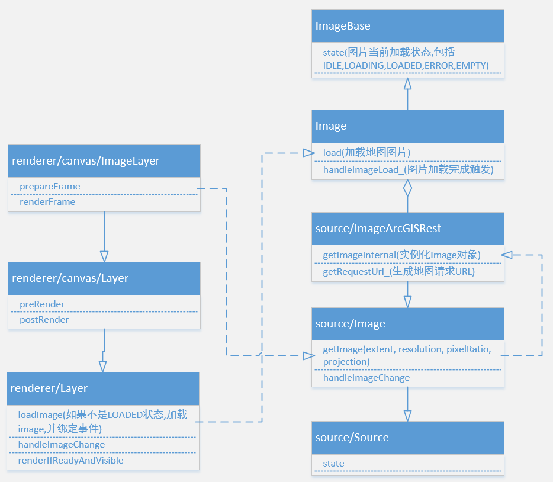
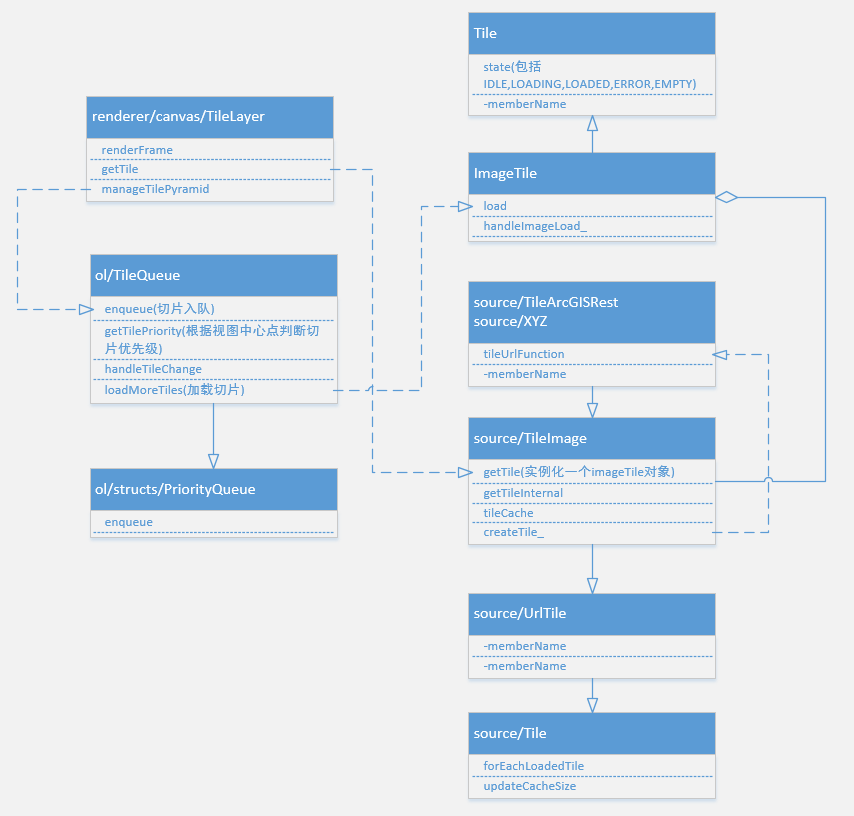
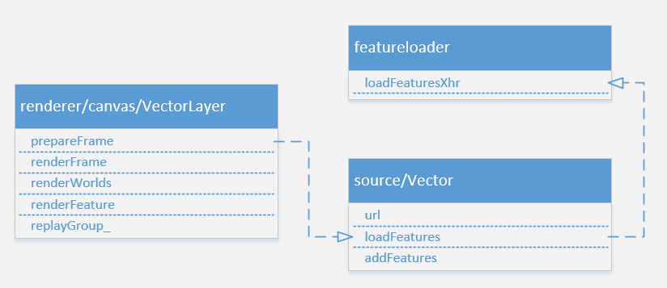
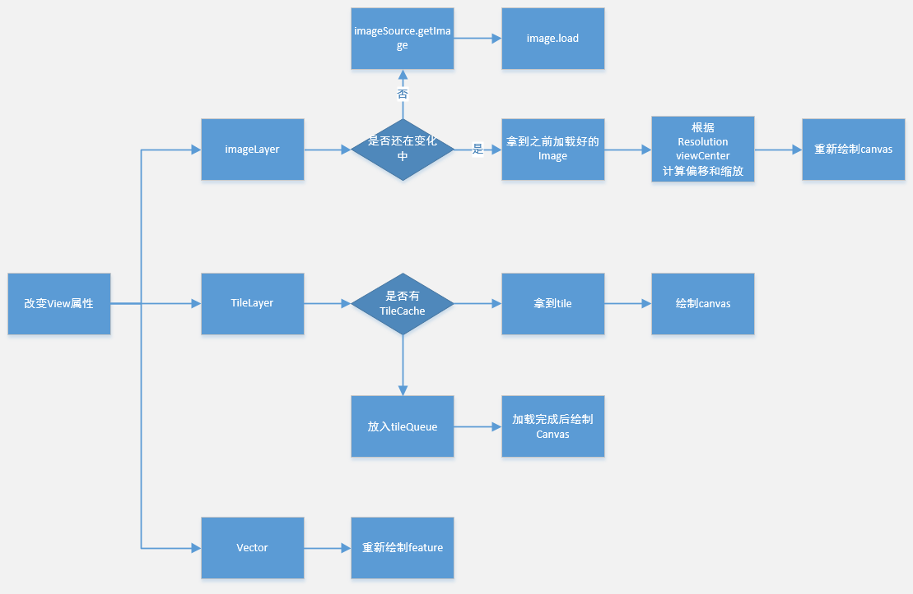
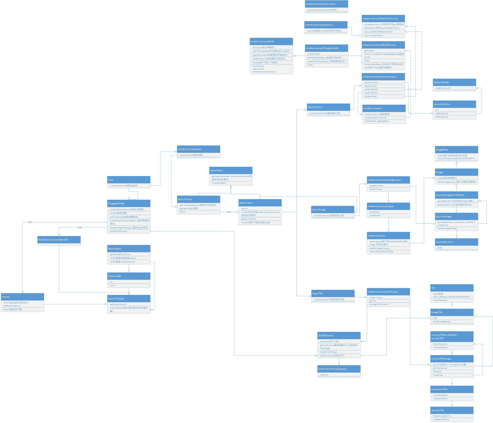
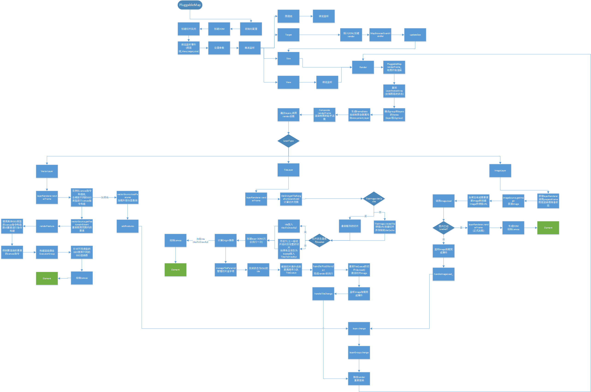

# OpenLayers 源码分析(下篇)

## 简介

本篇介绍 openlayers 源码中的 source 部分

## Source

从 openlayers 官网首页我们可以看到, openlayers 本身支持超多种类的数据来源作为图层加载到地图上, 这得益于 openlayers 可以自由的拓展 Source 类.


从源码的分析来看, 我们可以对 Source 分为三类:

1. 单张图片 ol/source/Image
2. 瓦片图片 ol/source/Tile
3. 矢量图片 ol/source/Vector

### 数据源

ol/source/Source 是抽象基类, 不被实例化, 其子类就是上面提到的三个类, 所以我们分析源码的时候也分成这三类分别去学习研究.

父类是 ol/Object. 这是基类中的基类, 这种基中基一般都是定义最通用的函数, 不会有业务逻辑. 所以我们直接从 Source 开始看就可以了.

```js
// ol/source/Source.js 关键代码

class Source extends BaseObject {
  constructor(options) {
    super();

    this.projection_ = getProjection(options.projection);
    this.attributions_ = adaptAttributions(options.attributions);
    this.attributionsCollapsible_ =
      options.attributionsCollapsible !== undefined
        ? options.attributionsCollapsible
        : true;

    this.loading = false;

    // source的状态, 默认是ready
    this.state_ =
      options.state !== undefined ? options.state : SourceState.READY;

    this.wrapX_ = options.wrapX !== undefined ? options.wrapX : false;
  }

  // 刷新source, source会被清空, 数据会重新加载
  refresh() {
    this.changed();
  }

  ...
}
```

可以看到, 这部分代码量非常少, 除了 state 设置为 ready, 并没有太多影响到业务的代码部分

### 单张图片(ol/source/Image)

相关的子类就非常多了:

1. ol/source/ImageArcGISRest
2. ol/source/ImageCanvas
3. ol/source/ImageMapGuide
4. ol/source/ImageStatic
5. ol/source/ImageWMS
6. ol/source/Raster

再做细分, 可以将 ArcGIS, WMS, MapGuide, Static 分为一类, 其原理都是根据图片的 URL, 拿到图片数据, 生成 canvas 绘制到地图上. canvas 和 raster 分为另一类, 这一类比较复杂, 是需要根据非图片数据进行 canvas 绘制.

我们主要分析第一类, 拿到图片数据去做图层加载, 这也是我们常用的图层加载方式.

UML 图:



#### ol/source/Image

抽象基类, 定义了 getImage 函数和 handleImageChange 函数, 具体是如何生成 image 则需要子类重载

```js
// ol/source/Image.js 关键代码

class ImageSource extends Source {
  constructor(options) {
    super({
      attributions: options.attributions,
      projection: options.projection,
      state: options.state,
    });

    // 分辨率
    this.resolutions_ =
      options.resolutions !== undefined ? options.resolutions : null;

    ...
  }

  // 获取图片方法
  getImage(extent, resolution, pixelRatio, projection) {
    const sourceProjection = this.getProjection();
    // 判断坐标系是否需要转换
    // projection参数指的是view的projection
    if (
      !ENABLE_RASTER_REPROJECTION ||
      !sourceProjection ||
      !projection ||
      equivalent(sourceProjection, projection)
    ) {
      if (sourceProjection) {
        projection = sourceProjection;
      }
      return this.getImageInternal(extent, resolution, pixelRatio, projection);
    } else {
      ...
    }
  }

  // 抽象方法, 具体如何实现在子类
  getImageInternal(extent, resolution, pixelRatio, projection) {
    return abstract();
  }

  // 监听 image 改变事件.
  handleImageChange(event) {
    const image = /** @type {import("../Image.js").default} */ (event.target);
    switch (image.getState()) {
      case ImageState.LOADING:
        this.loading = true;
        this.dispatchEvent(
          new ImageSourceEvent(ImageSourceEventType.IMAGELOADSTART, image)
        );
        break;
      case ImageState.LOADED:
        this.loading = false;
        this.dispatchEvent(
          new ImageSourceEvent(ImageSourceEventType.IMAGELOADEND, image)
        );
        break;
      case ImageState.ERROR:
        this.loading = false;
        this.dispatchEvent(
          new ImageSourceEvent(ImageSourceEventType.IMAGELOADERROR, image)
        );
        break;
      default:
      // pass
    }
  }
}
```

#### ol/source/ImageArcGISRest

再看看 arcgis, 也是我们最常用的类之一

主要内容是根据 arcgis server 的请求参数对 getImageInternal 函数进行重载

```js
// ol/source/ImageArcGISRest 关键代码

class ImageArcGISRest extends ImageSource {
  /**
   * @param {Options=} opt_options Image ArcGIS Rest Options.
   */
  constructor(opt_options) {
    const options = opt_options ? opt_options : {};

    super({
      attributions: options.attributions,
      imageSmoothing: options.imageSmoothing,
      projection: options.projection,
      resolutions: options.resolutions,
    });

    this.url_ = options.url;

    // image加载方法, 如果为定义则使用默认方法
    this.imageLoadFunction_ =
      options.imageLoadFunction !== undefined
        ? options.imageLoadFunction
        : defaultImageLoadFunction;

    // arcgis请求地图的参数
    this.params_ = options.params || {};
    // 存储图片
    this.image_ = null;
    // 图片大小
    this.imageSize_ = [0, 0];

    ...
  }

  // 实现父类方法, 实例化 ol/Image类
  getImageInternal(extent, resolution, pixelRatio, projection) {
    if (this.url_ === undefined) {
      return null;
    }

    resolution = this.findNearestResolution(resolution);
    pixelRatio = this.hidpi_ ? pixelRatio : 1;

    const image = this.image_;
    // 检查是否已有image, 且关键参数未修改
    if (
      image &&
      this.renderedRevision_ == this.getRevision() &&
      image.getResolution() == resolution &&
      image.getPixelRatio() == pixelRatio &&
      containsExtent(image.getExtent(), extent)
    ) {
      return image;
    }

    // arcgis 地图服务的参数
    const params = {
      'F': 'image',
      'FORMAT': 'PNG32',
      'TRANSPARENT': true,
    };
    assign(params, this.params_);

    extent = extent.slice();
    const centerX = (extent[0] + extent[2]) / 2;
    const centerY = (extent[1] + extent[3]) / 2;
    if (this.ratio_ != 1) {
      const halfWidth = (this.ratio_ * getWidth(extent)) / 2;
      const halfHeight = (this.ratio_ * getHeight(extent)) / 2;
      extent[0] = centerX - halfWidth;
      extent[1] = centerY - halfHeight;
      extent[2] = centerX + halfWidth;
      extent[3] = centerY + halfHeight;
    }

    const imageResolution = resolution / pixelRatio;

    // 计算图片的宽高.
    const width = Math.ceil(getWidth(extent) / imageResolution);
    const height = Math.ceil(getHeight(extent) / imageResolution);

    // 图片地理范围.
    extent[0] = centerX - (imageResolution * width) / 2;
    extent[2] = centerX + (imageResolution * width) / 2;
    extent[1] = centerY - (imageResolution * height) / 2;
    extent[3] = centerY + (imageResolution * height) / 2;

    this.imageSize_[0] = width;
    this.imageSize_[1] = height;

    // 通过所有的参数拼接一个URL
    const url = this.getRequestUrl_(
      extent,
      this.imageSize_,
      pixelRatio,
      projection,
      params
    );

    // 得到了一个ImageWrapper类(ol/Image), 后面如何对图片请求, 请求完后如何渲染就和他有关系了
    this.image_ = new ImageWrapper(
      extent,
      resolution,
      pixelRatio,
      url,
      this.crossOrigin_,
      this.imageLoadFunction_
    );

    this.renderedRevision_ = this.getRevision();

    // 监听image 回调函数就是父类的handleImageChange
    this.image_.addEventListener(
      EventType.CHANGE,
      this.handleImageChange.bind(this)
    );

    return this.image_;
  }


  // 拼接arcgis地图服务 URL
  getRequestUrl_(extent, size, pixelRatio, projection, params) {
    // ArcGIS Server only wants the numeric portion of the projection ID.
    const srid = projection.getCode().split(':').pop();

    params['SIZE'] = size[0] + ',' + size[1];
    params['BBOX'] = extent.join(',');
    params['BBOXSR'] = srid;
    params['IMAGESR'] = srid;
    params['DPI'] = Math.round(90 * pixelRatio);

    const url = this.url_;

    const modifiedUrl = url
      .replace(/MapServer\/?$/, 'MapServer/export')
      .replace(/ImageServer\/?$/, 'ImageServer/exportImage');
    if (modifiedUrl == url) {
      assert(false, 50); // `options.featureTypes` should be an Array
    }
    return appendParams(modifiedUrl, params);
  }
}
```

#### ol/image

getImageInternal 函数得到的 ImageWrapper 如果 state 为 IDLE 会被调用 load 方法, 然后监听 image 标签是否加载到了图片数据, 当加载完成的时候触发 change 函数.

```js
class ImageWrapper extends ImageBase {
  constructor(...){
    this.src_ = src;
    this.image_ = new Image();
  }
  ...

  load() {
    if (this.state == ImageState.IDLE || this.state == ImageState.ERROR) {
      this.state = ImageState.LOADING;
      this.changed();
      this.imageLoadFunction_(this, this.src_);
      this.unlisten_ = listenImage(
        this.image_,
        this.handleImageLoad_.bind(this),
        this.handleImageError_.bind(this)
      );
    }
  }
  handleImageLoad_() {
    if (this.resolution === undefined) {
      this.resolution = getHeight(this.extent) / this.image_.height;
    }
    this.state = ImageState.LOADED;
    this.unlistenImage_();
    this.changed();
  }
}

export function listenImage(image, loadHandler, errorHandler) {
  const img = (image);

  if (img.src && IMAGE_DECODE) {
    const promise = img.decode();
    let listening = true;
    const unlisten = function () {
      listening = false;
    };
    promise
      .then(function () {
        if (listening) {
          loadHandler();
        }
      })
      .catch(function (error) {
        if (listening) {
          if (
            error.name === 'EncodingError' &&
            error.message === 'Invalid image type.'
          ) {
            loadHandler();
          } else {
            errorHandler();
          }
        }
      });
    return unlisten;
  }

  const listenerKeys = [
    listenOnce(img, EventType.LOAD, loadHandler),
    listenOnce(img, EventType.ERROR, errorHandler),
  ];
  return function unlisten() {
    listenerKeys.forEach(unlistenByKey);
  };
}
```

#### ImageWMS/ImageStatic 等

再看看和 ImageArcGISRest 平级的 ImageWMS/ImageStatic 类, 会发现逻辑近乎一样, 核心都在 getImageInternal 里面

基本流程: 是否已加载 -> 否则准备好各种参数 -> 构造请求 URL -> load

简单来说, 就是对现有的服务请求做一个封装

### 瓦片图片(ol/source/Tile)

相对于单张图片, 瓦片图片需要更加精细的对每一个图片做控制, 才能把小图片拼接成一个大图片, 所以会用到 tileGrid(切片格网)和 tileCache(切片缓存)

UML 图:



#### ol/source/Tile

创建 tileGrid 和 tileCache

```js
// ol/source/Tile.js 关键代码

class TileSource extends Source {
  constructor(options) {
    super({
      attributions: options.attributions,
      attributionsCollapsible: options.attributionsCollapsible,
      projection: options.projection,
      state: options.state,
      wrapX: options.wrapX,
    });

    // 瓦片格网
    this.tileGrid = options.tileGrid !== undefined ? options.tileGrid : null;
    // 瓦片大小
    const tileSize = [256, 256];
    // 瓦片缓存
    this.tileCache = new TileCache(options.cacheSize || 0);

    ...
  }

  // 判断范围内是否有已经loader的切片
  forEachLoadedTile(projection, z, tileRange, callback) {
    const tileCache = this.getTileCacheForProjection(projection);
    if (!tileCache) {
      return false;
    }

    let covered = true;
    let tile, tileCoordKey, loaded;
    // 循环遍历范围内的切片
    for (let x = tileRange.minX; x <= tileRange.maxX; ++x) {
      for (let y = tileRange.minY; y <= tileRange.maxY; ++y) {
        tileCoordKey = getKeyZXY(z, x, y);
        loaded = false;
        // 如果cache里有切片且为loader就返回缓存切片
        if (tileCache.containsKey(tileCoordKey)) {
          tile = (tileCache.get(
            tileCoordKey
          ));
          loaded = tile.getState() === TileState.LOADED;
          if (loaded) {
            loaded = callback(tile) !== false;
          }
        }
        if (!loaded) {
          covered = false;
        }
      }
    }
    return covered;
  }


  // 获取瓦片, 类似前面的getImage 需要子类根据不同的数据源进行函数重载
  getTile(z, x, y, pixelRatio, projection) {
    return abstract();
  }

  // 获取切片网格, 如果没有就根据坐标系创建
  getTileGridForProjection(projection) {
    if (!this.tileGrid) {
      return getTileGridForProjection(projection);
    } else {
      return this.tileGrid;
    }
  }

  clear() {
    this.tileCache.clear();
  }

  refresh() {
    this.clear();
    super.refresh();
  }
}
```

#### ol/source/UrlTile

```js
// ol/source/UrlTile.js 关键代码

class UrlTile extends TileSource {
  constructor(options) {
    super({
      ...
    });

    this.generateTileUrlFunction_ =
      this.tileUrlFunction === UrlTile.prototype.tileUrlFunction;


    this.tileLoadFunction = options.tileLoadFunction;

    if (options.tileUrlFunction) {
      this.tileUrlFunction = options.tileUrlFunction;
    }
    if (options.urls) {
      this.setUrls(options.urls);
    } else if (options.url) {
      this.setUrl(options.url);
    }

    this.tileLoadingKeys_ = {};
  }

  // 监听 tile 改变事件
  handleTileChange(event) {
    const tile = /** @type {import("../Tile.js").default} */ (event.target);
    const uid = getUid(tile);
    const tileState = tile.getState();
    let type;
    if (tileState == TileState.LOADING) {
      this.tileLoadingKeys_[uid] = true;
      type = TileEventType.TILELOADSTART;
    } else if (uid in this.tileLoadingKeys_) {
      delete this.tileLoadingKeys_[uid];
      type =
        tileState == TileState.ERROR
          ? TileEventType.TILELOADERROR
          : tileState == TileState.LOADED
          ? TileEventType.TILELOADEND
          : undefined;
    }
    if (type != undefined) {
      this.dispatchEvent(new TileSourceEvent(type, tile));
    }
  }

  // 用于构造切片请求的URL 子类会重写该函数
  // 如果没有重写会在setUrls使用默认模版
  tileUrlFunction(tileCoord, pixelRatio, projection) {
    return undefined;
  }

  setUrls(urls) {
    this.urls = urls;
    const key = urls.join('\n');
    // 如果为true, 使用默认模版
    if (this.generateTileUrlFunction_) {
      this.setTileUrlFunction(createFromTemplates(urls, this.tileGrid), key);
    } else {
      this.setKey(key);
    }
  }
}
```

#### ol/source/TileImage

包办了切片的创建以及缓存处理

```js
// ol/source/TileImage.js 关键代码

class TileImage extends UrlTile {
  constructor(options) {
    super({
      ...
    });

    // ImageTile是 ol/ImageTile.js
    this.tileClass =
      options.tileClass !== undefined ? options.tileClass : ImageTile;
  }

  // 获取切片的方法
  getTile(z, x, y, pixelRatio, projection) {
    const sourceProjection = this.getProjection();
    // 判断坐标系是否需要转换
    // projection参数指的是view的projection
    if (
      !ENABLE_RASTER_REPROJECTION ||
      !sourceProjection ||
      !projection ||
      equivalent(sourceProjection, projection)
    ) {
      return this.getTileInternal(
        z,
        x,
        y,
        pixelRatio,
        sourceProjection || projection
      );
    } else {
      ...
    }
  }

  // 获取 ol/ImageTile 类
  getTileInternal(z, x, y, pixelRatio, projection) {
    let tile = null;
    const tileCoordKey = getKeyZXY(z, x, y);
    const key = this.getKey();
    if (!this.tileCache.containsKey(tileCoordKey)) {
      // 创建tile, 并存入缓存
      tile = this.createTile_(z, x, y, pixelRatio, projection, key);
      this.tileCache.set(tileCoordKey, tile);
    } else {
      tile = this.tileCache.get(tileCoordKey);
      ...
    }
    return tile;
  }

  // 创建切片(ol/ImageTile)
  createTile_(z, x, y, pixelRatio, projection, key) {
    const tileCoord = [z, x, y];
    const urlTileCoord = this.getTileCoordForTileUrlFunction(
      tileCoord,
      projection
    );
    const tileUrl = urlTileCoord
      ? this.tileUrlFunction(urlTileCoord, pixelRatio, projection)
      : undefined;
    const tile = new this.tileClass(
      tileCoord,
      tileUrl !== undefined ? TileState.IDLE : TileState.EMPTY,
      tileUrl !== undefined ? tileUrl : '',
      this.crossOrigin,
      this.tileLoadFunction,
      this.tileOptions
    );
    tile.key = key;
    tile.addEventListener(EventType.CHANGE, this.handleTileChange.bind(this));
    return tile;
  }
}
```

#### ol/source/TileArcGISRest

具体用于实例化的 source 类, 主要重写父类的 tileUrlFunction 函数, 根据实际情况, 构造切片 URL

```js
class TileArcGISRest extends TileImage {
  ...

  // 重写父类函数, 构建自己的URL拼接函数
  tileUrlFunction(tileCoord, pixelRatio, projection) {
    let tileGrid = this.getTileGrid();
    if (!tileGrid) {
      tileGrid = this.getTileGridForProjection(projection);
    }

    if (tileGrid.getResolutions().length <= tileCoord[0]) {
      return undefined;
    }

    if (pixelRatio != 1 && !this.hidpi_) {
      pixelRatio = 1;
    }

    const tileExtent = tileGrid.getTileCoordExtent(tileCoord, this.tmpExtent_);
    let tileSize = toSize(tileGrid.getTileSize(tileCoord[0]), this.tmpSize);

    if (pixelRatio != 1) {
      tileSize = scaleSize(tileSize, pixelRatio, this.tmpSize);
    }

    const baseParams = {
      'F': 'image',
      'FORMAT': 'PNG32',
      'TRANSPARENT': true,
    };
    assign(baseParams, this.params_);

    return this.getRequestUrl_(
      tileCoord,
      tileSize,
      tileExtent,
      pixelRatio,
      projection,
      baseParams
    );
  }

  getRequestUrl_(
    tileCoord,
    tileSize,
    tileExtent,
    pixelRatio,
    projection,
    params
  ) {
    const urls = this.urls;
    if (!urls) {
      return undefined;
    }

    const srid = projection.getCode().split(':').pop();

    params['SIZE'] = tileSize[0] + ',' + tileSize[1];
    params['BBOX'] = tileExtent.join(',');
    params['BBOXSR'] = srid;
    params['IMAGESR'] = srid;
    params['DPI'] = Math.round(
      params['DPI'] ? params['DPI'] * pixelRatio : 90 * pixelRatio
    );

    let url;
    if (urls.length == 1) {
      url = urls[0];
    } else {
      const index = modulo(tileCoordHash(tileCoord), urls.length);
      url = urls[index];
    }

    const modifiedUrl = url
      .replace(/MapServer\/?$/, 'MapServer/export')
      .replace(/ImageServer\/?$/, 'ImageServer/exportImage');
    return appendParams(modifiedUrl, params);
  }
}
```

#### ol/ImageTile

getTileInternal 函数得到的 ImageTile 如果 state 为 IDLE 会被推入 tileQueue, 在 handlePostRender 的时候调用 load 方法, 然后监听 image 标签是否加载到了图片数据, 当加载完成的时候触发 change 函数.

```js
class ImageTile extends Tile {
  constructor(...) {
    ...
    this.image_ = new Image();
  }
  load() {
    if (this.state == TileState.ERROR) {
      this.state = TileState.IDLE;
      this.image_ = new Image();
      if (this.crossOrigin_ !== null) {
        this.image_.crossOrigin = this.crossOrigin_;
      }
    }
    if (this.state == TileState.IDLE) {
      this.state = TileState.LOADING;
      this.changed();
      this.tileLoadFunction_(this, this.src_);
      this.unlisten_ = listenImage(
        this.image_,
        this.handleImageLoad_.bind(this),
        this.handleImageError_.bind(this)
      );
    }
  }

  handleImageLoad_() {
    const image = (this.image_);
    if (image.naturalWidth && image.naturalHeight) {
      this.state = TileState.LOADED;
    } else {
      this.state = TileState.EMPTY;
    }
    this.unlistenImage_();
    this.changed();
  }
}
```

### 矢量数据(ol/source/Vector)

矢量数据

矢量图层会在 prepareFrame 阶段加载外部矢量数据



#### ol/source/Vector

```js
class VectorSource extends Source {
  constructor(opt_options) {
    ...
    // 矢量数据的url和要使用的format(对应类型的解析器)
    this.url_ = options.url;
    this.format_ = options.format;

    if (options.loader !== undefined) {
      this.loader_ = options.loader;
    } else if (this.url_ !== undefined) {
      // 如果url不为空, 使用featureloader工具类加载数据
      this.loader_ = xhr(
        this.url_,
        (this.format_)
      );
    }
  }

  loadFeatures(extent, resolution, projection) {
    const loadedExtentsRtree = this.loadedExtentsRtree_;
    const extentsToLoad = this.strategy_(extent, resolution);
    this.loading = false;
    for (let i = 0, ii = extentsToLoad.length; i < ii; ++i) {
      const extentToLoad = extentsToLoad[i];
      const alreadyLoaded = loadedExtentsRtree.forEachInExtent(
        extentToLoad,
        function (object) {
          return containsExtent(object.extent, extentToLoad);
        }
      );
      if (!alreadyLoaded) {
        this.dispatchEvent(
          new VectorSourceEvent(VectorEventType.FEATURESLOADSTART)
        );
        this.loader_.call(
          this,
          extentToLoad,
          resolution,
          projection,
          function (features) {
            this.dispatchEvent(
              new VectorSourceEvent(
                VectorEventType.FEATURESLOADEND,
                undefined,
                features
              )
            );
          }.bind(this),
          function () {
            this.dispatchEvent(
              new VectorSourceEvent(VectorEventType.FEATURESLOADERROR)
            );
          }.bind(this)
        );
        loadedExtentsRtree.insert(extentToLoad, {extent: extentToLoad.slice()});
        this.loading = this.loader_ !== VOID;
      }
    }
  }

  // 添加feature, 触发change
  addFeatures(features) {
    this.addFeaturesInternal(features);
    this.changed();
  }
```

#### ol/featureloader

```js
export function xhr(url, format) {
  return function(extent, resolution, projection, success, failure) {
    const source = this;
    loadFeaturesXhr(
      url,
      format,
      extent,
      resolution,
      projection,
      function(features, dataProjection) {
        if (success !== undefined) {
          success(features);
        }
        source.addFeatures(features);
      },
      failure ? failure : VOID
    );
  };
}
```

### Source change

看完上面三种类型图层的 source 部分, 我们还留意到每次在获取完数据的时候都会触发 change 函数.

原因是 renderer 会对的 image 进行监听(vector 类型的 source 不会, 因为不需要 image)

以 ol/renderer/Layer 为例:

```js
  loadImage(image) {
    let imageState = image.getState();
    if (imageState != ImageState.LOADED && imageState != ImageState.ERROR) {
      // 如果state不是LOADED或ERROR 就会监听change
      image.addEventListener(EventType.CHANGE, this.boundHandleImageChange_);
    }
    if (imageState == ImageState.IDLE) {
      image.load();
      imageState = image.getState();
    }
    return imageState == ImageState.LOADED;
  }
```

同理, 在 boundHandleImageChange\_ 函数中也会调用 this.change 触发 layerGroup 监听 layer 的 change 事件, 最后调用 layerGroup 的 this.change ,map 监听到 layerGroup 变化了, 重新执行 render 函数, 将数据渲染到地图上.

### View change

除了 source 会 change, 当用户操作地图的时候. View 也会触发 change 事件, 导致 map 重新执行 render 函数.

对三种类型的图层, 也会有三种不同的处理过程



## 总结

最后, 整合绘制了一张完整的 UML 图和 map 加载图层的流程图

UML 图



流程图


