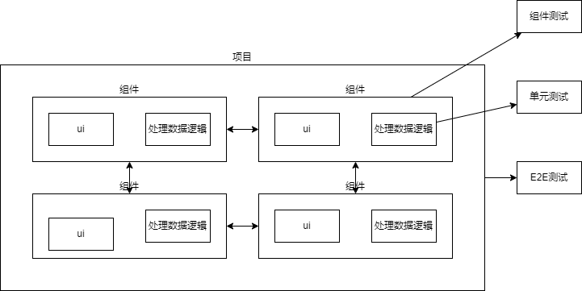

# 初识单元测试

## 为什么要写测试

1. 提高开发效率

- 使用测试进行调试是更加高级的调试手段, 一次编写, 永久检测

2. 对修改代码更加自信

- 保证项目原有功能正常, 拒绝运气编程

- 方便重构代码

- 检测提交的代码

3. 活文档

- 方便代码阅读

- 帮助新人了解项目

4. 改善程序设计

- 单元测试驱动程序开发实现高内聚低耦合

## 单元测试的定义

传统的单元测试是一个测试对应一个函数, 颗粒度过小导致测试代码难以维护

单元级别的功能测试意在对一个功能的输入输出做测试, 忽略功能的内部细节(一个或多个函数, 类)

## 手动测试到单元测试转变

### 手动测试

手动测试关注点在页面视图的变化, 测试流程如下:

用户交互 --input--> 处理数据 --output--> 渲染 ----> 页面

### 单元测试

单元测试关注点是系统的状态和数据的变化, 测试流程如下:

调用函数 --input--> 处理数据 --output--> 验证数据

## 前端测试图

