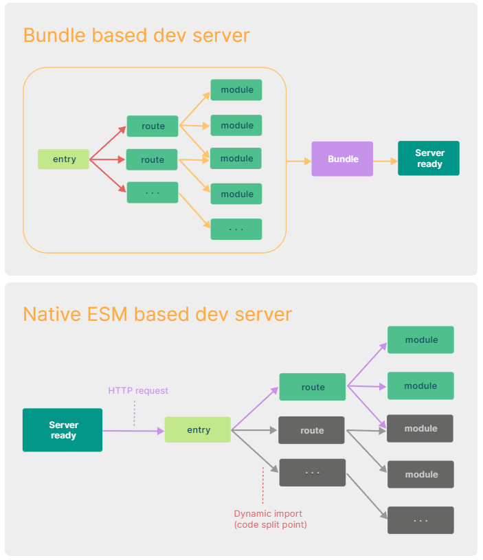

# vite

vite 是一个思维比较前卫而且先进的构建工具, 解决了一些 webpack 解决不了的问题, 同时降低了开发配置负担

Vite 也是 Vue 团队的官方出品, Vue-cli 会在今后将 vite 作为预设构建工具(目前只基于浏览器项目)

和所有的构建工具一样, Vite 也支持直接构建 react 项目, angular 项目

## 构建工具介绍

企业级项目里都可能会具备哪些功能

typescript: 使用 tsc 将 typescript 代码转换为 js 代码
Vue: 安装 vue-complier, 将.vue 文件转换为 render 函数
less/sass/postcss: 需要安装 less-loader, sass-loader 等一系列编译工具
语法降级: babel ---> 将 es 的新语法转换旧版浏览器可以接受的语法
体积优化: uglifyjs ---> 将代码进行压缩变成体积更小性能更高的文件
.....

### 什么是构建工具

当有一个东西能够帮你把这些东西全部集成到一起, 开发人员只需要关心代码, 每当代码发生变化, 可以自动执行一遍上面的内容, 这个就是**构建工具**

### 构建工具的任务

1. 模块化开发: 支持直接从 node_modules 里引入代码 + 多种模块化支持
2. 处理代码兼容性: 集成其他工具, 例如 babel 语法降级, less,ts 语法转换
3. 提高项目性能: 压缩文件, 代码分割
4. 优化开发体验: 开发服务器, 热更新
5. 打包文件: 将项目打包成一个浏览器可识别的文件合集

**构建工具的出现, 让我们不用关心生产的代码也不用关心代码如何在浏览器运行, 只需要关心我们的代码**

## vite 的优势

### 解决的最大问题

当我们开始构建越来越大型的应用时，需要处理的 JavaScript 代码量也呈指数级增长, 包含数千个模块的大型项目相当普遍。 项目逐步到达了性能瓶颈 —— 使用 JavaScript 开发的工具通常需要很长时间（甚至是几分钟！）才能启动开发服务器，即使使用热更新，文件修改后的效果也需要几秒钟才能在浏览器中反映出来。

### webpack 支持多种模块导致的结果

为了支持工程不只是跑在浏览器端, webpack 是允许我们写 es6 module 和 commonjs

```js
// index.js
// 这一段代码最终会到浏览器里去运行
const lodash = require("lodash"); // commonjs 规范
import Vue from "vue"; // es6 module
```

导致 webpack 在一开始必须要统一模块化代码, 所以意味着他需要将所有的依赖全部读一遍

### vite 的改进

Vite 通过在一开始将应用中的模块区分为 依赖 和 源码 两类，改进了开发服务器启动时间。

- 依赖 大多为在开发时不会变动的纯 JavaScript。一些较大的依赖（例如有上百个模块的组件库）处理的代价也很高。依赖也通常会存在多种模块化格式（例如 ESM 或者 CommonJS）。
  Vite 将会使用 esbuild 预构建依赖。esbuild 使用 Go 编写，并且比以 JavaScript 编写的打包器预构建依赖快 10-100 倍。

- 源码 通常包含一些并非直接是 JavaScript 的文件，需要转换（例如 JSX，CSS 或者 Vue/Svelte 组件），时常会被编辑。同时，并不是所有的源码都需要同时被加载（例如基于路由拆分的代码模块）。

Vite 以 原生 ESM 方式提供源码。这实际上是让浏览器接管了打包程序的部分工作：**Vite 只需要在浏览器请求源码时进行转换并按需提供源码.** 根据情景动态导入代码，即只在当前屏幕上实际使用时才会被处理。

#### 依赖

Vite 执行时所做的“依赖预构建”这个过程有两个目的:

1. CommonJS 和 UMD 兼容性: 开发阶段中，Vite 的开发服务器将所有代码视为原生 ES 模块。因此，Vite 必须先将作为 CommonJS 或 UMD 发布的依赖项转换为 ESM。

2. 性能： Vite 将有许多内部模块的 ESM 依赖关系转换为单个模块，以提高后续页面加载性能。(网络多包传输的性能问题)

3. 路径处理: 构建的依赖可直接在.vite/deps引用, 方便路径重写

#### 源码

在请求到vue文件的时候, vite会将对应的vue文件进行AST语法树分析, 并编辑成浏览器可识别的js文件.



## vite对css的处理

vite天生就支持对css文件的直接处理, 整个处理流程如下:

1. vite在读取js文件中得知引用到了css文件
2. 使用fs模块去读取css中的文件内容
3. 将该css文件中的内容替换为js脚本(方便热更新或者css模块化)
4. js脚本会创建一个style标签, 将css中文件内容填入style标签里
5. 将style标签插入到index.html的head中