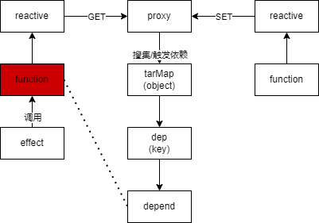
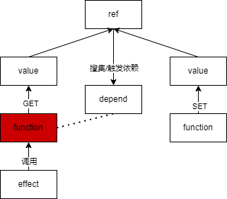

# VUE3 源码解析

通过实现最基础的 VUE, 先从整体了解 VUE3 的运行原理. 为后面揭开源码做好技术铺垫.

## 响应式对象

### 响应式对象的便捷性

#### 没有响应式

如果没有响应式, 我们对一个变量进行更新, 只能重新赋值, 代码会像下面一样

```js
let a = 10;
let b = a + 1;

console.log(b); // 11

a = 20;
b = a + 1;
console.log(b); //21
```

如果对代码有一定追求, 可能会封装一个函数, 对变量进行更新, 但依然还是需要手动调用

```js
let a = 10;
let b;
function update() {
  b = a + 1;
  console.log(b);
}

update(); // 11

a = 20;
// 手动调用 实现更新
update(); // 21
```

#### 响应式解决痛点

响应式对象解决了我们需要手动调用更新, 将更新逻辑放入 effect 函数内, 当变量值发送变化时自动调用更新函数进行更新

```js
let a = ref(10);
let b;
effect(() => {
  b = a.value + 1;
  console.log(b);
});

a.value = 20;
```

### 实现响应式

下面我们将会剖析响应式的实现原理, 通过一张图将整个响应式流程梳理清楚





#### effect

effect 将会搜集需要执行响应式的函数, 进行集中管理

```js
let activeEffect;
export function effect(fn) {
  activeEffect = fn;
  fn();
  activeEffect = null;
}
// 搜集
function trackEffect(dep) {
  if (activeEffect && !dep.has(activeEffect)) {
    dep.add(activeEffect);
  }
}
// 触发
function triggerEffect(dep) {
  dep.forEach((effect) => {
    effect();
  });
}
```

#### ref

通过代码实现 ref 功能, 如果函数内有获取(get)ref 的值, 则将该函数搜集到响应式集合中, 等待 ref 值发生变化(set)再重新执行集合中的函数

```js
class refClass {
  constructor(val) {
    this._val = val;
    // 一个不重复的集合
    this._dep = new Set();
  }

  get value() {
    // 搜集依赖
    trackEffect(this._dep);
    return this._val;
  }

  set value(newValue) {
    this._val = newValue;

    // 触发依赖
    triggerEffect(this._dep);
  }
}

export function ref(val) {
  return new refClass(val);
}
```

#### reactive

reactive 和 ref 的区别是, ref 只能对基本类型执行响应式更新, 而 reactive 可以对一个对象进行响应式更新

```js
const targetMap = new Map();
export function reactive(raw) {
  return new Proxy(raw, {
    get(target, key) {
      let depsMap = targetMap.get(target);
      if (!depsMap) {
        depsMap = new Map();
        targetMap.set(target, depsMap);
      }

      let dep = depsMap.get(key);
      if (!dep) {
        dep = new Set();
        depsMap.set(key, dep);
      }

      // 搜集依赖
      trackEffect(dep);

      return target[key];
    },
    set(target, key, newValue) {
      target[key] = newValue;
      // 触发依赖
      let depsMap = targetMap.get(target);
      let dep = depsMap.get(key);
      triggerEffect(dep);
      return true;
    },
  });
}
```

## 实现组件渲染

使用上面实现的响应式进行一个页面测试

### 创建一个 VUE3 组件

App.js

```js
import { effect, reactive } from "../reactivity/index.js";

export const App = {
  render(context) {
    // 构建视图
    effect(() => {
      document.body.innerHTML = "";
      const el = document.createElement("div");
      // div.innerText = "ljw";
      el.innerText = `${context.user.name} ${context.user.age}`;
      document.body.append(el);
    });
  },
  setup() {
    const user = reactive({
      name: "罗健文",
      age: 25,
      class: "red",
    });
    window.user = user;
    return { user };
  },
};

App.render(App.setup());
```

当 user 发生变化时, 整个 body 节点下的内容都将清空重新渲染实现的页面内容的响应式更新

### 提供 createApp

我们在使用 VUE3 的时候, 不会让用户去写 `App.render(App.setup());` 而是直接封装好一个 API 供用户使用, 其他逻辑会在框架内做好

创建 createApp.js

```js
import { effect, reactive } from "../reactivity/index.js";

export function createApp(rootComponent) {
  return {
    mount(rootContainer) {
      // 执行setup函数
      const context = rootComponent.setup();

      effect(() => {
        rootContainer.innerHTML = "";
        const el = rootComponent.render(context);
        rootContainer.append(el);
      });
    },
  };
}
```

创建 index.js 使用 createApp

```js
import { App } from "./App.js";
import { createApp } from "./createApp.js";

createApp(App).mount(document.getElementById("app"));
```

这样, 我们编写的 App.js 就不需要编写组件以外的内容

```js
export const App = {
  render(context) {
    // 构建视图
    const div = document.createElement("div");
    div.innerHTML = `${context.user.name} ${context.user.age}`;
    return div;
  },
  setup() {
    const user = reactive({
      name: "罗健文",
      age: 25,
      class: "red",
    });
    window.user = user;
    return { user };
  },
};
```

### 使用虚拟节点

虽然我们优化了代码逻辑, 但是目前 render 函数渲染视图的能力太弱, 需要使用虚拟节点进行优化

创建 h.js 用来构建虚拟节点

```js
// 创建虚拟节点
export function h(tag, props, children) {
  return {
    tag,
    props,
    children,
  };
}
```

修改 App.js

```js
export const App = {
  render(context) {
    // 构建视图
    return h(
      "div",
      {
        id: "user",
        class: context.user.class,
      },
      [h("p", null, context.user.name), h("p", null, context.user.age)]
      // `${context.user.name} ${context.user.age}`
    );
  },
  setup() {
    const user = reactive({
      name: "罗健文",
      age: 25,
      class: "red",
    });
    window.user = user;
    return { user };
  },
};
```

### 渲染虚拟节点

创建一个 renderer.js 专门负责处理渲染页面视图的逻辑

```js
export function mountElement(vnode, container) {
  const { tag, props, children } = vnode;
  // 标签
  const el = (vnode.el = document.createElement(tag));

  // props
  if (props) {
    for (const key in props) {
      const value = props[key];
      el.setAttribute(key, value);
    }
  }

  // children
  if (typeof children === "string" || typeof children === "number") {
    // 1. 字符串类型
    const textNode = document.createTextNode(children);
    el.append(textNode);
  } else if (Array.isArray(children)) {
    // 2. 虚拟节点数组
    children.forEach((vnode) => {
      mountElement(vnode, el);
    });
  }

  // 插入
  container.append(el);
}
```

修改 createApp.js 将虚拟节点交给 renderer 处理

```js
import { effect } from "../reactivity/index.js";
import { mountElement } from "./renderer.js";

export function createApp(rootComponent) {
  return {
    mount(rootContainer) {
      // 执行setup函数
      const context = rootComponent.setup();

      effect(() => {
        rootContainer.innerHTML = "";

        const subTree = rootComponent.render(context);
        mountElement(subTree, rootContainer);
      });
    },
  };
}
```

## 实现组件更新

### 更新虚拟节点

我们不能每次更新执行 effect 的时候都对 rootContainer 进行重建, 而是应该找到对应需要更新的地方单独更新.

修改 createApp.js, 区分首次渲染还是更新节点

```js
export function createApp(rootComponent) {
  return {
    mount(rootContainer) {
      const context = rootComponent.setup();
      let isMounted = false;
      let preSubTree;

      effect(() => {
        if (!isMounted) {
          // 初始化
          const subTree = rootComponent.render(context);
          mountElement(subTree, rootContainer);
          isMounted = true;
          preSubTree = subTree;
        } else {
          // 更新
          const subTree = rootComponent.render(context);
          patchElement(preSubTree, subTree);
          preSubTree = subTree;
        }
      });
    },
  };
}
```

区分出渲染和更新后, 我们只需要专注于 patchElement 把虚拟节点发生变化的地方更新到 DOM 就好

修改 renderer.js

```js
const EMPTY_OBJ = {};
export function patchElement(n1, n2) {
  const oldProps = n1.props || EMPTY_OBJ;
  const newProps = n2.props || EMPTY_OBJ;

  const el = (n2.el = n1.el);
  patchProps(el, oldProps, newProps);
  patchChildren(el, n1, n2);
}
```

### 更新 props

```js
function patchProps(el, oldProps, newProps) {
  if (oldProps !== newProps) {
    for (const key in newProps) {
      // 对比更新props
      const newValue = newProps[key];
      const oldValue = oldProps[key];

      if (newValue !== oldValue) {
        el.setAttribute(key, newValue);
      }
    }

    if (oldProps !== EMPTY_OBJ) {
      for (const key in oldProps) {
        // 剔除多余的props
        if (!(key in newProps)) {
          el.removeAttribute(key);
        }
      }
    }
  }
}
```

### 更新 children

```js
function patchChildren(el, n1, n2) {
  // 旧的是 text 新的是 text / array
  // 旧的是 array 新的是 text/ array

  const c1 = n1.children;
  const c2 = n2.children;

  if (typeof c2 === "string" || typeof c2 === "number") {
    // 更新子节点是 Text 类型
    el.innerHTML = "";
    el.append(document.createTextNode(c2));
  } else {
    if (Array.isArray(c1)) {
      // 新旧都是数组

      // 简单diff算法
      const length = Math.min(c2.length, c1.length);
      for (let i = 0; i < length; i++) {
        const oldVnode = c1[i];
        const newVnode = c2[i];

        patchElement(oldVnode, newVnode);
      }

      if (c2.length > length) {
        // 创建新节点
        for (let i = length; i < c2.length; i++) {
          const newVnode = c2[i];
          mountElement(newVnode, el);
        }
      }

      if (c1.length > length) {
        // 删除旧节点
        for (let index = length; index < c1.length; index++) {
          const oldVnode = c1[index];
          oldVnode.el.parent.removeChild(oldVnode.el);
        }
      }
    } else {
      el.innerHTML = "";
      c2.forEach((vnode) => {
        mountElement(vnode, el);
      });
    }
  }
}
```
