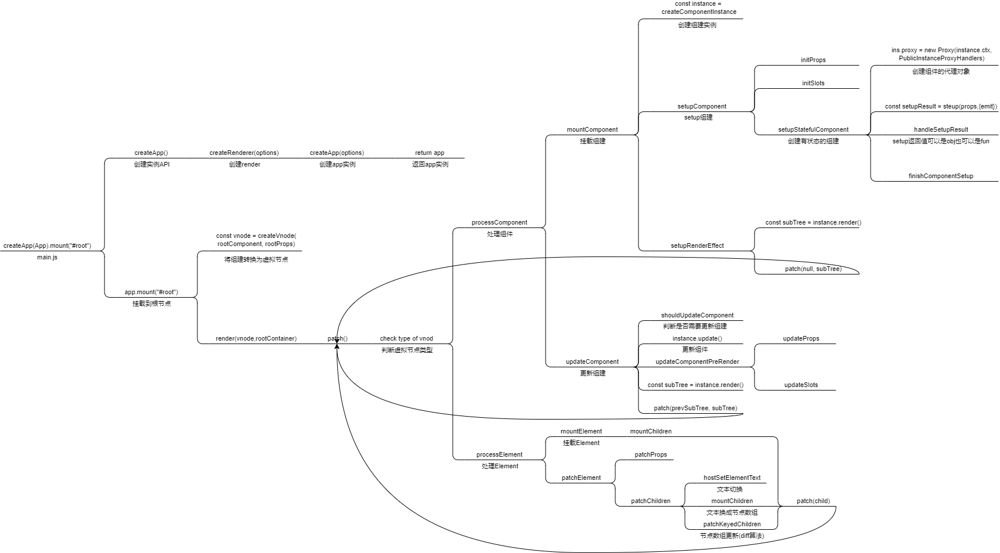

# 三、运行时核心

本章内容图解



可以以这张图为向导, 阅读本章节

GitHub: https://github.com/Roman-29/mini-vue

## 初始化主流程

观察图片, 如果我们要实现功能, 可以将主流程分为 component 和 element 两个方向处理

### 测试代码

App.js

```js
import { createVnode as h } from "../../lib/mini-vue.esm.js";

export const App = {
  render() {
    return h(
      // type
      "div",
      // props
      {
        id: "root",
        class: ["red", "hard"],
      },
      // children
      [h("p", { class: "red" }, "hi"), h("p", { class: "blue" }, "mini-vue")]
    );
  },

  setup() {
    return {};
  },
};
```

main.js

```js
import { createApp } from "../../lib/mini-vue.esm.js";
import { App } from "./App.js";

const rootContainer = document.querySelector("#app");
createApp(App).mount(rootContainer);
```

index.html

```html
<html lang="en">
  <head>
    <title>Document</title>
    <style>
      .red {
        color: red;
      }

      .blue {
        color: blue;
      }
    </style>
  </head>
  <body>
    <div id="app"></div>
    <script src="main.js" type="module"></script>
  </body>
</html>
```

### component 主流程代码

创建 createApp.ts 作为整个运行时的起始

```ts
import { render } from "./renderer";
import { createVnode } from "./vnode";

export function createApp(rootComponent) {
  return {
    mount(rootContainer) {
      // 将组件转化为虚拟节点
      // component -> vnode
      const vnode = createVnode(rootComponent);

      render(vnode, rootContainer);
    },
  };
}
```

创建的 app 实例应该有个 mount 方法, 用于挂载节点. 对组件进行渲染时需要根据用途分类新建代码文件处理:

vnode.ts 用来转换虚拟节点

```ts
export function createVnode(type, props?, children?) {
  const vnode = {
    type,
    props,
    children,
    el,
  };

  return vnode;
}
```

renderer.ts 用来渲染虚拟节点

```ts
import { createComponentInstance, setupComponent } from "./component";

export function render(vnode, container) {
  patch(vnode, container);
}

function patch(vnode, container) {
  // 处理组件
  processComponent(vnode, container);
}

function processComponent(vnode, container) {
  mountComponent(vnode, container);
}

function mountComponent(vnode, container) {
  const instance = createComponentInstance(vnode);

  setupComponent(instance);
  setupRenderEffect(instance, container);
}

function setupRenderEffect(instance, container) {
  const subTree = instance.render();

  // 拿到组件render函数渲染的虚拟节点继续递归patch
  patch(subTree, container);

  initialVNode.el = subTree.el;
}
```

component.ts 用来处理组件内容

```ts
import { proxyRefs } from "../reactivity";

export function createComponentInstance(vnode) {
  const component = {
    vnode,
    type: vnode.type, // 类型
    setupState: {}, // setup的return值
    el: null, // 组件对应的DOM节点
    props: {},
    slots: {},
  };

  return component;
}

export function setupComponent(instance) {
  // TODO
  // initProps
  // initSlots

  setupStatefulComponent(instance);
}

function setupStatefulComponent(instance) {
  const Component = instance.type;

  const { setup } = Component;

  if (setup) {
    const setupResult = setup();

    handleSetupResult(instance, setupResult);
  }
}

function handleSetupResult(instance, setupResult) {
  // function or object
  // TODO function(render函数)

  if (typeof setupResult === "object") {
    // 这里需要将setup里的ref对象全部代理出来, 从setupResult获取的ref都不再需要.value获取值
    instance.setupState = proxyRefs(setupResult);
  }

  finishComponentSetup(instance);
}

function finishComponentSetup(instance) {
  const Component = instance.type;

  if (Component.render) {
    instance.render = Component.render;
  }
}
```

### element 主流程代码

renderer.ts 之前只处理了 component 类型的虚拟节点, 现在补充处理 element 节点

```ts
function patch(vnode, container) {
  // 需要判断vnode是组件还是element
  if (typeof vnode.type === "string") {
    // type是
    processElement(vnode, container);
  } else if (isObject(vnode.type)) {
    // 处理组件
    processComponent(vnode, container);
  }
}

function processElement(vnode, container) {
  mountElement(vnode, container);
}

function mountElement(vnode, container) {
  const el = (vnode.el = document.createElement(vnode.type));

  const { props, children } = vnode;

  for (const key in props) {
    const val = props[key];
    el.setAttribute(key, val);
  }

  if (typeof children === "string") {
    el.textContent = children;
  } else if (Array.isArray(children)) {
    mountChildren(vnode, el);
  }
  container.append(el);
}

function mountChildren(vnode, container) {
  vnode.children.forEach((v) => {
    patch(v, container);
  });
}
```

## 实现组价代理对象

### 简介

上面我们实现的组件渲染并没有将变量用到组件渲染中, 现在我们修改测试代码, 将 setup 中返回的变量放到 render 函数中

App.js

```js
export const App = {
  render() {
    return h(
      "div",
      {
        id: "root",
        class: ["red", "hard"],
      },
      this.msg
    );
  },

  setup() {
    return {
      msg: "power by mini-vue",
    };
  },
};
```

### 代码

要实现在 render 函数中使用 this 调用到 setup 的值, 就需要用到代理对象

在 component.ts 中创建 proxy

```ts
import { PublicInstanceProxyHandles } from "./componentPublicInstance";

function setupStatefulComponent(instance) {
  const Component = instance.type;

  // 执行setup之前先给组件创建代理对象
  instance.proxy = new Proxy({ _: instance }, PublicInstanceProxyHandles);

  const { setup } = Component;

  if (setup) {
    const setupResult = setup();

    handleSetupResult(instance, setupResult);
  }
}
```

componentPublicInstance.ts

```ts
// 代理出组件实例的关键信息
const publicPropertiesMap = {
  $el: (i) => i.vnode.el,
  $slots: (i) => i.slots,
  $props: (i) => i.props,
};

export const PublicInstanceProxyHandles = {
  get: function({ _: instance }, key) {
    // setup属性
    const { setupState } = instance;
    if (hasOwn(setupState, key)) {
      return setupState[key];
    }

    // 组件属性
    const pulicGetter = publicPropertiesMap[key];
    if (pulicGetter) {
      return pulicGetter(instance);
    }
  },
};

const hasOwn = (val, key) => Object.prototype.hasOwnProperty.call(val, key);
```

修改 renderer.ts

```ts
function setupRenderEffect(instance, initialVNode, container) {
  const { proxy } = instance;

  // render函数this指向proxy
  const subTree = instance.render.call(proxy);

  // vnode-> patch
  // vnode-> element-> mountElement
  patch(subTree, container);

  initialVNode.el = subTree.el;
}
```

## shapeFlags

### 简介

shapeFlags 是描述虚拟节点的类型的一种标识, 用来更好的区分虚拟节点, 进行不同的逻辑处理.

### 代码

新建 ShapeFlags.ts 通过位运算判断类型

```ts
export const enum ShapeFlags {
  ELEMENT = 1, // 0001
  STATEFUL_COMPONENT = 1 << 1, // 0010
  TEXT_CHILDREN = 1 << 2, // 0100
  ARRAY_CHILDREN = 1 << 3, // 1000
}
```

修改 vnode.ts 将 ShapeFlags 挂载到虚拟节点上

```ts
import { ShapeFlags } from "../share/ShapeFlags";
export function createVnode(type, props?, children?) {
  const vnode = {
    type,
    props,
    children,
    shapeFlag: getShapeFlag(type),
    el: null,
  };

  if (typeof children === "string") {
    vnode.shapeFlag |= ShapeFlags.TEXT_CHILDREN;
  } else if (Array.isArray(children)) {
    vnode.shapeFlag |= ShapeFlags.ARRAY_CHILDREN;
  }

  return vnode;
}
```

最后修改 renderer.ts

```ts
function patch(vnode, container) {
  // 需要判断vnode是组件还是element
  const { shapeFlag } = vnode;
  if (shapeFlag & ShapeFlags.ELEMENT) {
    processElement(vnode, container);
  } else if (shapeFlag & ShapeFlags.STATEFUL_COMPONENT) {
    // 处理组件
    processComponent(vnode, container);
  }
}

function mountElement(vnode, container) {
  const el = (vnode.el = document.createElement(vnode.type));

  const { props, children, shapeFlag } = vnode;

  for (const key in props) {
    const val = props[key];
    el.setAttribute(key, val);
  }

  // 判断子节点类型
  if (shapeFlag & ShapeFlags.TEXT_CHILDREN) {
    el.textContent = children;
  } else if (shapeFlag & ShapeFlags.ARRAY_CHILDREN) {
    mountChildren(vnode, el);
  }
  container.append(el);
}
```

## 事件注册功能

### 简介

在 render 函数中的 props 参数增加一个事件名, 用来注册事件, 测试代码如下

```js
export const App = {
  render() {
    return h(
      "div",
      {
        id: "root",
        class: ["red", "hard"],
        onClick() {
          console.log("click");
        },
        onMousedown() {
          console.log("mousedown");
        },
      },
      this.msg
    );
  },

  setup() {
    return {
      msg: "power by mini-vue",
    };
  },
};
```

### 代码

修改 renderer.ts , 在挂载 element 的时候将事件注册到 el 中

```ts
function mountElement(vnode, container) {
  const el = (vnode.el = document.createElement(vnode.type));

  const { props, children, shapeFlag } = vnode;

  for (const key in props) {
    const val = props[key];
    // 判断是否为事件
    const isOn = (key: string) => /^on[A-Z]/.test(key);
    if (isOn(key)) {
      const event = key.slice(2).toLowerCase();
      el.addEventListener(event, val);
    } else {
      el.setAttribute(key, val);
    }
  }

  if (shapeFlag & ShapeFlags.TEXT_CHILDREN) {
    el.textContent = children;
  } else if (shapeFlag & ShapeFlags.ARRAY_CHILDREN) {
    mountChildren(vnode, el);
  }
  container.append(el);
}
```

## 组件的 props 功能

### 简介

在父子组件通信的时候, 我们会用到 props 将父组件的数据传递给子组件, 测试代码如下:

App.js

```js
export const App = {
  render() {
    return h(
      "div",
      {
        id: "root",
      },
      [h(Foo, { count: 1 })]
    );
  },

  setup() {
    return {
      msg: "power by mini-vue",
    };
  },
};

const Foo = {
  name: "foo",
  setup(props) {
    console.log(props);
  },
  render() {
    // this.count可以获取到值
    return h("div", {}, "foo: " + this.count);
  },
};
```

### 代码

修改 component.ts , 在 setup 的时候初始化 props

```ts
export function setupComponent(instance) {
  // 初始化props, 将虚拟节点的props挂载到组件中
  instance.props = instance.vnode.props || {};

  // TODO
  // initSlots

  setupStatefulComponent(instance);
}

function setupStatefulComponent(instance) {
  const Component = instance.type;

  // 执行setup之前先给组件创建代理对象
  instance.proxy = new Proxy({ _: instance }, PublicInstanceProxyHandles);

  const { setup } = Component;

  if (setup) {
    //  对props进行shallowReadonly封装, 禁止子组件修改props
    const setupResult = setup(shallowReadonly(instance.props));

    handleSetupResult(instance, setupResult);
  }
}
```

子组件如何通过 this 访问 props 呢? 也是通过代理, 在 componentPublicInstance 增加获取 props 的逻辑

```ts
export const PublicInstanceProxyHandles = {
  get: function({ _: instance }, key) {
    const { setupState, props } = instance;
    if (key in setupState) {
      return setupState[key];
    }

    if (hasOwn(setupState, key)) {
      return setupState[key];
    } else if (hasOwn(props, key)) {
      // 如果key在props里有值, 就返回props的值
      return props[key];
    }

    const pulicGetter = publicPropertiesMap[key];
    if (pulicGetter) {
      return pulicGetter(instance);
    }
  },
};
```

## 组件 emit 功能

### 简介

在父子组件通信的时候, 我们会用到 emit 在子组件触发自定义事件, 测试代码如下:

App.js

```js
export const App = {
  name: "App",
  render() {
    // emit
    return h("div", {}, [
      h("div", {}, "App"),
      h(Foo, {
        onAdd(a, b) {
          console.log("onAdd", a, b);
        },
      }),
    ]);
  },

  setup() {
    return {};
  },
};

const Foo = {
  name: "foo",
  render() {
    const btn = h(
      "button",
      {
        onClick: this.emitAdd,
      },
      "emitAdd"
    );

    const foo = h("p", {}, "foo");
    return h("div", {}, [foo, btn]);
  },

  setup(props, { emit }) {
    const emitAdd = () => {
      emit("add", 1, 2);
    };

    return {
      emitAdd,
    };
  },
};
```

### 代码

修改 component.ts 将 emit 存放到组件实例中, 并且放到 setup 参数中

```ts
import { emit } from "./componentEmit";

export function createComponentInstance(vnode) {
  const component = {
    vnode,
    type: vnode.type,
    setupState: {},
    el: null,
    props: {},
    slots: {},
    emit: () => {},
  };

  // 锁定第一个参数是组件instance
  component.emit = emit.bind(null, component) as any;

  return component;
}

function setupStatefulComponent(instance) {
  const Component = instance.type;

  // 执行setup之前先给组件创建代理对象
  instance.proxy = new Proxy({ _: instance }, PublicInstanceProxyHandles);

  const { setup } = Component;

  if (setup) {
    //  对props进行shallowReadonly封装, 禁止子组件修改props
    const setupResult = setup(shallowReadonly(instance.props), {
      emit: instance.emit,
    });

    handleSetupResult(instance, setupResult);
  }
}
```

新增 componentEmit.ts 专门处理 emit

```ts
export function emit(instance, event, ...args) {
  // 父组件自定义事件也是存放在 props 中
  const { props } = instance;

  const handlerName = toHandlerKey(camelize(event));

  const handler = props[handlerName];
  handler && handler(...args);
}

// 增加on开头
const toHandlerKey = (str) => {
  return str ? "on" + capitalize(str) : "";
};

// add -> Add
const capitalize = (str: string) => {
  return str.charAt(0).toUpperCase() + str.slice(1);
};

// add-foo -> addFoo
const camelize = (str: string) => {
  return str.replace(/-(\w)/g, (_, c: string) => {
    return c ? c.toUpperCase() : "";
  });
};
```

这样在调取 emit 的时候, 会将事件名进行重写, 并匹配执行 props 中对应的事件

## Fragment 和 Text 节点

### 简介

Fragment 和 Text 节点是新的虚拟节点类型

Fragment 类型不会创建父节点, 只渲染子节点

Text 类型是文本节点

### 代码

在 vnode.ts 新增这两个节点

```ts
export const Fragment = Symbol("Fragment");
export const Text = Symbol("Text");
```

在 renderer.ts 中, 当 patch 节点的时候判断类型

```ts
import { Fragment, Text } from "./vnode";

function patch(vnode, container) {
  // 需要判断vnode是组件还是element
  const { type, shapeFlag } = vnode;

  switch (type) {
    // Fragment只渲染children
    case Fragment:
      processFragment(vnode, container);
      break;
    case Text:
      processText(vnode, container);
      break;
    default:
      if (shapeFlag & ShapeFlags.ELEMENT) {
        processElement(vnode, container);
      } else if (shapeFlag & ShapeFlags.STATEFUL_COMPONENT) {
        // 处理组件
        processComponent(vnode, container);
      }
      break;
  }
}

function processFragment(vnode, container) {
  // 直接渲染子节点
  mountChildren(vnode, container);
}

function processText(vnode, container) {
  const { children } = vnode;
  const textNode = (vnode.el = document.createTextNode(children));
  container.append(textNode);
}
```

## 组件 slots 功能

### 简介

测试代码如下:

App.js

```ts
import { renderSlots } from "../../lib/mini-vue.esm.js";

export const App = {
  name: "App",
  render() {
    const app = h("div", {}, "App");

    const foo = h(
      Foo,
      {},
      {
        // 作用域插槽, age在子组件中
        header: ({ age }) => h("p", {}, "header" + age),
        footer: () => h("p", {}, "footer"),
      }
    );

    return h("div", {}, [app, foo]);
  },

  setup() {
    return {};
  },
};

const Foo = {
  setup() {
    return {};
  },
  render() {
    const foo = h("p", {}, "foo");

    // 通过renderSlots把slots转换为vnode参与渲染
    const age = 18;
    return h("div", {}, [
      renderSlots(this.$slots, "header", { age }),
      foo,
      renderSlots(this.$slots, "footer"),
    ]);
  },
};
```

### 代码

首先在创建组件虚拟节点的时候, 预处理插槽, 修改 vnode.ts 和 ShapeFlags.ts

```ts
export function createVnode(type, props?, children?) {
  const vnode = {
    type,
    props,
    children,
    shapeFlag: getShapeFlag(type),
    el: null,
  };

  if (typeof children === "string") {
    vnode.shapeFlag |= ShapeFlags.TEXT_CHILDREN;
  } else if (Array.isArray(children)) {
    vnode.shapeFlag |= ShapeFlags.ARRAY_CHILDREN;
  }

  // 判断虚拟节点是否为组件
  if (vnode.shapeFlag & ShapeFlags.STATEFUL_COMPONENT) {
    // 判断是否有 children 作为 slots
    if (typeof children === "object") {
      vnode.shapeFlag |= ShapeFlags.SLOT_CHILDREN;
    }
  }

  return vnode;
}
```

```ts
export const enum ShapeFlags {
  ELEMENT = 1, // 0001
  STATEFUL_COMPONENT = 1 << 1, // 0010
  TEXT_CHILDREN = 1 << 2, // 0100
  ARRAY_CHILDREN = 1 << 3, // 1000
  SLOT_CHILDREN = 1 << 4,
}
```

修改 component.ts 在 setup 的时候初始化 slots

```ts
export function setupComponent(instance) {
  initProps(instance, instance.vnode.props);

  // 组件虚拟节点的children就是组件的插槽
  initSlots(instance, instance.vnode.children);

  setupStatefulComponent(instance);
}

function initSlots(instance, children) {
  const { vnode } = instance;

  if (vnode.shapeFlag & ShapeFlags.SLOT_CHILDREN) {
    normalizeObjectSlots(children, instance.slots);
  }
}

// 具名插槽
function normalizeObjectSlots(children, slots) {
  for (const key in children) {
    const value = children[key];

    // slot是一个函数, props是作用域插槽的参数
    // 返回一个虚拟节点数组
    slots[key] = (props) => normalizeSlotValue(value(props));
  }
}

// slots需要是数组, 才能在后续被createVnode转换为虚拟节点
function normalizeSlotValue(value) {
  return Array.isArray(value) ? value : [value];
}
```

新增 renderSlots.ts 用来渲染 slots

```ts
import { createVnode, Fragment } from "../vnode";

export function renderSlots(slots, name, props) {
  const slot = slots[name];

  if (slot) {
    if (typeof slot === "function") {
      // props是作用域插槽的参数
      return createVnode(Fragment, {}, slot(props));
    }
  }
}
```

## getCurrentInstance 功能

### 简介

创建一个 API, 用来获取当前正在执行 setup 的组件实例对象

### 代码

修改 component.ts

```ts
function setupStatefulComponent(instance) {
  const Component = instance.type;

  instance.proxy = new Proxy({ _: instance }, PublicInstanceProxyHandles);

  const { setup } = Component;

  if (setup) {
    // 设置当前组件实例
    setCurrentInstance(instance);
    const setupResult = setup(shallowReadonly(instance.props), {
      emit: instance.emit,
    });

    setCurrentInstance(null);

    handleSetupResult(instance, setupResult);
  }
}

let currentInstance = null;

export function getCurrentInstance() {
  return currentInstance;
}

export function setCurrentInstance(instance) {
  currentInstance = instance;
}
```

## 组件 provides 和 inject 功能

### 简介

跨层级的组件存取数据

测试代码:

```ts
import { h, provide, inject } from "../../lib/mini-vue.esm.js";

export default {
  name: "App",
  setup() {},
  render() {
    return h("div", {}, [h("p", {}, "apiInject"), h(Provider)]);
  },
};

const Provider = {
  name: "Provider",
  setup() {
    provide("foo", "fooVal");
    provide("bar", "barVal");
  },
  render() {
    return h("div", {}, [h("p", {}, "Provider"), h(ProviderTwo)]);
  },
};

const ProviderTwo = {
  name: "ProviderTwo",
  setup() {
    provide("foo", "fooTwo");
    const foo = inject("foo");

    return {
      foo,
    };
  },
  render() {
    return h("div", {}, [
      h("p", {}, `ProviderTwo foo:${this.foo}`),
      h(Consumer),
    ]);
  },
};

const Consumer = {
  name: "Consumer",
  setup() {
    const foo = inject("foo");
    const bar = inject("bar");
    const baz = inject("baz", () => "bazDefault");

    return {
      foo,
      bar,
      baz,
    };
  },

  render() {
    return h("div", {}, `Consumer: - ${this.foo} - ${this.bar} - ${this.baz}`);
  },
};
```

### 代码

修改 component.ts , 在创建组件实例的时候需要传入组件的父节点, 这样就能将 provides 层层传递下去

```ts
export function createComponentInstance(vnode, parent) {
  const component = {
    vnode,
    type: vnode.type,
    setupState: {},
    el: null,
    props: {},
    slots: {},
    provides: parent ? parent.provides : {},
    parent,
    emit: () => {},
  };

  // 锁定第一个参数是组件instance
  component.emit = emit.bind(null, component) as any;

  return component;
}
```

新增 apiInject.ts , 处理 provide 和 inject

```ts
import { getCurrentInstance } from "./component";

export function provide(key: string, value: any) {
  const currentInstance: any = getCurrentInstance();

  if (currentInstance) {
    // 获取当前组件的provides
    let { provides } = currentInstance;
    // 获取当前组件的父组件的provides
    const parentProvides = currentInstance.parent.provides;

    // 如果相同说明首次使用provide api, 进行初始化
    if (provides === parentProvides) {
      // 初始化当前组件的provides, 使用原型链保持对父组件的provides的关联
      provides = currentInstance.provides = Object.create(parentProvides);
    }

    provides[key] = value;
  }
}

export function inject(key, defaultValue) {
  const currentInstance: any = getCurrentInstance();

  if (currentInstance) {
    const parentProvides = currentInstance.parent.provides;

    if (key in parentProvides) {
      return parentProvides[key];
    } else {
      if (typeof defaultValue === "function") {
        return defaultValue();
      }
      return defaultValue;
    }
  }
}
```

provide 使用原型链的方式将属性一层一层传下去, 这样既能保障之间保持对父组件的 provides 的关联, 又不会出现多层之间属性被替换的问题

## 自定义渲染器

### 简介

在我们之前处理 element 的逻辑中, 都是默认渲染 DOM, 但是如果可以将渲染节点中的创建, 赋值, 挂载抽离出来, 便可以自定义一个渲染器, 用来渲染到其他平台.

### 代码

修改 renderer.ts , 不直接提供 render 函数, 而是将创建,赋值,插入等逻辑抽离成参数, 方便实现自定义渲染, 再向外提供.

```ts
import { createAppAPI } from "./createApp";

export function createRenderer(options) {
  const {
    createElement: hostCreateElement,
    patchProp: hostPatchProp,
    insert: hostInsert,
  } = options;

  function render(vnode, container) {
    patch(vnode, container, null);
  }

  ...

  function mountElement(vnode, container, parentComponent) {
    const el = (vnode.el = hostCreateElement(vnode.type));

    const { props } = vnode;

    for (const key in props) {
      const val = props[key];

      hostPatchProp(el, key, val);
    }

    const { children, shapeFlag } = vnode;

    if (shapeFlag & ShapeFlags.TEXT_CHILDREN) {
      el.textContent = children;
    } else if (shapeFlag & ShapeFlags.ARRAY_CHILDREN) {
      mountChildren(vnode, el, parentComponent);
    }

    hostInsert(el, container);
  }

  ...

  return {
    createApp: createAppAPI(render),
  };
}
```

原来的 render 函数不再向外提供, 那么在 createApp.ts 就需要将 render 做为参数引入

```ts
export function createAppAPI(render) {
  return function createApp(rootComponent) {
    return {
      mount(rootContainer) {
        // 将组建转化为虚拟节点
        // component -> vnode

        const vnode = createVnode(rootComponent);
        render(vnode, rootContainer);
      },
    };
  };
}
```

最后新增 runtime-dom/index.ts 将 DOM API 的代码放到这个地方, 作为默认的渲染器

```ts
import { createRenderer } from "../runtime-core";

function createElement(type) {
  return document.createElement(type);
}

function patchProp(el, key, val) {
  const isOn = (key: string) => /^on[A-Z]/.test(key);
  if (isOn(key)) {
    const event = key.slice(2).toLowerCase();
    el.addEventListener(event, val);
  } else {
    el.setAttribute(key, val);
  }
}

function insert(el, container) {
  container.append(el);
}

// 使用 createRenderer API 创建render
const renderer: any = createRenderer({
  createElement,
  patchProp,
  insert,
});

export function createApp(...args) {
  return renderer.createApp(...args);
}

export * from "../runtime-core";
```

### 总结

经过以上的改造后, 当我们想往常使用 createApp 的时候, 会先创建一个默认的 renderer , renderer 包含一个 createApp 方法会把当前的 render 传入并使用

如果我们需要实现自己的渲染器, 参考代码如下:

```js
import { createRenderer } from "../../lib/mini-vue.esm.js";
import { App } from "./App.js";

const game = new PIXI.Application({
  width: 500,
  height: 500,
});

// 创建画布
document.body.append(game.view);

// 自定义渲染器
const renderer = createRenderer({
  createElement(type) {
    if (type === "rect") {
      const rect = new PIXI.Graphics();
      rect.beginFill(0xff0000);
      rect.drawRect(0, 0, 100, 100);
      rect.endFill();

      return rect;
    }
  },
  patchProp(el, key, val) {
    el[key] = val;
  },
  insert(el, parent) {
    parent.addChild(el);
  },
});

// 使用自定义渲染器创建App
renderer.createApp(App).mount(game.stage);
```
