# Webpack 打包分析以及loader编写

使用webpack对我们的代码进行打包，我们再熟悉不过了。但是我们有对webpack打包流程，以及打包结果进行分析学习过吗？亦或是自己开发一个loader解决一些问题？

今天我就分享一下我对webpack的学习的内容，抛砖引玉，希望可以帮助到大家。

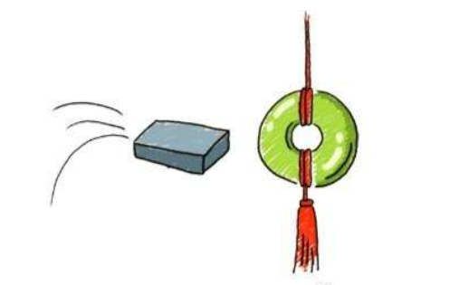

## 打包文件分析（webpack4）

我们虽然会使用 Webpack ，也大致知道其工作原理，可是你想过 Webpack 输出的 bundle.js 是什么样子的吗？ 为什么原来一个个的模块文件被合并成了一个单独的文件？为什么 bundle.js 能直接运行在浏览器中？让我们走进bundle.js，揭开他神秘的面纱。


### webpack 打包流程图

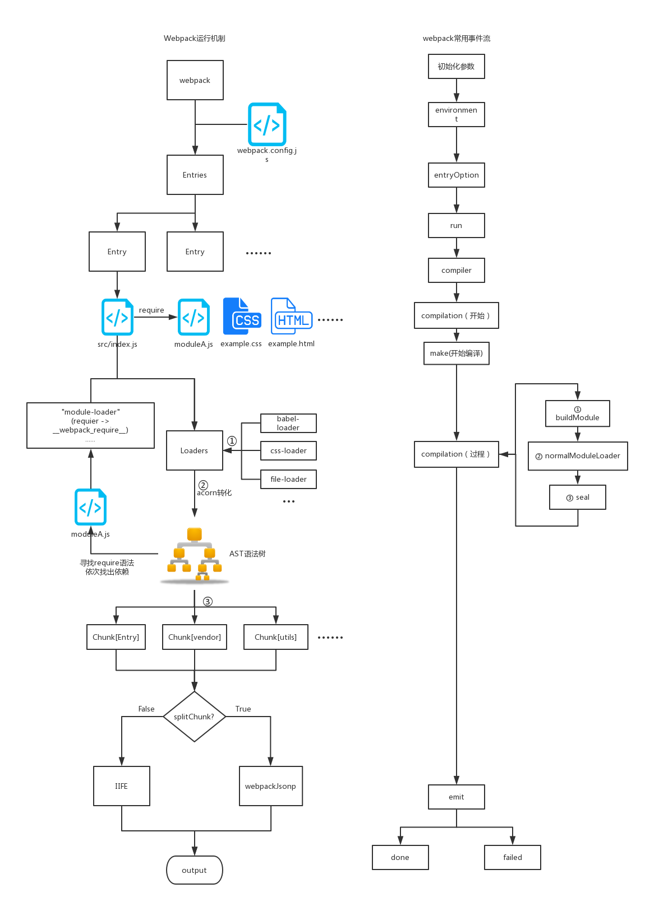

### 同步代码打包文件分析

源码目录结构如下

```
├── src
│   ├── js
│       ├── show.js
├── main.js
├── index.html
└── webpack.config.js
```

```html
index.html
<html>
<head>
  <meta charset="UTF-8">
</head>
<body>
  <div id="app"></div>
  <!--导入 webpack 输出的 JS 文件-->
  <script src="./dist/app.js"></script>
</body>
</html>
```

```js
main.js:
// 通过 CommonJS 规范导入 show 函数
const show = require('./src/js/show.js');
// 执行 show 函数
show('Webpack');
```

```js
show.js:
// 操作 DOM 元素，把 content 显示到网页上
function show(content) {
  window.document.getElementById('app').innerText = 'Hello,' + content;
}

// 通过 CommonJS 规范导出 show 函数
module.exports = show;
```

```js
webpack.config.js:
const path = require('path');
module.exports = {
  // JS 执行入口文件
  mode: "development",
  entry: './main.js',
  output: {
    // 把所有依赖的模块合并输出到一个 bundle.js 文件
    filename: 'app.js',
    // 输出文件都放到 dist 目录下
    path: path.resolve(__dirname, './dist'),
    publicPath: "./dist/",
    chunkFilename:'[name].chunk.js' 
  }
};
```

我们在看完整打包代码之前，先拆分一下，逐个击破：

最外面的代码结构：
```js
(function(modules){
  ...(webpack的函数)
  return __webpack_require__(__webpack_require__.s = "./demo01/main.js");
})(
 {
   "./main.js": (function(){...}),
   "./src/js/show.js": (function(){...})
 }
)
```

最外层是一个立即执行函数,参数是 modules 也就是我们的引用文件。每个文件就是一个 module，我们写的 require，则最终变为 __webpack_require__ 函数执行。

__webpack_require__函数：
```js
// 去模块对象中加载一个模块，moduleId 为要加载的模块
  function __webpack_require__(moduleId) {

    // 如果需要加载的模块已经被加载过，就直接从内存缓存中返回
    if (installedModules[moduleId]) {
      return installedModules[moduleId].exports;
    }
    // 如果缓存中不存在需要加载的模块，就新建一个模块，并把它存在缓存中
    var module = installedModules[moduleId] = {
      // 模块的名称
      i: moduleId,
      // 该模块是否已经加载完毕
      l: false,
      // 该模块的导出值
      exports: {}
    };

    // 从 modules 中获取名称为 moduleId 的模块对应的函数
    // 再调用这个函数，同时把函数需要的参数传入
    modules[moduleId].call(module.exports, module, module.exports, __webpack_require__);

    // 把这个模块标记为已加载
    module.l = true;

    // 返回这个模块的导出值
    return module.exports;
  }
```

现在再看看通过webpack打包后的代码。(精简处理后如下)

```js
// webpackBootstrap启动函数
// modules 即为存放所有模块的对象，对象中的每一个属性都是一个函数
(function (modules) {
  // 安装过的模块都存放在这里面
  // 作用是把已经加载过的模块缓存在内存中，提升性能
  var installedModules = {};

  // 去模块对象中加载一个模块，moduleId 为要加载的模块
  function __webpack_require__(moduleId) {

    // 如果需要加载的模块已经被加载过，就直接从内存缓存中返回
    if (installedModules[moduleId]) {
      return installedModules[moduleId].exports;
    }
    // 如果缓存中不存在需要加载的模块，就新建一个模块，并把它存在缓存中
    var module = installedModules[moduleId] = {
      // 模块的名称
      i: moduleId,
      // 该模块是否已经加载完毕
      l: false,
      // 该模块的导出值
      exports: {}
    };

    // 从 modules 中获取名称为 moduleId 的模块对应的函数
    // 再调用这个函数，同时把函数需要的参数传入
    modules[moduleId].call(module.exports, module, module.exports, __webpack_require__);

    // 把这个模块标记为已加载
    module.l = true;

    // 返回这个模块的导出值
    return module.exports;
  }

  // 传入模块对象
  __webpack_require__.m = modules;

  // 传入模块缓存
  __webpack_require__.c = installedModules;

  // 使用 __webpack_require__ 去加载 main.js模块，并且返回该模块导出的内容
  // main.js 对应的文件，也就是执行入口模块
  // __webpack_require__.s 的含义是启动模块对应的名称
  return __webpack_require__(__webpack_require__.s = "./main.js");
})
/************************************************************************/
({
  // 所有的模块都存放在了一个对象里，根据每个模块的路径来区分和定位模块
  "./main.js": (function (module, exports, __webpack_require__) {
    // 通过 CommonJS 规范导入 show 函数 
    const show = __webpack_require__( /*! ./src/js/show.js */ "./src/js/show.js");
    // 执行 show 函数
    show('Webpack');
  }),
  
  "./src/js/show.js": (function (module, exports) {
    // 操作 DOM 元素，把 content 显示到网页上
    function show(content) {
      window.document.getElementById('app').innerText = 'Hello,' + content;
    }
    // 通过 CommonJS 规范导出 show 函数
    module.exports = show;
  })
});
```

总结：

以上就是webpack的打包文件同步加载流程，主要的功能是把解析的模块变成一个对象，通过一个入口文件去递归加载，运行所有的模块。

bundle.js 能直接运行在浏览器中的原因在于输出的文件中通过 \_\_webpack_require__ 函数定义了一个可以在浏览器中执行的加载函数来加载模块。

原来一个个独立的模块文件被合并到了一个单独的 bundle.js 的原因在于浏览器不能像 Node.js 那样快速地去本地加载一个个模块文件，而必须通过网络请求去加载还未得到的文件。 如果模块数量很多，加载时间会很长，因此把所有模块都存放在了对象中，执行一次网络加载。（如果体积很大，需要将代码分割，按需加载）

如果仔细分析 \_\_webpack_require__ 函数的实现，你还有发现 Webpack 做了缓存优化： 执行加载过的模块不会再执行第二次，执行结果会缓存在内存中，当某个模块第二次被访问时会直接去内存中读取被缓存的返回值。

### 懒加载（异步代码）打包文件分析

#### 用 Webpack 实现按需加载

增加一个懒加载用的js文件
```js
module.exports = function(a, b) {
  return a + b;
}
```

将show.js文件进行懒加载修改
```js
show.js
// 操作 DOM 元素，把 content 显示到网页上
function show(content) {
  window.document.getElementById('app').innerText = 'Hello,' + content;
  import( /* webpackChunkName: "sum" */ './sum').then(
   (exprot) => {
      const sum = exprot.default
      console.log("sum(1, 2) = ", sum(1, 2));
    }
  )
}

// 通过 CommonJS 规范导出 show 函数
module.exports = show;
```

代码中最关键的一句是 import( /* webpackChunkName: "sum" \*/ './sum')，Webpack 内置了对 import(*) 语句的支持，当 Webpack 遇到了类似的语句时会这样处理：

* 以 ./sum.js 为入口新生成一个 Chunk
* 当代码执行到 import 所在语句时才会去加载由 Chunk 对应生成的文件。
* import 返回一个 Promise，当文件加载成功时可以在 Promise 的 then 方法中获取到 sum.js 导出的内容。

打包后发现有两个js文件,app.js和sum.chunk.js

先分析app.js

```js
app.js
// webpackBootstrap启动函数
// modules 即为存放所有模块的对象，对象中的每一个属性都是一个函数
(function (modules) {
  // 安装过的模块都存放在这里面
  // 作用是把已经加载过的模块缓存在内存中，提升性能
  var installedModules = {};

  // 存储每个 Chunk 的加载状态；
  // 键为 Chunk 的 ID，值的意思如下：
  // undefined = 模块未加载, 
  // null = chunk preloaded/prefetched
  // Promise = 模块正在加载
  // 0 = 模块已经加载成功
  var installedChunks = {
    "main": 0
  };

  // 传入模块对象
  __webpack_require__.m = modules;

  // 传入模块缓存
  __webpack_require__.c = installedModules;

  // Webpack 配置中的 publicPath，用于加载被分割出去的异步代码
  __webpack_require__.p = "./dist2/";

  // 加载一个模块
  function __webpack_require__(moduleId) {
    // 如果需要加载的模块已经被加载过，就直接从内存缓存中返回
    if (installedModules[moduleId]) {
      return installedModules[moduleId].exports;
    }
    // 如果缓存中不存在需要加载的模块，就新建一个模块，并把它存在缓存中
    var module = installedModules[moduleId] = {
      // 模块的名称
      i: moduleId,
      // 该模块是否已经加载完毕
      l: false,
      // 该模块的导出值
      exports: {}
    };

    // 从 modules 中获取名称为 moduleId 的模块对应的函数
    // 再调用这个函数，同时把函数需要的参数传入
    modules[moduleId].call(module.exports, module, module.exports, __webpack_require__);

    // 把这个模块标记为已加载
    module.l = true;

    // 返回这个模块的导出值
    return module.exports;
  }

  // 异步加载的文件中安装模块
  function webpackJsonpCallback(data) {
    // 异步加载的文件中存放的需要安装的模块对应的 Chunk ID
    var chunkIds = data[0];
    // 异步加载的文件中存放的需要安装的模块列表
    var moreModules = data[1];

    // 把 moreModules 添加到 modules 对象中
    // 把所有 chunkIds 对应的模块都标记成已经加载成功
    var moduleId, chunkId, i = 0,
      resolves = [];
    for (; i < chunkIds.length; i++) {
      chunkId = chunkIds[i];
      if (Object.prototype.hasOwnProperty.call(installedChunks, chunkId) && installedChunks[chunkId]) {
        resolves.push(installedChunks[chunkId][0]);
      }
      installedChunks[chunkId] = 0;
    }
    for (moduleId in moreModules) {
      if (Object.prototype.hasOwnProperty.call(moreModules, moduleId)) {
        modules[moduleId] = moreModules[moduleId];
      }
    }
    if (parentJsonpFunction) parentJsonpFunction(data);

    while (resolves.length) {
      resolves.shift()();
    }
  };

  // script 标签路径
  function jsonpScriptSrc(chunkId) {
    return __webpack_require__.p + "" + ({
      "sum": "sum"
    } [chunkId] || chunkId) + ".chunk.js"
  }

  /**
   * 用于加载被分割出去的，需要异步加载的 Chunk 对应的文件
   * @param chunkId 需要异步加载的 Chunk 对应的 ID
   * @returns {Promise}
   */
  __webpack_require__.e = function requireEnsure(chunkId) {
    var promises = [];

    // 从上面定义的 installedChunks 中获取 chunkId 对应的 Chunk 的加载状态
    var installedChunkData = installedChunks[chunkId];
    if (installedChunkData !== 0) { // 如果加载状态为0表示该 Chunk 已经加载成功了

      // installedChunkData 不为空且不为0表示该 Chunk 正在网络加载中
      if (installedChunkData) {
        // 返回存放在 installedChunkData 数组中的 Promise 对象
        promises.push(installedChunkData[2]);
      } else {
        // installedChunkData 为空，表示该 Chunk 还没有加载过，去加载该 Chunk 对应的文件
        var promise = new Promise(function (resolve, reject) {
          installedChunkData = installedChunks[chunkId] = [resolve, reject];
        });

        promises.push(installedChunkData[2] = promise);

        // 通过 DOM 操作，往 HTML head 中插入一个 script 标签去异步加载 Chunk 对应的 JavaScript 文件
        var script = document.createElement('script');
        var onScriptComplete;

        script.charset = 'utf-8';
        script.timeout = 120;
        if (__webpack_require__.nc) {
          script.setAttribute("nonce", __webpack_require__.nc);
        }
        script.src = jsonpScriptSrc(chunkId);

        // create error before stack unwound to get useful stacktrace later
        var error = new Error();
        // 在 script 加载和执行完成时回调
        onScriptComplete = function (event) {
          // 防止内存泄露
          script.onerror = script.onload = null;
          clearTimeout(timeout);
          // 去检查 chunkId 对应的 Chunk 是否安装成功，安装成功时才会存在于 installedChunks 中
          var chunk = installedChunks[chunkId];
          if (chunk !== 0) {
            if (chunk) {
              var errorType = event && (event.type === 'load' ? 'missing' : event.type);
              var realSrc = event && event.target && event.target.src;
              error.message = 'Loading chunk ' + chunkId + ' failed.\n(' + errorType + ': ' + realSrc + ')';
              error.name = 'ChunkLoadError';
              error.type = errorType;
              error.request = realSrc;
              chunk[1](error);
            }
            installedChunks[chunkId] = undefined;
          }
        };
        // 设置异步加载的最长超时时间
        var timeout = setTimeout(function () {
          onScriptComplete({
            type: 'timeout',
            target: script
          });
        }, 120000);
        script.onerror = script.onload = onScriptComplete;
        document.head.appendChild(script);
      }
    }
    return Promise.all(promises);
  };

  // define __esModule on exports
  __webpack_require__.r = function (exports) {
    if (typeof Symbol !== 'undefined' && Symbol.toStringTag) {
      Object.defineProperty(exports, Symbol.toStringTag, {
        value: 'Module'
      });
    }
    Object.defineProperty(exports, '__esModule', {
      value: true
    });
  };

  /***
   * webpackJsonp 用于从异步加载的文件中安装模块。
   * 把 webpackJsonp 挂载到全局是为了方便在其它文件中调用。
   */
  var jsonpArray = window["webpackJsonp"] = window["webpackJsonp"] || [];
  var oldJsonpFunction = jsonpArray.push.bind(jsonpArray);
  jsonpArray.push = webpackJsonpCallback;
  jsonpArray = jsonpArray.slice();
  for (var i = 0; i < jsonpArray.length; i++) webpackJsonpCallback(jsonpArray[i]);
  var parentJsonpFunction = oldJsonpFunction;

  // 使用 __webpack_require__ 去加载 main.js模块
  return __webpack_require__(__webpack_require__.s = "./main.js");
})
/************************************************************************/
({
  // 所有的模块都存放在了一个对象里，根据每个模块的路径来区分和定位模块
  "./main.js": (function (module, exports, __webpack_require__) {
    // 通过 CommonJS 规范导入 show 函数 
    const show = __webpack_require__( /*! ./src/js/show.js */ "./src/js/show.js");
    // 执行 show 函数
    show('Webpack');
  }),

  "./src/js/show.js": (function (module, exports, __webpack_require__) {
    // 操作 DOM 元素，把 content 显示到网页上
    function show(content) {
      window.document.getElementById('app').innerText = 'Hello,' + content;
      __webpack_require__.e( /*! import() | sum */ "sum").then(
        __webpack_require__.bind(null, /*! ./sum */ "./src/js/sum.js")
      ).then(
        (exprot) => {
          const sum = exprot.default
          window.document.getElementById('sum').innerText = '1 + 2 = ' + sum(1, 2);
        }
      )
    }
    // 通过 CommonJS 规范导出 show 函数
    module.exports = show;
  })
});
```

```js
sum.chunk.js
(window["webpackJsonp"] = window["webpackJsonp"] || []).push([
  ["sum"],
  {
    "./vendor/sum.js": (function (module, __webpack_exports__, __webpack_require__) {
      "use strict";
      __webpack_require__.r(__webpack_exports__);
      __webpack_exports__["default"] = (function (a, b) {
        return a + b;
      });
    })
  }
]);
```

这里的 bundle.js 和上面所讲的 bundle.js 非常相似，区别在于：

多了一个 \_\_webpack_require__.e 用于加载被分割出去的，需要异步加载的 Chunk 对应的文件;
多了一个 webpackJsonp 函数用于从异步加载的文件中安装模块。

### 打包文件加载流程分析图

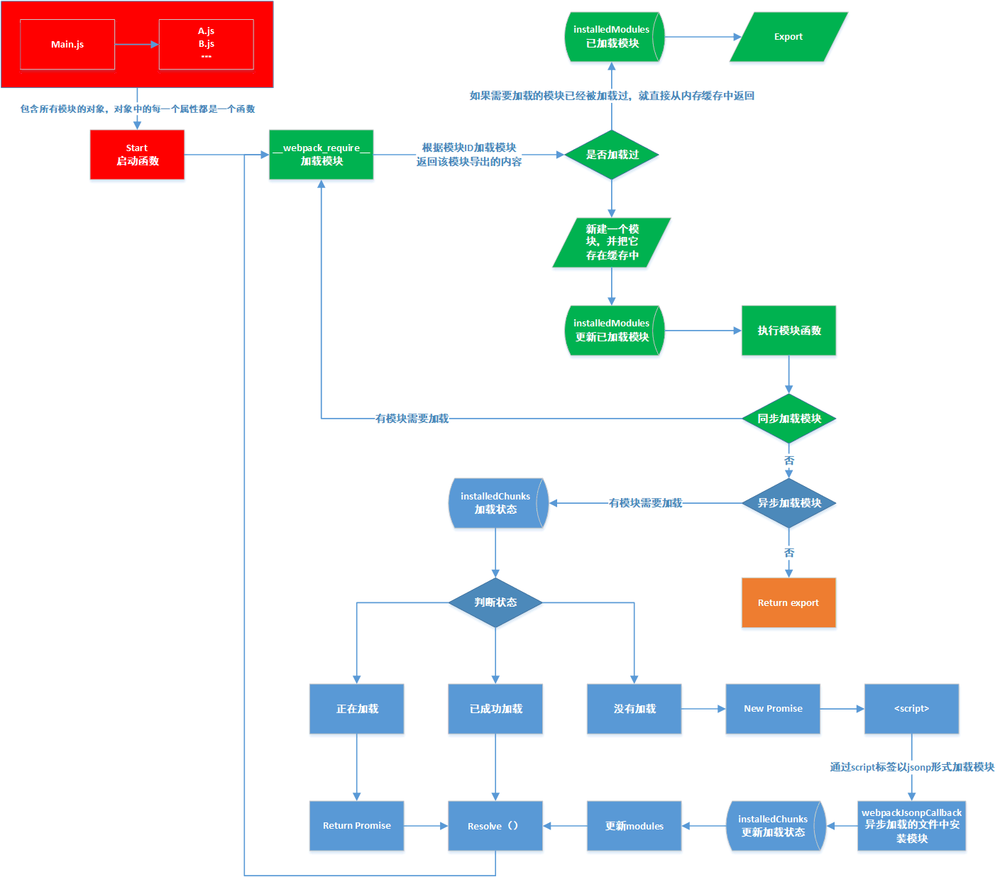

## 编写 Loader 的前置知识

由于webpack只能处理js的模块，如果要处理其他类型的文件，需要使用loader进行转换，Loader 就像是一个翻译员，能把源文件经过转化后输出新的结果，并且一个文件还可以链式的经过多个翻译员翻译。


### loader 处理模块流程

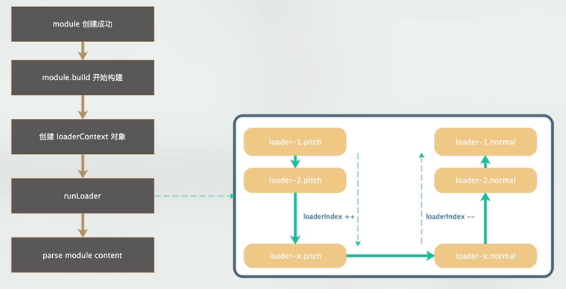

在 module 一开始构建的过程中，首先会创建一个 loaderContext 对象，它和这个 module 是一一对应的关系，而这个 module 所使用的所有 loaders 都会共享这个 loaderContext 对象，每个 loader 执行的时候上下文就是这个 loaderContext 对象，所以可以在我们写的 loader 里面通过 this 来访问。

### loader 的职责

**一个 Loader 的职责是单一的，只需要完成一种转换。** 如果一个源文件需要经历多步转换才能正常使用，就通过多个 Loader 去转换。在调用多个 Loader 去转换一个文件时，每个 Loader 会链式的顺序执行，第一个 Loader 将会拿到需处理的原内容，上一个 Loader 处理后的结果会传给下一个接着处理，最后的 Loader 将处理后的最终结果返回给 Webpack。

所以，在开发一个 Loader 时，请保持其职责的单一性，你只需关心输入和输出。

```js
{
  test: /\.less$/,
  use:[
    // 通过JS脚本创建style标签到页面上
    'style-loader',
    // 将CSS解析为CommonJS代码
    'css-loader',
    // 将less解析为css
    'less-loader'
  ]
}
```

### Loader 基础

由于 Webpack 是运行在 Node.js 之上的， **一个 Loader其实就是一个 Node.js模块，这个模块需要导出一个函数。** 这个导出的函数的工作就是获得处理前的原内容，对原内容执行处理后，返回处理后的内容。

一个loader最基础的结构：

```js
function loader(source) {
  // 处理source
  return source;
}
module.exports = loader
```

>loader 可以被链式调用意味着不一定要输出 JavaScript。只要下一个 loader 可以处理这个输出，这个 loader 就可以返回任意类型的模块。

### 加载调试本地 Loader

#### 使用本地 loader

在本地开发loader的时候，建议放在一个文件夹下，然后配置webpack配置，如下：

```js
// 在匹配到需要使用loader的时候，会在node_modules文件夹下找，如果没有找到就去我们自己配的文件夹下寻找
resolveLoader: {
  modules: ['node_modules', path.resolve(__dirname, 'loaders')]
},
// 对所有js结尾的文件使用my-loader
module: {
  rules: [{
      test: /\.js$/,
      use: {
        loader: "my-loader",
        options: {
          name:"luojw"
        }
      }
    }
  ]
}
```

#### 调试本地 loader（VSCODE）

首先，我们需要在package.json配置script：

```json
{
  "scripts": {
    // --inspect-brk指定在第一行就设置断点。也就是说，一开始运行，就是暂停的状态。
    "debug": "node --inspect-brk=5229 ./node_modules/webpack/bin/webpack"
  },
  "devDependencies": {
    ...
  },
  "dependencies": {
    ...
  }
}
```

在vocede的debug中添加新的配置：

```json
{
  "version": "0.2.0",
  "configurations": [
    {
      "type": "node",
      "request": "launch",
      "name": "Debug",
      "runtimeExecutable": "yarn",
      "runtimeArgs": ["debug"],
      "port": 5229
    }
  ]
}

// runtimeExecutable: 程序执行器，就是启动程序的脚本。默认是 node，但我们这里用 yarn 来启动 webpack
// runtimeArgs: 传递给程序执行器的参数
// port: node 调试端口号，和刚才在 package.json script 中配的 --inspect-brk 保持一致
```

### loader 工具库

充分利用 loader-utils 包。它提供了许多有用的工具，但最常用的一种工具是获取传递给 loader 的选项。schema-utils 包配合 loader-utils，用于保证 loader 选项，进行与 JSON Schema 结构一致的校验。这里有一个简单使用两者的例子：

```js
import { getOptions } from 'loader-utils';
import { validateOptions } from 'schema-utils';

// 配置参数结构
const schema = {
  type: 'object',
  properties: {
    test: {
      type: 'string'
    }
  }
}

export default function(source) {
  // 获取loader参数（或者叫选项）
  const options = getOptions(this);
  const loaderName = 'Example Loader'

  /**
   * @description: 校验options格式是否正确
   * @param {*} schema 模版
   * @param {*} options 参数
   * @param {string} loaderName loader名
   */
  validateOptions(schema, options, loaderName);

  // 对资源应用一些转换……

  return `export default ${ JSON.stringify(source) }`;
};
```

示例：banner-loader

### 返回其它结果

上面的 Loader 都只是返回了原内容转换后的内容，但有些场景下还需要返回除了内容之外的东西。

```js
module.exports = function(source) {
  // 通过 this.callback 告诉 Webpack 返回的结果
  this.callback(null, source, sourceMaps);
  // 当你使用 this.callback 返回内容时，该 Loader 必须返回 undefined，
  // 以让 Webpack 知道该 Loader 返回的结果在 this.callback 中，而不是 return 中 
  return;
};
```

其中的 this.callback 是 Webpack 给 Loader 注入的 API，以方便 Loader 和 Webpack 之间通信。this.callback 的详细使用方法如下：

```js
this.callback(
    // 当无法转换原内容时，给 Webpack 返回一个 Error
    err: Error | null,
    // 原内容转换后的内容
    content: string | Buffer,
    // 用于把转换后的内容得出原内容的 Source Map，方便调试
    sourceMap?: SourceMap,
    // 如果本次转换为原内容生成了 AST 语法树，可以把这个 AST 返回，
    // 以方便之后需要 AST 的 Loader 复用该 AST，以避免重复生成 AST，提升性能
    abstractSyntaxTree?: AST
);
```

示例：banner-loader

### 同步与异步

Loader 有同步和异步之分，上面介绍的 Loader 都是同步的 Loader，因为它们的转换流程都是同步的，转换完成后再返回结果。 但在有些场景下转换的步骤只能是异步完成的，如果采用同步的方式网络请求就会阻塞整个构建，导致构建非常缓慢。

在转换步骤是异步时，可以这样：

```js
module.exports = function(source) {
    // 告诉 Webpack 本次转换是异步的，Loader 会在 callback 中回调结果
    var callback = this.async();
    someAsyncOperation(source, function(err, result, sourceMaps, ast) {
        // 通过 callback 返回异步执行后的结果
        callback(err, result, sourceMaps, ast);
    });
};
```

示例：babel-loader | banner-loader

### 处理二进制数据

在默认的情况下，Webpack 传给 Loader 的原内容都是 UTF-8 格式编码的字符串。 但有些场景下 Loader 不是处理文本文件，而是处理二进制文件，例如读取图片，就需要 Webpack 给 Loader 传入二进制格式的数据。 为此，你需要这样编写 Loader：

```js
module.exports = function(source) {
    // 在 exports.raw === true 时，Webpack 传给 Loader 的 source 是 Buffer 类型的
    source instanceof Buffer === true;
    // Loader 返回的类型也可以是 Buffer 类型的
    // 在 exports.raw !== true 时，Loader 也可以返回 Buffer 类型的结果
    return source;
};
// 通过 exports.raw 属性告诉 Webpack 该 Loader 是否需要二进制数据 
module.exports.raw = true;
```

示例：file-loader

### loader 依赖

如果一个 loader 使用外部资源（例如，从文件系统读取），必须声明依赖，因为这个文件是在loader内部读取的，和webpack递归查找依赖模块是没有关系的。

导致的问题：
当修改了文件，webpack并不会认为有依赖发生了变化，会返回 Loader 的缓存结果，导致打包后文件没变化。

解决办法：
```js
import path from 'path';

module.exports = function(source) {
  var callback = this.async();
  // loader引用的文件
  var headerPath = path.resolve('header.js');
  // 把文件添加到webpack依赖
  this.addDependency(headerPath);

  fs.readFile(headerPath, 'utf-8', function(err, header) {
    callback(err, header + "\n" + source);
  });
};
```

示例：banner-loader

### loader 缓存加速

在有些情况下，有些转换操作需要大量计算非常耗时，如果每次构建都重新执行重复的转换操作，构建将会变得非常缓慢。 为此，Webpack 会默认缓存所有 Loader 的处理结果，也就是说在需要被处理的文件或者其依赖的文件没有发生变化时， 是不会重新调用对应的 Loader 去执行转换操作的。

如果想让 Webpack 不缓存该 Loader 的处理结果，可以这样：

```js
module.exports = function(source) {
  // 关闭该 Loader 的缓存功能
  this.cacheable(false);
  return source;
};
```

示例：banner-loader

### 模块依赖

根据模块类型，可能会有不同的模式指定依赖关系。例如在 CSS 中，使用 @import 和 url(...) 语句来声明依赖。这些依赖关系应该由模块系统解析。

可以通过以下两种方式中的一种来实现：

* 通过把它们转化成 require 语句。

* 使用 this.resolve 函数解析路径。

示例：css-loader

### loader的执行顺序

除了config中的loader，还可以写inline的loader，那么loader执行的先后顺序是什么呢？

当webpack.config.js配置如下时，其顺序为 loader执行顺序 pre > normal > post

```js
rules: [
  {
    test: /\.js$/,
    use: {
      loader: 'pre-loader'
    },
    enforce:'pre'
  },
  {
    test: /\.js$/,
    use: {
      loader: 'loader'
    }
  },
  {
    test: /\.js$/,
    use: {
      loader: 'post-loader'
    },
    enforce:'post'
  }
]
```

#### 行内loader

修改main.js 使用行内loader加载一个js文件

```js
const show = require('inline-loader!./src/js/show.js');
show('WEBPACK');
```

执行后顺序结果是： pre > normal > inline > post

在loader中log得到结果：

```js
pre-loader for main.js
loader for main.js
post-loader for main.js
pre-loader for show.js
loader for show.js
line-loader for show.js
post-loader for show.js
```

我们还可以在行内loader前加前缀，修改他的执行方式：

```js
// -!的行内loader不会走 pre和normal Loader
const show = require('-!inline-loader!./src/js/show.js');

// 执行顺序如下：
pre-loader for main.js
loader for main.js
post-loader for main.js
line-loader for show.js
post-loader for show.js

// !的行内loader不会走 normal Loader
const show = require('!inline-loader!./src/js/show.js');

// 执行顺序如下：
pre-loader for main.js
loader for main.js
post-loader for main.js
pre-loader for show.js
line-loader for show.js
post-loader for show.js

// !!的行内loader 只会走行内 Loaer
const show = require('!!inline-loader!./src/js/show.js');

// 执行顺序如下：
pre-loader for main.js
loader for main.js
post-loader for main.js
line-loader for show.js
```

### loader picth方法

loader 其实是由两部分组成的 pitch和normal，我们上面所说的都是normal部分。

下面介绍pitch和normal的关系：

在执行loader的时候，会先执行pitch，pitch执行的顺序与我们刚刚看的normal完全相反。

pitch执行后会去获取到source，再将source传回给normal。

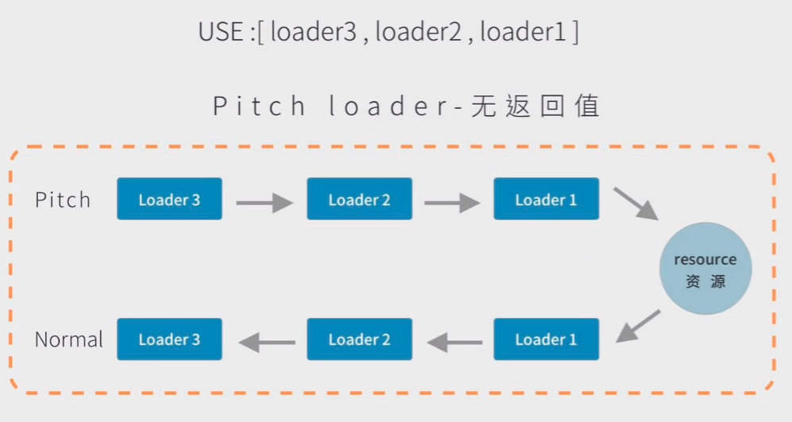

当pitch中有返回值的时候，一切都变了。

如图，loader2的pitch有返回值，那么直接跳过后面的pitch以及normal，直接到loader1的normal。也就是对loader有一个阻断的功能。

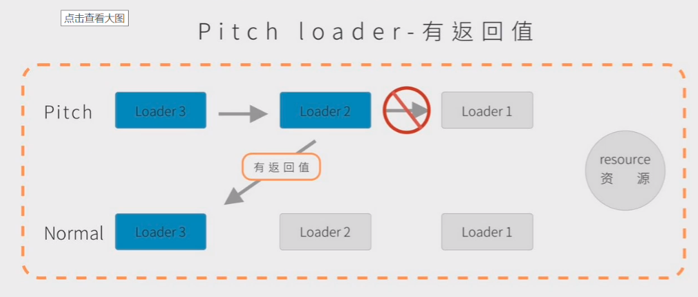

这些 pitch 函数并不是用来实际处理 module 的内容的，主要是可以做一些拦截处理的工作，从而达到在 loader 处理流程当中的一些定制化的处理需要。

### AST语法树

懂了loader的编写规则后，我们还需要了解AST语法树，有了这个黑魔法，我们就能为所欲为的操纵代码。

#### 什么是AST语法树

根据编程语言的语法表示源代码结构，每个AST节点对应于一个源代码项，如图：

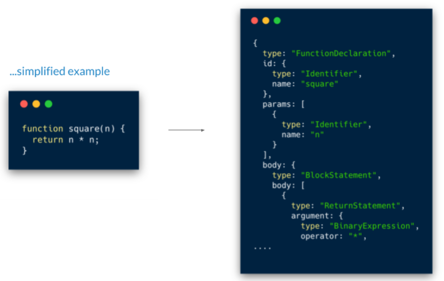

实际上，正真AST每个节点会有更多的信息。但是，这是大体思想。从纯文本中，我们将得到树形结构的数据。每个条目和树中的节点一一对应。

#### 怎么得到AST语法树

第一步，词法分析，也叫做扫描scanner。它读取我们的代码，然后把它们按照预定的规则合并成一个个的标识tokens（词法单元）。同时，它会移除空白符，注释等。最后，整个代码将被分割进一个tokens列表（或者说一维数组）。

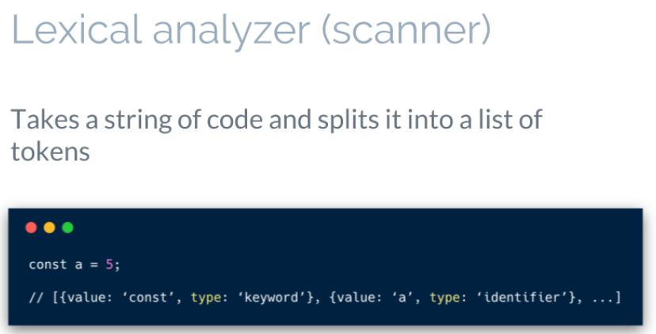

第二步，语法分析，也解析器。它会将词法分析出来的数组转化成树形的表达形式。同时，验证语法，语法如果有错的话，抛出语法错误。

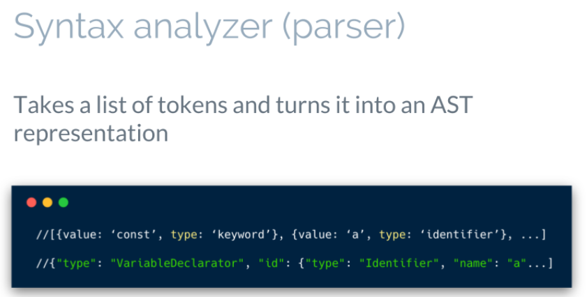

当生成树的时候，解析器会删除一些没必要的标识tokens（比如不完整的括号），因此AST不是100%与源码匹配的。说个题外话，解析器100%覆盖所有代码结构生成树叫做CST（具体语法树）

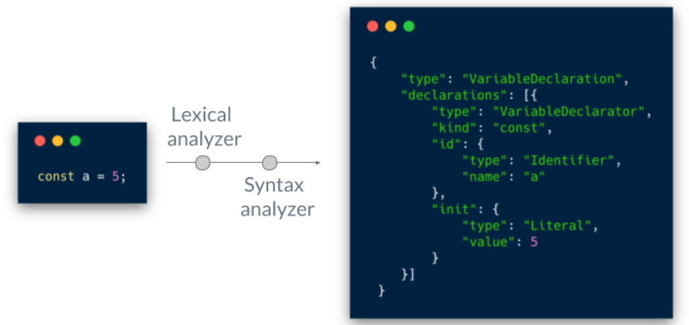

#### 通过AST修改源代码

3个阶段运行代码：解析（parsing），转译（transforming），生成（generation）

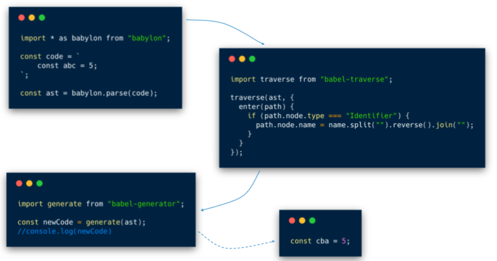

#### 第三方库以及调试工具

* @babel/parser 把源码转为ast
* @babel/traverse 遍历到对应节点
* @babel/types 节点替换
* @babel/generator 生成结果

当我们想看自己代码的AST时，可以在 https://astexplorer.net/ 中查看

## loader 编写示例

### try/catch loadere

```js
const parser = require("@babel/parser");
const traverse = require("@babel/traverse").default;
const t = require("@babel/types");
// @babel/parser 把源码转为ast
// @babel/traverse 遍历到对应节点
// @babel/types 节点替换

const core = require("@babel/core");
const loaderUtils = require("loader-utils");

const DEFAULT = {
  catchCode: identifier => `console.error(${identifier})`,
  identifier: "e",
  finallyCode: null
};

/**
 * 参数满足含有 async 关键字的
 * 函数声明
 * 箭头函数
 * 函数表达式
 * 方法
 * 则返回 true
 * **/

const isAsyncFuncNode = node =>
  t.isFunctionDeclaration(node, {
    async: true
  }) ||
  t.isArrowFunctionExpression(node, {
    async: true
  }) ||
  t.isFunctionExpression(node, {
    async: true
  }) ||
  t.isObjectMethod(node, {
    async: true
  });

module.exports = function(source) {
  let options = loaderUtils.getOptions(this);
  let ast = parser.parse(source, {
    sourceType: "module", // 支持 es6 module
    plugins: ["dynamicImport"] // 支持动态 import
  });
  options = {
    ...DEFAULT,
    ...options
  };
  if (typeof options.catchCode === "function") {
    options.catchCode = options.catchCode(options.identifier);
  }
  let catchNode = parser.parse(options.catchCode).program.body;
  let finallyNode =
    options.finallyCode && parser.parse(options.finallyCode).program.body;

  /**
   *  只给最外层的 async 函数包裹 try/catch
   * **/
  traverse(ast, {
    // 寻找到await表达式
    AwaitExpression(path) {
      // 递归向上找异步函数的 node 节点
      while (path && path.node) {
        let parentPath = path.parentPath;
        if (
          // 是否为块语句且是否 async
          t.isBlockStatement(path.node) &&
          isAsyncFuncNode(parentPath.node)
        ) {
          let tryCatchAst = t.tryStatement(
            path.node,
            t.catchClause(
              t.identifier(options.identifier),
              t.blockStatement(catchNode)
            ),
            finallyNode && t.blockStatement(finallyNode)
          );
          // 节点替换
          path.replaceWithMultiple([tryCatchAst]);
          return;
        } else if (
          // 已经包含 try 语句则直接退出
          t.isBlockStatement(path.node) &&
          t.isTryStatement(parentPath.node)
        ) {
          return;
        }
        path = parentPath;
      }
    }
  });
  return core.transformFromAstSync(ast, null, {
    configFile: false // 屏蔽 babel.config.js，否则会注入 polyfill 使得调试变得困难
  }).code;
};
```

### less/css/style loader链处理less样式

```js
less-loader.js

let less = require('less');
function lessloader(source) {
  less.render(source, (err, result) => {
    if (err) {
      this.callback(err)
    } else {
      this.callback(err, result.css)
    }
  });
}
module.exports = lessloader
```

```js
css-loader.js

function loader(source) {
  let reg = /url\((.+?)\)/g;
  let index = 0;
  let current = "";

  // js脚本字符串
  let arr = ['let list = []'];
  while (current = reg.exec(source)) {
    // 返回一个数组，其中存放匹配的结果
    // 数组的第 0 个元素是与正则表达式相匹配的文本
    // 第 1 个元素是与 RegExpObject 的第 1 个子表达式相匹配的文本
    let [match, url] = current;

    // reg.lastIndex 下次匹配的起始位置
    let last = reg.lastIndex - match.length

    console.log(source.slice(index, last));
    
    console.log(JSON.stringify(source.slice(index, last)))
    
    arr.push(`list.push(${JSON.stringify(source.slice(index, last))})`);

    index = reg.lastIndex;

    // 再把url引用图片换成require写法
    arr.push(`list.push("url(" + require(${url}) + ")")`);
  }
  arr.push(`list.push(${JSON.stringify(source.slice(index))})`);
  arr.push(`module.exports = list.join('')`);

  console.log(arr.join("\r\n"));
  
  return arr.join("\r\n");
}

module.exports = loader;
```

```js
style-loader

let loaderUtils = require('loader-utils')

function styleloader(source) {
  // 导出一个js脚本

  let style = `
    let style = document.createElement("style");
    style.innerHTML = ${JSON.stringify(source)}
    document.head.appendChild(style);
  `
  console.log(style);
  return style;
}

// remainingRequest 剩余的loader
styleloader.pitch = function (remainingRequest) {
  console.log(remainingRequest); // css-loader!less-loader!index.less

  // 让style-loader 去处理 

  // 返回相对路径
  console.log(loaderUtils.stringifyRequest(this,remainingRequest));

  let style = `
    let style = document.createElement("style");
    style.innerHTML = require(${loaderUtils.stringifyRequest(this,'!!'+remainingRequest)})
    document.head.appendChild(style);
  `
  console.log(style);
  
  return style;
}

module.exports = styleloader;
```

## 文中提到的其他loader代码：

**babel-loader.js**

```js
let bable = require("@babel/core");
// 一个loader工具
let loaderUtils = require("loader-utils")

function loader(source) {
  // 获取用户传入loader参数
  let options = loaderUtils.getOptions(this);
  let cb = this.async() // loader上下文 默认有async这个方法 异步执行

  // bable代码转换
  bable.transform(source,{
    // presets: [ '@bable/preset-env' ],
    ...options, //对象展开
    sourceMaps:true,
    filename: loaderUtils.interpolateName(this, '[name].[ext]',{}) // 文件名
  },function (err,result) {
    if (err) {
      console.log("err"+err);
    }
    cb(err,result.code,result.map) // 异步
  })
  return;
}
module.exports = loader;
```

**banner-loader.js**

```js
let loaderUtils = require("loader-utils");
// 校验参数的库
let { validate } = require("schema-utils");
let fs = require("fs")

function loader(source) {
  let options = loaderUtils.getOptions(this);
  let cb = this.async();
  // 参数骨架
  let schema = {
    type:'object',
    properties:{
      text:{
        type:"string"
      },
      filename:{
        type:"string"
      }
    }
  }
  // 校验 
  validate(schema,options,{ name: 'banner-loader' });
  // this.cacheable(false);

  if (options.filename) {
    // 把文件添加到webpack依赖
    // this.addDependency(options.filename);
    fs.readFile(options.filename,'utf8',function (err,data) {
      cb(err,`/**${data}**/${source}`)
    })
  }else{
    cb(null,`/**${options.text}**/${source}`)
  }
}
module.exports = loader;
```

**file-loader.js**

```js
let loaderUtils = require("loader-utils");

// 拿到文件（如图片）后发射到输出路径，并返回文件路径
function loader(source) {
  console.log( source instanceof Buffer === true);
  
  // 获取文件名
  let fileName = loaderUtils.interpolateName(this, '[name].[ext]',{});

  // 发射文件到打包文件夹下
  this.emitFile(fileName,source);

  // 指向dist里的图片
  return `module.exports="./${fileName}"`
}
// 通过 exports.raw 属性告诉 Webpack 该 Loader 是否需要二进制数据 
loader.raw = true;
module.exports = loader;
```

## 编写 Pulgin 的前置知识

### tapable

webpack本质上是一种事件流的机制，他的工作流程就是将各个插件串联，而实现这些的核心部分就是tapable。

查看webpack的源码我们可以看到在编译的主要核心模块里，引用了同步钩子和异步钩子，如图：

挖个坑，待补充...


## 补充资料：

- [webpack教程 B站视频](https://www.bilibili.com/video/BV1a4411e7Bz?from=search&seid=1342273522026746801)
- [Webpack Loader 高手进阶](https://segmentfault.com/a/1190000018450503)
- [AST](https://github.com/CodeLittlePrince/blog/issues/19)
- [webpack 4 源码主流程分析](https://zhuanlan.zhihu.com/p/102603497)
- [try/catch loader](https://www.jianshu.com/p/b1dc21fc025a)